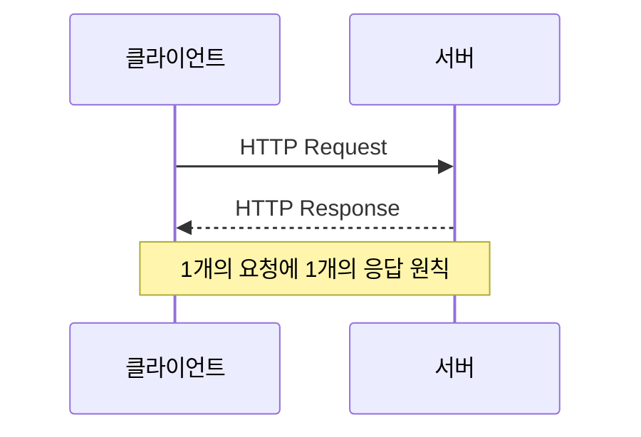
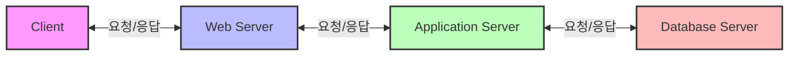

# 2. 앱/웹 서비스를 위한 모든 것 🌐

## 목차
- [2. 앱/웹 서비스를 위한 모든 것 🌐](#2-앱웹-서비스를-위한-모든-것-)
  - [목차](#목차)
  - [HTTP? 네 정체가 뭐냐? 🔄](#http-네-정체가-뭐냐-)
    - [HTTP의 의미](#http의-의미)
    - [Hypertext의 예시: JSON과 XML](#hypertext의-예시-json과-xml)
  - [WAS(Web Application Server)를 알아보자 🖥️](#wasweb-application-server를-알아보자-️)
  - [Front-end(클라이언트) 🎨](#front-end클라이언트-)
    - [주요 특징](#주요-특징)
    - [UI/UX](#uiux)
      - [반응형 디자인의 Grid System](#반응형-디자인의-grid-system)
    - [프론트엔드에서의 통신(HTTP 통신의 함수들)](#프론트엔드에서의-통신http-통신의-함수들)
  - [동기와 비동기(Synchronous, Asynchronous) ⏱️](#동기와-비동기synchronous-asynchronous-️)
  - [Back-end와 API ⚙️](#back-end와-api-️)
    - [백엔드에서의 통신(HTTP 통신의 함수들)](#백엔드에서의-통신http-통신의-함수들)
    - [REST API](#rest-api)
      - [URI vs URL](#uri-vs-url)
      - [REST API 예시](#rest-api-예시)

---

## HTTP? 네 정체가 뭐냐? 🔄

**통신**이란 컴퓨터 간의 데이터를 주고받는 것을 의미한다. 예시로는...

1. PC와 PC와의 대화
2. 스마트폰과 서버 컴퓨터와의 대화
3. 스마트폰과 스마트폰과의 대화(모바일 메신저)

등이 있을것이다.

통신 대화는 요청을 하는 **Request**와 응답을 하는 **Response**로 이루어지는데, 이러한 통신을 위해 사용되는 프로토콜이 **HTTP**이다. 응답과 요청은 1개의 요청에 대해 1개의 응답의 원칙을 가지고 있다.



### HTTP의 의미

한편, HTTP Stands for...
| 약자 | 의미 | 설명 |
|-----|------|-----|
| **H** | **Hyper** | 기기에 상관없이 문자로 통신 가능한 |
| **T** | **Text** | 운영체제와 관계없이 문자로 통신 |
| **T** | **Transfer** | 파일 전송 가능 |
| **P** | **Protocol** | 통신 규약 |

### Hypertext의 예시: JSON과 XML

**JSON 예시** (JavaScript Object Notation)
```json
{
  "user": {
    "id": 123,
    "name": "홍길동",
    "email": "hong@example.com",
    "isActive": true,
    "skills": ["Python", "Data Science", "Machine Learning"]
  }
}
```

**XML 예시** (eXtensible Markup Language)
```xml
<?xml version="1.0" encoding="UTF-8"?>
<user>
  <id>123</id>
  <name>홍길동</name>
  <email>hong@example.com</email>
  <isActive>true</isActive>
  <skills>
    <skill>Python</skill>
    <skill>Data Science</skill>
    <skill>Machine Learning</skill>
  </skills>
</user>
```

> **💡 팁:**
> 두 형식 모두 데이터를 구조화하여 전송하는 방식이지만, JSON은 더 간결하고 가벼워 최근 웹 서비스에서 더 널리 사용되고(key-value 형태), XML은 더 엄격한 구조와 유효성 검사가 가능하며 복잡한 문서 구조에 적합합니다(element를 열고 닫는 구조를 보면 알 수 있음).

---

## WAS(Web Application Server)를 알아보자 🖥️

일반적인 WAS의 구조는 다음과 같다.

| 구성 요소 | 역할 |
|----------|-----|
| **Web Server** | 클라이언트로부터 요청을 받아 정적인 파일을 제공하는 서버 |
| **Application Server(Back-end)** | 동적인 데이터를 처리하는 서버 |
| **Database Server** | 데이터를 저장하는 서버 |
| **Client** | 사용자가 사용하는 디바이스 |



Client와 Web Server, Web Server와 Application Server, Back-end와 Database 사이에 **응답-요청 관계**가 발생한다.

---

## Front-end(클라이언트) 🎨

서비스를 이용할 때 가장 처음 만나는 화면으로 **서비스의 의도대로 사용자를 유도**하는 역할을 한다.

*서버의 기능과는 관계없는* 단독적인 기능을 수행한다.(ex. 카메라 촬영)

### 주요 특징
1. UI/UX
2. 독립적인 기능들
3. 서버에 요청하기 위한 통신 기능
4. 사용자 패턴 분석을 위한 Analytics
   


*그림 1: 대표적인 UI의 예시, Facebook 로그인 화면*

### UI/UX

| 요소 | 설명 |
|------|-----|
| **UI(User Interface)** | 사용자가 처음 만나는 화면으로, **디자인 요소**를 담고 있으며 사용자의 **서비스 사용 편의성**, 심지어는 **서비스의 의도**까지 담고 있다.(ex. 계약 해지 방지를 위한 Dark Pattern) |
| **UX(User eXperience)** | 서비스의 성격에 따라 사용자에게 편리한 경험을 제공한다. **로그인 -> 메인 화면 -> 메뉴 탐색 -> 기능 -> 카메라 촬영** 등으로 이어지는 flow를 예시로 들 수 있다. |
| **반응형 화면(Responsive Design)** | 사용자의 디바이스 화면 크기에 따라 화면이 자동으로 변화하는 기능을 말한다. 이는 사용자의 **디바이스에 관계없이 동일한 정보 제공 환경**을 보장하기 위함이다. |

#### 반응형 디자인의 Grid System
- 반응형을 위한 일관된 규칙을 제공(화면을 일정 **격자, Grid**로 나누어 관리)
- 화면비에 대한 계산이 필요
- 작은 화면에서의 정보제공 손실 고려

```css
/* 반응형 그리드 시스템 예시 */
.container {
  display: grid;
  grid-template-columns: repeat(12, 1fr);
  gap: 20px;
}

/* 모바일 화면에서 변경 */
@media (max-width: 768px) {
  .container {
    grid-template-columns: repeat(4, 1fr);
  }
}
```

### 프론트엔드에서의 통신(HTTP 통신의 함수들)

| HTTP 메서드 | 기능 | 예시 |
|------------|-----|------|
| **GET** | 데이터를 요청하는 함수 | 로그인 후 내 이름이 적힌 Welcome! 페이지 문구, 쇼핑몰 상품 목록 |
| **POST** | 데이터를 전송하는 함수 | 블로그 글을 작성한 후 업로드 하는 경우 |
| **PUT, PATCH** | 데이터를 수정하는 함수 | 비밀번호 변경 시 |
| **DELETE** | 데이터를 삭제하는 함수 | 게시글 삭제 |

---

## 동기와 비동기(Synchronous, Asynchronous) ⏱️

> 본 개념은 다른 개념에 비해 이해하기 어려울 수 있으므로, 이 글만 읽고 이해가 되지 않을 경우 추가적인 학습 자료를 읽어보는 것을 추천합니다.

동기(Sync-hronous)와 비동기(A-sync-hronous)는 **프로그램의 실행 방식**을 의미한다. 전자의 경우 통신의 결과와 함께 클라이언트의 요청을 처리하는 반면, 후자는 통신의 결과와 상관없이 클라이언트의 요청을 처리한다.

| 처리 방식 | 사용 사례 | 특징 |
|----------|----------|------|
| **동기적 처리** | 강의 컨텐츠 목록, 상세 소개 페이지 | 화면을 불러오는 동시에 정보 또한 함께 가져와야 함 |
| **비동기적 처리** | 댓글 달기, 좋아요 누르기, 실시간 검색 결과 | 페이지 이동 없이 정보가 실시간으로 갱신됨 |

예시: 기차표 예약 플랫폼에서 새로고침 없이 실시간으로 남은 좌석을 확인하는 기능은 비동기 처리를 통해 구현됩니다.

> **💡 팁:**
> 동기와 비동기에 사용된 어근 Sync-와 A + Sync-은 각각 '같이'와 '같이 아닌'을 의미한다. 영어 단어를 통해 많은 컴퓨터 과학의 개념이 무슨 뜻일지 추측해 볼 수 있다!

**추천 학습 자료:**
- [Asynchronous vs. Synchronous Programming: Key Similarities and Differences(Mendix)](https://www.mendix.com/blog/asynchronous-vs-synchronous-programming/)
- [Introduction to Synchronous and Asynchronous Processing(Koyeb)](https://www.koyeb.com/blog/introduction-to-synchronous-and-asynchronous-processing#synchronous-processing)

---

## Back-end와 API ⚙️

백엔드는 서버 측에서 동작하는 Code로 이루어진 비즈니스 로직(Business Logic)을 처리한다.

> **비즈니스 로직이란?** 
> 컴퓨터 프로그램의 데이터를 생성, 표시, 저장, 변경(CRUD)하는 모든 내용들을 지칭합니다.
> - **C**reate: 생성
> - **R**ead: 읽기
> - **U**pdate: 수정
> - **D**elete: 삭제

### 백엔드에서의 통신(HTTP 통신의 함수들)

| HTTP 메서드 | 기능 | 데이터 변화 여부 |
|------------|-----|---------------|
| **GET** | 데이터를 요청하는 함수 | 데이터 변화 없음 |
| **POST** | 데이터를 전송하는 함수 | 데이터 생성 |
| **PUT, PATCH** | 데이터를 수정하는 함수 | 데이터 수정 |
| **DELETE** | 데이터를 삭제하는 함수 | 데이터 삭제 |

> **⚠️ 유의사항**
> 프론트엔드에서 GET 요청했다면 백엔드도 반드시 GET으로 응답해야 한다. 즉, 요청과 응답은 동일한 방식으로 이루어져야 한다.

### REST API

REST API는 약속된 주소(URI)를 가지고 있고, 각 주소에 기능(메소드)을 부여하여 사용한다. 이는 **REST(Representational State Transfer)** 의 개념을 따른다.

#### URI vs URL
| 개념 | 설명 | 특징 |
|-----|------|------|
| **URI(Uniform Resource Identifier)** | 인터넷에 있는 자원을 나타내는 유일한 주소 | **식별자(Identifier)** |
| **URL(Uniform Resource Locator)** | 인터넷 상의 자원의 위치를 나타내는 주소 | **위치(Location)** |

> URI가 URL의 상위 개념이라고 할 수 있습니다.

#### REST API 예시

| 엔드포인트 | HTTP 메서드 | 기능 |
|-----------|-----------|------|
| `/users` | GET | 사용자 목록 조회 |
| `/users/{id}` | GET | 특정 사용자 조회 |
| `/users` | POST | 새 사용자 생성 |
| `/users/{id}` | PUT | 사용자 정보 전체 수정 |
| `/users/{id}` | PATCH | 사용자 정보 일부 수정 |
| `/users/{id}` | DELETE | 사용자 삭제 |

예시: `GET https://somewebsite.com/users` - 사용자 목록을 가져오는 API