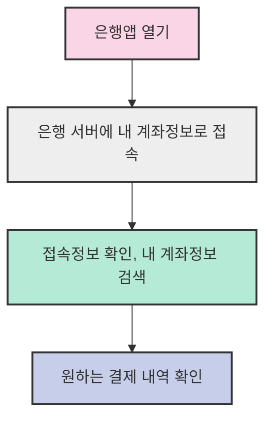
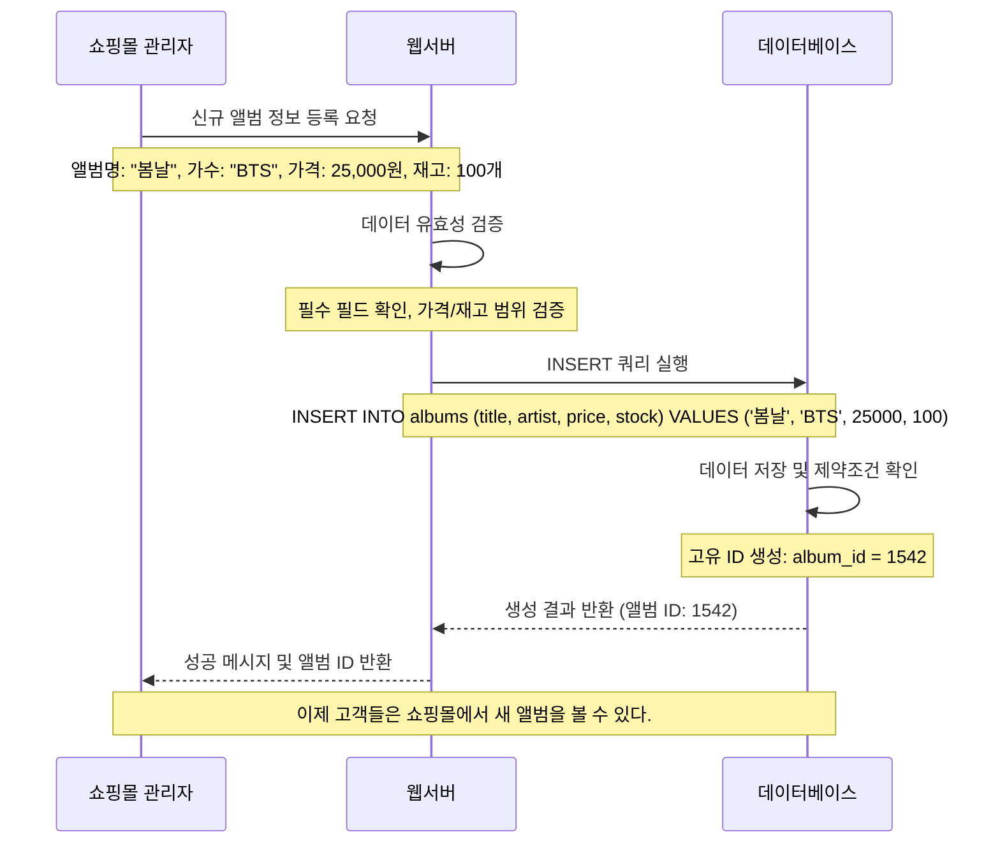
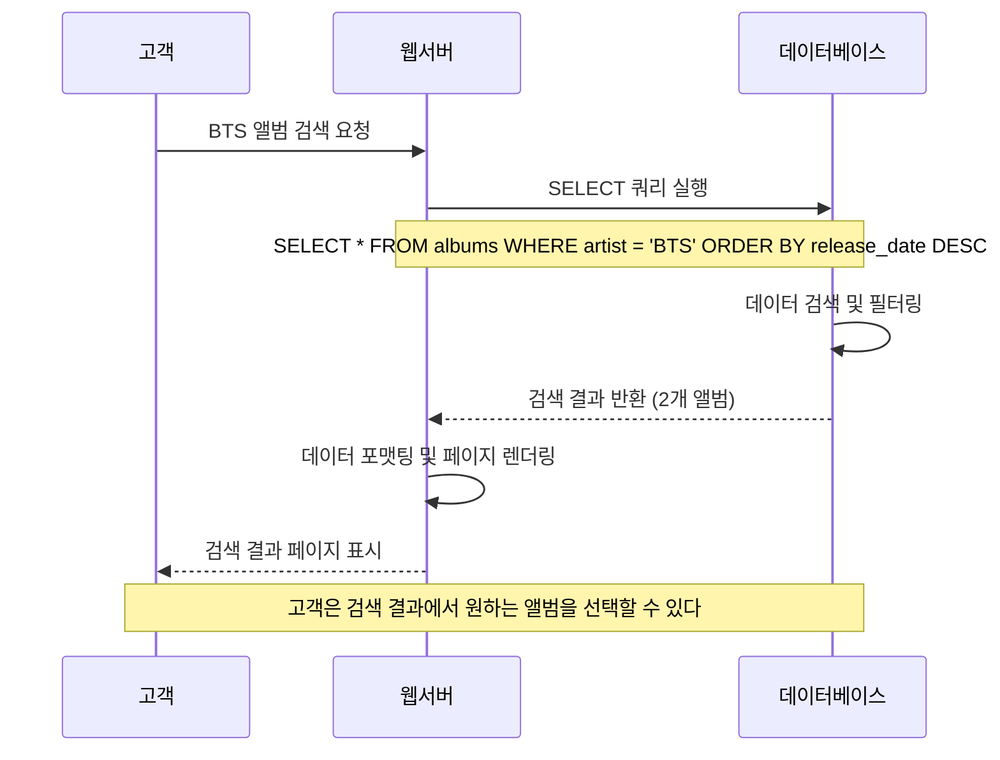
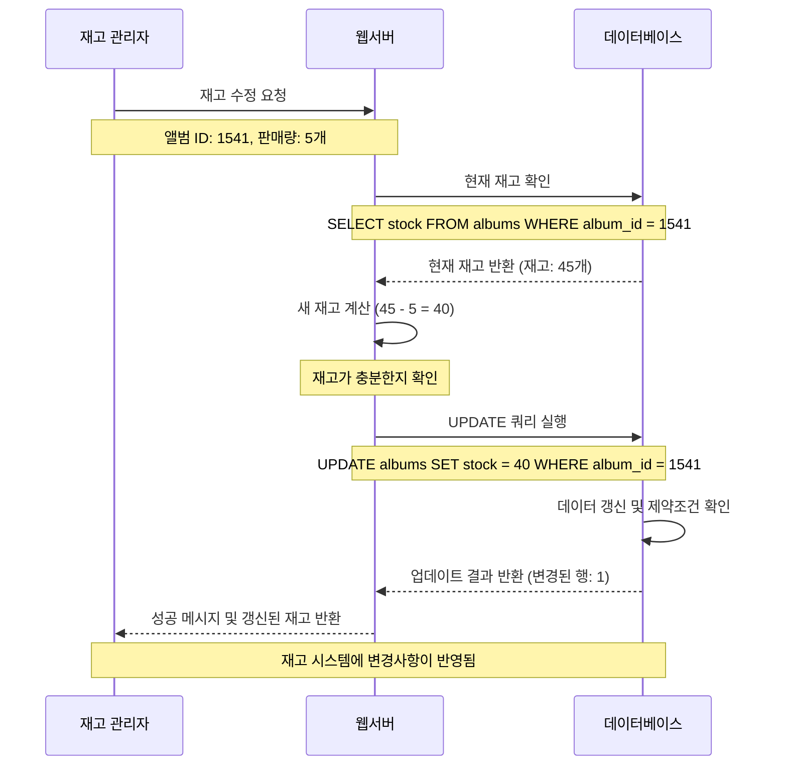
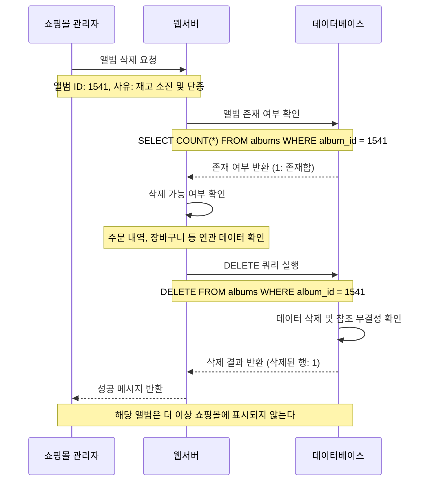
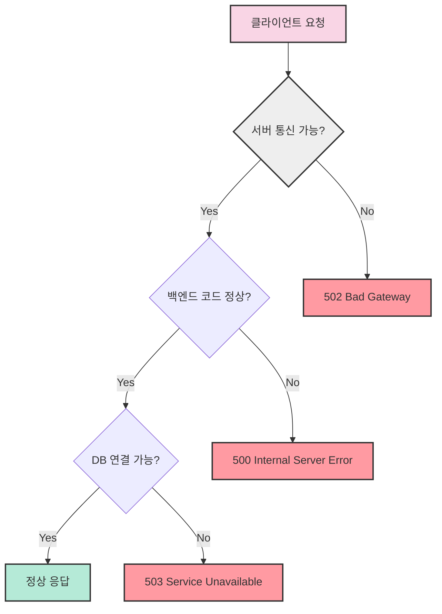
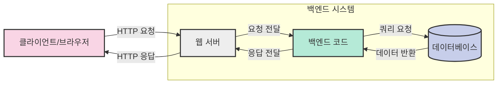
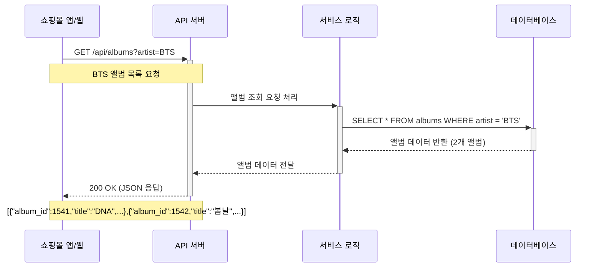

# 3. 데이터베이스와 REST API 🗄️

## 목차
- [3. 데이터베이스와 REST API 🗄️](#3-데이터베이스와-rest-api-️)
  - [목차](#목차)
  - [데이터베이스가 뭘까? 📊](#데이터베이스가-뭘까-)
    - [데이터베이스의 일상적 예시:](#데이터베이스의-일상적-예시)
      - [🏦 통장의 입출금 기록](#-통장의-입출금-기록)
      - [📚 도서관에서 도서를 검색하는 경우](#-도서관에서-도서를-검색하는-경우)
  - [데이터베이스의 주요 기능 ⚙️](#데이터베이스의-주요-기능-️)
    - [**Create**: 데이터를 생성하는 기능 ➕](#create-데이터를-생성하는-기능-)
      - [예시 테이블](#예시-테이블)
      - [데이터베이스 테이블이란?](#데이터베이스-테이블이란)
    - [**Read**: 데이터를 조회하는 기능 🔍](#read-데이터를-조회하는-기능-)
      - [예시 테이블](#예시-테이블-1)
    - [**Update**: 데이터를 수정하는 기능 ✏️](#update-데이터를-수정하는-기능-️)
      - [업데이트 전 테이블](#업데이트-전-테이블)
      - [업데이트 후 테이블](#업데이트-후-테이블)
    - [**Delete**: 데이터를 삭제하는 기능 ❌](#delete-데이터를-삭제하는-기능-)
      - [삭제 전 테이블](#삭제-전-테이블)
      - [삭제 후 테이블](#삭제-후-테이블)
    - [데이터베이스의 데이터 타입 🏷️](#데이터베이스의-데이터-타입-️)
  - [데이터베이스와 서버 🖥️](#데이터베이스와-서버-️)
    - [서버 오류의 다양한 예시](#서버-오류의-다양한-예시)
  - [데이터베이스와 웹 서버의 연결 🔄](#데이터베이스와-웹-서버의-연결-)
  - [API와 데이터베이스 🔌](#api와-데이터베이스-)
    - [CD 쇼핑몰 앱/웹에서 API 서버를 통해 데이터베이스와 통신하는 과정](#cd-쇼핑몰-앱웹에서-api-서버를-통해-데이터베이스와-통신하는-과정)
  - [데이터베이스의 종류와 선택 🧩](#데이터베이스의-종류와-선택-)
    - [DBMS(Database Management System)](#dbmsdatabase-management-system)
    - [데이터베이스 유형 비교](#데이터베이스-유형-비교)

---

## 데이터베이스가 뭘까? 📊

데이터베이스란 기록하고 조합하는 모든 데이터들의 총합을 의미한다.

### 데이터베이스의 일상적 예시:

#### 🏦 통장의 입출금 기록

#### 📚 도서관에서 도서를 검색하는 경우

| 정보 | 질문 예시 | 데이터 형태 |
|------|----------|------------|
| 보유 여부 | 도서관이 해당 책을 보유하고 있는가? | Boolean (Yes/No) |
| 책 정보 | 책의 제목, 작가, 출판사는? | Text 데이터 |
| 대여 상태 | 현재 대여중인가? 누가 대여했는가? | 관계형 데이터 |
| 대여 기간 | 언제 이용 가능(available)해지는가? | 날짜 데이터 |

> 💡 **중요!** 데이터베이스는 특성상 초기 설계를 나중에 바꾸는 것이 어렵다. 그러므로 반드시 초기에 정확한 설계를 해야 한다!
   
---

## 데이터베이스의 주요 기능 ⚙️

데이터베이스 역시 HTTP에서와 마찬가지로 CRUD 연산을 한다, 즉 데이터를 생성(Create), 읽기(Read), 수정(Update), 삭제(Delete)하고, 이에 해당하는 명령어인 Query가 각각 존재한다.

### **Create**: 데이터를 생성하는 기능 ➕
관리자가 쇼핑몰에 새로운 음악 CD를 등록하는 과정을 예시로 들어보자:

#### 예시 테이블

| album_id | title | artist | release_date | genre  | price | stock | created_at          |
|:--------:|:-----:|:------:|:------------:|:------:|:-----:|:-----:|:-------------------:|
| 1541     | DNA   | BTS    | 2017-09-18   | K-Pop  | 22000 | 45    | 2023-05-10 14:30:22 |
| 1542     | 봄날   | BTS    | 2017-02-13   | K-Pop  | 25000 | 100   | 2023-05-15 09:45:17 |

#### 데이터베이스 테이블이란?

- 데이터를 분류하기 좋게 저장되어 있는 형태
- 사람이 분류하기 쉽게 저장하는것이 중요하다.

> 💡 **팁**: Create 연산 후에는 방금 생성된 데이터의 고유 식별자(ID)를 반환하는 것이 일반적입니다. 이 ID는 향후 해당 데이터를 조회(Read), 수정(Update), 삭제(Delete)할 때 사용됩니다.

### **Read**: 데이터를 조회하는 기능 🔍
사용자가 쇼핑몰에서 BTS의 앨범을 검색하는 과정을 예시로 들어보자:

#### 예시 테이블

| album_id | title | artist | release_date | genre  | price | stock | created_at          |
|:--------:|:-----:|:------:|:------------:|:------:|:-----:|:-----:|:-------------------:|
| 1541     | DNA   | BTS    | 2017-09-18   | K-Pop  | 22000 | 45    | 2023-05-10 14:30:22 |
| 1542     | 봄날   | BTS    | 2017-02-13   | K-Pop  | 25000 | 100   | 2023-05-15 09:45:17 |

> 💡 **팁**: Read 연산은 데이터베이스 쿼리 중 가장 자주 사용되는 연산이며, 다양한 필터링, 정렬, 집계 기능을 통해 원하는 데이터를 정확하게 추출할 수 있다.

### **Update**: 데이터를 수정하는 기능 ✏️
재고 관리자가 앨범의 재고 수량을 업데이트하는 과정을 예시로 들어보자:

#### 업데이트 전 테이블

| album_id | title | artist | release_date | genre  | price | stock | created_at          |
|:--------:|:-----:|:------:|:------------:|:------:|:-----:|:-----:|:-------------------:|
| 1541     | DNA   | BTS    | 2017-09-18   | K-Pop  | 22000 | 45    | 2023-05-10 14:30:22 |
| 1542     | 봄날   | BTS    | 2017-02-13   | K-Pop  | 25000 | 100   | 2023-05-15 09:45:17 |

#### 업데이트 후 테이블

| album_id | title | artist | release_date | genre  | price | stock | created_at          |
|:--------:|:-----:|:------:|:------------:|:------:|:-----:|:-----:|:-------------------:|
| 1541     | DNA   | BTS    | 2017-09-18   | K-Pop  | 22000 | **40** | 2023-05-10 14:30:22 |
| 1542     | 봄날   | BTS    | 2017-02-13   | K-Pop  | 25000 | 100   | 2023-05-15 09:45:17 |

> 💡 **팁**: Update 연산 전에는 항상 현재 데이터 상태를 확인하는 Read 연산을 먼저 수행하는 것이 일반적입니다. 이를 통해 변경 전/후 데이터의 유효성을 보장할 수 있습니다.

### **Delete**: 데이터를 삭제하는 기능 ❌
관리자가 판매 중단된 앨범을 목록에서 삭제하는 과정을 예시로 들어보자:

#### 삭제 전 테이블

| album_id | title | artist | release_date | genre  | price | stock | created_at          |
|:--------:|:-----:|:------:|:------------:|:------:|:-----:|:-----:|:-------------------:|
| 1541     | DNA   | BTS    | 2017-09-18   | K-Pop  | 22000 | 40    | 2023-05-10 14:30:22 |
| 1542     | 봄날   | BTS    | 2017-02-13   | K-Pop  | 25000 | 100   | 2023-05-15 09:45:17 |

#### 삭제 후 테이블

| album_id | title | artist | release_date | genre  | price | stock | created_at          |
|:--------:|:-----:|:------:|:------------:|:------:|:-----:|:-----:|:-------------------:|
| 1542     | 봄날   | BTS    | 2017-02-13   | K-Pop  | 25000 | 100   | 2023-05-15 09:45:17 |

> ⚠️ **주의**: Delete 연산은 데이터 복구가 어려울 수 있으므로, 실행 전 충분한 검증과 백업이 필요합니다. 많은 시스템에서는 실제 데이터 삭제 대신 '소프트 삭제'(상태 필드만 변경)를 활용하여 나중에 데이터 복구 가능성을 열어둡니다.

### 데이터베이스의 데이터 타입 🏷️

데이터베이스에 사용하는 데이터 타입은 크게 숫자, 문자, 논리, 시간으로 나눌 수 있다.

이러한 데이터 타입은 데이터베이스의 종류에 따라 다르지만, 자주 쓰이는 데이터 타입은 다음과 같다:

| 데이터 타입 | 설명 | SQL 예시 | 일반적 사용 사례 |
|:-----------:|:----:|:--------:|:---------------:|
| **숫자형** ||||
| INTEGER | 정수 값 | INT, INTEGER | 사용자 ID, 수량, 나이 |
| DECIMAL | 소수점이 있는 숫자 | DECIMAL(10,2), NUMERIC | 가격, 측정값 |
| FLOAT | 부동 소수점 숫자 | FLOAT, REAL | 과학적 계산, 좌표 |
| **문자형** ||||
| CHAR | 고정 길이 문자열 | CHAR(10) | 고정 코드(우편번호 등) |
| VARCHAR | 가변 길이 문자열 | VARCHAR(255) | 이름, 주소, 제목 |
| **논리형** ||||
| BOOLEAN | 참/거짓 값 | BOOLEAN, TINYINT(1) | 상태 플래그, 활성화 여부 |
| **시간형** ||||
| DATE | 날짜 | DATE | 생일, 기념일 |
| TIME | 시간 | TIME | 영업 시간, 예약 시간 |
| DATETIME | 날짜와 시간 | DATETIME, TIMESTAMP | 게시 시간, 로그 기록 |

---

## 데이터베이스와 서버 🖥️

서버오류는 클라이언트(Front-end)와 서버(Back-end)가 통신이 불가능한 모든 상황을 일컫는다.

### 서버 오류의 다양한 예시

| 오류 유형 | 원인 | 해결 방안 |
|:--------:|:----:|:--------:|
| **트래픽 과부하** | 지나치게 많은 클라이언트의 요청 | 서버 확장(스케일링), 캐싱 전략 도입 |
| **백엔드 코드의 버그** | 서버 코드의 오류 | 코드 디버깅, 로그 분석, 테스트 강화 |
| **데이터베이스 연결 오류** | 서버-DB 연결 실패 | 연결 설정 확인, DB 서버 상태 점검 |

---

## 데이터베이스와 웹 서버의 연결 🔄

웹 서버와 데이터베이스 사이의 연결은 다음과 같은 과정을 거친다:

---

## API와 데이터베이스 🔌

API(Application Programming Interface)는 서버와 클라이언트 간의 통신을 위한 규약으로, 프로그램간의 대화를 하도록 도와주는 역할을 한다. 클라이언트의 요청 -> 서버의 응답구조를 가지고 있으며, **Open API** 등 다양한 행정정보를 유용하게 제공하는 공개 API 또한 존재한다.

### CD 쇼핑몰 앱/웹에서 API 서버를 통해 데이터베이스와 통신하는 과정

> 💡 **팁**: API는 프론트엔드와 백엔드 간의 계약과 같습니다. 잘 설계된 API는 명확한 문서화와 일관된 응답 형식을 제공하여 개발자가 쉽게 사용할 수 있게 합니다.

---

## 데이터베이스의 종류와 선택 🧩

데이터베이스라고 하면 하나의 공통된 형태가 존재할 것 같지만, 실제로는 다양한 종류의 데이터베이스가 존재하고, 다양한 데이터베이스를 관리하는 프로그램도 존재한다.

### DBMS(Database Management System)

데이터베이스를 관리하는 프로그램을 DBMS라고 한다. DBMS의 예시는 다음과 같다:

| DBMS | 제작사 | 라이선스 유형 |
|:----:|:------:|:------------:|
| MySQL | Oracle Corporation | 오픈소스/상용 듀얼 |
| MariaDB | MariaDB Foundation | 완전 오픈소스 |
| PostgreSQL | PostgreSQL Global Development Group | 완전 오픈소스 |
| Oracle Database | Oracle Corporation | 상용 |

### 데이터베이스 유형 비교

| 특성 | 관계형 데이터베이스 | NoSQL |
|:----:|:------------------:|:-----:|
| **데이터 구조** | 테이블 형태 (행과 열) | 다양한 형태 (문서, 키-값, 그래프 등) |
| **스키마** | 고정 스키마 | 유연한 스키마 또는 스키마리스 |
| **관계** | Primary Key를 통한 명확한 관계 정의 | 관계 정의가 덜 엄격함 |
| **확장성** | 수직적 확장(Scale-up) | 수평적 확장(Scale-out) |
| **사용 사례** | 복잡한 쿼리, 트랜잭션 중심 애플리케이션 | 대용량 데이터, 빠른 개발 주기, 유연한 데이터 모델 |
| **예시** | MySQL, PostgreSQL, Oracle | MongoDB, Redis, Cassandra |

> 💡 **결론**: **관계형 데이터베이스**는 이름에서 알 수 있듯이 Primary Key라는 고유값을 가지고 있기 때문에 데이터간의 연결과 관계(relation)을 따지기 유용하고, **NoSQL**은 단순한 기록이 가능하고 대용량 데이터를 처리하는데 이점이 있습니다.