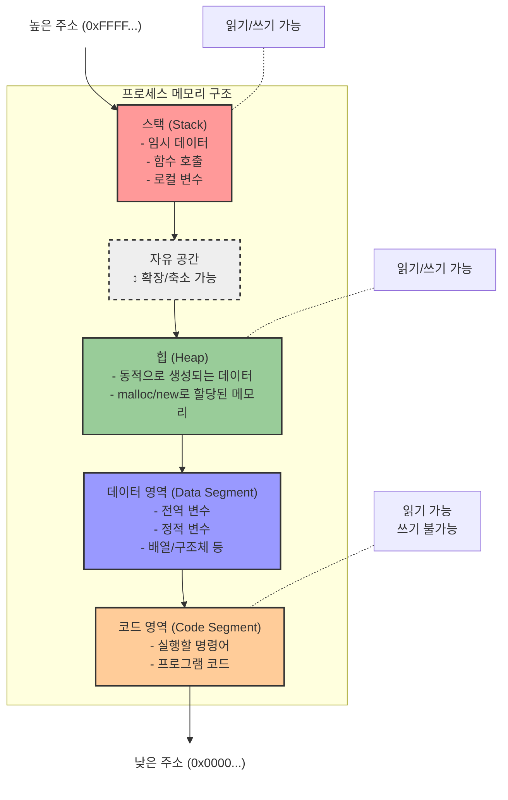
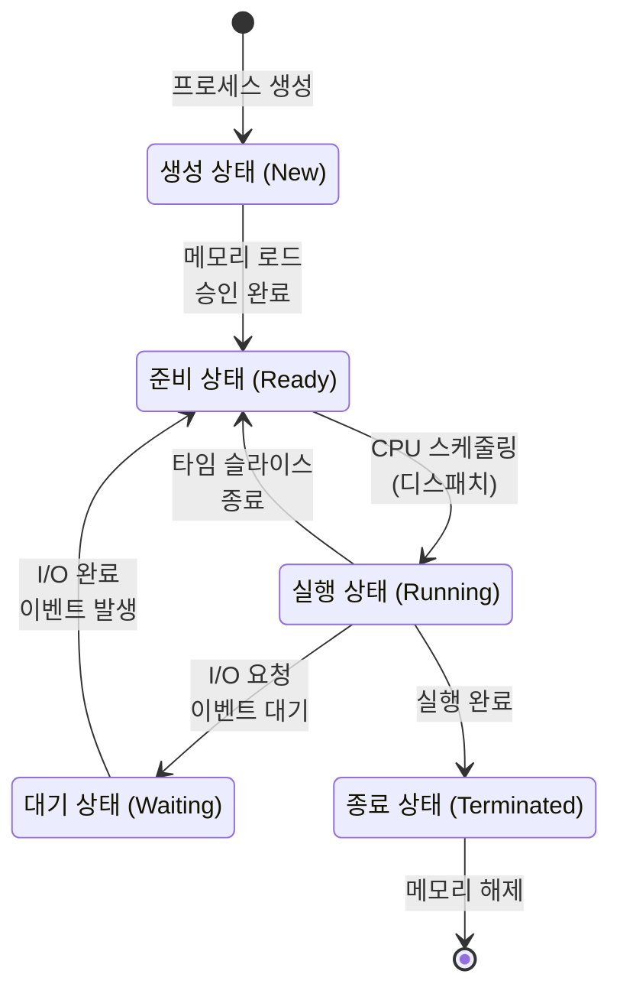

# 1. 프로세스 ⚙️

## 목차
- [1. 프로세스 ⚙️](#1-프로세스-️)
  - [목차](#목차)
  - [프로세스의 네 가지 구성요소 🧩](#프로세스의-네-가지-구성요소-)
  - [정적 할당과 동적 할당 비교 💾](#정적-할당과-동적-할당-비교-)
  - [프로세스의 상태 사이클 🔄](#프로세스의-상태-사이클-)
  - [멀티 프로세싱 🔀](#멀티-프로세싱-)
    - [vs 멀티 스레딩?](#vs-멀티-스레딩)
  - [프로세스 간 통신: 다른 프로세스와 정보를 주고받는 방법 📨](#프로세스-간-통신-다른-프로세스와-정보를-주고받는-방법-)
  - [프로세스 스케줄링 ⏱️](#프로세스-스케줄링-️)
  - [교착상태와 기아상태 ⛔](#교착상태와-기아상태-)
    - [교착상태(Deadlock)](#교착상태deadlock)
      - [교착 상태를 해결하려면?](#교착-상태를-해결하려면)
    - [기아상태(Starvation)](#기아상태starvation)
      - [기아 상태를 해결하려면?](#기아-상태를-해결하려면)

---

## 프로세스의 네 가지 구성요소 🧩

프로세스는 **스택, 힙, 데이터, 코드**로 구성된다.

| 구성요소 | 설명 | 특징 |
|---------|------|------|
| 스택(Stack) | 임시 데이터(함수 호출, 로컬 변수) 저장 | 후입선출(LIFO) 구조, push/pop 연산 |
| 힙(Heap) | 동적으로 생성되는 데이터가 저장 | 사용자가 직접 메모리 할당/해제 가능 |
| 데이터(Data) | 전역 변수, 정적 변수, 배열, 구조체 저장 | 프로그램 시작 시 할당, 종료 시 소멸 |
| 코드(Code) | CPU에서 실행할 명령어 저장 | 읽기 전용 영역 |



*그림으로 본 프로세스의 구성요소*

```python
# 코드 영역: 이 파이썬 코드 자체가 코드 영역에 저장됨

# 데이터 영역: 전역 변수
total_count = 0  # 전역 변수는 데이터 영역에 저장됨

def calculate_sum(n):
    # 스택 영역: 매개변수와 지역 변수
    result = 0  # 지역 변수는 스택 영역에 저장됨
    
    for i in range(n):
        result += i
    
    return result

def main():
    global total_count
    
    # 스택 영역: 지역 변수
    x = 5  # 지역 변수는 스택 영역에 저장됨
    
    # 힙 영역: 동적으로 할당되는 객체들
    numbers = [1, 2, 3, 4, 5]  # 리스트는 힙에 할당됨
    user = {"name": "홍길동", "age": 30}  # 딕셔너리도 힙에 할당됨
    
    total_count += 1  # 전역 변수 업데이트
    
    print(f"합계: {calculate_sum(x)}")
    print(f"리스트: {numbers}")
    print(f"실행 횟수: {total_count}")

# 프로그램 시작
if __name__ == "__main__":
    main()
```

*파이썬 코드를 통한 프로세스의 구성요소 예시*

> 각 메모리 영역의 경계는 구별되어야 하며, 스택 메모리가 경계를 넘어서는 경우 스택 오버플로우, 힙 메모리가 경계를 넘어서는 경우 힙 오버플로우 등으로 부른다. 두 오버플로우의 경우 **Segmentation Fault(슬랭으로 SegFault라고도 부름)** 라는 오류로 이어진다.
> 
> **더 읽어보면 좋은 글**: [메모리의 구조](https://www.tcpschool.com/c/c_memory_structure)

---

## 정적 할당과 동적 할당 비교 💾

프로세스의 메모리 할당 방식은 서로 다른 특성을 가진 두 가지 방식이 있습니다.

| 할당 방식 | 할당 시점 | 장점 | 단점 |
|----------|-----------|------|------|
| **정적 할당** | 프로그램 실행 전 | 메모리 관리가 간단함 | 유연성이 떨어짐 |
| **동적 할당** | 프로그램 실행 중 필요할 때 | 메모리 효율성 높음 | 관리 오버헤드 발생 |

---

## 프로세스의 상태 사이클 🔄

프로세스는 생명주기 동안 다양한 상태로 전환되며 실행됩니다.

| 상태 | 설명 |
|------|------|
| **생성 상태** | 준비 상태로의 승인을 기다리며 아직 메모리에 로드되지 않은 상태 |
| **준비 상태** | CPU를 사용하고 있지 않지만 언제든 실행 가능하게 대기하는 상태 |
| **실행 상태** | CPU를 사용하며 명령어를 실행하는 상태 |
| **대기 상태** | 프로세스가 특정 자원이나 이벤트를 기다리는 상태 |
| **종료 상태** | 프로세스가 실행을 마치고 메모리 해제를 대기하는 상태 |



---

## 멀티 프로세싱 🔀

멀티 프로세싱은 **하나의 컴퓨터가 여러 개의 프로세스를 동시에 처리하는 방식**을 의미한다.

| 구현 방식 | 설명 |
|----------|------|
| 단일 CPU 시분할 | 하나의 CPU가 빠르게 여러 프로세스를 번갈아가며 실행 |
| 다중 코어/CPU | 여러 CPU 코어가 각 프로세스를 동시에 실행 |

**장점**:
- 한 프로세스의 오류가 다른 프로세스에 영향을 주지 않아 안정성 높음
- 독립적인 메모리 공간으로 보안성이 높음

**단점**:
- 프로세스 간 자원 공유가 어려움
- 프로세스 생성과 컨텍스트 스위칭에 큰 오버헤드
- 메모리 사용량이 많아짐

### vs 멀티 스레딩?

| 특성 | 멀티 프로세싱 | 멀티 스레딩 |
|------|--------------|------------|
| 자원 공유 | 독립적인 메모리 공간 | 프로세스 내에서 자원 공유 |
| 통신 방법 | IPC 필요 | 공유 메모리 직접 접근 |
| 안정성 | 한 프로세스 오류가 다른 프로세스에 영향 없음 | 한 스레드 오류가 전체 프로세스에 영향 |
| 속도 | 상대적으로 느림 | 상대적으로 빠름 |
| 메모리 사용 | 많음 | 적음 |

> 멀티 프로세싱과 멀티 스레딩은 각각 다른 상황에 적합합니다. 높은 안정성이 필요하면 멀티 프로세싱, 빠른 데이터 공유와 효율성이 필요하면 멀티 스레딩이 선호됩니다.

---

## 프로세스 간 통신: 다른 프로세스와 정보를 주고받는 방법 📨

독립된 프로세스 간의 안전한 데이터 교환을 위해 운영체제는 다양한 IPC(Inter-Process Communication) 메커니즘을 제공한다.

| IPC 방식 | 설명 | 특징 |
|----------|------|------|
| **메시지 큐** | 운영체제가 관리하는 메시지 저장소를 통한 통신 | 비동기적 통신, 시스템 부하 적음 |
| **공유 메모리** | 두 프로세스가 동일한 메모리 영역을 공유 | 가장 빠른 IPC, 동기화 필요 |
| **파이프** | 단방향 데이터 흐름을 위한 채널 | 주로 부모-자식 프로세스 간 사용 |
| **소켓** | 네트워크 프로토콜을 이용한 통신 | 원격 프로세스 간 통신 가능 |

---

## 프로세스 스케줄링 ⏱️

프로세스 스케줄링은 **여러 프로세스가 CPU를 사용할 수 있도록 CPU를 할당하는 작업**이다.

**스케줄링의 목적**:
1. 시스템 처리량 최대화
2. 응답 시간 최소화
3. 공정한 자원 분배
4. 기아 상태 방지

| 스케줄링 알고리즘 | 설명 | 장단점 |
|-----------------|------|--------|
| **FIFO/FCFS** | 먼저 도착한 프로세스 먼저 실행 | 간단하지만 긴 프로세스에 의한 지연 발생 |
| **SJF** | 실행 시간이 짧은 프로세스 먼저 실행 | 평균 대기 시간 최소화, 긴 작업 기아 가능성 |
| **라운드 로빈** | 시간 할당량을 정해 번갈아 실행 | 공정하지만 시간 할당량에 민감 |

> 어떤 스케줄링 알고리즘이 최적인지는 시스템의 목적과 워크로드 특성에 따라 달라집니다. 실시간 시스템과 배치 처리 시스템은 서로 다른 스케줄링 전략을 필요로 합니다.

---

## 교착상태와 기아상태 ⛔

### 교착상태(Deadlock)

교착상태는 **두 개 이상의 프로세스가 서로 상대방의 작업이 끝나기만을 기다리며 무한 대기 상태에 빠지는 현상**이다.

**교착상태 발생 조건**:

| 조건 | 설명 |
|------|------|
| **상호 배제** | 한 자원은 한 번에 한 프로세스만 사용 가능 |
| **점유 대기** | 자원을 가진 상태에서 다른 자원을 요청 |
| **비선점** | 이미 할당된 자원은 강제로 회수할 수 없음 |
| **순환 대기** | 프로세스 간 자원 요청이 순환적으로 발생 |

> 모든 조건이 동시에 성립할 때 교착상태가 발생합니다.

#### 교착 상태를 해결하려면?

| 접근법 | 설명 |
|-------|------|
| **예방** | 네 가지 조건 중 하나라도 성립하지 않도록 시스템 설계 |
| **회피** | 자원 할당 시 안전한 상태를 유지하도록 결정 (은행원 알고리즘) |
| **탐지 및 복구** | 교착상태 발생 시 감지하고 프로세스 종료 등으로 해결 |
| **무시** | 드물게 발생한다면 시스템 재시작으로 해결 |

### 기아상태(Starvation)

기아상태는 **프로세스가 원하는 자원을 계속해서 할당받지 못해 영원히 대기하는 상태**이다.

#### 기아 상태를 해결하려면?

| 해결책 | 설명 |
|-------|------|
| **에이징(Aging)** | 오래 기다린 프로세스의 우선순위를 점차 높임 |
| **우선순위 조정** | 우선순위를 주기적으로 재계산하여 공정성 확보 |
| **자원 예약** | 일부 자원을 낮은 우선순위 프로세스에 배타적으로 할당 |