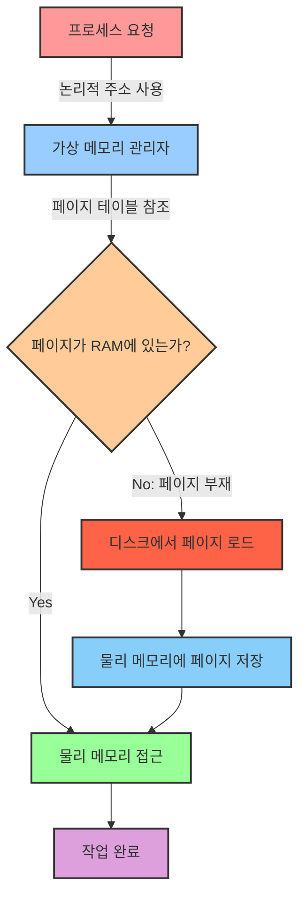

# 2. 메모리 💾

## 목차
- [2. 메모리 💾](#2-메모리-)
  - [목차](#목차)
  - [메모리 관리란? 🧠](#메모리-관리란-)
  - [메모리 할당과 해제 📋](#메모리-할당과-해제-)
    - [연속 할당](#연속-할당)
    - [불연속 할당](#불연속-할당)
  - [가상 메모리: 더 많은 작업을 위한 방법 🚀](#가상-메모리-더-많은-작업을-위한-방법-)
    - [가상 메모리의 원리](#가상-메모리의-원리)
    - [가상 메모리의 장점 🚀](#가상-메모리의-장점-)
    - [가상 메모리 동작 구조 🔄](#가상-메모리-동작-구조-)

---

## 메모리 관리란? 🧠

메모리 관리란 프로그램들이 **잘 실행될 수 있도록 메모리를 할당하고 해제하는 작업**이다. 메모리 공간은 한정적이기 때문에 메모리 관리 기술은 필수적이며, 메모리 관리 도중에는 각 프로그램의 **리소스가 보호**되어야 하는 동시에 여러 프로세스의 **동시 실행을 위한 메모리 공간을 제공**해야 한다.

메모리 관리를 통해 메모리 공간을 할당/해제하고, 메모리 간 침범을 막고, 효율적인 메모리 자원 분배를 실현할 수 있다.

---

## 메모리 할당과 해제 📋

메모리 공간들은 시스템에 따라 다르지만 각각 고유한 주소를 가지고 있다.(ex. 0x0000, 0x0001, ...) 많은 방으로 구성된 호텔과 같은 구성이라고 보면 되는데 공간에 값을 배정하는 것을 **할당**, 값을 제거하는 것을 **해제**라고 한다.

메모리 할당 방식에 따라 **연속 할당**과 **불연속 할당**이 있는데, 전자는 인접한 순서대로 메모리를 할당하는 방식이고 후자는 메모리 공간이 분산되어 할당되는 방식이다. (현대 운영체제에서는 후자를 주로 사용)

### 연속 할당

연속 할당의 경우 크게 두 가지 방식으로 나뉘는데, **고정 할당**과 **가변 할당**이 있다. 

1. 고정 할당의 경우

- 각 프로세스에게 고정된 메모리 공간을 할당하는 방식
- **메모리 공간이 고정되어 있기 때문에 메모리 공간의 낭비가 적다.**
- 외부 단편화 문제(ex. 메모리를 6만큼 할당해야 하는데 분할 단위가 4여서 더 이상 할당할 수 없는 경우)와 내부 단편화 문제(ex. 메모리를 4만큼 할당해야 하는데 6만큼 할당받아 2만큼 남는 경우)가 발생할 수 있다.

2. 가변 할당의 경우
   
- 프로세스의 크기에 따라 메모리 공간을 할당하는 방식
- **메모리 공간이 가변적이기 때문에 메모리 공간의 낭비가 발생할 수 있다.**
- 프로세스의 할당/해제에 따라 남는 공간이 생겨 외부 단편화 문제는 여전히 발생할 수 있다.

### 불연속 할당

불연속 할당 방식에는 **페이징(Paging)** 과 **세그멘테이션(Segmentation)** 이 있다.

**1. 페이징**

메모리를 작은 크기의 블록 단위인 **페이지**로 나누는 방식을 **페이징**이라고 한다. **페이지 테이블**이라는 자료구조를 통해 가상 주소와 물리 주소를 매핑하여 사용한다. **스와핑** 기법을 통해 사용 빈도가 적은 페이지 혹은 프로세스는 보조기억장치로 옮길 수 있다. 페이지 단위로 스와핑하면 요구 페이징(Demand Paging), 프로세스 단위로 스와핑하면 프로세스 스와핑(Process Swapping)이라고 한다.(주로 사용하는 것은 요구 페이징이다.)

페이징 기법의 문제점은 내부 단편화의 발생이 가능하다는 것이다. 페이지의 크기가 4KB인데 3KB만 사용하는 경우 1KB가 남게 되어 이를 내부 단편화라고 한다.

> 💡 요구 페이징은 말하자면 실제 물리 메모리를 하드 디스크의 캐시로써 사용하는 기법이다.

> **페이지**: 물리적 메모리와 가상 주소를 매핑하는 단위로, 고정된 크기의 블록(일반적으로 4KB 혹은 8KB)으로 나누어진 메모리 공간이다.

**2. 세그멘테이션**

페이징의 문제점은 프로세스의 실제 구현 단위를 고려하지 않고 동일하게 분할한다는 것이다. 세그먼테이션은 이와 달리 **논리적으로 같은 역할을 하는 단위인 세그먼트**(주로 코드, 데이터, 스택, 힙)로 나누어 메모리를 할당하는 방식이다. 세그먼트 테이블을 통해 가상 주소와 물리 주소를 매핑하여 사용한다.

세그먼테이션은 내부 단편화는 발생하지 않지만 외부 단편화가 발생할 수 있다.

**3. 페이징 + 세그먼테이션**

두 가지 방법을 모두 사용한다. 세그먼트 단위로 역할에 따라 나누고, 세그먼트를 다시 페이지로 나누어 메모리를 할당하는 방식이다. 단편화 문제를 해결하는 가장 좋은 방법이지만 두 번의 테이블을 거쳐야 하는 단점이 있다.

---

## 가상 메모리: 더 많은 작업을 위한 방법 🚀

가상 메모리는 실제 주소를 할당하지 않고 가상의 주소인 **논리적 주소**를 할당하여 실제 물리적 메모리 크기보다 더 큰 공간을 프로그램이 사용할 수 있도록 해주는 기술이다. 모든 프로세스는 고정된 주소를 가지며, 실제 물리적 주소는 운영체제만이 접근 가능한 상태에서 분배하며, 보조기억장치(SSD, HDD 등) 일부를 메모리처럼 사용하도록 한다.

### 가상 메모리의 원리

프로세스가 접근할 수 있는 가상의 주소인 **논리적 주소(Logical Address)** 와 운영체제가 관리하는 **물리적 주소(Physical Address)** 를 매핑하여 실제 메모리 주소에 접근하지 않고도 접근하게 하는 것이다.

### 가상 메모리의 장점 🚀

| 장점 | 설명 |
|------|------|
| **독립된 주소 공간** | 프로세스마다 독립된 주소 공간을 제공하여, 동일한 논리 주소 범위(0~최대값)를 사용 가능해 프로그래밍이 쉬워진다. |
| **메모리 보호** | 자원을 운영체제가 관리하므로 프로세스 간 메모리 침범을 막을 수 있다. |
| **더 큰 메모리 공간** | 물리적 메모리보다 큰 공간을 사용할 수 있어 더 많은 프로세스를 실행할 수 있다. |
| **메모리 효율성** | 덜 사용되는 데이터는 보조기억장치 영역으로 보내 실제 RAM의 효율을 높일 수 있다.(페이지 교체) |

> 💡 **알아두면 좋은 팁**: 가상 메모리는 운영체제의 핵심 기술로, 여러분이 사용하는 모든 현대 운영체제(Windows, macOS, Linux 등)에서 기본적으로 활용되고 있습니다!

### 가상 메모리 동작 구조 🔄

> 📚 **심화 학습**: [Virtual Memory in Operating System](https://www.geeksforgeeks.org/virtual-memory-in-operating-system/)에서 가상 메모리의 작동 원리에 대해 더 자세히 알아보자!

