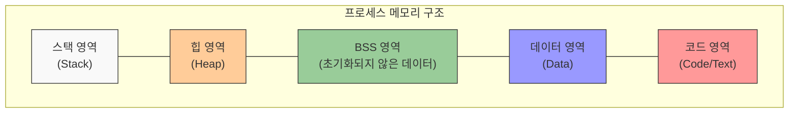

# 4. 리눅스의 프로세스와 네트워크 관리 🖥️

## 목차
- [4. 리눅스의 프로세스와 네트워크 관리 🖥️](#4-리눅스의-프로세스와-네트워크-관리-️)
  - [목차](#목차)
  - [프로세스란?: 프로세스의 특징 알아보기 🔄](#프로세스란-프로세스의-특징-알아보기-)
    - [PID란?](#pid란)
    - [프로세스의 메모리 구성?](#프로세스의-메모리-구성)
  - [프로세스와 관련된 명령어: ps, kill 🛑](#프로세스와-관련된-명령어-ps-kill-)
    - [프로세스 목록 보기: ps](#프로세스-목록-보기-ps)
    - [프로세스 종료: kill](#프로세스-종료-kill)
  - [jobs 명령어: 백그라운드 프로세스 목록 확인하기 👀](#jobs-명령어-백그라운드-프로세스-목록-확인하기-)
  - [at과 cron 명령어: 작업 예약하기 ⏰](#at과-cron-명령어-작업-예약하기-)
    - [at 명령어](#at-명령어)
    - [crontab 명령어](#crontab-명령어)
  - [SSH 알아보기 🔒](#ssh-알아보기-)

---

## 프로세스란?: 프로세스의 특징 알아보기 🔄

리눅스 시스템에서 메모리에 적제되어 실행되고 있는 모든 프로그램을 프로세스라고 한다. 프로세스의 특징은 다음과 같다:

| 특징 | 설명 |
|------|------|
| **실행 단위** | 모든 프로그램이 하나 이상의 프로세스를 가짐 |
| **계층 구조** | 부모 프로세스와 자식 프로세스가 있음 |
| **병행 실행** | 여러 프로세스의 병행적인 실행이 가능 |
| **관리 주체** | 커널에 의해 관리됨 |
| **소유권** | 프로세스마다 소유자가 있음 |
| **식별자** | 각 프로세스는 고유한 PID(Process ID)를 가짐 |

### PID란?

모든 프로세스는 고유한 번호(PID)를 가지며, PID 1번은 init 프로세스, 2번은 kthreadd 프로세스로 예약되어 있다. init 프로세스는 나머지 모든 시스템 프로세스의 부모 프로세스이며, thread 프로세스는 모든 스레드의 부모 프로세스이다.

### 프로세스의 메모리 구성?



프로세스는 코드, 데이터, 스택, 힙의 4가지 영역 이외에도 데이터 영역과 힙 영역 사이에 BSS 영역 또한 함께 포함하고 있다.

---

## 프로세스와 관련된 명령어: ps, kill 🛑

### 프로세스 목록 보기: ps

ps 명령어는 **현재 실행 중인 프로세스 목록**을 보여준다. ps 명령어는 다음과 같은 옵션을 사용할 수 있다.

| 옵션 | 설명 |
|------|------|
| **-e** | 시스템에 존재하는 모든 프로세스를 보여줌 |
| **-f** | 프로세스의 상세 정보를 보여줌 |
| **-a** | 다른 사용자의 프로세스도 보여줌 |
| **-u** | 사용자 이름과 시작 시간을 보여줌 |
| **-x** | 터미널 제어 없이 실행 중인 프로세스를 보여줌 |

```bash
exampleuser@ubuntu:~$ ps -ef

UID        PID  PPID  C STIME TTY          TIME CMD
root         1     0  0  2021 ?        00:00:01 /sbin/init
root         2     0  0  2021 ?        00:00:00 [kthreadd]
root         3     2  0  2021 ?        00:00:00 [rcu_gp]
root         4     2  0  2021 ?        00:00:00 [rcu_par_gp]
root         6     2  0  2021 ?        00:00:00 [kworker/0:0H-kblockd]
```

### 프로세스 종료: kill

kill 명령어는 **프로세스를 종료**하는 명령어이다. kill 명령어는 다음과 같은 옵션을 사용할 수 있다.

| 옵션 | 설명 | 용도 |
|------|------|------|
| **-l** | 시그널 목록을 보여줌 | 가능한 시그널 확인 |
| **-1** | SIGHUP 시그널을 보냄 | 프로세스 재실행 |
| **-9** | SIGKILL 시그널을 보냄 | 프로세스 강제종료 |
| **-15** | SIGTERM 시그널을 보냄 | 프로세스 정상종료 |

```bash
exampleuser@ubuntu:~$ kill -9 1234  # PID 1234인 프로세스를 강제 종료
```

---

## jobs 명령어: 백그라운드 프로세스 목록 확인하기 👀

jobs 명령어는 **백그라운드에서 실행 중인 프로세스 목록**을 보여주는 명령어이다.

> 🔍 **jobs vs. ps 차이점**: jobs는 현재 터미널 세션에서 실행 중인 작업만 보여주는 반면, ps는 시스템 전체의 프로세스를 보여줍니다.

| 특징 | 설명 |
|------|------|
| **범위** | 터미널 명령만을 통한 작업만을 의미 |
| **생명주기** | 터미널이 종료되면 jobs와 함께 프로세스도 종료됨 |
| **제어** | kill 명령을 통해 종료 가능 |

```bash
exampleuser@ubuntu:~$ sleep 100 &  # 백그라운드에서 100초 대기
[1] 1234
exampleuser@ubuntu:~$ jobs         # 백그라운드 작업 목록 확인
[1]+  Running                 sleep 100 &
```

---

## at과 cron 명령어: 작업 예약하기 ⏰

### at 명령어

at 명령어는 **특정 시간에 한 번만 실행되는 작업**을 예약하는 명령어이다.

| 옵션 | 설명 |
|------|------|
| **-m** | 작업이 완료되면 메일을 보냄 |
| **-f** | 스크립트를 실행 |
| **-l** | 예약된 작업 목록을 보여줌 (atq 명령과 동일) |
| **-v** | 작업이 수행될 시간 출력 |
| **-d** | 예약된 작업을 삭제 (atrm 명령과 동일) |

```bash
exampleuser@ubuntu:~$ at 10:00
warning: commands will be executed using /bin/sh
at> echo "Hello, world!"
at> < EOT >
job 1 at 2022-01-01 10:00
```
*10시에 "Hello, world!"를 출력하는 작업 예약*

### crontab 명령어

crontab 명령어는 **특정 시간에 주기적으로 실행되는 작업**을 예약하는 명령어이다.

| 옵션 | 설명 |
|------|------|
| **-l** | 현재 계정에 설정된 crontab 목록을 보여줌 |
| **-e** | crontab 파일을 편집 |
| **-r** | crontab 파일을 삭제 |
| **-u** | 다른 사용자의 crontab 파일을 편집 |

crontab의 형식은 다음과 같다:

분(0-59) 시(0-23) 일(1-31) 월(1-12) 요일(0-7) 실행할 명령어

(각 분,시,일,월,요일마다 콤마를 사용해 여러 값 입력 가능)

```bash
exampleuser@ubuntu:~$ crontab -l
0 0 * * * echo "Hello, world!"
```
*매일 0시에 "Hello, world!"를 출력하는 작업 예약*

---

## SSH 알아보기 🔒

SSH(Secure Shell)는 **암호화된 통신을 통해 원격지에 접속**할 수 있게 해주는 프로토콜이다. 우분투에서는 openssh라는 패키지를 통해 SSH를 사용할 수 있다. 기본 설치 시에는 클라이언트 기능만 제공되며, (다른 컴퓨터에서 접속을 허용하려면)서버 기능을 사용하려면 openssh-server 패키지를 설치해야 한다.

1. openssh 설치 여부를 확인하는 명령어는 다음과 같다:
    
```bash
exampleuser@ubuntu:~$ dpkg -l | grep openssh
```

2. apt-get 명령어로 openssh-server를 설치하는 명령어는 다음과 같다:

```bash
exampleuser@ubuntu:~$ sudo apt-get install openssh-server
```

3. SSH 서버를 시작하는 명령어는 다음과 같다:

```bash
exampleuser@ubuntu:~$ sudo service ssh start
```

4. SSH 포트를 확인하는 명령어는 다음과 같다:

```bash
exampleuser@ubuntu:~$ sudo netstat -antp
```

5. SSH 접속하는 명령어는 다음과 같다
```bash
exampleuser@ubuntu:~$ ssh exampleuser@117.12.3.4
```