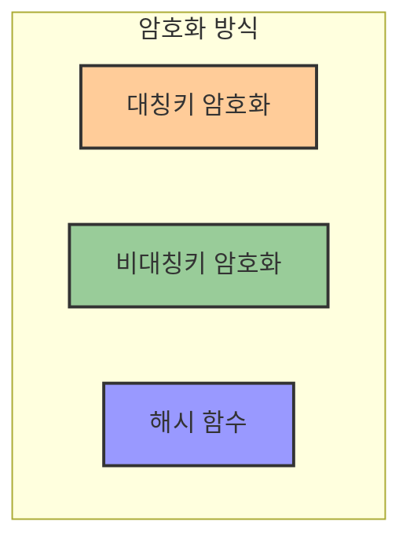
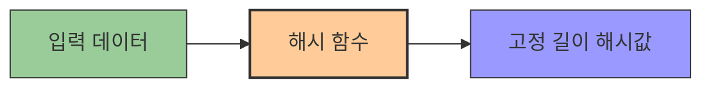
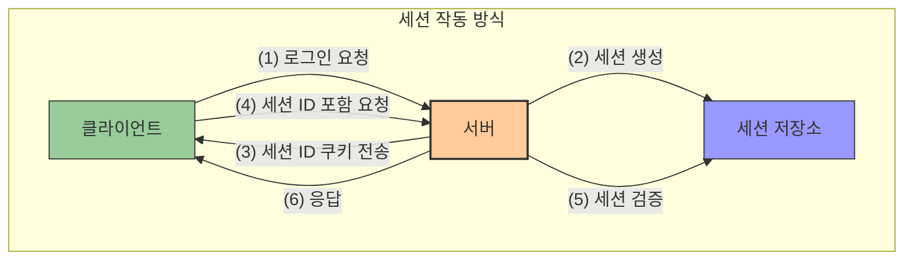
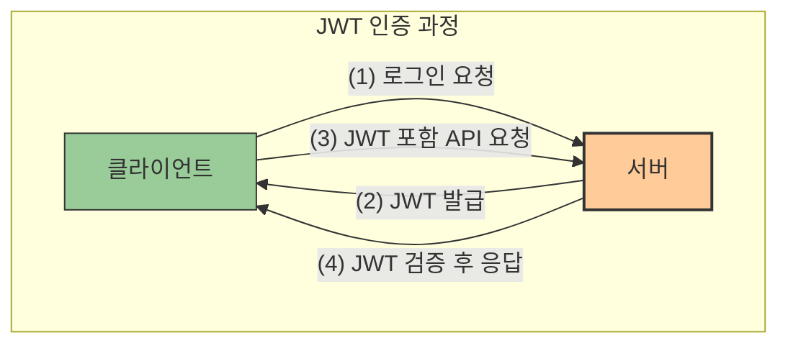
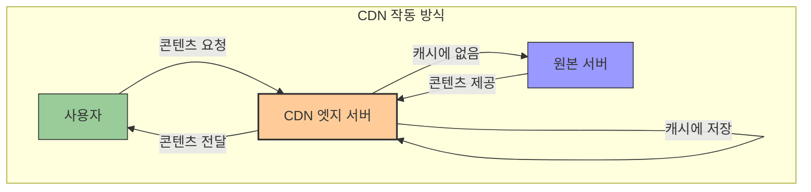

# 3. 네트워크 보안 🔒

## 목차

- [3. 네트워크 보안 🔒](#3-네트워크-보안-)
  - [목차](#목차)
  - [보안의 기본 개념 📝](#보안의-기본-개념-)
  - [해시 기법 🔑](#해시-기법-)
  - [쿠키와 웹 데이터 관리 🍪](#쿠키와-웹-데이터-관리-)
  - [세션 기반 인증 📌](#세션-기반-인증-)
  - [토큰 기반 인증 🎫](#토큰-기반-인증-)
  - [JWT(JSON Web Token) 🔐](#jwtjson-web-token-)
  - [캐시와 성능 최적화 ⚡](#캐시와-성능-최적화-)

---

## 보안의 기본 개념 📝

**보안**은 승인되지 않은 액세스, 오용, 수정, 파괴 등으로부터 시스템과 데이터를 보호하는 과정이다.

**인증(Authentication)** 은 사용자의 신원을 검증하는 절차로 비밀번호, 일회용 핀, 인증 앱, 생체 인식 등의 방법이 있다.

**인가(Authorization)** 는 인증된 사용자가 특정 자원에 접근할 수 있는지를 확인하는 절차다. 인증과 인가는 각각 자격 증명 확인과 권한 허가라는 차이가 있다.

| 특성 | 인증(Authentication) | 인가(Authorization) |
|------|---------------------|-------------------|
| **정의** | 사용자의 신원을 확인하는 과정 | 인증된 사용자의 자원 접근 권한을 부여하는 과정 |
| **질문** | "당신은 누구인가?" | "당신은 무엇을 할 수 있는가?" |
| **방식** | 비밀번호, 생체인식, OTP 등 | 역할, 권한, 정책 등 |
| **순서** | 인가 이전에 먼저 수행 | 인증 이후에 수행 |

암호는 정보를 의도하지 않은 수신자가 파악할 수 없는 형태로 바꾼 것으로, 암호화 방식에는 **대칭키, 비대칭키, 해시** 방식이 있으며 대칭키는 동일한 키로 암호화와 복호화를 진행하고 비대칭키는 공개키와 개인키를 이용한다. 암호화는 단방향(해시)과 양방향(대칭/비대칭)으로 구분된다.



---

## 해시 기법 🔑

**해시(Hash)** 는 단방향 암호화 기법으로 임의의 입력값을 고정된 길이의 암호화된 문자열로 변환하는 것이다. 

**해시함수**는 입력값을 일정한 길이로 매핑하는 함수로 암호화 해시함수와 비암호화 해시함수로 나뉜다.

- **암호화 해시함수**: 단방향성, 복호 불가 (MD5, SHA, MAC)
- **비암호화 해시함수**: 무결성 검증용 (CRC, Checksum)

**SHA(Secure Hash Algorithm)** 는 대표적인 암호화 해시함수로 SHA-1, SHA-2, SHA-3 등의 종류가 있다.

**해시함수 특징**:
- **충돌 저항성**: 동일한 해시값을 갖는 두 입력을 찾기 어려움.
- **압축 효과**: 큰 데이터를 작은 해시값으로 표현.
- **눈사태 효과**: 입력값의 작은 변화로도 큰 결과 변화.

**활용 예시**: 메시지 무결성 검증, 전자서명, 패스워드 저장.



---

## 쿠키와 웹 데이터 관리 🍪

**쿠키(Cookie)** 는 서버가 클라이언트의 브라우저에 저장하는 작은 데이터이다. HTTP의 무상태 특성을 보완해 사용자의 정보를 기억하기 위해 사용된다.

**특징**:
- 4KB까지 저장 가능, 최대 300개.
- 클라이언트에 저장되며, 이름, 값, 만료날짜, 경로 정보를 포함.

| 장점 | 단점 |
|------|------|
| 로그인 정보를 활용해 추가 데이터 저장 불필요 | 보안 위험 |
| 서버 수 증가(Scale-out)에 문제 없음 | 용량 제한 |
| 빠른 속도 | 브라우저 간 공유 불가 |

**종류**:
- **세션 쿠키**: 브라우저 종료 시 삭제.
- **영구 쿠키**: 설정된 유효기간 동안 유지.

**작동원리**: 서버가 응답 시 쿠키를 전송 → 클라이언트가 이후 요청에 쿠키 포함.

---

## 세션 기반 인증 📌

**세션(Session)** 은 서버 측에서 사용자 정보를 저장하여 웹사이트 여러 페이지에 걸쳐 사용자 상태를 유지하는 방법이다.

**특징**:
- 서버에 저장.
- 각 클라이언트에 고유 Session ID 부여.

| 장점 | 단점 |
|------|------|
| 쿠키보다 보안성 높음 | 서버 자원 소모 |
| 로그인 유지 가능 | 쿠키보다 속도 느림 |

**작동원리**: 클라이언트가 HTTP 요청 → 서버가 Session ID 생성 → 세션 쿠키 전송 → 클라이언트가 재요청 시 세션 쿠키 포함.

**쿠키와 비교**:
- 쿠키는 클라이언트 저장, 세션은 서버 저장.
- 세션은 서버 자원 사용, 쿠키는 클라이언트 자원 사용.



---

## 토큰 기반 인증 🎫

**토큰(Token)** 은 서버가 클라이언트를 구별하기 위해 발급하는 유니크한 암호화 데이터이다.

**토큰 유형**:
- **연결형**: USB, 스마트카드 등 물리적 장치.
- **비접촉형**: 가까운 거리에서 통신 (예: Microsoft 매직 링).
- **분리형**: 원거리에서 통신 (예: 이중 인증).

**토큰 기반 인증**:
1. 사용자 인증 요청.
2. 서버가 고유 토큰 발급.
3. 클라이언트가 토큰 포함해 재요청.
4. 서버가 토큰 검증 후 액세스 허용.

---

## JWT(JSON Web Token) 🔐

**JWT(JSON Web Token)** 는 클라이언트-서버 간 권한 확인을 위해 사용하는 토큰이다.

**구성요소**:
- **Header**: 토큰 유형, 서명 알고리즘.
- **Payload**: 사용자 정보, 권한, 유효기간.
- **Signature**: 개인키 기반 전자서명.

```
xxxxx.yyyyy.zzzzz
[헤더].[페이로드].[서명]
```

**특징**:
- HTTP 헤더에 실어 전달.
- 서버가 서명을 검증해 요청 처리.

| 장점 | 단점 |
|------|------|
| 경량, 빠른 전달 | 키 유출 시 전체 시스템 위험 |
| 서버에서 상태 관리 불필요 | 복잡한 암호 서명 |
| 권한 지속 시간, 데이터 제어 가능 | 푸시 메시지 어려움 |

**동작원리**:
1. 사용자 로그인 → 서버가 JWT 발급.
2. 클라이언트가 JWT 포함해 요청.
3. 서버가 검증 후 응답.

**Refresh Token**을 함께 사용해 Access Token 만료 문제를 보완한다.



---

## 캐시와 성능 최적화 ⚡

**캐시(Cache)** 는 자주 사용하는 데이터 복사본을 임시로 저장해 빠르게 접근하는 방법이다.

**특징**:
- 메모리 기반 저장으로 빠른 속도.
- 데이터베이스 부하 감소, IOPS 증가, 비용 절감.

**캐싱(Caching)** 은 오랜 작업 결과를 저장해 시간, 비용 절약.

**캐시와 쿠키 비교**:
- **캐시**: 웹 요소 저장, 성능 향상.
- **쿠키**: 사용자 정보 저장, 인증 유지.

| 특성 | 캐시(Cache) | 쿠키(Cookie) |
|------|------------|-------------|
| **목적** | 성능 향상 | 사용자 식별 및 상태 유지 |
| **저장위치** | 브라우저 또는 중간 서버 | 클라이언트 브라우저 |
| **수명** | 브라우저 설정 또는 HTTP 헤더에 의해 결정 | 만료 날짜까지 또는 브라우저 종료 시 |
| **내용** | 웹페이지, 이미지, 스크립트 등 | 사용자 정보, 설정 등 |
| **사용례** | 리소스 재사용으로 속도 향상 | 로그인 상태 유지, 사용자 선호도 저장 |

**CDN(Content Delivery Network)** 은 전 세계 사용자에게 고용량 데이터를 안정적으로 제공하기 위한 네트워크이다.

**CDN 장점**:
1. 글로벌 웹 로딩 속도 개선.
2. 호스팅 비용 절감.

**단점**:
1. 특정 지역 서비스에 불필요한 연결 가능.
2. 캐시 서버 문제 시 SPOF(단일 장애점) 발생 위험.

**활용 사례**: 구글캐시, AWS S3, 넷플릭스 등.

