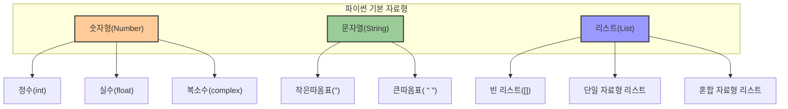
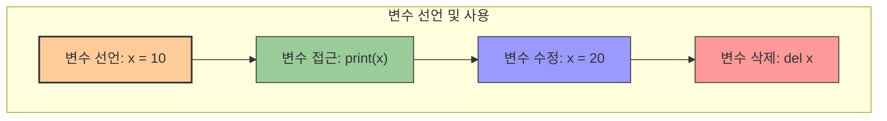
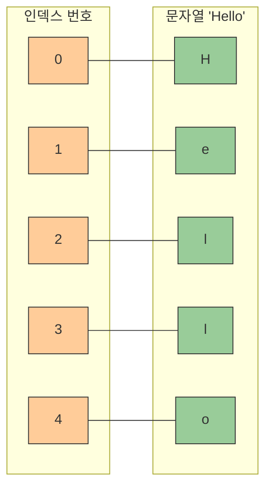

# 1. 기초 자료형 알아보기 🧩

## 목차
- [1. 기초 자료형 알아보기 🧩](#1-기초-자료형-알아보기-)
  - [목차](#목차)
  - [출력을 담당하는 함수: print 🖨️](#출력을-담당하는-함수-print-️)
  - [기본 자료형들: 숫자, 문자열, 리스트 📦](#기본-자료형들-숫자-문자열-리스트-)
    - [숫자형(Number)](#숫자형number)
    - [문자열(String)](#문자열string)
    - [리스트(List)](#리스트list)
    - [주석(Comment)](#주석comment)
  - [변수: 데이터를 담는 그릇 🏺](#변수-데이터를-담는-그릇-)
    - [변수 선언 규칙](#변수-선언-규칙)
    - [변수 이름 표기법(Naming Convention)](#변수-이름-표기법naming-convention)
  - [자료형의 연산: 사칙연산, 특수연산, 문자열/리스트 연산 🔣](#자료형의-연산-사칙연산-특수연산-문자열리스트-연산-)
    - [수학 자료형의 사칙연산](#수학-자료형의-사칙연산)
    - [수학 자료형의 특수 연산](#수학-자료형의-특수-연산)
    - [문자열 자료형의 연산](#문자열-자료형의-연산)
  - [문자열/리스트 접근하기: zero-based index 📑](#문자열리스트-접근하기-zero-based-index-)
    - [인덱싱 (특정 위치의 원소 가져오기)](#인덱싱-특정-위치의-원소-가져오기)
    - [슬라이싱 (일부분 가져오기)](#슬라이싱-일부분-가져오기)

---

## 출력을 담당하는 함수: print 🖨️

Python에서는 `print()` 함수를 사용하여 정보를 출력할 수 있다. 여러 자료를 출력할 때는 콤마(`,`)로 구분하면 되고, 여러 줄 출력은 `print()`를 여러 번 사용하면 된다.

| 기능 | 문법 | 예시 |
|------|------|------|
| **기본 출력** | `print(값)` | `print("안녕하세요")` |
| **여러 값 출력** | `print(값1, 값2, ...)` | `print("파이썬", 3.14)` |
| **구분자 지정** | `print(값1, 값2, sep='구분자')` | `print("a", "b", sep="-")` |
| **끝문자 지정** | `print(값, end='끝문자')` | `print("안녕", end="!")` |

예시:
```python
print("파이썬 공부 재미있다!")
print(1, "World")
print("첫 번째 줄")
print("두 번째 줄")
```
출력:
```
파이썬 공부 재미있다!
1 World
첫 번째 줄
두 번째 줄
```

---

## 기본 자료형들: 숫자, 문자열, 리스트 📦

파이썬에서 다루는 기본 자료형들은 데이터의 특성과 용도에 따라 구분됩니다.



### 숫자형(Number)

숫자를 다루는 자료형으로, 정수, 실수, 복소수 등이 있다.

| 종류 | 예시 | 특징 |
|------|------|------|
| **정수(int)** | `7`, `-42`, `0` | 소수점이 없는 숫자 |
| **실수(float)** | `3.14`, `-0.01`, `2.71` | 소수점이 있는 숫자 |
| **복소수(complex)** | `1+2j`, `3-4j` | 실수부와 허수부로 구성된 숫자 |

```python
7      # 정수
2.71   # 실수
1+2j   # 복소수
```

### 문자열(String)

문자들을 나열한 자료형으로, 작은 따옴표(`'`)나 큰 따옴표(`"`)로 감싼다.

| 특징 | 예시 |
|------|------|
| **작은 따옴표 사용** | `'Python'`, `'Hello World'` |
| **큰 따옴표 사용** | `"Python"`, `"Hello World"` |
| **여러 줄 문자열** | `'''여러 줄 문자열'''`, `"""여러 줄 문자열"""` |
| **이스케이프 문자** | `"He said \"Hello\""`, `'It\'s a nice day'` |

```python
'Python'
"42"
```
> 문자열을 표현할땐 큰 따옴표와 작은 따옴표를 혼용하지 않는 것이 좋다.

### 리스트(List)

여러 자료를 순서 있게 저장하는 자료형이며, 서로 다른 자료형도 함께 담을 수 있다.

| 특징 | 예시 |
|------|------|
| **빈 리스트** | `[]` |
| **동일 자료형** | `[1, 2, 3, 4]`, `['a', 'b', 'c']` |
| **혼합 자료형** | `['apple', 3, True]` |
| **중첩 리스트** | `[[1, 2], [3, 4]]` |

```python
[]
['x', 'y']
['apple', 3]
```

### 주석(Comment)

코드에 설명을 추가할 때 사용하며, 한 줄 주석은 `#`, 여러 줄 주석은 `'''` 또는 `"""`로 작성한다.

| 종류 | 문법 | 예시 |
|------|------|------|
| **한 줄 주석** | `# 주석 내용` | `# 이것은 주석입니다.` |
| **여러 줄 주석** | `''' 주석 내용 '''` | `''' 이것은 여러 줄 주석입니다. '''` |

```python
# 이것은 주석입니다.
```

---

## 변수: 데이터를 담는 그릇 🏺

변수는 데이터를 담아두는 그릇으로, 데이터를 저장하고 참조할 수 있게 해준다.

### 변수 선언 규칙

| 규칙 | 설명 | 예시 |
|------|------|------|
| **허용 문자** | 숫자, 알파벳, 한글, 언더바(`_`) | `count`, `사용자_이름` |
| **시작 문자** | 숫자로 시작 불가 | `name3`(O), `3name`(X) |
| **예약어** | Python의 예약어 사용 금지 | `print`(X), `for`(X) |
| **특수문자** | 공백 및 연산자 사용 금지 | `user_name`(O), `user name`(X) |

변수 선언 예시:
```python
count = 5
username = "Alice"
score_list = ['A', 'B', 'C']
```

### 변수 이름 표기법(Naming Convention)

| 표기법 | 설명 | 예시 |
|------|------|------|
| **스네이크 표기법** | 단어 사이에 언더바(`_`) 사용 | `user_name`, `item_price` |
| **카멜 표기법** | 첫 단어는 소문자, 이후 단어는 대문자로 시작 | `userName`, `itemPrice` |

> 이 두가지 이외에도 다양한 표기법이 있으며, 각자의 언어가 권장하는 코딩 스타일에 맞게 사용하면 된다.



---

## 자료형의 연산: 사칙연산, 특수연산, 문자열/리스트 연산 🔣

Python에서는 다양한 자료형에 대해 여러 연산을 수행할 수 있다.

### 수학 자료형의 사칙연산

| 연산자 | 기능 | 예시 | 결과 |
|-------|------|------|------|
| `+` | 덧셈 | `2 + 4` | `6` |
| `-` | 뺄셈 | `7 - 2` | `5` |
| `*` | 곱셈 | `3 * 3` | `9` |
| `/` | 나눗셈 | `8 / 2` | `4.0` |

```python
print(2 + 4)  # 6
print(7 - 2)  # 5
print(3 * 3)  # 9
print(8 / 2)  # 4.0
```

### 수학 자료형의 특수 연산

| 연산자 | 기능 | 예시 | 결과 |
|-------|------|------|------|
| `//` | 몫 | `10 // 3` | `3` |
| `%` | 나머지 | `10 % 3` | `1` |
| `**` | 제곱 | `3 ** 3` | `27` |

```python
print(10 // 3)  # 몫: 3
print(10 % 3)   # 나머지: 1
print(3 ** 3)   # 제곱: 27
```

### 문자열 자료형의 연산

| 연산자 | 기능 | 예시 | 결과 |
|-------|------|------|------|
| `+` | 문자열 연결 | `"파이" + "썬"` | `"파이썬"` |
| `*` | 문자열 반복 | `"코드" * 2` | `"코드코드"` |

```python
print("파이" + "썬")  # 이어붙이기: 파이썬
print("코드" * 2)    # 반복하기: 코드코드
```

---

## 문자열/리스트 접근하기: zero-based index 📑

문자열과 리스트는 여러 원소로 이루어져 있고, 각 원소는 **인덱스(index)** 로 접근할 수 있다. 인덱스는 0부터 시작한다.(0-based indexing)



### 인덱싱 (특정 위치의 원소 가져오기)

| 문법 | 설명 | 예시 | 결과 |
|------|------|------|------|
| `변수[인덱스]` | 특정 위치의 원소에 접근 | `text = "Hello"` <br> `text[1]` | `'e'` |
| `변수[-인덱스]` | 뒤에서부터 접근 | `text = "Hello"` <br> `text[-1]` | `'o'` |

```python
text = "Hello"
print(text[1])  # 'e'
```

### 슬라이싱 (일부분 가져오기)

| 문법 | 설명 | 예시 | 결과 |
|------|------|------|------|
| `변수[시작:끝]` | 시작 인덱스부터 끝 인덱스 전까지 | `numbers = [10, 20, 30, 40, 50]` <br> `numbers[1:4]` | `[20, 30, 40]` |
| `변수[시작:]` | 시작 인덱스부터 끝까지 | `text = "Hello"` <br> `text[2:]` | `'llo'` |
| `변수[:끝]` | 처음부터 끝 인덱스 전까지 | `text = "Hello"` <br> `text[:3]` | `'Hel'` |
| `변수[::단계]` | 단계만큼 건너뛰기 | `text = "Hello"` <br> `text[::2]` | `'Hlo'` |

```python
numbers = [10, 20, 30, 40, 50]
print(numbers[1:4])  # [20, 30, 40]
```

문자열과 리스트는 원소의 순서가 다르면 다른 자료로 인식된다.
