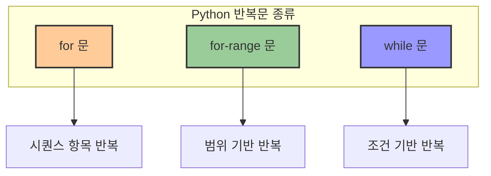
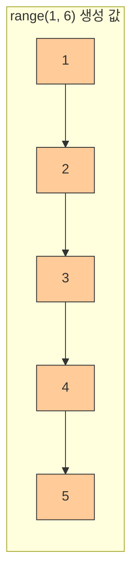
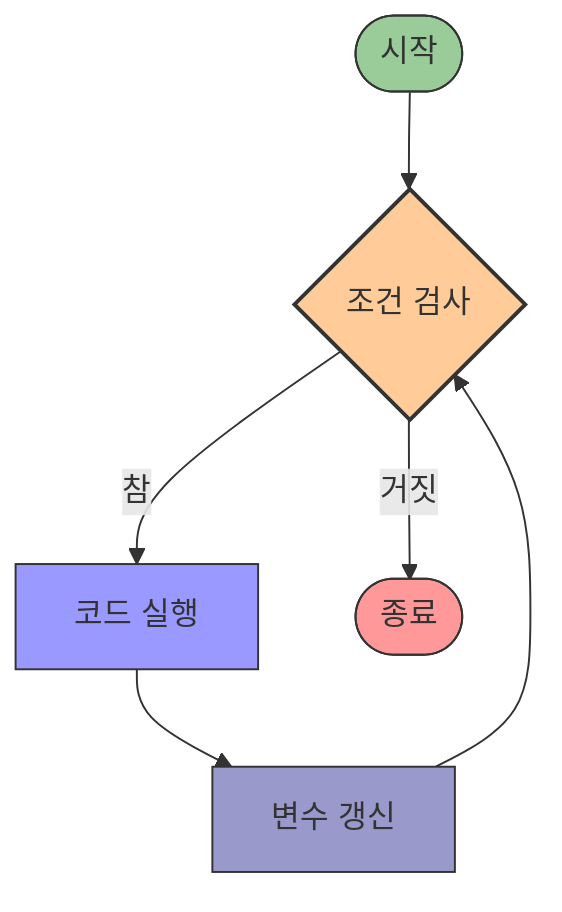

# 4. 반복 작업을 처리해주는 반복문 🔄

## 목차
- [4. 반복 작업을 처리해주는 반복문 🔄](#4-반복-작업을-처리해주는-반복문-)
  - [목차](#목차)
  - [반복문: 동일한 명령을 반복 수행하다 🔁](#반복문-동일한-명령을-반복-수행하다-)
    - [for 문 기본 구조](#for-문-기본-구조)
  - [for-range 문: 범위에서 반복하기 🔢](#for-range-문-범위에서-반복하기-)
    - [기본 사용](#기본-사용)
    - [리스트에 값 추가](#리스트에-값-추가)
    - [횟수 기반 반복](#횟수-기반-반복)
    - [인덱스 활용](#인덱스-활용)
  - [while 문: 조건식에 따른 반복 ⏱️](#while-문-조건식에-따른-반복-️)
    - [기본 구조](#기본-구조)
    - [예시: 카운트다운](#예시-카운트다운)
    - [예시: 합계 구하기](#예시-합계-구하기)
    - [무한 루프와 break](#무한-루프와-break)

---

## 반복문: 동일한 명령을 반복 수행하다 🔁

반복문은 **동일한 명령을 여러 번 수행**해야 할 때 사용하는 문법이다. 예를 들어, 별을 100개 출력하거나, 뉴스레터를 여러 명에게 발송하는 등의 작업에 적합하다.



### for 문 기본 구조

| 구성 요소 | 설명 |
|----------|------|
| **for** | 반복문을 시작하는 키워드 |
| **변수** | 시퀀스의 각 원소를 담을 변수 |
| **in** | 시퀀스에서 원소를 하나씩 가져옴을 나타내는 키워드 |
| **시퀀스** | 반복할 요소들의 집합 (리스트, 문자열 등) |
| **:와 들여쓰기** | 반복할 코드 블록을 구분 |

```python
for 변수 in 시퀀스:
    # 수행할 명령
```
시퀀스의 원소를 하나씩 변수에 담아 반복적으로 명령을 실행한다.

예시:
```python
sum = 0
for i in [1, 3, 5]:
    sum += i
print(sum)  # 9
```

또한 반복 횟수를 측정할 수도 있다:
```python
length = 0
for i in [1, 3, 5]:
    length += 1
print(length)  # 3
```

---

## for-range 문: 범위에서 반복하기 🔢

`range()`는 숫자 시퀀스를 생성하는 함수로, 주어진 범위의 숫자를 반복할 때 사용된다.

| range() 함수 형태 | 설명 | 예시 | 생성 범위 |
|-----------------|------|------|----------|
| **range(끝)** | 0부터 끝-1까지 | `range(5)` | 0, 1, 2, 3, 4 |
| **range(시작, 끝)** | 시작부터 끝-1까지 | `range(2, 5)` | 2, 3, 4 |
| **range(시작, 끝, 간격)** | 시작부터 끝-1까지 간격만큼 증가 | `range(1, 10, 2)` | 1, 3, 5, 7, 9 |



### 기본 사용
```python
for i in range(1, 5):
    print(i)  # 1, 2, 3, 4
```

### 리스트에 값 추가
```python
num_list = [1]
for i in range(2, 5):
    num_list.append(i)
print(num_list)  # [1, 2, 3, 4]
```

### 횟수 기반 반복
```python
count = 0
for i in range(10):
    count += 1
print(count)  # 10
```

### 인덱스 활용
```python
str_list = ["a", "b", "c", "d"]
for idx in range(len(str_list)):
    print(idx)          # 0, 1, 2, 3
    print(str_list[idx])  # a, b, c, d
```

---

## while 문: 조건식에 따른 반복 ⏱️

`while` 문은 주어진 조건이 참일 동안 명령을 반복 수행한다.

| 구성 요소 | 설명 |
|----------|------|
| **while** | 반복문을 시작하는 키워드 |
| **조건** | 반복을 계속할지 결정하는 논리식 |
| **:와 들여쓰기** | 반복할 코드 블록을 구분 |
| **break** | 반복문을 즉시 종료 |
| **continue** | 현재 반복을 건너뛰고 다음 반복으로 이동 |



### 기본 구조
```python
while 조건:
    # 수행할 명령
```

### 예시: 카운트다운
```python
i = 5
while i > 0:
    print(i)
    i -= 1
print("발사!")
```

### 예시: 합계 구하기
```python
i = 1
sum = 0
while i < 5:
    sum += i
    i += 1
print(sum)  # 10
```

### 무한 루프와 break
조건이 항상 `True`인 경우 무한 반복이 발생할 수 있으므로, `if` 조건문과 `break`를 함께 사용하여 반복을 종료할 수 있다.

```python
i = 1
while i > 0:
    print(i)
    if i >= 5:
        break
    i += 1
print("종료")
```

