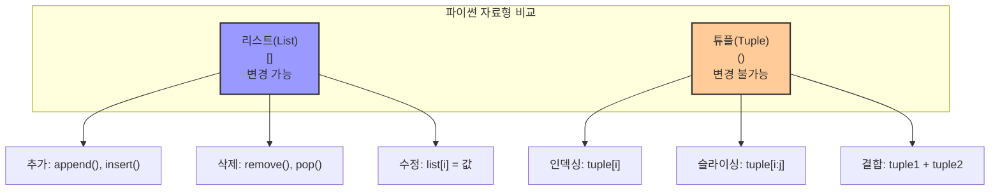
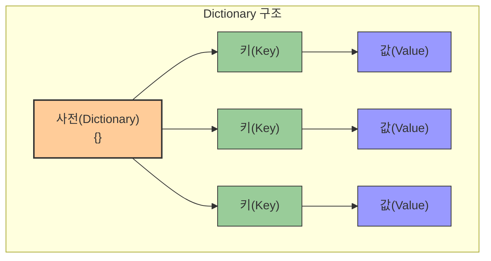

# 1. 더 많은 기초 자료형 🧩

## 목차
- [1. 더 많은 기초 자료형 🧩](#1-더-많은-기초-자료형-)
  - [목차](#목차)
  - [문자열/리스트를 관리하는 다양한 메소드들 🔄](#문자열리스트를-관리하는-다양한-메소드들-)
  - [Tuple: 변경 불가능한 자료형 🔒](#tuple-변경-불가능한-자료형-)
    - [튜플의 특징](#튜플의-특징)
  - [Dictionary: key-value 쌍으로 구성 📚](#dictionary-key-value-쌍으로-구성-)
    - [주요 기능](#주요-기능)
  - [for 문과 Dictionary: 딕셔너리 순회 🔄](#for-문과-dictionary-딕셔너리-순회-)
    - [for 문에서 여러 변수 사용](#for-문에서-여러-변수-사용)
    - [zip() 함수](#zip-함수)
    - [Dictionary의 key, value 구분 출력](#dictionary의-key-value-구분-출력)

---

## 문자열/리스트를 관리하는 다양한 메소드들 🔄

| 메소드 | 설명 | 예시 | 결과 |
|------|------|------|------|
| `list.pop(i)` | 인덱스 i의 원소를 제거하고 반환 | `queue = [100, 200, 300, 400]`<br>`queue.pop(0)` | `100` |
| `seq.count(d)` | 시퀀스 내부의 특정 자료 d의 개수 반환 | `votes = ["yes", "no", "yes", "yes"]`<br>`votes.count("yes")` | `3` |
| `str.split(c)` | 구분자 c를 기준으로 문자열을 나누어 리스트로 반환 | `"apple,orange,grape".split(",")` | `['apple', 'orange', 'grape']` |
| `str.join(list)` | 리스트를 문자열로 합침 | `" | ".join(["North", "South", "East"])` | `'North | South | East'` |

```python
# 리스트에서 원소 제거하기
queue = [100, 200, 300, 400]
first = queue.pop(0)     # 100
last = queue.pop()       # 400

# 시퀀스 내 특정 요소 개수 세기
votes = ["yes", "no", "yes", "yes"]
votes.count("yes")        # 3

"banana split".count("a")  # 3

# 문자열 나누기
"10 20 30".split()              # ['10', '20', '30']
"apple,orange,grape".split(",")  # ['apple', 'orange', 'grape']

# 문자열 합치기
"".join(["c", "o", "d", "e"])           # 'code'
" | ".join(["North", "South", "East"])  # 'North | South | East'
```

---

## Tuple: 변경 불가능한 자료형 🔒



| 특징 | 설명 | 예시 |
|------|------|------|
| **선언 방법** | 소괄호 `()` 사용 | `book_info = ("Title", 2024, 15.99)` |
| **불변성** | 한번 생성하면 내용 변경 불가 | `weekend[0] = "Monday"` (오류 발생) |
| **다양한 자료형** | 서로 다른 자료형 포함 가능 | `("Hello", 42, True)` |

```python
book_info = ("Title", 2024, 15.99)
type(book_info)  # <class 'tuple'>
```

### 튜플의 특징

| 기능 | 문법 | 예시 | 결과 |
|------|------|------|------|
| **인덱싱** | `tuple[인덱스]` | `weekend = ("Sat", "Sun")`<br>`weekend[0]` | `'Sat'` |
| **슬라이싱** | `tuple[시작:끝]` | `weekend[:2]` | `('Sat', 'Sun')` |
| **포함 여부** | `요소 in tuple` | `"Sun" in weekend` | `True` |
| **길이 확인** | `len(tuple)` | `len(weekend)` | `2` |
| **덧셈 연산** | `tuple1 + tuple2` | `("up",) + ("down",)` | `('up', 'down')` |
| **곱셈 연산** | `tuple * 정수` | `("go",) * 3` | `('go', 'go', 'go')` |

```python
weekend = ("Sat", "Sun")
weekend[0]     # 'Sat'
weekend[:2]    # ('Sat', 'Sun')

"Sun" in weekend     # True
len(weekend)         # 2

("up",) + ("down",)   # ('up', 'down')
("go",) * 3           # ('go', 'go', 'go')
```

---

## Dictionary: key-value 쌍으로 구성 📚



| 특징 | 설명 | 예시 |
|------|------|------|
| **선언 방법** | 중괄호 `{}` 사용, `키:값` 형태 | `profile = {"username": "neo", "level": 5}` |
| **키 제약** | 변경 불가능한 자료형만 키로 사용 가능 | `문자열, 숫자, 튜플 가능, 리스트 불가능` |
| **값 제약** | 모든 자료형 사용 가능 | `숫자, 문자열, 리스트, 딕셔너리 등` |

```python
profile = {"username": "neo", "level": 5}
```

### 주요 기능

| 기능 | 문법 | 예시 | 결과 |
|------|------|------|------|
| **값 조회** | `dict[key]` | `profile["username"]` | `'neo'` |
| **값 추가/수정** | `dict[key] = value` | `profile["email"] = "neo@matrix.com"` | 새 키-값 쌍 추가 |
| **값 삭제** | `del dict[key]` | `del profile["level"]` | 키-값 쌍 삭제 |
| **키 목록** | `dict.keys()` | `profile.keys()` | `dict_keys(['username', 'email'])` |
| **값 목록** | `dict.values()` | `profile.values()` | `dict_values(['neo', 'neo@matrix.com'])` |
| **키-값 쌍** | `dict.items()` | `profile.items()` | `dict_items([('username', 'neo'), ('email', 'neo@matrix.com')])` |

```python
profile["username"]  # 'neo'
profile["email"] = "neo@matrix.com"
del profile["level"]
```

> key는 변경 불가능한 자료형만 가능 (리스트 불가, 튜플 가능)

---

## for 문과 Dictionary: 딕셔너리 순회 🔄

### for 문에서 여러 변수 사용

| 기능 | 문법 | 예시 |
|------|------|------|
| **여러 변수 할당** | `for 변수1, 변수2 in 시퀀스:` | `for symbol, number in pairs:` |

```python
pairs = [("x", 1), ("y", 2), ("z", 3)]
for symbol, number in pairs:
    print(symbol, number)
```

### zip() 함수

| 기능 | 문법 | 예시 | 결과 |
|------|------|------|------|
| **시퀀스 병렬화** | `zip(시퀀스1, 시퀀스2)` | `zip(names, scores)` | 튜플의 이터레이터 |
| **리스트로 변환** | `list(zip(시퀀스1, 시퀀스2))` | `list(zip(names, scores))` | `[('Anna', 90), ('Ben', 85), ('Cleo', 92)]` |
| **딕셔너리 변환** | `dict(zip(시퀀스1, 시퀀스2))` | `dict(zip(names, scores))` | `{'Anna': 90, 'Ben': 85, 'Cleo': 92}` |

```python
names = ["Anna", "Ben", "Cleo"]
scores = [90, 85, 92]
zipped = zip(names, scores)
list(zipped)  # [('Anna', 90), ('Ben', 85), ('Cleo', 92)]

dict(zip(names, scores))  # {'Anna': 90, 'Ben': 85, 'Cleo': 92}
```

### Dictionary의 key, value 구분 출력

| 방법 | 문법 | 설명 |
|------|------|------|
| **방법 1: zip 이용** | `for k, v in zip(dict.keys(), dict.values()):` | keys()와 values()를 zip으로 묶어 순회 |
| **방법 2: items() 이용** | `for k, v in dict.items():` | items()는 (key, value) 튜플을 반환 |

```python
# 방법 1: zip 이용
for k, v in zip(profile.keys(), profile.values()):
    print("key:", k, "value:", v)

# 방법 2: items() 이용 (권장)
for k, v in profile.items():
    print("key:", k, "value:", v)
```
