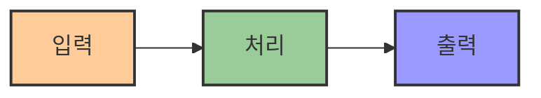
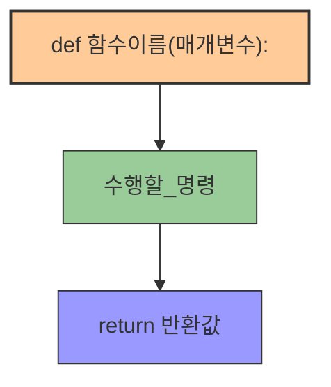
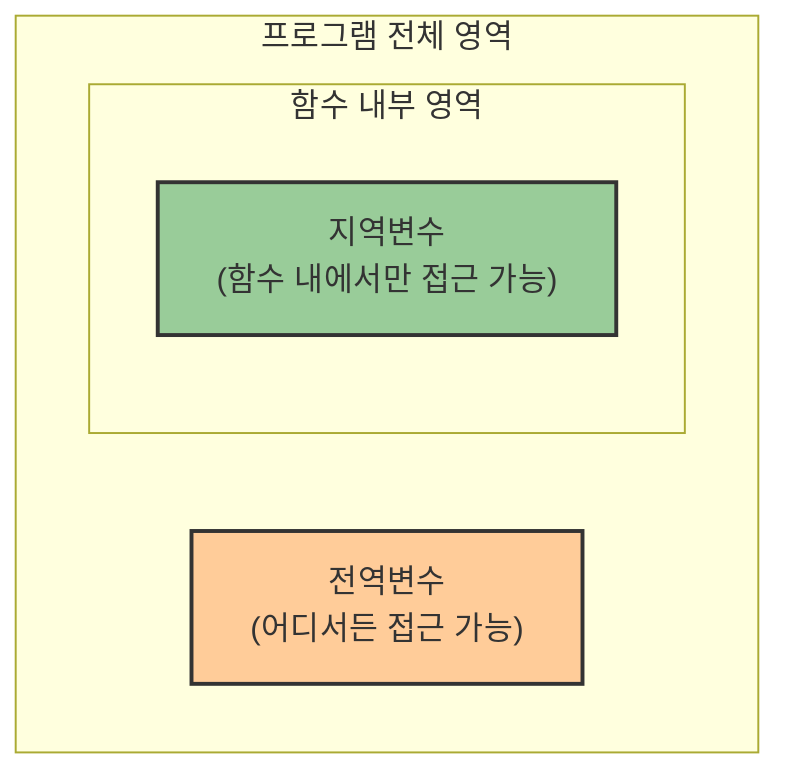
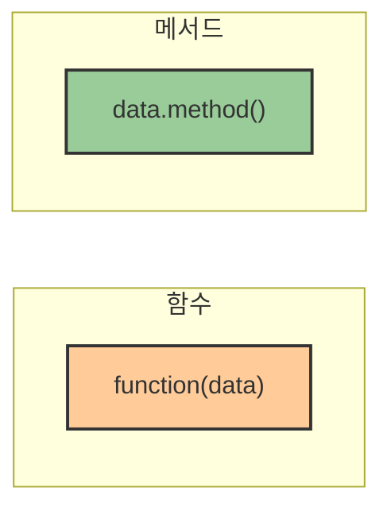

# 3. 함수와 메서드 🧰

## 목차
- [3. 함수와 메서드 🧰](#3-함수와-메서드-)
  - [목차](#목차)
  - [1. 함수란 무엇인가 📦](#1-함수란-무엇인가-)
  - [2. 함수의 종류 🔀](#2-함수의-종류-)
    - [1) **내장 함수 (Built-in Function)**](#1-내장-함수-built-in-function)
    - [2) **사용자 정의 함수 (User-defined Function)**](#2-사용자-정의-함수-user-defined-function)
    - [함수 정의 구성 요소](#함수-정의-구성-요소)
  - [3. 전역변수와 지역변수 🔍](#3-전역변수와-지역변수-)
  - [4. 메서드 🛠️](#4-메서드-️)
    - [함수 vs 메서드 비교](#함수-vs-메서드-비교)

---

## 1. 함수란 무엇인가 📦

프로그래밍은 **입력 → 처리 → 출력** 구조를 가진다. 이 구조에서 **특정 기능을 수행하는 코드 블록의 묶음**이 바로 함수이다.



```python
# 예시: 문자열을 정수로 바꾸고 자료형 확인
my_data = "1234"
print(type(int(my_data)))  # <class 'int'>
```

| 함수의 역할 | 설명 |
|------------|------|
| **단순화** | 복잡한 작업을 간단하게 표현 |
| **재사용성** | 같은 코드를 여러 번 작성할 필요 없음 |
| **모듈화** | 코드를 기능 단위로 분리하여 관리 |
| **추상화** | 구현 세부사항을 숨기고 기능에 집중 |

---

## 2. 함수의 종류 🔀

### 1) **내장 함수 (Built-in Function)**

파이썬에서 기본 제공하는 함수로, 따로 정의하지 않아도 사용 가능하다.

| 함수 | 기능 | 예시 |
|------|------|------|
| `input()` | 사용자 입력 받기 | `name = input("이름을 입력하세요: ")` |
| `print()` | 출력 | `print("Hello World")` |
| `max()` | 최댓값 구하기 | `max([1, 5, 3])  # 5` |
| `min()` | 최솟값 구하기 | `min([1, 5, 3])  # 1` |
| `sum()` | 합계 구하기 | `sum([1, 2, 3])  # 6` |
| `len()` | 길이 구하기 | `len("Hello!")  # 6` |

```python
print(max([1, 5, 3]))   # 5
print(len("Hello!"))    # 6
```

### 2) **사용자 정의 함수 (User-defined Function)**

사용자가 직접 작성하여 특정 기능을 수행하도록 만드는 함수.

```python
def double_sum(a, b):
    c = a + b
    return 2 * c

print(double_sum(3, 4))  # 14
```

### 함수 정의 구성 요소



| 구성 요소 | 설명 | 예시 |
|----------|------|------|
| `def` | 함수 정의 키워드 | `def greeting():` |
| `매개변수(Parameter)` | 입력값을 받는 변수 | `def add(a, b):` |
| `return` | 결과를 반환 | `return a + b` |

> **주의**: `return` 없이 값을 전달하려 하면 함수 외부에서는 알 수 없다.

```python
def add_square(a, b):
    c = a**2 + b**2
    return c

result = add_square(2, 4)
print(result)  # 20
```

---

## 3. 전역변수와 지역변수 🔍

함수 내부에서 정의한 변수는 **지역변수**이며, 외부에서는 접근할 수 없다.



| 변수 종류 | 특징 | 가시성 | 수명 |
|----------|------|--------|------|
| **지역변수** | 함수 내에서 정의 | 함수 내부에서만 | 함수 실행 중에만 |
| **전역변수** | 함수 외부에서 정의 | 프로그램 전체 | 프로그램 실행 중 |

**지역변수 예시**:
```python
def greet():
    x = "Hello"  # 지역변수
    print(x)

greet()
print(x)  # NameError 발생
```

**전역변수 예시**:
```python
x = "Hi"  # 전역변수

def show(a):
    print(a)

show(x)
print(x)
```

> **요점**: 지역변수는 함수나 특정 블록 내에서만 유효하며, 전역변수는 프로그램 전체에서 사용 가능하다.

---

## 4. 메서드 🛠️

**메서드(method)**는 특정 자료형 객체에 **소속되어 있는 함수**로, 점(`.`) 표기법을 통해 호출한다.

| 자료형 | 메서드 예시 | 기능 |
|-------|------------|------|
| **리스트** | `append()` | 요소 추가 |
| **리스트** | `pop()` | 마지막 요소 제거 |
| **리스트** | `count()` | 특정 값의 등장 횟수 |
| **문자열** | `upper()` | 대문자로 변환 |
| **문자열** | `lower()` | 소문자로 변환 |
| **문자열** | `replace()` | 특정 문자열 교체 |

```python
my_list = [1, 2, 3]
my_list.append(4)     # 리스트에 4 추가
my_list.pop()         # 마지막 요소 제거
my_list.count(2)      # 2의 등장 횟수
```

### 함수 vs 메서드 비교

| 항목     | 함수                      | 메서드                             |
|----------|---------------------------|-------------------------------------|
| 소속     | 독립적                    | 특정 객체(자료형)에 소속됨         |
| 사용법   | `함수명(자료)`            | `자료.메서드명()`                  |
| 예시     | `len(my_list)`            | `my_list.append(4)`                |



---
