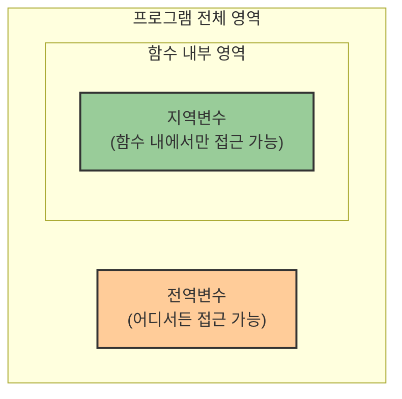

# 1. 동작의 기본단위인 함수 🛠️

## 목차
- [1. 동작의 기본단위인 함수 🛠️](#1-동작의-기본단위인-함수-️)
  - [목차](#목차)
  - [함수의 매개변수 📥](#함수의-매개변수-)
    - [매개변수가 많은 경우](#매개변수가-많은-경우)
    - [매개변수의 기본값 설정](#매개변수의-기본값-설정)
  - [파이썬의 주요 내장 함수들 🧰](#파이썬의-주요-내장-함수들-)
  - [스코프: 변수의 유효 범위 🔍](#스코프-변수의-유효-범위-)

---

## 함수의 매개변수 📥

함수에 데이터를 전달하는 방법과 매개변수 활용 기법을 알아보자.


### 매개변수가 많은 경우

```python
def register_user(username, pw, nickname, region, gender, premium):
    ...

# 키워드 인자를 사용하여 가독성 향상
register_user(
    username="sky@domain.com",
    pw="Secur3PW!",
    nickname="Sky",
    region="Busan",
    gender="F",
    premium=False
)
```

| 매개변수 전달 방식 | 설명 | 예시 |
|-----------------|------|------|
| **위치 인자** | 함수 정의 순서대로 값을 전달 | `register_user("email", "pw", "name", "seoul", "M", True)` |
| **키워드 인자** | 매개변수 이름을 명시하여 전달 | `register_user(username="email", pw="1234")` |
| **혼합 방식** | 위치 인자와 키워드 인자를 함께 사용 | `register_user("email", "pw", nickname="Sky")` |

> **참고**: 위치 인자는 항상 키워드 인자보다 앞에 위치해야 한다.

### 매개변수의 기본값 설정

```python
def register_user(username, pw, nickname, region, gender, premium=False):
    ...
```

- 대부분의 사용자가 기본 회원이라면, `premium=False`를 기본값으로 지정하여 중복 제거 가능

| 기본값의 장점 | 설명 |
|-------------|------|
| **코드 단순화** | 자주 사용되는 값을 매번 입력할 필요가 없음 |
| **선택적 인자** | 필요한 경우에만 값을 지정하여 함수 호출 가능 |
| **하위 호환성** | 새 매개변수 추가 시 기존 코드 수정 불필요 |

```python
# 기본값이 있는 매개변수는 생략 가능
register_user("sky@domain.com", "Secur3PW!", "Sky", "Busan", "F")  # premium=False 자동 적용
```

---

## 파이썬의 주요 내장 함수들 🧰

| 함수 | 설명 | 예시 | 결과 |
|------|------|------|------|
| `max()` | 최댓값 반환 | `max(12, 5)` | `12` |
| `min()` | 최솟값 반환 | `min(-3, 7)` | `-3` |
| `abs()` | 절대값 반환 | `abs(-99)` | `99` |
| `round()` | 반올림 | `round(3.14159, 2)` | `3.14` |
| `len()` | 길이 반환 | `len("developer")` | `9` |
| `str()` | 문자열 변환 | `str(1234)` | `"1234"` |
| `int()` | 정수 변환 | `int("42")` | `42` |
| `range()` | 범위 생성 | `list(range(2, 6))` | `[2, 3, 4, 5]` |
| `reversed()` | 뒤집기 | `list(reversed("Hello"))` | `['o', 'l', 'l', 'e', 'H']` |
| `any()` | 하나라도 True | `any([False, False, True])` | `True` |
| `all()` | 모두 True | `all([True, True, True])` | `True` |

> **참고**: 문자열 `"7.2"`는 `int()`로 변환 불가하므로 `float()`를 사용할 것

---

## 스코프: 변수의 유효 범위 🔍

**스코프(Scope)** 란 변수의 **유효 범위**를 뜻하며, 함수 안에서 선언한 변수는 함수 밖에서 접근할 수 없다.



```python
current_year = 2025  # 전역 변수

def get_age(birth):
    return current_year - birth
```

```python
def get_age(birth):
    year = 2025  # 지역 변수
    return year - birth

print(year)  # 오류 발생: year는 함수 내부 지역 변수이기 때문
```

| 스코프 유형 | 특징 | 접근성 | 생명주기 |
|-----------|------|--------|---------|
| **지역 스코프** | 함수 내에서 선언된 변수 | 함수 내부에서만 | 함수 실행 중에만 |
| **전역 스코프** | 함수 외부에서 선언된 변수 | 프로그램 어디서든 | 프로그램 실행 동안 |

같은 이름의 변수가 함수 안과 밖에 있다면, **함수 내부 변수(지역 변수)**가 우선적으로 사용된다.

```python
current_year = 2025  # 전역 변수

def get_age(birth):
    current_year = 2000  # 지역 변수 (이름은 같지만 다른 변수)
    return current_year - birth
```

> **팁**: 전역 변수보다 함수 내부에서 명시적으로 값을 처리하는 것이 코드의 안정성과 재사용성을 높인다.

---
