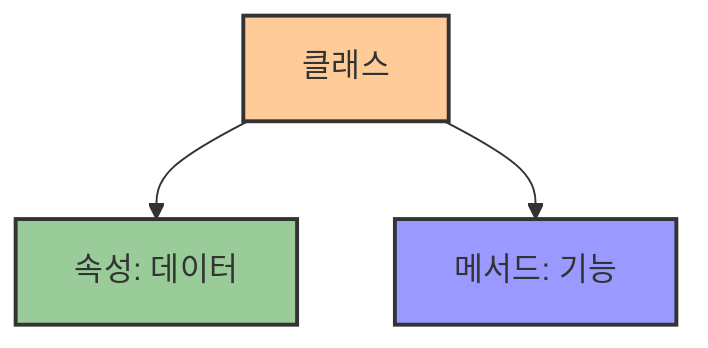

# 2. 객체의 설계도, 클래스 🏗️

## 목차
- [2. 객체의 설계도, 클래스 🏗️](#2-객체의-설계도-클래스-️)
  - [목차](#목차)
  - [클래스: 객체의 설계도 📝](#클래스-객체의-설계도-)
  - [클래스 작성 따라하기 🛠️](#클래스-작성-따라하기-️)
    - [실습 1: 글 작성하기](#실습-1-글-작성하기)
    - [메서드 추가 예시](#메서드-추가-예시)
  - [클래스와 유효성 검사 ✅](#클래스와-유효성-검사-)
    - [실습 3: 회원 가입 및 게시물 생성](#실습-3-회원-가입-및-게시물-생성)

---

## 클래스: 객체의 설계도 📝

**클래스(class)** 는 어떤 개념을 코드로 모델링한 **설계도**이다. 예를 들어, 블로그 글에는 작성자, 내용, 태그, 작성일 등 여러 **속성**이 있고, '좋아요', '댓글' 같은 **행동**도 가능하다. 이런 구조를 하나의 틀로 묶는 것이 클래스다.



- **클래스(Class)**: 어떤 속성과 기능(method)을 가질지 정의한 틀
- **인스턴스(Instance)**: 클래스를 바탕으로 실제 생성된 객체

```python
class Article:
    author = None
    tags = []
    likes = 0
    body = "Write your story here."
```

`Article`은 글을 표현하는 클래스다. 여기에 사용자 반응을 처리하는 **메서드**도 추가할 수 있다.

```python
def recommend(self, reader):
    self.likes += 1
    reader.recommended.append(self)
```

---

## 클래스 작성 따라하기 🛠️

클래스가 제대로 동작하려면, 객체를 만들 때 필요한 정보를 **생성자**에서 설정해야 한다.

| 클래스 구성요소 | 설명 | 예시 |
|---------------|-----|-----|
| **생성자** | 객체 초기화 함수 | `__init__(self, ...)` |
| **속성** | 객체가 가진 데이터 | `self.author`, `self.body` |
| **메서드** | 객체가 할 수 있는 기능 | `reaction_count(self)` |

```python
class Article:
    def __init__(self, author, body):
        self.author = author
        self.body = body
```

- `__init__`은 객체가 생성될 때 실행되는 함수
- `self`는 생성 중인 **자기 자신 인스턴스**를 가리킨다

예를 들어, 독자 등록서를 받는 것과 실제 DB에 저장하는 것을 구분하는 것처럼, **입력값(매개변수)**과 **저장값(속성)**을 구분해야 한다.

```python
my_article = Article("chloe", "My first travel log!")
```

### 실습 1: 글 작성하기

```python
print(my_article.author)  # chloe
print(my_article.body)    # My first travel log!
```

**속성 관리 주의점**: 속성 이름이 중복되거나 기능이 겹치지 않도록 한다.

```python
self.reactions = []
self.likes = 0  # 좋아요 수를 따로 둘 것인지, 반응 배열로 관리할 것인지 혼동 주의
```

### 메서드 추가 예시

```python
def reaction_count(self):
    return len(self.reactions)
```

위 메서드는 현재 글에 반응한 사용자의 수를 반환한다.

---

## 클래스와 유효성 검사 ✅

객체 생성 시 **유효하지 않은 값**이 들어오는 것을 방지하기 위해 검사를 추가할 수 있다.

```python
class Member:
    def __init__(self, birth_year):
        if not isinstance(birth_year, int):
            raise TypeError("Birth year must be an integer")
```

**타입 체크**로 잘못된 자료형을 차단할 수 있다. 더 정교하게는 다음처럼 복합 조건도 처리할 수 있다.

| 검증 유형 | 목적 | 코드 예시 |
|---------|------|----------|
| **타입 검사** | 올바른 자료형 확인 | `isinstance(value, type)` |
| **값 검사** | 허용 범위 내 값 확인 | `if value < min or value > max` |
| **객체 타입 검사** | 올바른 클래스의 객체인지 확인 | `isinstance(obj, Class)` |

```python
if birth_year > 2015:
    raise ValueError("Age must be above 10")
```

또는 다음처럼 인스턴스 타입을 점검하여, 올바른 객체만 클래스에 할당되도록 할 수 있다.

```python
class Article:
    def __init__(self, author, body):
        if not isinstance(author, Member):
            raise TypeError("Author must be a Member instance")
        if not isinstance(body, str):
            raise TypeError("Body must be a string")
```

### 실습 3: 회원 가입 및 게시물 생성

```python
new_user = Member(1998)
new_post = Article(new_user, "This is my first post!")
```

올바른 타입과 값이 들어오지 않으면 예외가 발생한다.

---

이렇게 클래스를 통해 **데이터와 동작을 함께 묶고**, **생성 시 유효성 검사**를 추가함으로써 견고한 프로그램을 구성할 수 있다.
