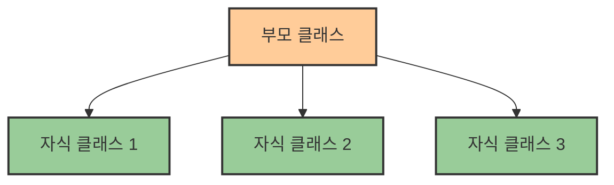
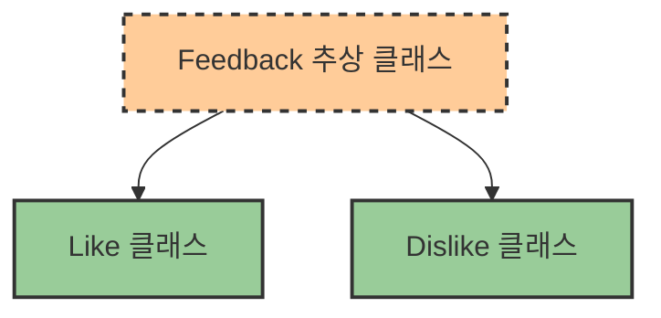
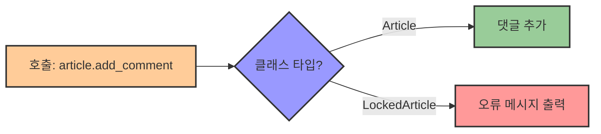

# 3. 클래스의 상속과 다형성 🧬

## 목차
- [3. 클래스의 상속과 다형성 🧬](#3-클래스의-상속과-다형성-)
  - [목차](#목차)
  - [클래스의 상속 🔄](#클래스의-상속-)
  - [상속의 구현 방식 🛠️](#상속의-구현-방식-️)
  - [추상적인 부모 클래스 📝](#추상적인-부모-클래스-)
  - [오버라이딩과 다형성 🔄](#오버라이딩과-다형성-)

---

## 클래스의 상속 🔄

**상속(Inheritance)** 은 여러 클래스가 유사한 속성과 메서드를 공유해야 할 때, 중복을 줄이고 구조를 명확하게 하기 위해 사용된다. 특히 프로그램의 **계층적 구조**를 설계할 때 유용하다.



예를 들어, 블로그 시스템에서 여러 종류의 게시글(텍스트, 이미지, 코드 등)이 있다고 하면, 이들 모두는 공통된 기능을 가지므로 `Article`이라는 부모 클래스를 만들고 이를 상속받을 수 있다.

```python
class Article:
    def __init__(self, title, author):
        self.title = title
        self.author = author

class ImageArticle(Article):
    def __init__(self, title, author, image_urls):
        super().__init__(title, author)
        self.image_urls = image_urls

    def image_count(self):
        return len(self.image_urls)
```

---

## 상속의 구현 방식 🛠️

자식 클래스가 부모 클래스의 생성자나 메서드를 사용할 때는 `super()` 키워드를 사용한다. 자식 인스턴스를 만들면 자동으로 부모 인스턴스도 생성되며, 부모의 속성과 기능을 그대로 물려받는다.

| 상속 관련 개념 | 설명 | 예시 |
|--------------|------|------|
| **super()** | 부모 클래스의 메서드 호출 | `super().__init__(title, author)` |
| **기능 확장** | 자식 클래스에서 부모 기능 확장 | 부모 메서드 호출 후 추가 기능 구현 |
| **다중 상속** | 여러 클래스를 동시에 상속 | `class Child(Parent1, Parent2):` |

```python
class Article:
    def __init__(self, title, author):
        self.title = title
        self.author = author
        self.tags = []

    def add_tag(self, tag):
        self.tags.append(tag)

class CodeArticle(Article):
    def __init__(self, title, author, code_snippet):
        super().__init__(title, author)
        self.code_snippet = code_snippet

post = CodeArticle("파이썬 팁", "윤하", "print('hello')")
post.add_tag("python")
print(post.tags)  # ['python']
```

---

## 추상적인 부모 클래스 📝

공통 구조를 가지되 직접 인스턴스를 만들 필요가 없는 클래스는 **추상 클래스(abstract class)** 로 정의하는 것이 바람직하다. 자식 클래스만 구체적으로 사용할 수 있도록 설계한다.



```python
class Feedback:
    def __init__(self, kind, article, user):
        self.kind = kind
        self.article = article
        self.user = user

class Like(Feedback):
    def __init__(self, article, user):
        super().__init__("LIKE", article, user)

class Dislike(Feedback):
    def __init__(self, article, user):
        super().__init__("DISLIKE", article, user)
```

```python
# 아래와 같은 직접 사용은 피해야 한다
# feedback = Feedback("LIKE", article, user)  ❌

like = Like(article, user)  # ✅
```

| 추상 클래스 특징 | 설명 |
|--------------|------|
| **직접 인스턴스화 불가** | 추상 클래스는 직접 인스턴스를 생성할 수 없음 |
| **구조적 틀 제공** | 자식 클래스들이 따라야 할 기본 구조 정의 |
| **코드 재사용** | 공통 기능을 한 곳에 정의하여 중복 제거 |

---

## 오버라이딩과 다형성 🔄

**오버라이딩**은 자식 클래스가 부모 클래스의 메서드를 **덮어써서** 자신만의 동작을 구현하는 것이다. 이를 통해 클래스마다 **다른 동작 방식**을 갖도록 할 수 있고, 이는 **다형성(polymorphism)** 의 핵심 개념이기도 하다.



```python
class Article:
    def __init__(self):
        self.comments = []

    def add_comment(self, user, content):
        self.comments.append((user, content))

class LockedArticle(Article):
    def add_comment(self, user, content):
        print("이 게시글은 댓글이 비활성화되어 있습니다.")
```
> 비슷한 이름의 **오버로딩**과 혼동하지 않도록 주의하자. 오버로딩은 같은 이름의 메서드를 여러 개 정의하는 것이고, 오버라이딩은 부모 클래스의 메서드를 자식 클래스에서 덮어쓰는 것이다.

```python
a = LockedArticle()
a.add_comment("세린", "잘 읽었습니다!")  
# 출력: 이 게시글은 댓글이 비활성화되어 있습니다.
```

| 다형성 개념 | 설명 | 이점 |
|-----------|------|------|
| **오버라이딩** | 부모 메서드 재정의 | 같은 메서드명으로 다른 동작 구현 |
| **인터페이스 일관성** | 같은 메서드명 유지 | 코드 호출 방식 통일 가능 |
| **유연한 설계** | 타입에 따라 다른 동작 | 확장성이 높은 코드 설계 가능 |

---

