# 4. 파이썬 패키지 사용해보기 📊

## 목차
- [4. 파이썬 패키지 사용해보기 📊](#4-파이썬-패키지-사용해보기-)
  - [목차](#목차)
  - [수학적 그래프 그리는 도구, matplotlib 📈](#수학적-그래프-그리는-도구-matplotlib-)
    - [`bar()` 함수 🔍](#bar-함수-)
    - [`xticks()` 함수 🏷️](#xticks-함수-️)
  - [한 번 해보기 🧪](#한-번-해보기-)

---

## 수학적 그래프 그리는 도구, matplotlib 📈

**matplotlib**은 시각화를 위한 대표적인 파이썬 라이브러리다. `pyplot` 모듈을 통해 그래프를 그릴 수 있다.

```mermaid
graph LR
    A[데이터 준비] --> B[그래프 유형 선택]
    B --> C[그래프 그리기]
    C --> D[옵션 설정]
    D --> E[화면에 표시]
    
    style A fill:#FFCC99,stroke:#333,stroke-width:2px
    style B fill:#99CC99,stroke:#333,stroke-width:2px
    style C fill:#9999FF,stroke:#333,stroke-width:2px
    style D fill:#FF99CC,stroke:#333,stroke-width:2px
    style E fill:#CCFF99,stroke:#333,stroke-width:2px
```



```python
import matplotlib.pyplot as plt

x = [0, 1, 2, 3, 4]
y = [2, 4, 6, 8, 10]

plt.bar(x, y)
plt.show()
```

### `bar()` 함수 🔍

막대그래프를 그릴 때 사용한다. `bar(위치, 높이)` 형식으로 입력한다.

```python
x = range(5)
y = [1, 3, 5, 7, 9]

plt.bar(x, y)
plt.show()
```

### `xticks()` 함수 🏷️

x축에 해당하는 위치에 라벨을 붙일 수 있다.

```python
years = [2019, 2020, 2021, 2022]
temps = [13, 15, 17, 16]
pos = range(len(years))

plt.bar(pos, temps)
plt.xticks(pos, years)
plt.show()
```

| 주요 함수 | 설명 | 사용 예시 |
|---------|------|---------|
| `plt.bar()` | 막대그래프 생성 | `plt.bar(x, y)` |
| `plt.plot()` | 선 그래프 생성 | `plt.plot(x, y)` |
| `plt.scatter()` | 산점도 생성 | `plt.scatter(x, y)` |
| `plt.xticks()` | x축 눈금 설정 | `plt.xticks(pos, labels)` |
| `plt.yticks()` | y축 눈금 설정 | `plt.yticks(pos, labels)` |
| `plt.title()` | 그래프 제목 설정 | `plt.title('제목')` |
| `plt.xlabel()` | x축 이름 설정 | `plt.xlabel('x축')` |
| `plt.ylabel()` | y축 이름 설정 | `plt.ylabel('y축')` |

---

## 한 번 해보기 🧪

1. **기본 막대그래프 그리기** 📊
   - `x`축은 0부터 4까지의 정수, `y`축은 2, 4, 6, 8, 10으로 설정하여 막대그래프를 그려보세요.
   - `plt.show()`를 통해 그래프를 확인하세요.

   ```python
   # 예시 코드
   import matplotlib.pyplot as plt
   
   # 데이터 준비
   x = [0, 1, 2, 3, 4]
   y = [2, 4, 6, 8, 10]
   
   # 막대그래프 생성
   plt.bar(x, y)
   
   # 제목과 축 레이블 추가
   plt.title('기본 막대그래프')
   plt.xlabel('X 값')
   plt.ylabel('Y 값')
   
   # 그래프 표시
   plt.show()
   ```

2. **matplotlib에서 한글 표시하기** 🇰🇷
   - `matplotlib`에서 한글을 표시하기 위해서는 폰트를 설정해야 합니다. 아래 코드를 참고하여 한글이 잘 보이도록 설정해보세요.
   
   ```python
   import matplotlib.pyplot as plt
   import matplotlib.font_manager as fm

   # 한글 폰트 설정
   plt.rc('font', family='Malgun Gothic')
   # 마이너스 기호 깨짐 방지
   plt.rc('axes', unicode_minus=False)
   
   # 이제 한글을 사용할 수 있습니다
   plt.title('한글 제목')
   ```

   ```python
   # 전체 예시 코드
   import matplotlib.pyplot as plt
   import matplotlib.font_manager as fm
   
   # 한글 폰트 설정
   plt.rc('font', family='Malgun Gothic')
   # 마이너스 기호 깨짐 방지
   plt.rc('axes', unicode_minus=False)
   
   # 데이터 준비
   categories = ['사과', '바나나', '딸기', '오렌지', '포도']
   values = [25, 40, 30, 55, 15]
   
   # 막대그래프 생성
   plt.bar(categories, values, color='skyblue')
   
   # 제목과 축 레이블 추가
   plt.title('과일별 판매량')
   plt.xlabel('과일 종류')
   plt.ylabel('판매량 (단위: 개)')
   
   # 그래프 표시
   plt.show()
   ```

3. **꺾은선그래프(line graph) 시도하기** 📈
    - `x`축은 0부터 4까지의 정수, `y`축은 2, 4, 6, 8, 10으로 설정하여 꺾은선그래프를 그려보세요.
    - `plt.show()`를 통해 그래프를 확인하세요.
    - 힌트: `plt.plot()` 함수를 사용하세요.

    ```python
    # 예시 코드
    import matplotlib.pyplot as plt
    
    # 데이터 준비
    x = [0, 1, 2, 3, 4]
    y = [2, 4, 6, 8, 10]
    
    # 꺾은선그래프 생성 (마커 스타일과 선 스타일 지정)
    plt.plot(x, y, marker='o', linestyle='-', color='blue', linewidth=2)
    
    # 그리드 추가
    plt.grid(True, linestyle='--', alpha=0.7)
    
    # 제목과 축 레이블 추가
    plt.title('꺾은선그래프 예시')
    plt.xlabel('X 값')
    plt.ylabel('Y 값')
    
    # 그래프 표시
    plt.show()
    ``` 
