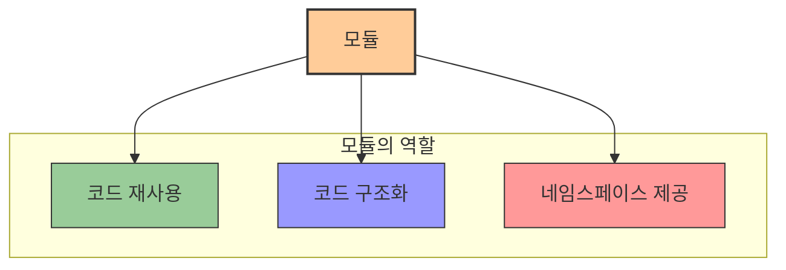
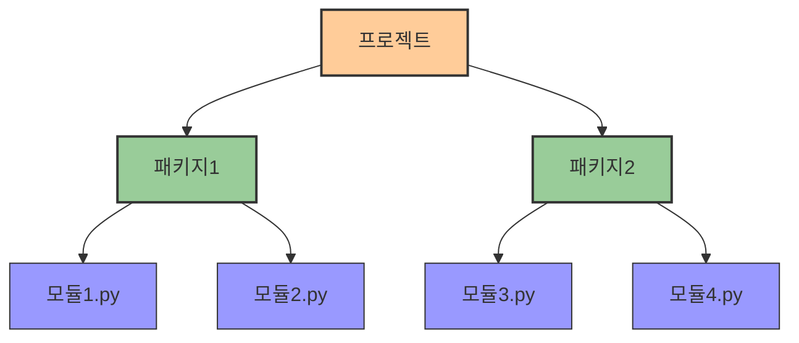

# 2. 모듈과 패키지 📦

## 목차
- [2. 모듈과 패키지 📦](#2-모듈과-패키지-)
  - [목차](#목차)
  - [모듈: 미리 만들어놓은 도구상자 🧰](#모듈-미리-만들어놓은-도구상자-)
  - [모듈 사용해보기 🔍](#모듈-사용해보기-)
    - [기본 사용법](#기본-사용법)
    - [모듈 사용법 확인하기](#모듈-사용법-확인하기)
    - [사용자 정의 모듈 만들기](#사용자-정의-모듈-만들기)
  - [다양한 기본 모듈 활용하기 🛠️](#다양한-기본-모듈-활용하기-️)
    - [`math` 모듈](#math-모듈)
    - [`random` 모듈](#random-모듈)
  - [패키지: 모듈을 관리하는 단위 📚](#패키지-모듈을-관리하는-단위-)
    - [패키지란?](#패키지란)
    - [패키지 속 모듈 사용 방법](#패키지-속-모듈-사용-방법)

---

## 모듈: 미리 만들어놓은 도구상자 🧰

파이썬 프로그램이 길어지고 복잡해질수록, 모든 기능을 직접 구현하기보다는 **누군가 만들어 놓은 함수와 변수들을 불러다 사용하는 방식**이 필요해진다.  
이러한 목적을 가진 코드 집합을 **모듈(module)**이라고 한다.



예를 들어, '치킨 스테이크 굽기'라는 기능을 여러 방식으로 세분화한 뒤, 각각의 레시피를 함수로 구성하여 하나의 파일로 모아두는 것이 모듈이다.

---

## 모듈 사용해보기 🔍

### 기본 사용법

`import` 키워드를 통해 모듈을 불러온 후, `모듈명.함수()` 형태로 사용한다.

| 사용 방식 | 문법 | 예시 |
|----------|------|------|
| **전체 모듈 가져오기** | `import 모듈명` | `import random` |
| **특정 함수만 가져오기** | `from 모듈명 import 함수명` | `from random import randint` |
| **모든 함수 가져오기** | `from 모듈명 import *` | `from random import *` |
| **모듈에 별칭 부여** | `import 모듈명 as 별칭` | `import random as rd` |

```python
import random
print(random.randint(1, 10))  # 1부터 10 사이의 난수 생성
```

### 모듈 사용법 확인하기

모듈의 사용법은 다양한 방법으로 확인할 수 있습니다:

| 방법 | 설명 | 링크/예시 |
|-----|------|----------|
| **공식 문서** | 파이썬 공식 문서를 통한 참조 | [Python 모듈 인덱스](https://docs.python.org/ko/3/py-modindex.html) |
| **도움말 함수** | `help()` 함수 활용 | `help(random)` |
| **생성형 AI** | ChatGPT 등의 AI 활용 (검증 필수) | ChatGPT 등에 '파이썬 random 모듈 사용법' 질문 |
| **커뮤니티** | StackOverflow 등 검색 | Python 관련 커뮤니티 검색 |

### 사용자 정의 모듈 만들기

.py 파일을 생성해 함수를 작성하고, 다른 파일에서 `import`하여 사용 가능하다.

```python
# 파일명: calc.py
def add(x, y):
    return x + y

def subtract(x, y):
    return x - y
```

```python
# 파일명: main.py
import calc
print(calc.add(3, 4))      # 출력: 7
print(calc.subtract(7, 2)) # 출력: 5
```

---

## 다양한 기본 모듈 활용하기 🛠️

파이썬에는 다양한 내장 모듈이 있어 특별한 설치 없이 바로 사용할 수 있습니다.

### `math` 모듈

수학 연산 관련 상수 및 함수들을 제공한다.

| 함수/상수 | 설명 | 예시 | 결과 |
|---------|------|------|------|
| `math.pi` | 원주율 π 값 | `math.pi` | `3.141592...` |
| `math.sqrt(x)` | x의 제곱근 | `math.sqrt(16)` | `4.0` |
| `math.pow(x, y)` | x의 y제곱 | `math.pow(2, 3)` | `8.0` |
| `math.floor(x)` | 내림 연산 | `math.floor(4.7)` | `4` |
| `math.ceil(x)` | 올림 연산 | `math.ceil(4.1)` | `5` |

```python
import math
print(math.pi)       # 3.1415...
print(math.sqrt(16)) # 4.0
print(math.floor(4.7)) # 4
```

### `random` 모듈

무작위 수 생성 기능을 제공한다.

| 함수 | 설명 | 예시 | 가능한 결과 |
|-----|------|------|------------|
| `random.random()` | 0.0과 1.0 사이의 실수 | `random.random()` | `0.35740...` |
| `random.randint(a, b)` | a와 b 사이의 정수 | `random.randint(1, 10)` | `7` |
| `random.choice(seq)` | 시퀀스에서 무작위 선택 | `random.choice(['a', 'b', 'c'])` | `'b'` |
| `random.shuffle(seq)` | 시퀀스를 섞기 | `random.shuffle(my_list)` | (리스트 순서 변경) |

```python
import random
print(random.randrange(1, 6))  # 1 이상 6 미만의 정수 중 무작위
print(random.choice(['사과', '바나나', '체리']))  # 무작위 항목 선택
```
> 메서드마다 개구간으로 정의하는지, 폐구간으로 정의하는지가 각각 다르므로 유의하여 사용하도록 하자.
---

## 패키지: 모듈을 관리하는 단위 📚

### 패키지란?

**여러 모듈을 폴더 구조로 묶어 체계적으로 관리하는 방법**이다. 이를 통해 관련 기능을 논리적으로 구분할 수 있다.



파일 구조 예시:
```
project/
├── user/
│   ├── __init__.py
│   ├── calc.py
│   └── utils.py
└── main.py
```

### 패키지 속 모듈 사용 방법

| 방법 | 문법 | 예시 |
|------|------|------|
| **전체 경로 사용** | `import 패키지.모듈` | `import user.calc` |
| **함수 직접 가져오기** | `from 패키지.모듈 import 함수` | `from user.calc import add` |
| **별칭 사용** | `import 패키지.모듈 as 별칭` | `import user.calc as uc` |

```python
# 방법 1: import 후 dot 사용
import user.calc
print(user.calc.add(3, 4))  # 출력: 7
```

```python
# 방법 2: from ~ import로 dot 생략
from user.calc import add
print(add(3, 4))  # 출력: 7
```

---

이와 같은 모듈과 패키지 구조는 **코드의 재사용성과 유지보수성**을 높이는 데 매우 중요하다.
