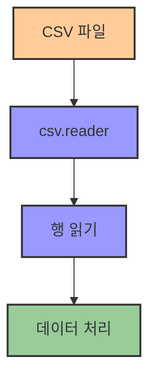

# 1. csv와 lambda 함수 📝

## 목차
- [1. csv와 lambda 함수 📝](#1-csv와-lambda-함수-)
  - [목차](#목차)
  - [CSV 파일 다루기 📊](#csv-파일-다루기-)
    - [CSV 처리 시 주의점](#csv-처리-시-주의점)
    - [CSV 파싱 예시 (Python)](#csv-파싱-예시-python)
  - [lambda 함수: 간단한 함수 바로 만들기 🔍](#lambda-함수-간단한-함수-바로-만들기-)
    - [람다 함수 (Lambda Function)](#람다-함수-lambda-function)
    - [람다와 `sorted()` 함수의 조합](#람다와-sorted-함수의-조합)
    - [`assert` 문 ✅](#assert-문-)
  - [한번 해보기 🧪](#한번-해보기-)
    - [실습 1: CSV 파일을 파이썬으로 읽어오기](#실습-1-csv-파일을-파이썬으로-읽어오기)
    - [실습 2: CSV 데이터를 원하는 포맷으로 변환하기](#실습-2-csv-데이터를-원하는-포맷으로-변환하기)
    - [실습 3: 람다 함수 작성 및 활용](#실습-3-람다-함수-작성-및-활용)
    - [실습 4: 함수를 리턴하는 함수 구현 (예: 클로저 개념)](#실습-4-함수를-리턴하는-함수-구현-예-클로저-개념)

---

## CSV 파일 다루기 📊

CSV는 **Comma Separated Values**, 즉 쉼표로 구분된 텍스트 데이터를 의미한다. 각 행은 하나의 레코드이며, 각 열은 특정 의미를 가진 데이터 항목을 나타낸다.

예를 들어, 다음과 같은 형식의 데이터가 있을 수 있다:
```
제목,영문제목,개봉연도
별이 빛나는 밤,Starry Night,2015
어드벤처 플래닛,Adventure Planet,2020
```

쉼표 외에도 `|`(파이프)나 `\t`(탭)과 같은 다른 **구분자(delimiter)**도 사용할 수 있다.

### CSV 처리 시 주의점

- 필드 내부에 쉼표가 포함될 수 있다. 이 경우 큰따옴표로 감싸야 한다.
  ```csv
  "삶, 사랑, 희망","Life, Love, Hope",2012
  ```

- CSV의 장점은 **데이터 용량이 작고** 대부분의 소프트웨어와 호환된다는 점이다.

- 단점으로는 **데이터 오염에 취약**하고, **스키마가 명시되지 않아** 데이터 해석에 어려움이 발생할 수 있다.

| CSV 구분자 | 설명 | 예시 |
|-----------|------|------|
| **쉼표(,)** | 일반적인 CSV 구분자 | `제목,연도,감독` |
| **탭(\t)** | TSV(Tab Separated Values) | `제목\t연도\t감독` |
| **파이프(\|)** | 쉼표가 많은 데이터에서 사용 | `제목\|연도\|감독` |

### CSV 파싱 예시 (Python)

```python
import csv

with open('example.csv', encoding='utf-8') as file:
    reader = csv.reader(file)
    for row in reader:
        print(row[0])  # 첫 번째 열 출력
```



---

## lambda 함수: 간단한 함수 바로 만들기 🔍

### 람다 함수 (Lambda Function)

람다 함수는 **이름 없는 간단한 함수**를 한 줄로 정의할 수 있게 해준다. 일반적인 함수 선언 대신, 코드가 간결해지는 장점이 있다.

```python
# 일반 함수
def 제곱(x):
    return x * x

# 람다 함수
제곱 = lambda x: x * x
```

| 함수 유형 | 특징 | 예시 |
|----------|------|------|
| **일반 함수** | 이름과 정의부가 분리됨 | `def 함수명(매개변수): 코드블록` |
| **람다 함수** | 익명 함수, 한 줄로 표현 | `lambda 매개변수: 표현식` |
| **고차 함수** | 함수를 인자로 받거나 함수를 반환 | `map(lambda x: x*2, 리스트)` |

### 람다와 `sorted()` 함수의 조합

리스트에서 특정 기준으로 정렬하고 싶을 때 `key` 인자에 람다를 활용할 수 있다.

```python
데이터 = [
    "별이 빛나는 밤,Starry Night,2015",
    "어드벤처 플래닛,Adventure Planet,2020"
]

# 영어 제목 기준 정렬
정렬결과 = sorted(데이터, key=lambda row: row.split(',')[1])
```

### `assert` 문 ✅

`assert`는 **조건이 True가 아니면 예외를 발생시키는 문장**으로, 코드 내 디버깅이나 테스트에 유용하다.

```python
assert (lambda x: x * x)(4) == 16  # 통과
assert (lambda x: x > 0)(5)  # 통과
assert (lambda x: x % 2 == 0)(3)  # AssertionError 발생
```

---

## 한번 해보기 🧪

### 실습 1: CSV 파일을 파이썬으로 읽어오기
```python
import csv

# 영화 데이터를 저장한 CSV 파일 읽기
with open('movies.csv', 'r', encoding='utf-8') as file:
    csv_reader = csv.reader(file)
    header = next(csv_reader)  # 헤더 행 건너뛰기
    
    for row in csv_reader:
        print(f"제목: {row[0]}, 개봉연도: {row[1]}")
```

### 실습 2: CSV 데이터를 원하는 포맷으로 변환하기
```python
import csv

# 입력 CSV 파일을 읽어서 JSON 형식으로 변환
movies = []
with open('movies.csv', 'r', encoding='utf-8') as file:
    csv_reader = csv.DictReader(file)
    
    for row in csv_reader:
        movie = {
            "title": row['제목'],
            "year": int(row['개봉연도']),
            "director": row['감독']
        }
        movies.append(movie)

# 결과 확인
import json
print(json.dumps(movies, ensure_ascii=False, indent=2))
```

### 실습 3: 람다 함수 작성 및 활용
```python
# 람다 함수로 영화 필터링하기
movies = [
    {"제목": "인셉션", "개봉연도": 2010, "감독": "크리스토퍼 놀란"},
    {"제목": "기생충", "개봉연도": 2019, "감독": "봉준호"},
    {"제목": "매트릭스", "개봉연도": 1999, "감독": "워쇼스키"}
]

# 2010년 이후 개봉한 영화만 필터링
최신영화 = list(filter(lambda m: m["개봉연도"] >= 2010, movies))
print(최신영화)

# 제목 길이 순으로 정렬
제목길이순 = sorted(movies, key=lambda m: len(m["제목"]))
print(제목길이순)
```

### 실습 4: 함수를 리턴하는 함수 구현 (예: 클로저 개념)
```python
# 클로저를 활용한 함수 팩토리 만들기
def 배수_판별기(n):
    """입력받은 수의 배수인지 판별하는 함수를 반환"""
    return lambda x: x % n == 0

# 활용 예시
짝수_판별 = 배수_판별기(2)
삼의배수_판별 = 배수_판별기(3)

# 테스트
numbers = [1, 2, 3, 4, 5, 6, 7, 8, 9, 10]
print("짝수:", list(filter(짝수_판별, numbers)))
print("3의 배수:", list(filter(삼의배수_판별, numbers)))
```
