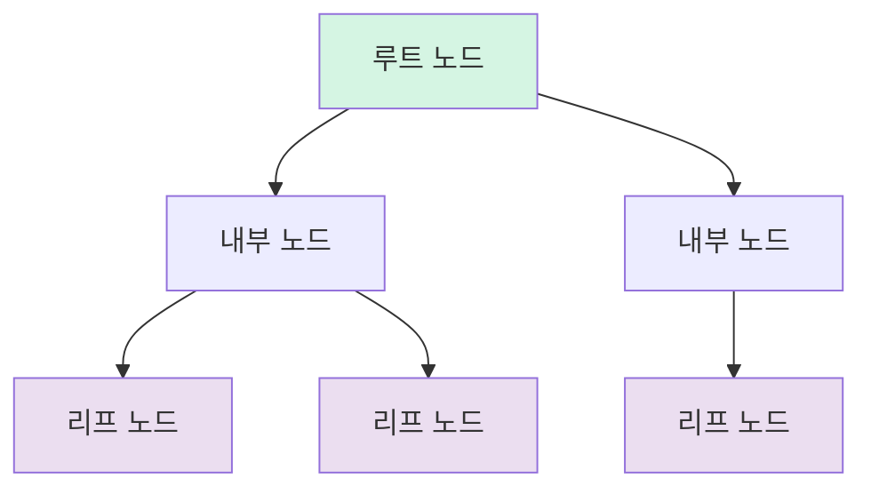
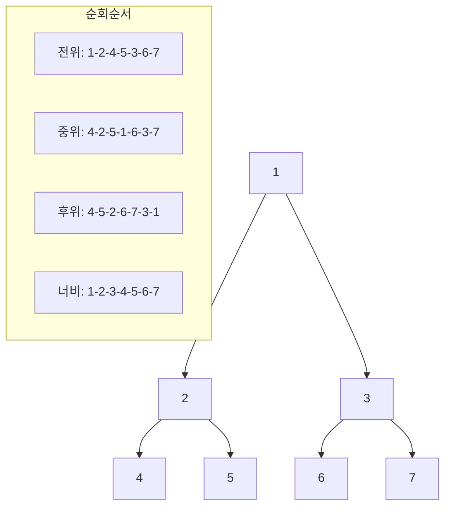

# 3. 비선형 구조의 대표, 트리 🌳

## 목차
- [3. 비선형 구조의 대표, 트리 🌳](#3-비선형-구조의-대표-트리-)
  - [목차](#목차)
  - [비선형 구조와 트리 🌿](#비선형-구조와-트리-)
    - [트리의 종류 🌱](#트리의-종류-)
  - [트리의 표현 방법 📝](#트리의-표현-방법-)
    - [클래스 기반 표현 (Python 예시)](#클래스-기반-표현-python-예시)
    - [배열 기반 표현 (완전 이진 트리 한정) 📊](#배열-기반-표현-완전-이진-트리-한정-)
  - [트리 순회하기 🔄](#트리-순회하기-)
    - [깊이 우선 탐색 (DFS) 🔍](#깊이-우선-탐색-dfs-)
    - [너비 우선 탐색 (BFS) 🌊](#너비-우선-탐색-bfs-)
  - [트리의 활용 💼](#트리의-활용-)
    - [이진 탐색 트리 (Binary Search Tree) 🔍](#이진-탐색-트리-binary-search-tree-)
    - [배열 vs 트리의 연산 성능 비교 ⚖️](#배열-vs-트리의-연산-성능-비교-️)
  - [트리 실습 🧪](#트리-실습-)
    - [트리의 높이 구하기 📏](#트리의-높이-구하기-)
    - [트리의 너비 구하기 📐](#트리의-너비-구하기-)
    - [트리 시각화하기 🖼️](#트리-시각화하기-️)
  - [트리 자료구조의 응용 사례 🌟](#트리-자료구조의-응용-사례-)
    - [파일 시스템 📁](#파일-시스템-)
    - [계층형 데이터 조직 👨‍👩‍👧‍👦](#계층형-데이터-조직-)
    - [XML, HTML DOM 🌐](#xml-html-dom-)
    - [데이터베이스 인덱싱 🗃️](#데이터베이스-인덱싱-️)
  - [마무리 📚](#마무리-)

---

## 비선형 구조와 트리 🌿

**트리(Tree)** 는 대표적인 **비선형 자료구조**로, 선형 구조인 배열, 스택, 큐와는 달리 계층적인 관계를 표현할 수 있다. 트리는 **그래프(Graph)** 의 특수한 형태이며, 방향성과 계층성, 단일 경로, 사이클 없음 등의 특징을 갖는다.

- **루트 노드(Root Node)**: 최상단 노드이며 부모가 없음
- **부모 노드 / 자식 노드**: 한 노드에서 다른 노드를 가리킬 때의 관계
- **리프 노드(Leaf Node)**: 자식 노드가 없는 노드
- **깊이(Depth)**: 루트로부터의 거리



### 트리의 종류 🌱

- **이진 트리**: 자식 노드를 최대 2개까지 가질 수 있음
- **포화 이진 트리**: 모든 내부 노드가 2개의 자식을 가지며, 리프 노드의 깊이가 동일
- **완전 이진 트리**: 마지막 레벨을 제외한 모든 레벨이 채워져 있으며, 마지막 레벨의 노드는 왼쪽부터 채워짐
- **정 이진 트리**: 0개 또는 2개의 자식만 가짐

---

## 트리의 표현 방법 📝

### 클래스 기반 표현 (Python 예시)
```python
class Node:
    def __init__(self, value):
        self.value = value
        self.left = None
        self.right = None>
```

### 배열 기반 표현 (완전 이진 트리 한정) 📊

- 노드 번호가 `i`일 때:
  - 왼쪽 자식: `2 * i`
  - 오른쪽 자식: `2 * i + 1`
  - 부모 노드: `i // 2`

```python
# 인덱스 1부터 시작하는 배열로 표현
tree = [None, 'A', 'B', 'C', 'D', 'E', 'F', 'G']
```

> 트리는 그래프의 일종이므로 인접 리스트, 인접 행렬로도 표현 가능함.

---

## 트리 순회하기 🔄

트리에서 **모든 노드를 방문**하는 방법은 다음과 같다.

### 깊이 우선 탐색 (DFS) 🔍

1. **전위 순회 (Pre-order)**  
   루트 → 왼쪽 → 오른쪽

2. **중위 순회 (In-order)**  
   왼쪽 → 루트 → 오른쪽

3. **후위 순회 (Post-order)**  
   왼쪽 → 오른쪽 → 루트

```python
def preorder(node):
    if node:
        visit(node)  # 방문 처리
        preorder(node.left)
        preorder(node.right)

def inorder(node):
    if node:
        inorder(node.left)
        visit(node)  # 방문 처리
        inorder(node.right)

def postorder(node):
    if node:
        postorder(node.left)
        postorder(node.right)
        visit(node)  # 방문 처리
```

### 너비 우선 탐색 (BFS) 🌊

- 큐(Queue)를 활용하여 레벨 단위로 순회

```python
from collections import deque

def bfs(root):
    queue = deque([root])
    while queue:
        node = queue.popleft()
        visit(node)  # 방문 처리
        if node.left: queue.append(node.left)
        if node.right: queue.append(node.right)
```



---

## 트리의 활용 💼

### 이진 탐색 트리 (Binary Search Tree) 🔍

- **왼쪽 서브트리**: 현재 노드보다 작거나 같은 값
- **오른쪽 서브트리**: 현재 노드보다 큰 값
- **중위 순회**를 하면 **오름차순 정렬 결과**가 된다

```python
class BSTNode:
    def __init__(self, value):
        self.value = value
        self.left = None
        self.right = None
    
    def insert(self, value):
        if value <= self.value:
            if self.left:
                self.left.insert(value)
            else:
                self.left = BSTNode(value)
        else:
            if self.right:
                self.right.insert(value)
            else:
                self.right = BSTNode(value)
```

### 배열 vs 트리의 연산 성능 비교 ⚖️

| 연산 | 배열 (정렬 유지) | 이진 탐색 트리 |
|------|------------------|----------------|
| 삽입 | O(n)             | O(log n)       |
| 삭제 | O(n)             | O(log n)       |
| 탐색 | O(log n)         | O(log n)       |

> 다만, 이진 탐색 트리도 **편향 트리**가 될 경우 O(n)의 시간 복잡도를 가지게 되므로, **레드-블랙 트리**와 같은 **균형 트리**가 실제로는 많이 사용된다.

---

## 트리 실습 🧪

### 트리의 높이 구하기 📏
- DFS로 리프 노드까지의 깊이를 모두 구하고 그 중 최댓값 + 1이 높이

```python
def tree_height(root):
    if not root:
        return 0
    left_height = tree_height(root.left)
    right_height = tree_height(root.right)
    return max(left_height, right_height) + 1
```

### 트리의 너비 구하기 📐
- **중위 순회**로 각 노드의 열(column) 위치를 확정
- **같은 깊이의 노드들 중 최대 열 차이 + 1**을 계산하여 너비 도출

```python
def find_width(root):
    # 각 노드의 위치를 저장할 딕셔너리
    positions = {}
    # 레벨별 최소/최대 위치를 저장
    level_min_max = {}
    
    # 중위 순회로 노드 위치 결정
    def inorder_position(node, depth=0, pos=0):
        if not node:
            return
        # 왼쪽 서브트리
        inorder_position(node.left, depth+1, pos-1)
        
        # 현재 노드 위치 저장
        positions[node] = (depth, pos)
        
        # 현재 레벨의 최소/최대 위치 갱신
        if depth not in level_min_max:
            level_min_max[depth] = [pos, pos]
        else:
            level_min_max[depth][0] = min(level_min_max[depth][0], pos)
            level_min_max[depth][1] = max(level_min_max[depth][1], pos)
        
        # 오른쪽 서브트리
        inorder_position(node.right, depth+1, pos+1)
    
    # 위치 계산 수행
    inorder_position(root)
    
    # 각 레벨별 너비 계산 후 최대값 반환
    max_width = 0
    for level, (min_pos, max_pos) in level_min_max.items():
        width = max_pos - min_pos + 1
        max_width = max(max_width, width)
    
    return max_width
```

### 트리 시각화하기 🖼️

```python
def print_tree(root, level=0, prefix="Root: "):
    if root is None:
        return
    
    print(" " * (level * 4) + prefix + str(root.value))
    
    if root.left or root.right:
        if root.left:
            print_tree(root.left, level + 1, "L── ")
        else:
            print(" " * ((level + 1) * 4) + "L── None")
            
        if root.right:
            print_tree(root.right, level + 1, "R── ")
        else:
            print(" " * ((level + 1) * 4) + "R── None")
```

---

## 트리 자료구조의 응용 사례 🌟

### 파일 시스템 📁
- 디렉토리와 파일의 계층 구조는 트리로 표현
- 루트 디렉토리에서 시작하여 파일까지 이어지는 경로

### 계층형 데이터 조직 👨‍👩‍👧‍👦
- 조직도, 가족 관계도 등 계층 관계 표현
- 부모-자식 관계를 트리로 모델링

### XML, HTML DOM 🌐
- 웹 브라우저의 렌더링 엔진은 HTML을 파싱하여 DOM 트리 생성
- 트리 형태로 문서 구조를 표현

### 데이터베이스 인덱싱 🗃️
- B-트리, B+트리를 사용한 효율적인 데이터베이스 인덱싱
- 빠른 검색과 정렬된 데이터 접근

---

## 마무리 📚

트리는 계층적인 데이터를 표현하고 효율적으로 관리하는 데 필수적인 자료구조이다. 이진 탐색 트리, 균형 트리, 힙 등 다양한 변형을 통해 특정 문제를 해결하는 데 활용되며, 실제 응용 프로그램에서도 널리 사용된다.

---

