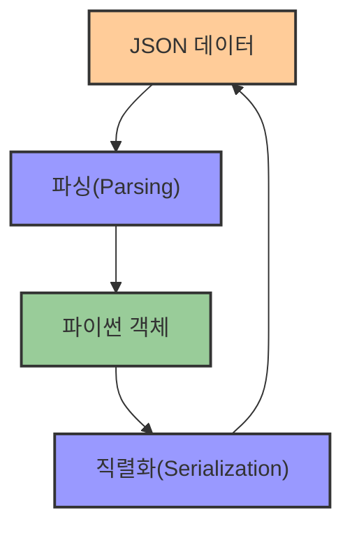
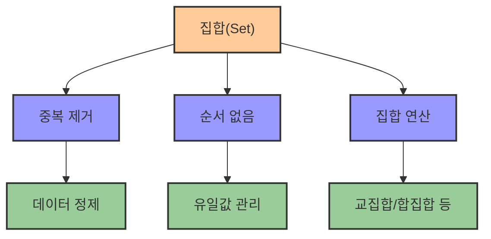

# 4. JSON과 set 자료형 🔄

## 목차
- [4. JSON과 set 자료형 🔄](#4-json과-set-자료형-)
  - [목차](#목차)
  - [JSON 📦](#json-)
    - [JSON이란?](#json이란)
    - [JSON과 파이썬 딕셔너리](#json과-파이썬-딕셔너리)
    - [실습 예시](#실습-예시)
  - [집합(Set) 🧮](#집합set-)
    - [집합의 특징](#집합의-특징)
    - [집합 생성 방법](#집합-생성-방법)
    - [집합 연산](#집합-연산)
    - [실습 예시](#실습-예시-1)

---

## JSON 📦

### JSON이란?

**JSON**은 JavaScript Object Notation의 약자로, **웹 환경에서 데이터를 교환하는 표준 포맷**이다. 사람이 읽기 쉬우면서도 기계가 쉽게 파싱할 수 있어 널리 사용된다.

- **Key-Value 쌍**으로 구성된 데이터 구조
- 필요한 데이터만 **선택적으로 추출** 가능
- 형식이 명확하여 데이터 **오염 가능성 낮음**
- 단점: 같은 데이터를 담더라도 **다소 용량이 큰 편**

```json
{
  "name": "Alice",
  "age": 30,
  "hobby": "reading"
}
```



### JSON과 파이썬 딕셔너리

파이썬에서는 JSON과 딕셔너리 사이의 변환을 위해 `json` 모듈을 사용한다.

| JSON 함수 | 설명 | 예시 |
|-----------|------|------|
| **loads()** | JSON 문자열을 파이썬 객체로 변환 | `json.loads('{"key": "value"}')` |
| **dumps()** | 파이썬 객체를 JSON 문자열로 변환 | `json.dumps({"key": "value"})` |
| **load()** | JSON 파일을 파이썬 객체로 변환 | `json.load(file)` |
| **dump()** | 파이썬 객체를 JSON 파일로 저장 | `json.dump(obj, file)` |

```python
import json

# 문자열 형태의 JSON → 딕셔너리
data = json.loads('{"key": "value"}')

# 딕셔너리 → JSON 문자열
json_str = json.dumps({"key": "value"})
```

> `loads()`는 문자열을 객체로, `dumps()`는 객체를 문자열로 변환한다.

### 실습 예시

```python
import json

# 기본 사용법
user_info = '{"username": "skyblue", "level": 5}'
parsed = json.loads(user_info)
print(parsed["username"])  # skyblue

# 복잡한 JSON 다루기
complex_data = '''
{
    "user": {
        "name": "김데이터",
        "scores": [85, 90, 78],
        "contact": {
            "email": "kim@example.com",
            "phone": "010-1234-5678"
        }
    }
}
'''
data = json.loads(complex_data)
print(data["user"]["name"])             # 김데이터
print(data["user"]["scores"][1])        # 90
print(data["user"]["contact"]["email"]) # kim@example.com

# 파이썬 객체를 JSON으로 변환
user = {
    "name": "박분석",
    "age": 28,
    "skills": ["Python", "R", "SQL"]
}
json_string = json.dumps(user, ensure_ascii=False, indent=2)
print(json_string)
```

---

## 집합(Set) 🧮

### 집합의 특징

파이썬의 **집합(set)** 자료형은 다음 두 가지 성질을 가진다:

- **중복 없음**: 동일한 값은 한 번만 저장됨
- **순서 없음**: 인덱스로 접근할 수 없음



### 집합 생성 방법

```python
a = {1, 2, 3}
b = set([1, 2, 3])
c = {3, 2, 1, 2}
```

위 세 집합은 모두 `{1, 2, 3}`으로 동일하다. 중복 원소는 자동 제거된다.

| 집합 생성 방법 | 설명 | 예시 |
|--------------|------|------|
| **중괄호 사용** | 중괄호 안에 요소 작성 | `{1, 2, 3}` |
| **set() 함수** | 리스트/튜플 등을 집합으로 변환 | `set([1, 2, 3])` |
| **리스트 중복 제거** | 리스트의 중복 요소 제거 용도 | `list(set([1, 1, 2, 3]))` |

### 집합 연산

**원소 추가 / 삭제**는 다음과 같은 메서드를 통해 수행한다:

```python
s = {2, 4, 6}
s.add(8)              # 하나 추가
s.update([6, 10])     # 여러 개 추가 (중복 제거)
s.remove(2)           # 특정 원소 제거
s.discard(100)        # 존재하지 않는 원소 제거 (오류 없음)
```

**수학적 집합 연산**:

```python
a = {1, 2, 3, 4}
b = {3, 4, 5, 6}

print(a.union(b))         # 합집합: {1, 2, 3, 4, 5, 6}
print(a | b)              # 합집합: {1, 2, 3, 4, 5, 6}

print(a.intersection(b))  # 교집합: {3, 4}
print(a & b)              # 교집합: {3, 4}

print(a.difference(b))    # 차집합: {1, 2}
print(a - b)              # 차집합: {1, 2}
```

**멤버십 확인 및 크기 확인**:

```python
print(10 in s)      # True 또는 False
print(len(s))       # 집합의 크기 출력
```

### 실습 예시

```python
# 기본 집합 조작
s = {1, 3, 5}
s.add(7)
s.update([3, 11, 2])
s.remove(1)

print(s)              # 예: {2, 3, 5, 7, 11}
print(9 in s)         # False
print(len(s))         # 현재 원소 개수

# 집합의 활용 - 고유 값 찾기
names = ["김철수", "이영희", "박민수", "김철수", "이영희"]
unique_names = set(names)
print(unique_names)   # {'김철수', '이영희', '박민수'}
print(len(names), "->", len(unique_names))  # 5 -> 3

# 집합 연산 예시
fruits1 = {"사과", "바나나", "오렌지"}
fruits2 = {"바나나", "키위", "망고"}

# 합집합: 두 집합의 모든 요소
print(fruits1 | fruits2)  # {'사과', '바나나', '오렌지', '키위', '망고'}

# 교집합: 두 집합에 공통으로 있는 요소
print(fruits1 & fruits2)  # {'바나나'}

# 차집합: fruits1에만 있는 요소
print(fruits1 - fruits2)  # {'사과', '오렌지'}
```
