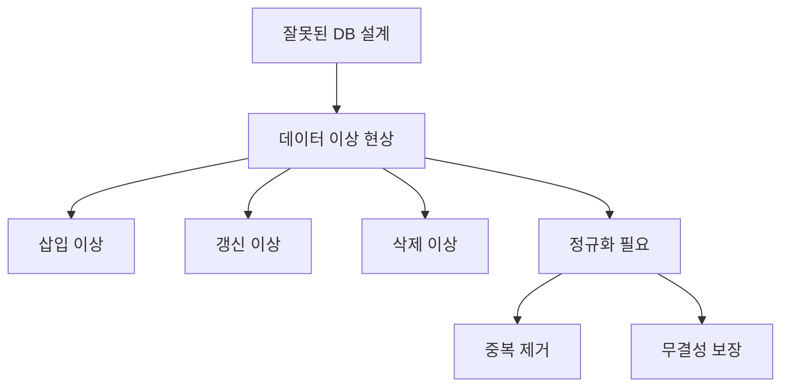
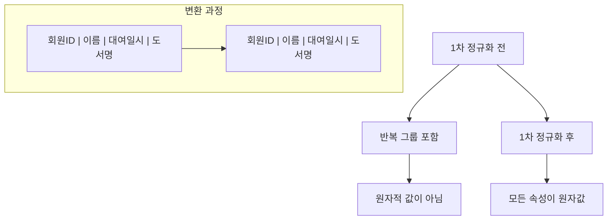
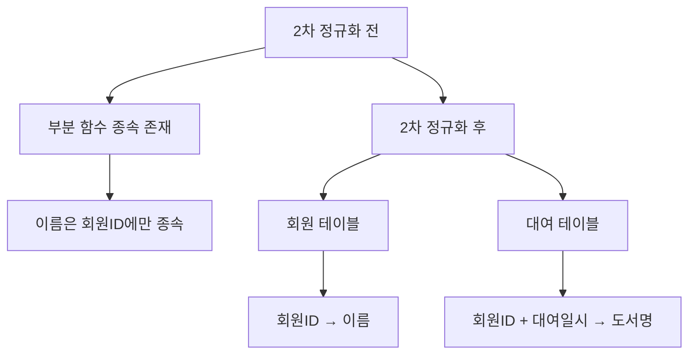
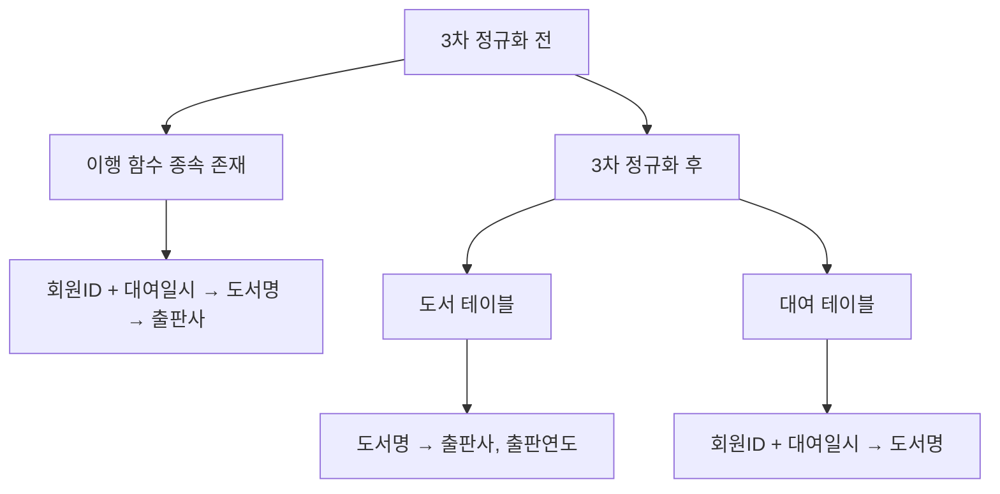
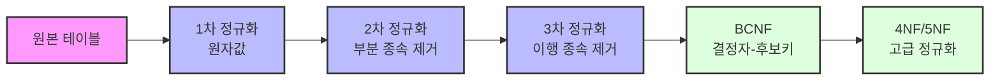

# 3. 데이터베이스 정규화 📊

## 목차
- 데이터베이스 이상 현상과 정규화
- 1차 정규화 (1NF)
- 2차 정규화 (2NF)
- 3차 정규화 (3NF) 🔍
- 다양한 정규화 요약정리 📊
- 도서 대여 시스템 예시

---

## 데이터베이스 이상 현상과 정규화

잘못된 데이터베이스 설계로 인해 다음과 같은 **이상 현상(Anomaly)** 이 발생할 수 있다:

- **삽입 이상**: 책을 아직 빌리지 않은 회원은 등록할 수 없음
- **갱신 이상**: 회원 주소 변경 시 관련된 모든 튜플을 수정해야 함
- **삭제 이상**: 대여 이력 삭제 시 회원 정보도 함께 사라질 수 있음

이러한 문제를 해결하기 위해 **정규화(Normalization)** 가 필요하며, 이는 데이터의 **중복을 제거하고 무결성**을 보장하는 과정을 의미한다.



### 함수 종속성 (Functional Dependency)
- **정의**: 속성 A가 속성 B를 결정하는 경우, A는 B에 대해 함수적으로 종속된다고 한다.
1. **완전 함수 종속 (Full Functional Dependency)**

    기본키가 여러 속성으로 구성되어 있을 때, 그 모든 속성을 알아야 종속자를 결정할 수 있는 경우이다.

    예: 기본키가 {학번, 과목코드}일 때, "성적"이 이 두 속성에 완전 함수적으로 종속된다.

2. **부분 함수 종속 (Partial Functional Dependency)**

    기본키가 여러 속성으로 구성되어 있을 때, 그 중 일부만으로도 종속자를 결정할 수 있는 경우이다. 2NF와 연관이 있다.

    예: {학번, 과목코드}가 기본키일 때, "학생이름"이 "학번"에만 종속된다면 부분 함수적 종속이다.

3. **이행적 함수 종속 (Transitive Functional Dependency)**

    X → Y, Y → Z가 성립할 때, X → Z도 성립하는 경우를 말한다. 3NF와 연관이 있다.

    예: "학번"으로 "학부"를 알 수 있고, "학부"로 "학부장"을 알 수 있다면, "학번"으로 "학부장"을 알 수 있는 이행적 함수 종속이다.
---

## 1차 정규화 (1NF)

**정의**: 테이블의 모든 속성이 **원자 값(atomic value)** 만 가지도록 구성하는 것. (함수 종속성 때문은 아니다)



### 예시 (정규화 전)

```sql
회원ID | 이름   | 대여일시                | 도서명
------------------------------------------------------------
m001   | 김지훈 | 2024-01-01 10:00, ...   | 데이터베이스, ...
```

→ 한 셀에 여러 날짜나 도서명이 들어간 경우 **반정규화된 상태**

### 정규화 후

```sql
회원ID | 이름   | 대여일시            | 도서명
----------------------------------------------
m001   | 김지훈 | 2024-01-01 10:00:00 | 데이터베이스
m001   | 김지훈 | 2024-01-10 14:15:00 | 파이썬 입문
```

---

## 2차 정규화 (2NF)

**정의**: **부분 함수 종속**을 제거하고, 기본키의 전체에 대해 종속되도록 구성.



### 예시 (정규화 전)

```sql
회원ID | 이름   | 대여일시 | 도서명 | 출판연도 | 출판사
---------------------------------------------------------
m001   | 김지훈 | ...      | 파이썬 입문 | 2021 | 한빛미디어
```

- 이름은 회원ID에만 종속되고, 대여일시와는 무관 → 부분 함수 종속 존재

### 정규화 후

- 회원 테이블 (회원ID → 이름)
- 대여 테이블 (회원ID + 대여일시 → 도서명 등)
> (종속되는 속성끼리만 묶어주도록 한다.)
---

## 3차 정규화 (3NF) 🔍

**정의**: **이행 함수 종속**을 제거하여, 비기본키 속성이 다른 비기본키 속성에 종속되지 않도록 한다.



### 예시 (정규화 전)

- 도서명 → 출판사인 경우
- 회원ID + 대여일시 → 도서명 → 출판사  
→ **이행 종속**

### 정규화 후

- 도서 테이블 (도서명 → 출판사, 출판연도)
- 대여 테이블에서는 도서명만 참조

> 참고: 이행적 종속성을 제거함으로써 데이터의 일관성을 유지하고 갱신 이상을 방지할 수 있다.

---

## 다양한 정규화 요약정리 📊

### 정규화 요약



| 정규형 | 제거하는 종속성           |
|--------|----------------------------|
| 1NF    | 반복 속성 제거              |
| 2NF    | 부분 함수 종속 제거         |
| 3NF    | 이행 함수 종속 제거         |
| BCNF   | 결정자이지만 후보키가 아님 제거 |
| 4NF    | 다치 종속 제거             |
| 5NF    | 조인 종속 제거             |

> 참고: 대부분의 실무에서는 3NF까지만 적용하는 경우가 많으며 성능을 고려하여 때로는 의도적으로 정규화를 완화(반정규화)하기도 한다.

---

## 도서 대여 시스템 예시

### 회원 테이블

```sql
회원ID | 이름   | 생년월일   | 전화번호
---------------------------------------
m001   | 김지훈 | 1995-05-22 | 01011112222
```

### 대여 테이블

```sql
회원ID | 대여일시            | 반납일시            | 도서ID
----------------------------------------------------------
m001   | 2024-01-01 10:00:00 | 2024-01-05 16:00:00 | b001
m001   | 2024-01-10 14:15:00 | 2024-01-15 18:30:00 | b002
```

### 도서 테이블

```sql
도서ID | 제목         | 출판연도 | 출판사ID
--------------------------------------------
b001   | 데이터베이스 | 2020     | p001
b002   | 파이썬 입문  | 2021     | p002
```

### 출판사 테이블

```sql
출판사ID | 이름          | 주소
-------------------------------
p001     | 인사이트      | 서울시 강남구
p002     | 한빛미디어    | 서울시 마포구
```


정규화 과정을 통해 데이터의 중복을 줄이고, 삽입·갱신·삭제 이상 현상을 방지할 수 있다.
