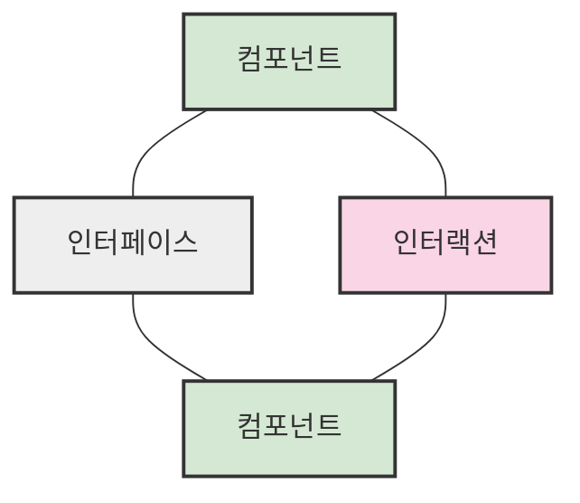
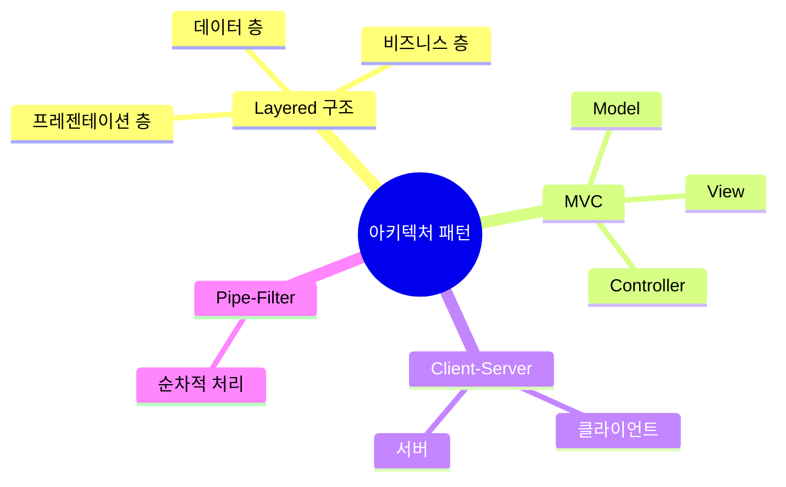

# 3. 소프트웨어 설계

## 목차
- [3. 소프트웨어 설계](#3-소프트웨어-설계)
  - [목차](#목차)
  - [소프트웨어 생명 주기와 설계 📈](#소프트웨어-생명-주기와-설계-)
  - [설계의 두 가지 관점 🔍](#설계의-두-가지-관점-)
  - [소프트웨어 설계의 원리 🌟](#소프트웨어-설계의-원리-)
    - [결합도(Coupling)와 응집도(Cohesion)](#결합도coupling와-응집도cohesion)
  - [소프트웨어 설계 모델링 ✍️](#소프트웨어-설계-모델링-️)
    - [주요 기법](#주요-기법)
  - [구조적 설계 방법론 🛠️](#구조적-설계-방법론-️)
  - [소프트웨어 아키텍처 🏛️](#소프트웨어-아키텍처-️)
    - [아키텍처 패턴](#아키텍처-패턴)

---

## 소프트웨어 생명 주기와 설계 📈

소프트웨어 개발은 **요구사항 분석 → 설계 → 구현 → 테스트 → 배포 및 유지보수**로 이어진다. 이 중 **설계**는 *요구사항을 어떻게 구현할지* 구체적인 구조와 계획을 수립하는 단계다.

설계 단계는 **요구사항 분석**과 **구현**을 연결하는 다리 역할을 하며, 시스템 구조를 구체화하고 구체적인 구현 방향을 결정한다.

---

## 설계의 두 가지 관점 🔍

- **관리적 시각**: 프로젝트 계획, 자원 배분, 위험 관리 등을 중심으로 기본 설계와 상세 설계를 수행한다.
- **기술적 시각**: 데이터 설계, 사용자 인터페이스 설계, 시스템 구조 설계, 알고리즘 설계 등을 다룬다.

---

## 소프트웨어 설계의 원리 🌟

- **단순성**: 이해하기 쉽고 복잡하지 않은 구조를 갖춘다.
- **효율성**: 자원과 성능을 최적화한다.
- **추상화**: 불필요한 세부사항을 감추고 필요한 정보만 드러낸다.
- **모듈화**: 기능별로 독립적인 단위로 나누어 관리한다.
- **정보 은닉**: 모듈 내부 구현은 숨기고 인터페이스만 외부에 제공한다.

### 결합도(Coupling)와 응집도(Cohesion)

- **결합도**: 모듈 간의 의존성 정도 → **낮을수록 좋다**.
- **응집도**: 모듈 내부 요소 간의 관련성 → **높을수록 좋다**.

> 좋은 설계는 결합도는 낮고, 응집도는 높아야 한다.

---

## 소프트웨어 설계 모델링 ✍️

요구사항을 컴퓨터에서 어떻게 실현할지를 구체화하는 과정이다. 설계 모델은 다음과 같이 구성된다:

- **구조 모델**: 클래스 다이어그램, 컴포넌트 다이어그램 등을 통해 시스템 구성요소들의 관계를 표현한다.
- **행위 모델**: 순차 다이어그램, 상태도, 활동도 등을 통해 시간에 따른 동작을 표현한다.
- **기능 모델**: 데이터 흐름도(DFD) 등을 통해 기능 흐름을 표현한다.

### 주요 기법
- **데이터 흐름도(DFD)**: 시스템 내 데이터의 흐름과 처리를 시각적으로 표현
- **데이터 사전(Data Dictionary)**: 시스템 내 모든 데이터의 정의를 기록
- **소단위 명세서(Mini Spec)**: 최하위 프로세스의 처리 절차 설명
- **N-S Chart**: 순차, 조건, 반복 구조를 시각적으로 표현
- **HIPO**: 계층구조와 입출력 흐름을 함께 보여주는 도구

---

## 구조적 설계 방법론 🛠️

**구조적 설계**는 절차 중심, 기능 중심으로 시스템을 계층적으로 나누는 방식이다.  
주요 특징은 다음과 같다:

- 상위 기능을 하위 기능으로 분해하는 **Top-down 설계**를 따른다.
- DFD, 데이터 사전, 소단위 명세서 등의 문서화 기법을 활용한다.
- 논리적 증명 가능성을 강조하며 명확한 구조를 지향한다.

---

## 소프트웨어 아키텍처 🏛️

**소프트웨어 아키텍처**는 시스템의 주요 컴포넌트와 그들 간의 **인터페이스 및 상호작용 구조**를 설계하는 것이다.  
주요 개념:

```plaintext
- 컴포넌트: 명확한 역할을 가진 독립적 요소
- 인터페이스: 컴포넌트 간의 연결 방식
- 인터랙션: 컴포넌트 간 상호작용
```



### 아키텍처 패턴

**주요 아키텍처 패턴:**



```plaintext
- Layered (계층) 구조: 소프트웨어를 층으로 나누어 설계하는 방식 (N-tier 구조)
- MVC (Model-View-Controller): 데이터(Model), 화면(View), 제어(Controller)를 분리
- Client-Server: 서버가 서비스를 제공하고 클라이언트가 요청하는 구조
- Pipe-Filter: 데이터를 여러 단계를 거쳐 처리하는 방식
```

> 아키텍처 패턴은 구조적 일관성, 유지보수성, 재사용성을 높이는 데 도움을 준다.

---
