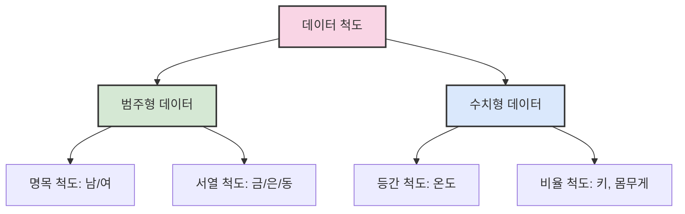
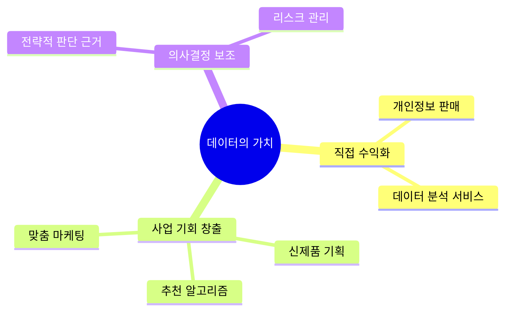
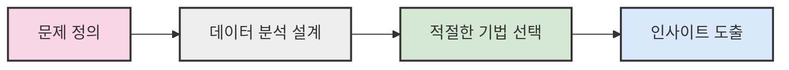
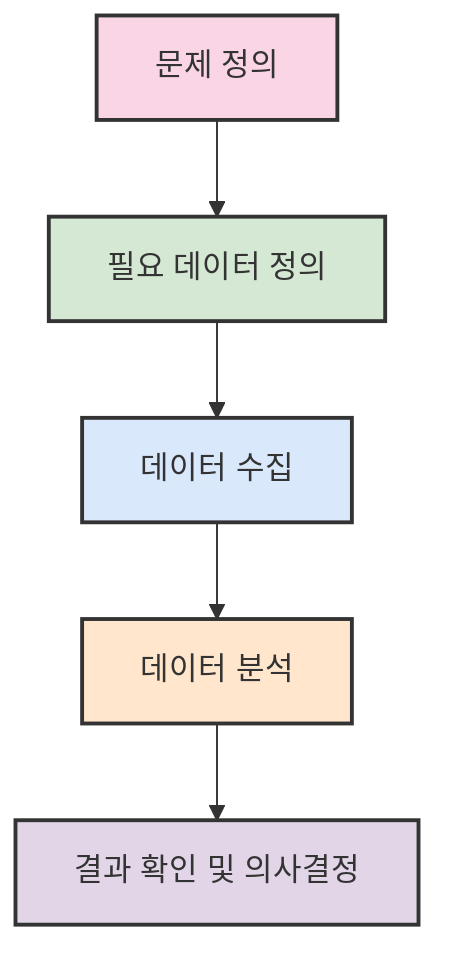

# 1. 데이터 소개 📊

## 목차
- [1. 데이터 소개 📊](#1-데이터-소개-)
  - [목차](#목차)
  - [데이터의 시작, 데이터 이해하기 🔍](#데이터의-시작-데이터-이해하기-)
  - [데이터의 가치 💎](#데이터의-가치-)
  - [데이터의 미래 🚀](#데이터의-미래-)
  - [데이터 목적 사고력 🎯](#데이터-목적-사고력-)
  - [데이터 분석 업무 프로세스 ⚙️](#데이터-분석-업무-프로세스-️)

---

## 데이터의 시작, 데이터 이해하기 🔍

**데이터(Data)** 는 라틴어 *datum*에서 유래한 말로, '주어진 것'을 뜻한다. 현실 세계에서 관찰되고 기록되는 모든 정보가 데이터가 될 수 있다.

| 데이터 유형 | 설명 | 예시 |
|:----------:|:-----|:-----|
| **정형 데이터** | 구조화된 형식을 가진 데이터로, 미리 정해진 틀에 맞게 저장 | 데이터베이스 테이블, 스프레드시트 |
| **비정형 데이터** | 구조가 정해져 있지 않은 자유로운 형식의 데이터 | 이미지, 오디오, 텍스트 문서 |

**데이터 척도에 따라 네 가지로 분류**된다.
(전자 둘은 범주형 데이터, 후자 둘은 수치형 데이터)



데이터는 **정보**를 얻기 위한 원재료로, **데이터 마이닝**을 통해 유용한 인사이트를 추출할 수 있다.

---

## 데이터의 가치 💎

기업들이 데이터를 확보하려는 이유는 다음과 같다.



| 데이터 활용 사례 | 설명 |
|:----------------|:-----|
| **마켓 바스켓 분석** | 유통업체가 고객의 영수증 데이터를 분석하여 '기저귀를 구매하는 고객이 맥주도 함께 구매한다'는 패턴 발견 |
| **소셜 데이터 분석** | SNS에서 제품 언급 데이터를 분석하여 소비자 반응 예측 |
| **위치 데이터 활용** | GPS 데이터를 활용한 맞춤형 광고 및 서비스 제공 |

---

## 데이터의 미래 🚀

미래 데이터 산업의 중심에는 **빅데이터 활용과 인공지능의 결합**이 있다.

- **Hyperscale AI** 🧠: 인간의 두뇌처럼 추론하고 창작 가능한 거대 인공지능을 지향하며, 이를 위해 방대한 양의 데이터와 파라미터가 필요
- **융합 영역의 중요성** 🔄: 소프트웨어, 수학, 통계, 도메인 지식이 결합된 융합 영역으로 발전
- **인력 수요 증가** 👥: 데이터 기반 사회에서는 데이터를 다룰 수 있는 인력에 대한 수요가 급증

```plaintext
- 데이터 활용은 법적·윤리적 고려가 필요한 영역
- 2020년 데이터 3법을 통해 관련 규제를 체계화(한국)
- 데이터 주권과 프라이버시 보호의 중요성 증가
```

---

## 데이터 목적 사고력 🎯

데이터 분석의 핵심은 **기술보다 목적 지향성**이다.



| 접근법 | 설명 |
|:------|:-----|
| **목적 중심 분석** | 복잡한 분석 기법보다는 분석 목적에 맞는 단순한 접근이 더 유효할 수 있음 |
| **웹페이지 분석 예시** | "이탈이 많이 발생한 시점"이나 "페이지 이동 경로" 등을 파악하는 것이 기술보다 중요 |

> 핵심은 **데이터가 해결하고자 하는 문제를 명확히 정의하고**, 그 목적에 부합하는 분석이 이루어져야 한다.

---

## 데이터 분석 업무 프로세스 ⚙️

데이터 분석은 다음과 같은 절차로 수행된다.



1. **문제 정의** 📋  
   - 해결하고자 하는 문제를 명확히 규정
   - 예: 특정 상품의 매출이 갑자기 급감한 원인 분석

2. **필요 데이터 정의** 🔍  
   - 문제 해결에 필요한 데이터가 무엇인지 결정
   - 기존 보유 데이터 또는 수집이 필요한 외부 데이터 포함

3. **데이터 수집** 📊  
   - 사내 시스템, 웹 크롤링 등 다양한 방식으로 데이터 확보

4. **데이터 분석** 📈  
   - 통계 기법, 인공지능 등을 활용해 정보 도출
   - 시각화, 정량화도 포함

5. **결과 확인 및 의사결정** 🎯  
   - A/B 테스트, 비교 실험 등을 통해 실행 방안 검토
   - 분석 결과를 바탕으로 실질적 결정을 내림

> ✨ **사례**: 문자 발송이 고객 구매에 미친 영향 → 특정 집단에 2차 발송 후 매출 변화 분석

---
