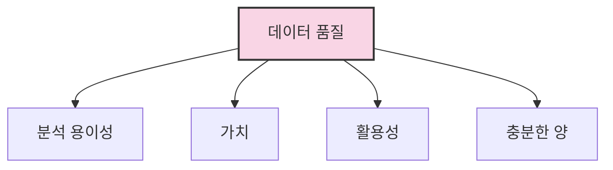

# 2. 데이터 리터러시 📊

## 목차
- [2. 데이터 리터러시 📊](#2-데이터-리터러시-)
  - [목차](#목차)
  - [데이터의 품질 🔍](#데이터의-품질-)
    - [좋은 데이터의 조건 ✅](#좋은-데이터의-조건-)
  - [데이터 목적 사고력 🎯](#데이터-목적-사고력-)
    - [실패 사례 ⚠️](#실패-사례-️)
  - [신뢰도 있는 데이터 🔐](#신뢰도-있는-데이터-)
    - [데이터 평가 체크리스트 📋](#데이터-평가-체크리스트-)
    - [표본 수집 관련 용어 📊](#표본-수집-관련-용어-)
    - [실제 사례 분석 🔬](#실제-사례-분석-)

---

## 데이터의 품질 🔍

**데이터에도 품질이 있다.** 단순히 많다고 해서 좋은 것이 아니라, 분석 가능성과 정확성이 중요하다. 예를 들어, **삼성 반도체 검사 시스템**은 고해상도 카메라를 사용했지만, 인쇄 오류로 인해 알고리즘이 데이터를 잘못 해석한 사례가 있다. 이는 **센서의 물리적 한계나 기술적 문제**로 인해 발생하는 품질 저하를 보여준다.

### 좋은 데이터의 조건 ✅

| 조건 | 설명 |
|:-----|:-----|
| **분석하기 쉬움** | 구조화되어 있고 해석이 용이함 |
| **분석할 가치가 있음** | 문제 해결이나 인사이트 도출에 직접적으로 기여 |
| **활용성 높음** | 목적에 맞게 재사용 가능 |
| **충분한 양 확보** | 다양한 케이스를 포괄 가능 |



---

## 데이터 목적 사고력 🎯

**좋은 데이터냐 나쁜 데이터냐는 '상황과 목적'에 따라 달라진다.**  
즉, 무작정 많은 데이터를 모으는 것이 아니라 **'어떤 문제를 해결하기 위해 필요한가?'** 를 먼저 설정해야 한다.

### 실패 사례 ⚠️
빅데이터 프로젝트 중 85%가 실패했다는 보고가 있다.  
이는 **"문제 정의 없이 데이터만 수집한 결과"** 라는 비판을 받았다.

> "해결하고자 하는 비즈니스 문제가 선행되어야 하며,  
> 그에 맞는 데이터가 무엇인지 판단해야 한다." — 프로젝트 전문가 그린바움


---

## 신뢰도 있는 데이터 🔐

**데이터는 비판적으로 수용해야 하며, 다음 항목들을 반드시 점검해야 한다:**

### 데이터 평가 체크리스트 📋

1. **출처**: 누가 만들었는가?
2. **수집 시기**: 최신성은 충분한가?
3. **수집 방식**: 설문인지, 센서인지 등
4. **수집 기관**: 신뢰할 수 있는가?
5. **샘플 수**: 적정 수준의 표본인가?(딥러닝의 경우 데이터가 많으면 좋지만 머신 러닝의 경우 반드시 그렇진 않음)
6. **스케일의 시각화 적절성**: 데이터의 시각적 표현이 올바르게 반영되어 있는가?(ex. 실제로 데이터가 4배 차이난다면 시각적으로도 4배 차이나야 함)

### 표본 수집 관련 용어 📊

| 용어 | 설명 |
|:-----|:-----|
| **모집단(Population)** | 조사하고자 하는 전체 집단 |
| **표본(Sample)** | 모집단에서 추출한 일부 집단 |
| **대표성(Representativeness)** | 표본이 모집단을 얼마나 잘 대표하는가? |
| **표본 오차(Sampling Error)** | 표본에서 얻은 결과와 모집단의 실제 값 간의 차이 |


### 실제 사례 분석 🔬

**예시 1: 시계열 데이터 품질 문제**
```text
기온 데이터에서 -140도가 측정됨 → 명백한 센서 오류
```

**예시 2: 흡연과 폐암 연구의 통계적 한계**
1954년 연구에서 흡연자의 폐암 사망률은 4배 높았으나,  
모든 집단의 사망률 자체는 당시 미국 평균보다 낮아 **대표성 부족** 문제를 보였다.

---

> 💡 **정리하자면, 좋은 데이터란 단순히 '양'이나 '형식'이 아니라,  
> 문제 해결력**과 **목적 부합성**, **비판적 검증 가능성**을 갖춘 데이터다.

