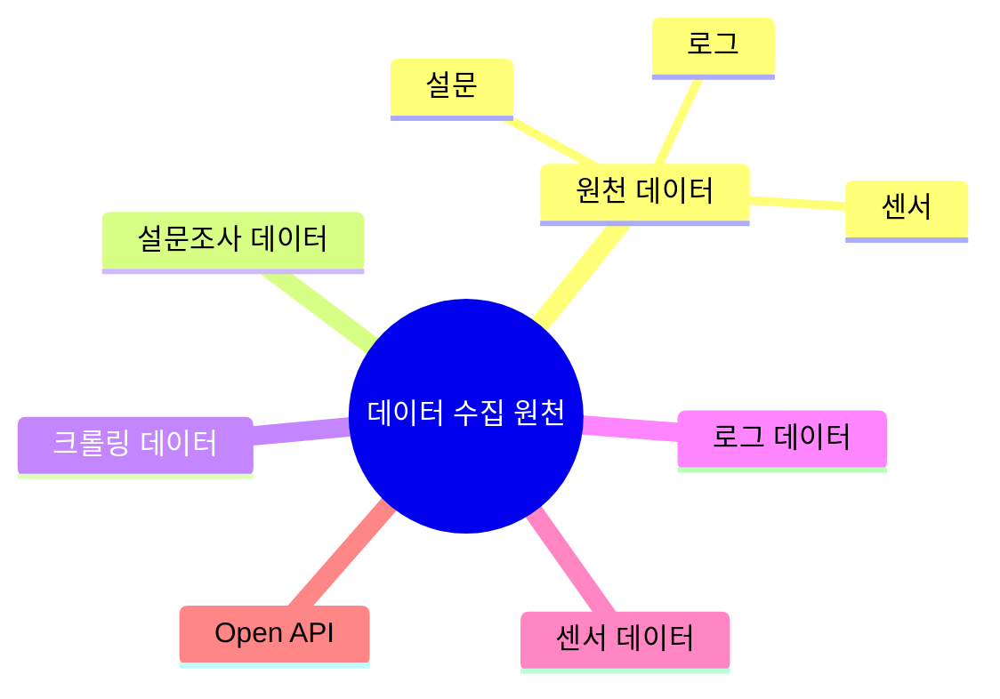
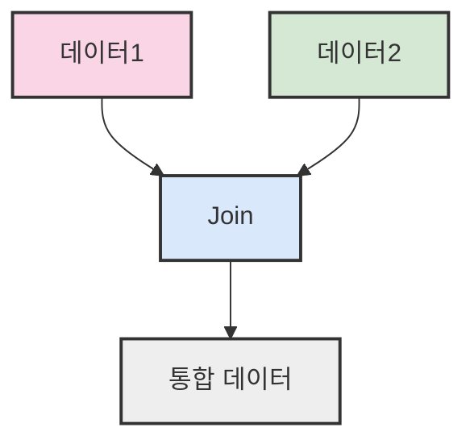

# 3. 데이터 신뢰성 판단 🔍

## 목차
- [3. 데이터 신뢰성 판단 🔍](#3-데이터-신뢰성-판단-)
  - [목차](#목차)
  - [믿을 수 있는 데이터란? 🤔](#믿을-수-있는-데이터란-)
  - [데이터 오류와 편향 ⚠️](#데이터-오류와-편향-️)
    - [데이터 오류](#데이터-오류)
    - [데이터 편향](#데이터-편향)
  - [결측 데이터와 처리 전략 🧩](#결측-데이터와-처리-전략-)
  - [데이터 수집의 출처와 신뢰도 📊](#데이터-수집의-출처와-신뢰도-)
    - [주요 수집 원천](#주요-수집-원천)
  - [데이터의 연결 방식 🔗](#데이터의-연결-방식-)
    - [주요 연결 기법](#주요-연결-기법)

---

## 믿을 수 있는 데이터란? 🤔

데이터 분석이 의미 있으려면 **데이터 자체에 대한 신뢰**가 선행되어야 한다.  
아무리 많은 데이터를 모았더라도 다음과 같은 문제가 있다면 분석 결과는 신뢰하기 어렵다:

```plaintext
- 데이터 편향: 편향된 표본만 수집된 경우
- 데이터 오류: 사실과 다른 정보가 데이터에 포함된 경우
- 결측 데이터: 측정이 누락된 항목들이 있는 경우
```

데이터의 신뢰도는 단순히 양으로 결정되지 않으며, **수집과 처리 과정의 투명성**이 중요하다.

---

## 데이터 오류와 편향 ⚠️

### 데이터 오류

데이터에 **사실이 아닌 정보**가 포함된 경우를 말한다. 예를 들어, 나이가 9999세로 기록된 항목이나 성별이 모호하게 표기된 사례는 오류로 간주된다.

```python
# 오류 예시 (잘못된 연령값 포함)
{
  "name": "홍길동",
  "age": 9999,
  "gender": "남성",
  "education": "대학교 졸업"
}
```

오류가 포함된 데이터는 분석을 왜곡할 수 있으며, 단순 삭제보다는 **오류 발생 원인 파악**이 우선되어야 한다.

### 데이터 편향

**특정 집단만 대표**하도록 수집된 데이터는 전체 모집단을 반영하지 못하며, 편향이 발생한다.  
예컨대, 특정 지역, 연령층, 성별만 대상으로 한 설문 결과는 일반화에 한계가 있다.


---

## 결측 데이터와 처리 전략 🧩

결측 데이터란 값이 누락되었거나 비어 있는 경우를 말하며, 주로 다음과 같은 방식으로 처리된다:

| 처리 방법 | 설명 | 적합한 상황 |
|:---------|:-----|:-----------|
| **행 삭제** | 결측값이 포함된 데이터를 제거 | 결측값이 소수일 때 |
| **평균값 대입** | 수치형 변수에 평균값을 채움 | 정규분포 데이터 |
| **최빈값 대입** | 범주형 변수에 가장 자주 나타나는 값을 대입 | 범주형 변수 |
| **모델 기반 예측** | 머신러닝 모델을 활용하여 결측값을 예측 | 데이터 간 상관관계가 높을 때 |
| **지원 알고리즘 사용** | 결측값 자체를 허용하는 알고리즘 사용 | 결측값이 많을 때 |
| **딥러닝 기반 보간** | 예: Datawig 등 | 복잡한 패턴의 데이터 |

결측값은 단순한 오류가 아니라 **의미 있는 결측**일 수 있으므로, 삭제 전 분석적 판단이 필요하다.

---

## 데이터 수집의 출처와 신뢰도 📊

데이터의 **수집 경로**와 **처리 단계**는 신뢰도를 판단하는 데 핵심이다.

### 주요 수집 원천



- **원천 데이터** 📝: 가공 전 데이터 (예: 센서, 설문, 로그 등)
- **설문조사 데이터** 📋: 자발적 응답으로 구성되며, 응답자의 의도나 해석이 개입될 수 있음
- **크롤링 데이터** 🕸️: 자동화 도구를 통해 수집된 웹 콘텐츠 기반
- **로그 데이터** 📜: 시스템이나 애플리케이션에서 자동으로 생성된 데이터
- **센서 데이터** 📡: 실시간 측정 장치에서 수집된 데이터
- **Open API** 🔌: 외부 기관에서 공개적으로 제공하는 데이터, 메타데이터 확인이 중요

데이터 출처에 따라 해석의 신뢰도와 활용도가 달라지므로, **메타데이터** 확보가 필수적이다.

---

## 데이터의 연결 방식 🔗

분석을 위해 다양한 데이터를 결합해야 하는 경우가 많다. 이때 적절한 연결 방식이 필요하다.

### 주요 연결 기법

- `Data Join` 🔄: 공통된 속성(열)을 기준으로 두 테이블을 병합
  - 예: `성별`, `나이` 같은 공통 필드를 기준으로 병합
- `Data Concat` ➕: 단순한 행 또는 열 추가로 데이터 확장
- `Data Merge` 🧩: `Join`의 특수 형태로, `inner`, `outer`, `left`, `right` 등 다양한 방식 존재

```python
# pandas를 활용한 병합 예시
pd.merge(df1, df2, how='left', on='id')
```



데이터의 구조와 목적에 맞는 연결 방식을 택해야 하며, 연결 전에 **열 이름 통일**과 **결측값 처리**가 선행되어야 한다.

---

> ✨ **요약**: 데이터 신뢰성 판단은 분석 결과의 품질을 좌우하는 핵심 요소이다. 데이터의 출처를 확인하고, 오류와 편향을 제거하며, 결측값을 적절히 처리하는 것이 중요하다.
