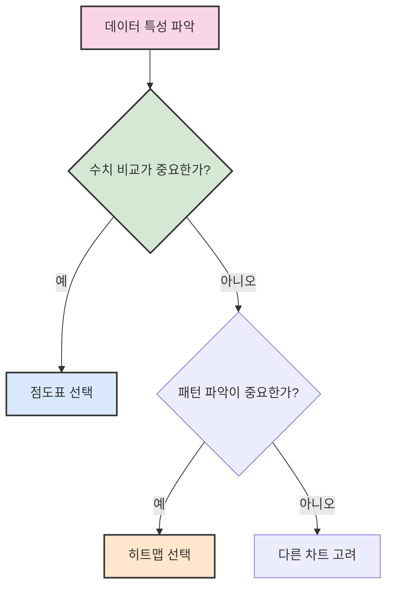

# 2. 수량 데이터의 시각화

## 목차
- [2. 수량 데이터의 시각화](#2-수량-데이터의-시각화)
  - [목차](#목차)
  - [1. 막대그래프](#1-막대그래프)
    - [✅ 묶은 막대그래프 유의사항](#-묶은-막대그래프-유의사항)
  - [2. 점도표와 히트맵 🔍](#2-점도표와-히트맵-)
    - [점도표와 히트맵 특징 비교](#점도표와-히트맵-특징-비교)
    - [코드 예시](#코드-예시)

---

## 1. 막대그래프

**막대그래프(Bar Plot)** 는 범주형 데이터의 수량 값을 시각화하는 가장 기본적인 방법이다. 대표적으로 다음 세 가지 유형이 존재한다:

- 단일 막대그래프
- 묶은(클러스터) 막대그래프
- 누적 막대그래프

범주명이 길 경우에는 **가로 막대그래프**가 가독성이 더 좋으며, 수량 값의 왜곡을 방지하려면 항상 **y축을 0부터 시작**해야 한다.

또한, 시간 경과와 무관한 데이터는 **값의 크기순 또는 임의의 순서로 정렬**하여 정보를 명확히 전달해야 한다. 세로 막대그래프의 경우, 시각적 강조를 위해 **명확한 색상 대비**를 사용하는 것이 좋다.

### ✅ 묶은 막대그래프 유의사항
- 두 개의 범주형 변수를 동시에 표현할 수 있어 정보가 풍부함
- 그러나 **한눈에 보기 어려운 단점**이 있으며,
- 보통 한 축에 범주형 변수, 다른 하나는 **색상 구분**으로 표현함

```python
# 예시: 범주형 2개와 수량값을 가진 데이터 시각화
import matplotlib.pyplot as plt
import seaborn as sns
sns.barplot(data=df, x="지역", y="수량", hue="연령대")
```

---

## 2. 점도표와 히트맵 🔍

**점도표(Dot Plot)** 🎯는 막대그래프보다 **정확한 수량 차이를 비교**하는 데 유리하다. 특히 막대들이 비슷한 길이를 가질 때, 막대그래프에서는 시선이 막대 중간에 머물러 **차이를 인지하기 어렵지만**, 점도표는 각 수치를 직접 찍어주기 때문에 비교가 더 명확하다.

그러나 데이터 수가 많아질수록 **시각적으로 복잡**해진다는 단점이 있다. 이 경우 **히트맵(Heatmap)** 🌡️을 활용하면 전체적인 **추세**를 파악하기 쉬워진다.

### 점도표와 히트맵 특징 비교

| 차트 유형 | 장점 | 단점 | 적합한 상황 |
|---------|-----|-----|-----------|
| 점도표 | 정확한 수치 비교 가능 | 데이터 많을 때 복잡해짐 | 유사한 수치 간 세밀한 비교 |
| 히트맵 | 전체적 패턴 파악 용이 | 정확한 수치 파악 어려움 | 2차원 데이터 패턴 분석 |

> 💡 **팁**: 점도표는 단일 변수, 히트맵은 두 변수의 관계를 표현할 때 효과적이다. 목적에 맞게 선택하자.

> ⚠️ **주의사항**: 히트맵은 색의 농도로 정보를 전달하기 때문에 **정확한 수치 파악에는 부적합**하다. 필요시 `annot=True` 옵션으로 수치를 함께 표시하자.

### 코드 예시

```python
# 점도표 사용 예시
import matplotlib.pyplot as plt
import seaborn as sns
import numpy as np
import pandas as pd

# 샘플 데이터 생성
categories = ['제품A', '제품B', '제품C', '제품D', '제품E']
values = [23, 25, 24, 27, 23]

# 점도표 그리기
plt.figure(figsize=(10, 6))
plt.scatter(values, categories, s=100)
plt.title('제품별 판매량 점도표')
plt.xlabel('판매량')
plt.grid(axis='x', linestyle='--', alpha=0.7)
plt.show()

# 히트맵 사용 예시
# 2차원 데이터 생성
weekdays = ['월', '화', '수', '목', '금', '토', '일']
hours = ['오전', '오후', '저녁', '심야']
data = pd.DataFrame(np.random.randint(10, 100, size=(7, 4)), 
                    index=weekdays, columns=hours)

# 히트맵 그리기
plt.figure(figsize=(10, 8))
sns.heatmap(data, annot=True, cmap="YlGnBu", fmt='d')
plt.title('요일 및 시간대별 방문자 수')
plt.show()
```



> ✨ **요약**: 점도표는 정확한 수치 비교에, 히트맵은 2차원 데이터의 패턴 파악에 사용하는 것이 효과적이다. 데이터의 특성과 전달하고자 하는 메시지에 따라 적절한 시각화 방법을 선택하는 것이 중요하다.

---
