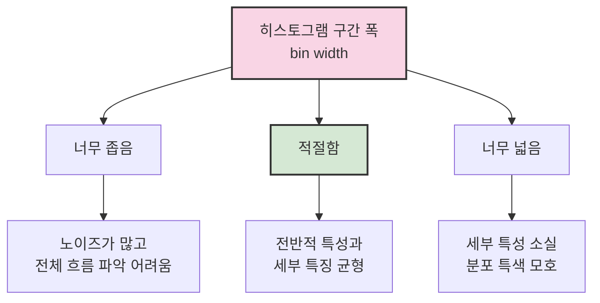

# 3. 분포 데이터의 시각화 📊

## 목차
- [3. 분포 데이터의 시각화 📊](#3-분포-데이터의-시각화-)
  - [목차](#목차)
  - [단일 분포 데이터 시각화](#단일-분포-데이터-시각화)
    - [히스토그램](#히스토그램)
    - [밀도 플롯(Density Plot)](#밀도-플롯density-plot)
    - [박스 플롯(Box Plot)](#박스-플롯box-plot)
    - [바이올린 플롯(Violin Plot)](#바이올린-플롯violin-plot)
  - [여러 분포 데이터 시각화](#여러-분포-데이터-시각화)
    - [누적 히스토그램](#누적-히스토그램)
    - [대안: 피라미드형 비교](#대안-피라미드형-비교)
    - [다중 분포 시각화 기법](#다중-분포-시각화-기법)

---

## 단일 분포 데이터 시각화

### 히스토그램

**히스토그램(histogram)** 은 구간별로 데이터를 분류하여 시각화하는 대표적인 방법이다. 원시 데이터를 구간으로 나누고 각 구간에 속하는 데이터 수를 시각적으로 보여준다.

- **구간 폭(bin width)** 설정이 핵심이다.
  - 너무 좁은 경우: 분포가 지나치게 뾰족하고 노이즈가 많아 전체 흐름 파악이 어렵다.
  - 너무 넓은 경우: 세부 특성이 사라져 분포의 특색을 파악하기 힘들다.
  - 적절한 폭: 데이터의 전반적 특성과 세부 특징을 균형 있게 보여줌.

```python
# 실제 히스토그램 예시
import matplotlib.pyplot as plt
import numpy as np

# 정규분포 데이터 생성
np.random.seed(42)
data = np.random.normal(0, 1, 1000)

# 다양한 bin 설정으로 히스토그램 비교
fig, axes = plt.subplots(1, 3, figsize=(15, 5))

# 너무 적은 bin (5개)
axes[0].hist(data, bins=5, color='lightblue', edgecolor='black')
axes[0].set_title('너무 적은 bin (5개)')

# 적절한 bin (20개)
axes[1].hist(data, bins=20, color='skyblue', edgecolor='black')
axes[1].set_title('적절한 bin (20개)')

# 너무 많은 bin (100개)
axes[2].hist(data, bins=100, color='steelblue', edgecolor='black')
axes[2].set_title('너무 많은 bin (100개)')

plt.tight_layout()
plt.show()
```



### 밀도 플롯(Density Plot)

연속적인 분포를 부드러운 곡선으로 표현하는 방법으로, 히스토그램의 대안으로 사용된다.

```python
# 밀도 플롯 예시
import seaborn as sns

plt.figure(figsize=(10, 6))
sns.histplot(data, kde=True, stat="density", linewidth=0, color="skyblue")
sns.kdeplot(data, color="darkblue", linewidth=2)
plt.title("히스토그램과 KDE 밀도 플롯")
plt.xlabel("값")
plt.ylabel("밀도")
plt.show()
```

### 박스 플롯(Box Plot)

데이터의 사분위수와 이상치를 효과적으로 표현하는 방법이다.

```python
# 박스 플롯 예시
plt.figure(figsize=(10, 6))
sns.boxplot(y=data)
plt.title("박스 플롯")
plt.ylabel("값")
plt.show()
```

### 바이올린 플롯(Violin Plot)

박스 플롯과 밀도 플롯을 결합한 형태로, 분포의 모양을 시각화하는 데 유용하다.

```python
# 바이올린 플롯 예시
plt.figure(figsize=(10, 6))
sns.violinplot(y=data)
plt.title("바이올린 플롯")
plt.ylabel("값")
plt.show()
```

> 💡 **팁**: 데이터의 특성에 따라 적절한 시각화 방법을 선택하세요.
> - 이상치 파악이 중요하면 → 박스 플롯
> - 분포 모양 파악이 중요하면 → 히스토그램, 밀도 플롯
> - 둘 다 필요하면 → 바이올린 플롯

**요점 정리**:
- 히스토그램은 구간 설정에 따라 전혀 다른 해석을 낳을 수 있으므로 주의가 필요하다.
- 시각화 전, 데이터의 분포를 탐색하여 적절한 bin 수를 결정해야 한다.
- 분포 데이터는 목적에 맞는 다양한 시각화 방법을 활용하여 분석해야 한다.

---

## 여러 분포 데이터 시각화

둘 이상의 변수나 그룹의 분포를 비교해야 할 경우에는 **누적 히스토그램** 또는 **연령 피라미드 형태의 시각화**가 사용된다.

### 누적 히스토그램

여러 그룹의 데이터를 하나의 히스토그램에 겹쳐 표현한 방식이다.

- 해석의 어려움:
  - 색상만으로는 구간별 누적값을 해석하기 어려움.
  - 예: 빨간색 영역이 0~30을 의미하는지, 15~45를 의미하는지 모호할 수 있음.

### 대안: 피라미드형 비교

각 그룹의 히스토그램을 90도 회전시켜 양쪽으로 배치하는 방식으로 시각적 명확성을 확보할 수 있다.

```python
# 피라미드형 분포 시각화 예시 (설명용)
import matplotlib.pyplot as plt
plt.barh(range(len(group1)), group1, color='blue', label='Group A')
plt.barh(range(len(group2)), [-val for val in group2], color='red', label='Group B')  # 음수로 반대 방향
plt.legend()
plt.show()
```

### 다중 분포 시각화 기법

- **산점도 행렬(Scatter Matrix)**: 여러 변수 간의 관계를 한눈에 파악할 수 있는 방법.
- **병렬 좌표계(Parallel Coordinates)**: 다차원 데이터를 시각화하는 데 유용한 기법.

```python
# 산점도 행렬 예시
from pandas.plotting import scatter_matrix
import pandas as pd

# 예시 데이터프레임
df = pd.DataFrame({
    "A": np.random.rand(100),
    "B": np.random.rand(100),
    "C": np.random.rand(100),
    "D": np.random.rand(100)
})

# 산점도 행렬 그리기
scatter_matrix(df, alpha=0.8, figsize=(10, 10), diagonal='hist')
plt.show()
```

```python
# 병렬 좌표계 예시
from pandas.plotting import parallel_coordinates

# 예시 데이터프레임 (범주형 변수 포함)
df = pd.DataFrame({
    "A": np.random.rand(100),
    "B": np.random.rand(100),
    "C": np.random.rand(100),
    "D": np.random.rand(100),
    "Category": np.random.choice(['Group 1', 'Group 2'], 100)
})

# 병렬 좌표계 그리기
plt.figure(figsize=(10, 6))
parallel_coordinates(df, 'Category', color=('blue', 'red'))
plt.title("병렬 좌표계")
plt.xlabel("변수")
plt.ylabel("값")
plt.show()
```

**주의사항**:
- 두 그룹까지만 비교 가능하며, 세 그룹 이상에는 적합하지 않다.
- 변수 수가 많다면 **박스플롯**, **밀도 플롯**, **다차원 시각화 기법** 등을 고려해야 한다.

---
