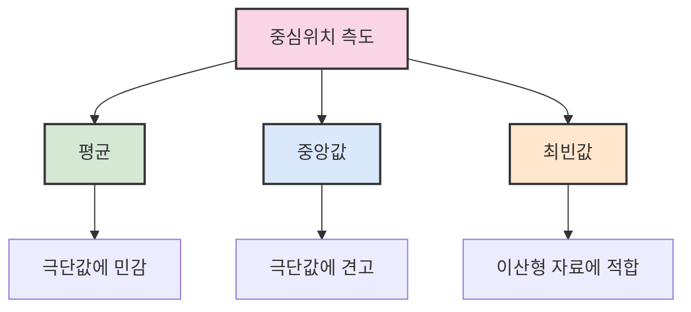
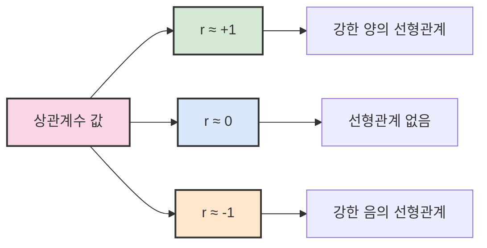

# 2. 논리적인 자료의 요약 📊

## 목차
- [2. 논리적인 자료의 요약 📊](#2-논리적인-자료의-요약-)
  - [목차](#목차)
  - [중심위치의 측도 🎯](#중심위치의-측도-)
    - [주의사항](#주의사항)
  - [퍼진 정도의 측도 📏](#퍼진-정도의-측도-)
    - [변동계수 (CV)](#변동계수-cv)
  - [상자그림 📦](#상자그림-)
  - [두 변수 자료의 요약 🔄](#두-변수-자료의-요약-)
    - [범주형 + 범주형: **분할표**](#범주형--범주형-분할표)
    - [수치형 + 수치형: **산점도, 공분산, 상관계수**](#수치형--수치형-산점도-공분산-상관계수)
      - [상관계수 해석](#상관계수-해석)
    - [주의사항](#주의사항-1)

---

## 중심위치의 측도 🎯

자료의 대략적인 분포를 수치로 요약하면 **주관성을 배제**하고 객관적인 비교가 가능하다. 이를 위해 다음과 같은 중심값들이 사용된다:

| 측도 | 설명 | Python 함수 |
|------|------|------------|
| **평균(mean)** | 모든 값을 더한 뒤 개수로 나눈 값 | `np.mean()` |
| **중앙값(median)** | 정렬된 값의 중간값. 짝수 개일 경우 두 중앙값의 평균 | `np.median()` |
| **최빈값(mode)** | 가장 자주 나타나는 값. 이산형 자료에 적합 | `stats.mode()` |

```python
import numpy as np
import scipy.stats as stats

data = [3, 5, 7, 7, 9]
print(np.mean(data))       # 평균
print(np.median(data))     # 중앙값
print(stats.mode(data))    # 최빈값
```

### 주의사항
- 평균은 **극단값에 민감**
- 중앙값은 **극단값의 영향을 거의 받지 않음**
- 최빈값은 **연속형 자료에는 부적절**



---

## 퍼진 정도의 측도 📏

중심값만으로는 분포의 **흩어진 정도**를 알 수 없다. 이를 보완하기 위해 다음 지표들을 사용한다:

| 측도 | 설명 | Python 함수 |
|------|------|------------|
| **분산(variance)** | 편차 제곱의 평균 | `np.var()` |
| **표준편차(standard deviation)** | 분산의 양의 제곱근 | `np.std()` |
| **범위(range)** | 최댓값 - 최솟값 | `np.max() - np.min()` |
| **사분위수(quartiles)** | 분포를 4등분한 기준값 | `np.percentile()` |
| **사분위수 범위(IQR)** | Q3 - Q1 | 직접 계산 |

```python
import numpy as np

data = [2, 4, 4, 6, 8, 10]
print(np.var(data))                   # 분산
print(np.std(data))                   # 표준편차
print(np.max(data) - np.min(data))    # 범위
print(np.percentile(data, 25))        # Q1
print(np.percentile(data, 75))        # Q3
```

### 변동계수 (CV)
- **단위가 다른 대상 간 분산 비교** 시 사용
- `CV = 표준편차 / 평균`

> 💡 **팁**: 변동계수는 평균이 다른 두 그룹의 분산을 비교할 때 특히 유용합니다. 예를 들어 연봉과 나이의 분산을 직접 비교하기 어려울 때 변동계수로 상대적 분산 정도를 비교할 수 있습니다.

---

## 상자그림 📦

**Box plot**은 다음 다섯 가지 값을 시각화한다:

- 최솟값
- 제1사분위수 (Q1)
- 중앙값 (Q2)
- 제3사분위수 (Q3)
- 최댓값

```python
import matplotlib.pyplot as plt

data = [4, 5, 7, 9, 10, 13, 15]
plt.boxplot(data)
plt.show()
```

| 장점 | 단점 |
|------|------|
| 한눈에 극단값과 퍼진 정도를 확인 가능 | 다봉형 분포의 경우 해석이 어려움 |
| 여러 데이터셋 비교에 효과적 | 분포의 모양을 정확히 파악하기 어려움 |
| 이상치 탐지에 유용 | 표본 크기에 대한 정보 제공 안 함 |

---

## 두 변수 자료의 요약 🔄

### 범주형 + 범주형: **분할표**
```python
import pandas as pd
pd.crosstab(index=df['성별'], columns=df['선호음료'])
```

- 두 범주형 변수의 관련성 시각화
- 행과 열 기준으로 분할된 도수분포표

### 수치형 + 수치형: **산점도, 공분산, 상관계수**

| 도구 | 설명 | 활용 |
|------|------|------|
| **산점도 (scatter plot)** | 변수 간 관계를 점으로 표현 | 패턴 시각적 확인 |
| **공분산** | 두 변수의 **동방향/역방향** 관계 확인 | `df.cov()` |
| **상관계수 (Pearson's r)** | 두 변수의 **선형관계 정도** | `df.corr()` |

```python
import matplotlib.pyplot as plt

plt.scatter(x=df['나이'], y=df['소득'])
plt.xlabel('나이')
plt.ylabel('소득')
plt.show()
```

#### 상관계수 해석
- `r = +1`: 완벽한 양의 직선관계
- `r = -1`: 완벽한 음의 직선관계
- `r ≈ 0`: 선형관계 없음



### 주의사항
- **상관관계 ≠ 인과관계**
- 상관계수는 **직선적 관계만 측정**하므로 산점도로 사전 확인 필요

> ⚠️ **주의사항**: 상관계수가 높다고 해서 인과관계가 있다고 단정할 수 없다. 제3의 변수에 의한 우연한 상관관계일 수 있으며, 반드시 이론적 근거와 함께 해석해야 한다.

> ✨ **요약**: 논리적인 자료 요약은 데이터의 중심 경향과 분산을 객관적으로 표현하는 중요한 과정이다. 중심위치 측도(평균, 중앙값, 최빈값)와 퍼진 정도 측도(분산, 범위, IQR)를 통해 데이터의 특성을 파악하고, 상자그림과 같은 시각화 도구로 직관적 이해를 돕는다. 두 변수 관계는 분할표, 산점도, 상관계수 등을 통해 분석할 수 있으며, 항상 상관관계와 인과관계의 차이를 인지하는 것이 중요하다.

---

