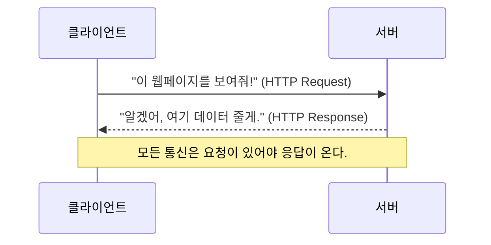
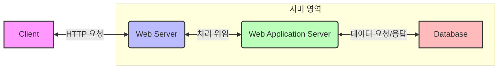

# 2. 앱/웹 서비스를 위한 모든 것 🌐

## 목차
- [2. 앱/웹 서비스를 위한 모든 것 🌐](#2-앱웹-서비스를-위한-모든-것-)
  - [목차](#목차)
  - [웹 통신의 기본 약속, HTTP 🔄](#웹-통신의-기본-약속-http-)
    - [HTTP란 무엇인가?](#http란-무엇인가)
    - [데이터 표현 형식: JSON과 XML](#데이터-표현-형식-json과-xml)
  - [웹 서비스의 엔진: WAS와 서버 아키텍처 🖥️](#웹-서비스의-엔진-was와-서버-아키텍처-️)
  - [사용자와의 접점: Front-end(클라이언트) 🎨](#사용자와의-접점-front-end클라이언트-)
    - [UI와 UX: 좋은 경험의 설계](#ui와-ux-좋은-경험의-설계)
  - [작업 흐름의 제어: 동기와 비동기 ⏱️](#작업-흐름의-제어-동기와-비동기-️)
  - [서비스의 두뇌: Back-end와 API ⚙️](#서비스의-두뇌-back-end와-api-️)
    - [REST API: 잘 설계된 소통 방식](#rest-api-잘-설계된-소통-방식)
      - [REST API 예시](#rest-api-예시)

---

## 웹 통신의 기본 약속, HTTP 🔄

우리가 웹 브라우저로 웹사이트를 보거나 앱으로 서버와 통신할 때, 보이지 않는 곳에서는 **요청(Request)**  과 **응답(Response)**  이 끊임없이 오고 갑니다. 이처럼 클라이언트와 서버가 서로 데이터를 주고받기 위해 사용하는 핵심적인 규칙이 바로 **HTTP**입니다.



### HTTP란 무엇인가?

HTTP는 **H**yper**T**ext **T**ransfer **P**rotocol의 약자입니다.

| 약자 | 의미 | 핵심 설명 |
|---|---|---|
| **H** | **HyperText** | 다른 문서로 이동할 수 있는 링크(하이퍼링크)를 포함한 텍스트. 우리가 웹서핑 중 링크를 클릭해 다른 페이지로 이동하는 것이 바로 하이퍼텍스트의 개념입니다. |
| **T** | **Transfer** | 전송. 하이퍼텍스트를 포함한 각종 데이터(이미지, 동영상 등)를 주고받는 것. |
| **P** | **Protocol** | 규약. '어떻게' 주고받을지에 대한 약속. 전 세계 모든 컴퓨터가 이 약속을 따르기에 웹이 동작할 수 있습니다. |

결론적으로, **HTTP는 웹 문서를 빠르고 안정적으로 주고받기 위한 통신 규약**입니다.

### 데이터 표현 형식: JSON과 XML

서버와 클라이언트는 주로 **JSON** 또는 **XML** 형식으로 구조화된 데이터를 주고받습니다.

**JSON 예시** (JavaScript Object Notation)
- **특징**: Key-Value 쌍으로 이루어져 가볍고, 사람이 읽기 편합니다. 현대 웹 API의 표준으로 자리 잡았습니다.
```json
{
  "user": {
    "id": 123,
    "name": "홍길동",
    "skills": ["Python", "Data Science"]
  }
}
```

**XML 예시** (eXtensible Markup Language)
- **특징**: 태그로 데이터를 감싸 계층 구조를 표현합니다. 엄격한 구조가 필요하거나, 오래된 시스템과 연동할 때 사용됩니다.
```xml
<user>
  <id>123</id>
  <name>홍길동</name>
  <skills>
    <skill>Python</skill>
    <skill>Data Science</skill>
  </skills>
</user>
```

---

## 웹 서비스의 엔진: WAS와 서버 아키텍처 🖥️

웹 서비스는 사용자의 요청에 따라 정적인 정보(항상 같은 내용)와 동적인 정보(상황에 따라 변하는 내용)를 모두 제공해야 합니다. 이를 효율적으로 처리하기 위해 대부분의 서비스는 다음과 같은 구조를 가집니다.



| 구성 요소 | 역할 분담 | 예시 |
|---|---|---|
| **Web Server** | **정적 콘텐츠 처리**. 이미지 파일, CSS, JavaScript 파일처럼 변하지 않는 파일을 빠르게 전달합니다. | Nginx, Apache |
| **Web Application Server (WAS)**  | **동적 콘텐츠 처리**. 사용자에 따라 다른 내용을 보여주거나, 데이터베이스와 연동하여 비즈니스 로직을 수행합니다. | Tomcat, Gunicorn |
| **Database** | 데이터를 영구적으로 저장하고 관리합니다. | MySQL, PostgreSQL, MongoDB |

이처럼 역할을 분담하면, 웹 서버는 단순 반복 작업을 빠르게 처리하고 WAS는 복잡한 로직에 집중할 수 있어 전체 시스템의 효율이 극대화됩니다.

---

## 사용자와의 접점: Front-end(클라이언트) 🎨

프론트엔드는 사용자가 직접 마주하고 상호작용하는 모든 화면과 기능을 의미합니다. 웹 브라우저나 모바일 앱 화면이 대표적입니다.

- **핵심 역할**: 서버로부터 받은 데이터를 사용자에게 보기 좋게 보여주고, 사용자의 입력을 받아 서버에 전달하는 '창구' 역할을 합니다.
- **주요 기술**: HTML(구조), CSS(디자인), JavaScript(동작)

### UI와 UX: 좋은 경험의 설계

| 요소 | 설명 | 목표 |
|---|---|---|
| **UI (User Interface)**  | 사용자 인터페이스. 버튼, 레이아웃, 폰트 등 사용자가 보는 **시각적 디자인 요소** 전체를 의미합니다. | **직관성, 일관성, 심미성**. 사용자가 고민 없이 서비스를 사용할 수 있게 합니다. |
| **UX (User eXperience)**  | 사용자 경험. 사용자가 서비스를 이용하며 느끼는 **총체적인 만족도나 감정**. 회원가입부터 기능 사용, 탈퇴에 이르는 전 과정이 포함됩니다. | **효율성, 유용성, 만족감**. 사용자가 목표를 쉽고 즐겁게 달성하게 합니다. |

> **팁**: A/B 테스트는 대표적인 데이터 기반 UX 개선 방법론입니다. 버튼 색상이나 문구(UI)를 다르게 보여주고, 어떤 쪽의 클릭률(UX)이 더 높은지 분석하여 서비스를 개선합니다.

---

## 작업 흐름의 제어: 동기와 비동기 ⏱️

프로그램이 여러 작업을 처리할 때, 그 순서와 흐름을 제어하는 방식은 크게 두 가지로 나뉩니다.

| 처리 방식 | 핵심 개념 (블로킹 여부) | 예시 |
|---|---|---|
| **동기(Synchronous)**  | 한 작업이 끝날 때까지 **기다렸다가(Blocking)**  다음 작업을 시작합니다. | 로그인 요청 후, 성공/실패 결과가 올 때까지 화면이 멈춰있는 것. |
| **비동기(Asynchronous)**  | 작업을 요청한 뒤, 결과를 **기다리지 않고(Non-Blocking)**  바로 다음 작업을 시작합니다. 요청했던 작업의 결과는 나중에 별도로 처리합니다. | SNS에서 '좋아요'를 눌렀을 때, 페이지 전체를 새로고침하지 않아도 '좋아요' 숫자가 올라가는 것. |

> **핵심**: 동기/비동기의 차이는 **'요청한 작업의 완료를 기다리느냐, 아니냐'** 입니다. 비동기 처리는 사용자에게 더 빠르고 쾌적한 경험을 제공하기 위해 현대 웹/앱에서 필수적으로 사용됩니다.

---

## 서비스의 두뇌: Back-end와 API ⚙️

백엔드는 사용자 눈에 보이지 않는 서버 영역에서 서비스의 핵심 로직을 처리합니다.

- **비즈니스 로직(Business Logic)** : 서비스의 고유한 규칙과 정책을 의미합니다. 예를 들어, 'VIP 등급 회원은 10% 할인을 적용한다' 또는 '재고가 5개 미만인 상품은 주문할 수 없다'와 같은 규칙이 비즈니스 로직입니다.
- **데이터 처리(CRUD)** : 비즈니스 로직을 수행하기 위해 데이터베이스의 데이터를 생성(Create), 조회(Read), 수정(Update), 삭제(Delete)하는 역할을 합니다.

### REST API: 잘 설계된 소통 방식

**API(Application Programming Interface)** 는 프론트엔드와 백엔드가 데이터를 주고받기 위한 '통신 메뉴판'과 같습니다. **REST(REpresentational State Transfer)** 는 이 API를 설계하는 가장 널리 쓰이는 스타일 중 하나입니다.

- **자원(Resource)** : API로 다루는 모든 대상을 의미합니다. (예: 사용자, 게시글, 상품)
- **행위(Verb)** : 자원에 어떤 작업을 할지를 HTTP 메서드로 표현합니다. (예: GET, POST)
- **표현(Representations)** : 자원에 대한 정보를 JSON이나 XML로 표현하여 전달합니다.

#### REST API 예시

| 엔드포인트 (자원) | HTTP 메서드 (행위) | 기능 설명 |
|---|---|---|
| `/users` | GET | 모든 사용자 목록 조회 |
| `/users/{id}` | GET | 특정 ID의 사용자 정보 조회 |
| `/users` | POST | 새로운 사용자 생성 |
| `/users/{id}` | PUT | 특정 사용자 정보 전체 수정 |
| `/users/{id}` | DELETE | 특정 사용자 삭제 |

> **URI vs URL**: URI(Uniform Resource Identifier)는 자원을 고유하게 식별하는 주소(` /users/123 `)이고, URL(Uniform Resource Locator)은 해당 자원의 실제 위치(` https://api.example.com/users/123 `)를 나타냅니다. URI가 더 상위의 개념입니다.

이처럼 REST API는 주소만 봐도 어떤 자원을 다루는지, HTTP 메서드만 봐도 어떤 작업을 하는지 명확하게 알 수 있어 매우 효율적인 소통 방식입니다.
