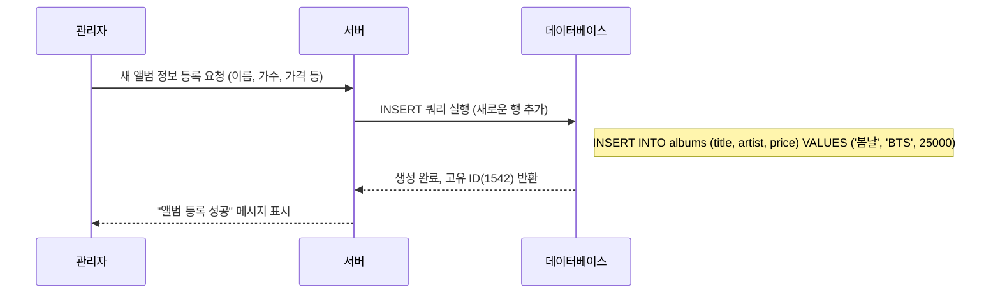
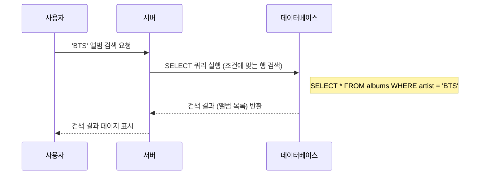
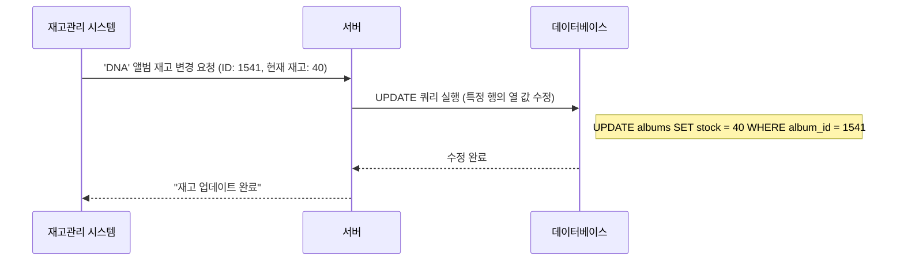
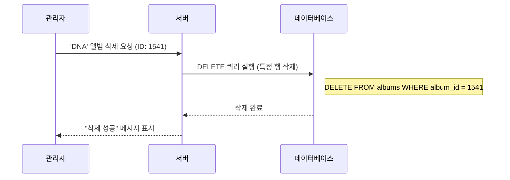
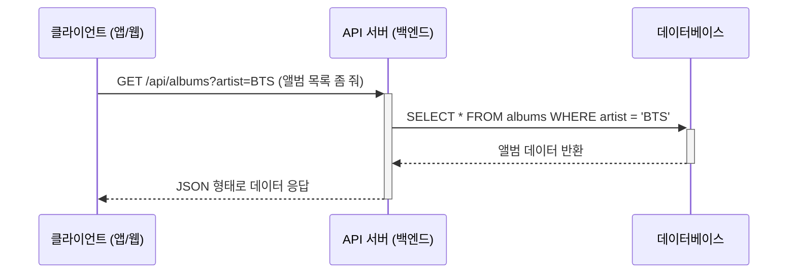

# 3. 데이터베이스와 REST API 🗄️

## 목차
- [3. 데이터베이스와 REST API 🗄️](#3-데이터베이스와-rest-api-️)
  - [목차](#목차)
  - [데이터베이스란 무엇인가? 📊](#데이터베이스란-무엇인가-)
    - [데이터베이스의 핵심, 테이블](#데이터베이스의-핵심-테이블)
  - [데이터베이스의 핵심 연산: CRUD ⚙️](#데이터베이스의-핵심-연산-crud-️)
    - [**Create**: 새로운 데이터 생성 ➕](#create-새로운-데이터-생성-)
    - [**Read**: 기존 데이터 조회 🔍](#read-기존-데이터-조회-)
    - [**Update**: 기존 데이터 수정 ✏️](#update-기존-데이터-수정-️)
    - [**Delete**: 기존 데이터 삭제 ❌](#delete-기존-데이터-삭제-)
  - [데이터의 종류: 데이터 타입 🏷️](#데이터의-종류-데이터-타입-️)
  - [API와 데이터베이스의 관계 🔄](#api와-데이터베이스의-관계-)
  - [데이터베이스의 종류와 선택 🧩](#데이터베이스의-종류와-선택-)
    - [관계형 데이터베이스 vs. NoSQL](#관계형-데이터베이스-vs-nosql)

---

## 데이터베이스란 무엇인가? 📊

**데이터베이스(Database, DB)**  란 **체계적인 구조에 따라 저장되고, 효율적으로 접근, 수정, 관리할 수 있도록 조직된 데이터의 집합체**입니다. 단순히 데이터를 모아두는 것을 넘어, 필요할 때 원하는 정보를 빠르고 정확하게 찾아내기 위해 존재합니다.

우리가 일상에서 접하는 거의 모든 서비스는 데이터베이스를 기반으로 동작합니다.
- **은행 앱**: 우리의 모든 거래 내역을 기록하고 조회합니다.
- **도서관**: 수만 권의 책 정보를 체계적으로 관리하고, 대여 상태를 실시간으로 추적합니다.
- **온라인 쇼핑몰**: 상품 정보, 재고, 주문 내역, 회원 정보를 모두 데이터베이스에 저장합니다.

> 💡 **팁**
> 데이터베이스 설계는 건물의 기초 공사와 같습니다. 초기에 구조를 잘못 잡으면 나중에 수정하기가 매우 어렵고 비용도 많이 듭니다. 데이터의 중복을 피하고 일관성을 유지하는 **정규화(Normalization)**  원칙에 따라 신중하게 설계해야 합니다.

### 데이터베이스의 핵심, 테이블

관계형 데이터베이스에서 데이터는 **테이블(Table)**  이라는 정해진 형식의 표에 저장됩니다.

- **테이블(Table)** : 특정 주제와 관련된 데이터의 집합. (예: '앨범' 테이블, '회원' 테이블)
- **열(Column / Field)** : 데이터의 속성을 정의합니다. (예: '앨범' 테이블의 '앨범명', '가수', '가격' 열)
- **행(Row / Record)** : 실제 데이터의 개별 항목을 나타냅니다. (예: '앨범' 테이블의 'BTS - 봄날' 앨범 정보 한 줄)

| album_id (열) | title (열) | artist (열) |
|---|---|---|
| 1541 (행) | DNA | BTS |
| 1542 (행) | 봄날 | BTS |

---

## 데이터베이스의 핵심 연산: CRUD ⚙️

데이터베이스와의 모든 상호작용은 결국 4가지 기본 연산, **CRUD**로 귀결됩니다.

### **Create**: 새로운 데이터 생성 ➕
쇼핑몰에 새로운 앨범을 등록하는 상황을 예시로 들어보겠습니다.

### **Read**: 기존 데이터 조회 🔍
사용자가 'BTS'의 앨범을 검색하는 상황입니다.

> 💡 **팁**
> 데이터 분석가에게 가장 중요한 SQL 명령어는 단연 `SELECT`입니다. 복잡한 조건(WHERE), 정렬(ORDER BY), 그룹화(GROUP BY), 테이블 연결(JOIN)을 자유자재로 구사하여 원하는 데이터를 추출하는 능력이 핵심 역량입니다.

### **Update**: 기존 데이터 수정 ✏️
앨범의 재고가 변경되는 상황입니다.

> ⚠️ **경고**: `UPDATE` 쿼리에서 `WHERE` 절을 빠뜨리는 것은 재앙입니다. 테이블의 모든 행이 동일한 값으로 변경될 수 있습니다. 실행 전 `SELECT`로 변경 대상을 정확히 확인하는 습관을 들여야 합니다.

### **Delete**: 기존 데이터 삭제 ❌
판매가 중단된 앨범을 삭제하는 상황입니다.

> **실무 Tip: 소프트 삭제 (Soft Deletion)** 
> 실제 데이터를 `DELETE`로 완전히 삭제하는 것은 위험합니다. 데이터 복구가 어렵고, 관련 기록(예: 과거 주문 내역)과 연결이 끊어질 수 있습니다.
>
> 실무에서는 `is_deleted` 같은 상태 컬럼(열)을 두고, 삭제 요청 시 이 값을 `true`로 `UPDATE`하는 **'소프트 삭제'** 방식을 선호합니다. 이렇게 하면 데이터는 보존하면서, 사용자에게는 보이지 않도록 안전하게 처리할 수 있습니다.

---

## 데이터의 종류: 데이터 타입 🏷️

데이터베이스는 저장할 데이터의 종류에 따라 명확한 **데이터 타입**을 지정해야 합니다. 이는 데이터의 일관성을 보장하고 저장 공간을 효율적으로 사용하기 위함입니다.

| 분류 | 주요 데이터 타입 | 설명 | 사용 사례 |
|---|---|---|---|
| **숫자형** | `INTEGER`, `BIGINT` | 정수 | 사용자 ID, 수량, 나이 |
| | `DECIMAL`, `NUMERIC` | 고정 소수점 (정확한 계산) | 가격, 급여, 환율 |
| | `FLOAT`, `DOUBLE` | 부동 소수점 (근사값) | 과학 계산, GPS 좌표 |
| **문자형** | `VARCHAR(n)` | 가변 길이 문자열 (최대 n자) | 이름, 제목, 주소 |
| | `TEXT` | 매우 긴 문자열 | 게시글 본문, 상품 설명 |
| **날짜/시간형** | `DATE` | 날짜 (YYYY-MM-DD) | 생년월일 |
| | `TIMESTAMP`, `DATETIME` | 날짜와 시간 | 게시글 작성 시각, 로그 기록 |
| **논리형** | `BOOLEAN` | 참(True) 또는 거짓(False) | 활성화 여부, 동의 여부 |

---

## API와 데이터베이스의 관계 🔄

API와 데이터베이스는 웹 서비스에서 각기 다른 중요한 역할을 수행하며 긴밀하게 협력합니다.

- **데이터베이스**: 데이터의 **'창고'** 입니다. 실제 데이터가 체계적으로 보관되는 물리적 또는 논리적 공간이며, 허가된 접근(API를 통한)에만 응답하여 데이터를 안전하게 지킵니다.
- **API**: 데이터 창고의 **'안내 데스크' 또는 '주문 창구'** 입니다. 외부(클라이언트)로부터 정해진 양식의 요청을 받아, 내부 로직(비즈니스 로직)을 거쳐 창고에서 데이터를 꺼내주거나, 새 데이터를 넣어줍니다.

**클라이언트는 절대 데이터베이스에 직접 접근할 수 없습니다.** 반드시 API라는 공식적인 창구를 통해서만 상호작용해야 합니다.

---

## 데이터베이스의 종류와 선택 🧩

모든 상황에 맞는 만능 데이터베이스는 없습니다. 데이터의 특성과 서비스의 요구사항에 따라 적절한 유형을 선택해야 합니다.

### 관계형 데이터베이스 vs. NoSQL

| 특성 | 관계형 데이터베이스 (RDBMS) | NoSQL (Not Only SQL) |
|---|---|---|
| **데이터 구조** | 정해진 행과 열의 테이블 (엑셀 시트 연상) | 문서, 키-값, 그래프 등 다양한 형태 |
| **스키마** | **엄격함 (Schema-on-Write)** : 데이터 저장 전에 구조를 완벽하게 정의해야 함. | **유연함 (Schema-on-Read)** : 정해진 구조 없이 자유롭게 데이터를 저장하고, 읽을 때 해석함. |
| **관계** | 테이블 간의 관계(JOIN)를 통해 복잡하고 정합성 높은 데이터 표현에 강함. | 관계 정의가 느슨하거나 없음. |
| **확장성** | 주로 **수직적 확장 (Scale-up)** : 서버 자체의 성능(CPU, RAM)을 높여 처리량 증대. | 주로 **수평적 확장 (Scale-out)** : 여러 대의 서버를 연결하여 처리량을 분산. |
| **대표 예시** | **MySQL, PostgreSQL, Oracle** | **MongoDB, Redis, Cassandra** |
| **적합한 사례** | 금융 거래, 예약 시스템 등 데이터의 **일관성과 정합성**이 매우 중요한 경우. | 로그 데이터, SNS 피드, IoT 데이터 등 **대용량의 비정형 데이터**를 빠르게 처리해야 하는 경우. |

> 💡 **결론**: 데이터 사이언티스트는 주로 정형 데이터를 다루므로, **관계형 데이터베이스와 SQL**에 대한 깊은 이해가 필수적입니다. 하지만 빅데이터 환경에서는 NoSQL 데이터베이스를 다루는 능력 또한 중요해지고 있습니다.
