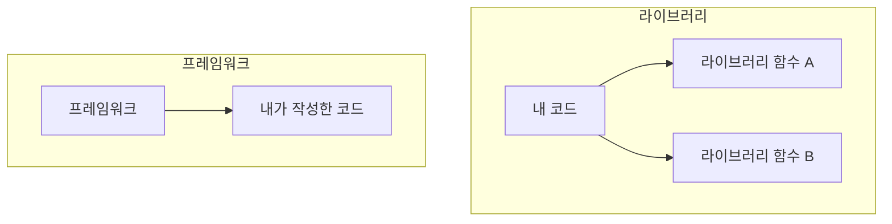

# 4. 라이브러리와 프레임워크 📚

## 목차
- [4. 라이브러리와 프레임워크 📚](#4-라이브러리와-프레임워크-)
  - [목차](#목차)
  - [왜 이 도구들이 필요해졌을까? 🌐](#왜-이-도구들이-필요해졌을까-)
  - [라이브러리: 잘 만들어진 '도구'들의 모음 📦](#라이브러리-잘-만들어진-도구들의-모음-)
    - [대표적인 라이브러리 예시](#대표적인-라이브러리-예시)
    - [라이브러리와 API의 관계](#라이브러리와-api의-관계)
  - [프레임워크: 잘 설계된 '뼈대' 🏗️](#프레임워크-잘-설계된-뼈대-️)
    - [프레임워크의 핵심: 제어의 역전 (IoC)](#프레임워크의-핵심-제어의-역전-ioc)
    - [주요 프레임워크 살펴보기](#주요-프레임워크-살펴보기)
  - [핵심 비교: 라이브러리 vs 프레임워크](#핵심-비교-라이브러리-vs-프레임워크)

---

## 왜 이 도구들이 필요해졌을까? 🌐

초기 웹은 단순한 정보 공유가 목적이었지만, 점차 상호작용이 중요해지고 기능이 복잡해지면서 개발의 규모와 복잡성이 폭발적으로 증가했습니다.

- **반복 작업의 증가**: 로그인, 데이터베이스 연결, UI 구성 등 모든 프로젝트에서 비슷한 코드가 반복적으로 작성되었습니다.
- **협업의 중요성 증대**: 프로젝트 규모가 커지면서 여러 개발자가 함께 일관된 방식으로 코드를 작성할 필요성이 생겼습니다.

이러한 문제를 해결하기 위해, 개발자들은 **'바퀴를 재발명'** 하는 대신, 잘 만들어진 코드를 재사용하고 정해진 구조 안에서 협업하는 방식을 고민하기 시작했습니다. 그 결과물이 바로 **라이브러리**와 **프레임워크**입니다.

---

## 라이브러리: 잘 만들어진 '도구'들의 모음 📦

**라이브러리(Library)**  는 특정 기능들을 수행하는 함수나 클래스 등, 재사용 가능한 코드의 묶음입니다. 개발자는 필요할 때마다 이 코드 묶음을 가져와(호출하여) 사용합니다.

**비유**: 라이브러리는 **'전문 공구함'** 과 같습니다. 차트를 그리거나, 데이터를 분석하는 등 특정 작업이 필요할 때, 우리는 공구함에서 잘 만들어진 망치(함수)나 렌치(클래스)를 꺼내 사용합니다. **무엇을, 언제, 어떻게 사용할지는 전적으로 개발자(나)에게 달려있습니다.**

### 대표적인 라이브러리 예시

| 분야 | 라이브러리 | 언어 | 핵심 기능 |
|---|---|---|---|
| **데이터 분석** | **Pandas, NumPy** | Python | 데이터프레임 조작, 고성능 수치 계산 |
| **머신러닝** | **TensorFlow, PyTorch** | Python | 딥러닝 모델 구축 및 학습 |
| **데이터 시각화** | Matplotlib, Seaborn | Python | 정적 그래프 및 차트 생성 |
| **웹 UI 개발** | **React, Vue.js** | JavaScript | 사용자 인터페이스(UI)를 만들기 위한 도구 |

> **팁**: **Pandas**는 데이터 분석의 시작과 끝이라고 할 수 있는 필수 라이브러리입니다. 데이터를 불러오고, 정제하고, 변형하는 모든 과정에서 Pandas를 사용하게 될 것입니다.

### 라이브러리와 API의 관계

종종 혼동되지만, 라이브러리와 API는 비교의 대상이 아니라 **상호 보완적인 관계**입니다.

- **라이브러리**: 기능의 **실체**인 코드 묶음입니다.
- **API (Application Programming Interface)** : 그 기능을 사용할 수 있도록 외부에 노출된 **'사용 설명서' 또는 '조작 버튼'** 입니다.

개발자는 라이브러리가 제공하는 API를 통해 라이브러리의 기능을 호출하고 사용합니다. 예를 들어, Pandas 라이브러리를 사용할 때 `pd.read_csv()`라는 함수를 쓰는 것은, Pandas가 제공하는 API를 이용해 'CSV 파일을 읽는 기능'을 실행하는 것입니다.

---

## 프레임워크: 잘 설계된 '뼈대' 🏗️

**프레임워크(Framework)**  는 소프트웨어의 전체적인 구조와 흐름을 미리 정해놓은 '뼈대'입니다. 개발자는 이 뼈대 위에 자신의 코드를 추가하여 애플리케이션을 완성합니다.

### 프레임워크의 핵심: 제어의 역전 (IoC)

라이브러리와 프레임워크를 구분하는 가장 중요한 개념은 **제어의 역전(Inversion of Control, IoC)**  입니다.

- **라이브러리 사용 시**: **내 코드**가 주체가 되어 라이브러리를 호출합니다. 제어권은 개발자에게 있습니다.
- **프레임워크 사용 시**: **프레임워크**가 주체가 되어 개발자의 코드를 호출합니다. 제어권이 프레임워크로 넘어갑니다. 이것이 바로 '제어의 역전'입니다.

### 주요 프레임워크 살펴보기

| 언어 | 프레임워크 | 용도 | 주요 특징 |
|---|---|---|---|
| **Python** | **Django, FastAPI** | 웹 개발 | '배터리 포함' 철학, 빠른 API 개발 |
| **Java** | Spring | 엔터프라이즈 앱 | 의존성 주입(DI), 관점 지향 프로그래밍(AOP) |
| **JavaScript** | Angular, NestJS | 웹 개발 | 풀스택 프레임워크, 효율적인 백엔드 개발 |

> **React는 라이브러리인가, 프레임워크인가?**
> React는 공식적으로 'UI 구축을 위한 JavaScript 라이브러리'입니다. 하지만 생태계(라우팅, 상태 관리 등)가 워낙 방대하여 프레임워크처럼 사용되는 경우가 많습니다. 핵심은 'UI를 그리는 기능'에 집중된 라이브러리라는 점입니다.

---

## 핵심 비교: 라이브러리 vs 프레임워크

| 비교 항목 | 라이브러리 (도구함) | 프레임워크 (뼈대) |
|---|---|---|
| **제어권** | **개발자 (내 코드)**  | **프레임워크** |
| **핵심 개념** | 내가 필요할 때 코드를 **호출 (Call)**  | 내 코드가 프레임워크에 의해 **호출됨 (Called)**  |
| **자유도** | 높음 (필요한 기능만 선택적 사용) | 낮음 (정해진 규칙과 구조를 따라야 함) |
| **목적** | 특정 기능을 쉽고 효율적으로 구현 | 애플리케이션의 전체 구조와 일관성 유지 |
| **대표 비유** | 전문가용 공구 세트 | 조립식 주택의 뼈대 |

**결론**: 작은 기능 구현에는 **라이브러리**를, 전체 애플리케이션의 구조를 잡고 일관성을 유지해야 하는 대규모 프로젝트에는 **프레임워크**를 사용하는 것이 일반적입니다. 프로젝트의 목적과 규모에 맞는 올바른 도구를 선택하는 것이 뛰어난 개발자의 역량입니다.