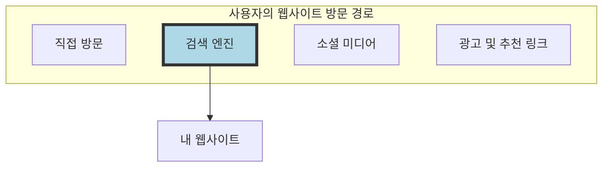
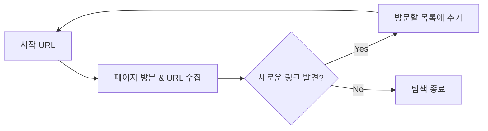

# 5. 검색엔진 최적화와 웹 데이터 수집 🔍

## 목차
- [5. 검색엔진 최적화와 웹 데이터 수집 🔍](#5-검색엔진-최적화와-웹-데이터-수집-)
  - [목차](#목차)
  - [검색엔진 최적화(SEO)란?](#검색엔진-최적화seo란)
  - [검색엔진의 작동 원리: 크롤링, 인덱싱, 랭킹](#검색엔진의-작동-원리-크롤링-인덱싱-랭킹)
  - [웹 데이터 수집 기술: 크롤링 vs 스크래핑](#웹-데이터-수집-기술-크롤링-vs-스크래핑)
    - [웹 크롤링 (Web Crawling): 인터넷을 항해하는 거미](#웹-크롤링-web-crawling-인터넷을-항해하는-거미)
    - [웹 스크래핑 (Web Scraping): 원하는 정보만 콕 집어 추출하기](#웹-스크래핑-web-scraping-원하는-정보만-콕-집어-추출하기)
    - [핵심 비교: 크롤링 vs 스크래핑](#핵심-비교-크롤링-vs-스크래핑)
  - [데이터 수집의 규칙과 책임 ⚖️](#데이터-수집의-규칙과-책임-️)
    - [사이트의 규칙: `robots.txt`](#사이트의-규칙-robotstxt)
    - [기술적, 법적 책임](#기술적-법적-책임)

---

## 검색엔진 최적화(SEO)란?

**검색엔진 최적화(Search Engine Optimization, SEO)**  란, 구글이나 네이버 같은 검색엔진에서 특정 키워드로 검색했을 때, 내 웹사이트가 검색 결과 상위에 노출되도록 만드는 모든 작업을 의미합니다.

사용자는 다양한 경로로 웹사이트에 방문하지만, 그중에서도 '검색'을 통한 유입은 가장 중요한 경로 중 하나입니다. SEO는 바로 이 검색 트래픽을 극대화하기 위한 디지털 마케팅의 핵심 전략입니다.



> **데이터 사이언티스트와 SEO**: 검색 로그 데이터를 분석하여 사용자의 검색 의도를 파악하고, 어떤 콘텐츠가 더 많은 트래픽을 유도하는지 분석하는 것은 데이터 사이언스의 중요한 응용 분야입니다. A/B 테스트를 통해 SEO 전략의 효과를 검증하기도 합니다.

---

## 검색엔진의 작동 원리: 크롤링, 인덱싱, 랭킹

검색엔진은 크게 3단계 과정을 거쳐 검색 결과를 보여줍니다. SEO는 이 각 단계에 맞춰 내 사이트를 최적화하는 과정입니다.

| 단계 | 검색엔진의 활동 | 우리의 SEO 전략 |
|---|---|---|
| 1. **크롤링 (Crawling)**  | '크롤러(봇)'라는 자동화된 프로그램이 전 세계 웹을 돌아다니며 어떤 웹페이지가 있는지 **발견하고 수집**합니다. | 크롤러가 내 사이트를 쉽게 발견하고 내용을 잘 가져갈 수 있도록 `robots.txt` 설정, 사이트맵(`sitemap.xml`) 제출, 내부 링크 구조 최적화 등을 수행합니다. |
| 2. **인덱싱 (Indexing)**  | 크롤러가 수집한 웹페이지의 내용을 **분석하고 정리**하여 거대한 데이터베이스(인덱스)에 저장합니다. | 페이지의 주제가 무엇인지 명확히 알 수 있도록 `<title>` 태그, `<meta>` 설명, 제목(h1, h2) 태그 등을 의미에 맞게 작성합니다. |
| 3. **랭킹 (Ranking)**  | 사용자가 검색어를 입력하면, 인덱스에서 가장 **관련성 높고 신뢰할 수 있는** 페이지 순서대로 결과를 보여줍니다. | 양질의 콘텐츠 제작, 빠른 페이지 로딩 속도, 모바일 최적화, 다른 신뢰도 높은 사이트로부터의 링크(백링크) 확보 등을 통해 검색 순위를 높입니다. |

---

## 웹 데이터 수집 기술: 크롤링 vs 스크래핑

데이터 사이언티스트는 종종 웹에서 직접 데이터를 수집해야 합니다. 이때 사용되는 핵심 기술이 바로 크롤링과 스크래핑이며, 둘은 목적과 방식에서 명확한 차이가 있습니다.

### 웹 크롤링 (Web Crawling): 인터넷을 항해하는 거미

**웹 크롤링**은 자동화된 봇(크롤러, 스파이더)이 여러 웹페이지를 돌아다니며 **페이지의 존재를 발견하고, 그 페이지에 있는 링크를 따라 또 다른 페이지로 이동하는 과정**을 반복하는 것입니다.

- **주요 목적**: 어떤 정보가 어디에 있는지 '목록'을 만드는 것 (인덱싱).
- **핵심 활동**: URL 수집 및 탐색.
- **비유**: 도서관의 모든 서가를 돌아다니며 **어떤 책이 어디에 꽂혀 있는지** 목록(도서 원장)을 만드는 사서의 역할.



### 웹 스크래핑 (Web Scraping): 원하는 정보만 콕 집어 추출하기

**웹 스크래핑**은 특정 웹페이지에 접속하여, 그 페이지의 HTML 구조를 분석해 **내가 원하는 특정 데이터를 추출(Extract)하여 구조화된 형태로 확장**하는 과정입니다.

- **주요 목적**: 특정 정보 자체를 '추출'하여 활용하는 것.
- **핵심 활동**: 데이터 추출 및 저장. 이 과정에서 HTML **파싱(Parsing)**  이 핵심적인 역할을 합니다. 파싱이란 HTML 코드의 구조를 분석하여 원하는 데이터(예: `<div>` 태그 안의 텍스트)의 위치를 찾아내는 기술입니다.
- **비유**: 도서관의 특정 책(웹페이지)을 펼쳐, **그 안에 있는 특정 문장이나 통계 자료(데이터)를 베껴서** 내 노트에 정리하는 것.

### 핵심 비교: 크롤링 vs 스크래핑

| 구분 | 웹 크롤링 (탐색) | 웹 스크래핑 (추출) |
|---|---|---|
| **목표** | 웹의 구조 파악, URL 목록화 | 특정 데이터 추출 및 저장 |
| **범위** | 광범위 (수많은 웹사이트) | 집중적 (특정 웹사이트/페이지) |
| **결과물** | URL 리스트, 사이트맵 | 구조화된 데이터 (CSV, JSON, DB) |
| **주요 사용자** | 검색 엔진, 웹 아카이브 | **데이터 분석가**, 연구원, 마케터 |

---

## 데이터 수집의 규칙과 책임 ⚖️

웹에서 데이터를 수집하는 행위는 기술적인 문제를 넘어 법적, 윤리적 책임을 동반합니다.

### 사이트의 규칙: `robots.txt`

대부분의 웹사이트는 루트 디렉토리(예: `https://example.com/robots.txt`)에 `robots.txt`라는 파일을 가지고 있습니다. 이 파일은 웹사이트 운영자가 크롤러에게 **"이곳은 들어와도 좋지만, 저곳은 들어오지 마세요"** 라고 알려주는 공식적인 규칙입니다.

```
# robots.txt 예시
User-agent: *           # 모든 크롤러에게
Disallow: /admin/       # /admin/ 경로는 수집하지 마세요 (접근 금지)
Disallow: /private/     # /private/ 경로도 수집하지 마세요

User-agent: Googlebot   # 구글 크롤러에게만
Allow: /               # 모든 경로의 수집을 허용합니다
```

> **팁**: `robots.txt`를 확인하는 것은 웹 데이터 수집의 첫걸음이자 가장 기본적인 예의입니다. 이를 무시하는 것은 법적 분쟁의 원인이 될 수 있습니다.

### 기술적, 법적 책임

1.  **서버 부하**: 너무 짧은 간격으로 반복해서 데이터를 요청하면 대상 서버에 과도한 부하를 주어 서비스 장애를 유발할 수 있습니다. 이는 업무방해에 해당할 수 있습니다. 요청 사이에 `time.sleep()`을 넣어 서버에 부담을 주지 않도록 조절하는 것이 필수입니다.

2.  **저작권**: 웹사이트의 글, 이미지, 영상 등은 대부분 저작권의 보호를 받습니다. 저작권이 있는 콘텐츠를 무단으로 수집하여 상업적으로 이용하거나 재배포하는 것은 명백한 불법입니다.

3.  **개인정보**: 웹사이트에서 이름, 이메일, 연락처 등 개인정보를 수집하는 것은 개인정보보호법에 위배될 수 있습니다. 수집 목적을 명확히 하고, 정보 주체의 동의를 받는 등 법적 절차를 준수해야 합니다.

**결론**: 크롤링과 스크래핑은 강력한 데이터 수집 도구이지만, 항상 기술적 예의를 지키고 법적 테두리 안에서 책임감 있게 사용해야 합니다. "기술적으로 가능하다"는 것이 "해도 괜찮다"는 의미는 결코 아닙니다.