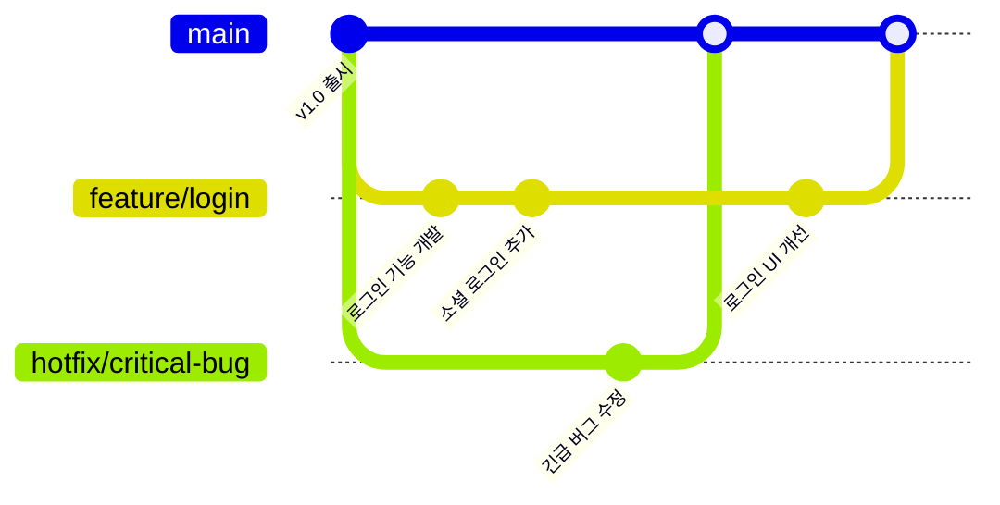
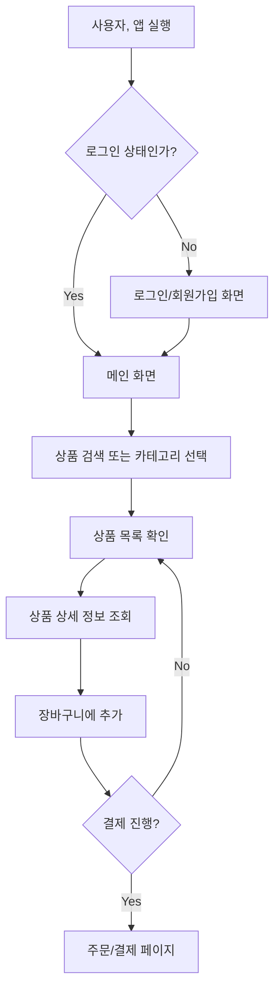

# 6. 현업에서의 용어와 개발 문화 💼

## 목차
- [6. 현업에서의 용어와 개발 문화 💼](#6-현업에서의-용어와-개발-문화-)
  - [목차](#목차)
  - [버전 관리 시스템: 협업과 안정성의 핵심, Git 🔄](#버전-관리-시스템-협업과-안정성의-핵심-git-)
  - [기획과 플로우차트: 아이디어를 현실로 만드는 설계도 📊](#기획과-플로우차트-아이디어를-현실로-만드는-설계도-)
  - [오픈소스: 공유와 협력의 개발 생태계 🌍](#오픈소스-공유와-협력의-개발-생태계-)
    - [주요 오픈소스 라이선스](#주요-오픈소스-라이선스)
  - [클라우드 컴퓨팅: 빌려 쓰는 고성능 컴퓨터 ☁️](#클라우드-컴퓨팅-빌려-쓰는-고성능-컴퓨터-️)
    - [클라우드 서비스 모델 (IaaS, PaaS, SaaS)](#클라우드-서비스-모델-iaas-paas-saas)
  - [SaaS (Software as a Service): 구독형 소프트웨어의 시대 📦](#saas-software-as-a-service-구독형-소프트웨어의-시대-)

---

## 버전 관리 시스템: 협업과 안정성의 핵심, Git 🔄

**버전 관리(Version Control)**  란 코드나 파일의 **변경 이력을 체계적으로 추적하고 관리**하는 시스템입니다. 이를 통해 개발자는 다음과 같은 핵심적인 가치를 얻습니다.

1.  **안전한 타임머신**: 코드에 문제가 생겼을 때, 언제든지 정상적으로 작동했던 과거의 특정 시점(버전)으로 코드를 되돌릴 수 있습니다.
2.  **효율적인 협업**: 여러 개발자가 **'브랜치(Branch)'** 라는 독립된 작업 공간에서 서로의 작업에 영향을 주지 않고 동시에 다른 기능을 개발할 수 있습니다. 개발이 완료되면 각자의 작업물을 '병합(Merge)'하여 하나의 결과물로 합칩니다.

이러한 버전 관리 시스템 중 전 세계 개발자들이 가장 널리 사용하는 도구가 바로 **Git**입니다.

*Git을 이용한 기능 개발 및 버그 수정 워크플로우 예시*

> **데이터 사이언티스트와 Git**: 데이터 분석 프로젝트에서 Git은 실험의 **재현성**을 보장하는 핵심 도구입니다. 어떤 데이터를 사용했고, 어떤 코드로 전처리했으며, 어떤 모델을 사용했는지 모든 과정을 Git으로 기록하면, 나중에 누가 보더라도 동일한 결과를 재현할 수 있습니다. Jupyter 노트북(`.ipynb`) 파일도 Git으로 버전 관리가 가능합니다.

---

## 기획과 플로우차트: 아이디어를 현실로 만드는 설계도 📊

모든 소프트웨어 개발은 '어떤 문제를 해결할 것인가'에 대한 **기획**에서 시작됩니다. **플로우차트(Flowchart)** 는 이 기획 단계에서 서비스의 작동 흐름이나 사용자의 이용 과정을 시각적으로 표현하는 **설계도**입니다.

플로우차트를 통해 개발자와 기획자는 서비스의 전체적인 로직을 한눈에 파악하고, 잠재적인 문제점이나 누락된 기능을 개발 착수 전에 발견하여 수정할 수 있습니다.

*온라인 쇼핑몰의 사용자 플로우차트 예시*

---

## 오픈소스: 공유와 협력의 개발 생태계 🌍

**오픈소스(Open Source)**  란 소스 코드가 대중에게 공개되어 누구나 자유롭게 사용, 수정, 배포할 수 있는 소프트웨어를 의미합니다. 오늘날 우리가 사용하는 대부분의 기술(Android, Linux, Python, TensorFlow 등)은 오픈소스에 기반하고 있습니다.

- **장점**: 개발 속도 향상, 비용 절감, 투명성, 커뮤니티를 통한 빠른 문제 해결
- **책임**: 오픈소스는 무료이지만, 사용 시 반드시 해당 소프트웨어의 **라이선스**를 확인하고 준수해야 할 의무가 있습니다.

### 주요 오픈소스 라이선스

| 라이선스 | 핵심 특징 | 의무 사항 | 데이터 사이언티스트와의 관련성 |
|---|---|---|---|
| **MIT** | **가장 허용적.** 거의 아무런 제약이 없음. | 저작권 표시 및 허가 전문 포함. | **Pandas, NumPy, Scikit-learn** 등 대부분의 핵심 Python 라이브러리가 사용. 가장 자유롭게 사용 가능. |
| **Apache 2.0** | MIT와 유사하나, **특허권** 관련 조항이 포함됨. | 수정한 파일에 대한 고지 필요. | **TensorFlow, Spark** 등 대규모 프로젝트에서 선호. 특허 문제로부터 비교적 자유로움. |
| **GPL** | **강력한 카피레프트(Copyleft).** GPL 코드를 사용한 2차 창작물은 **반드시 동일한 GPL 라이선스로 공개**해야 함. | 소스 코드 공개 의무. | 상업용 소프트웨어에 통합 시 비즈니스 모델과 충돌할 수 있어 사용에 각별한 주의가 필요. |

---

## 클라우드 컴퓨팅: 빌려 쓰는 고성능 컴퓨터 ☁️

**클라우드 컴퓨팅(Cloud Computing)**  이란 서버, 스토리지, 데이터베이스 같은 IT 인프라를 직접 소유하고 관리하는 대신, 인터넷을 통해 필요할 때마다 빌려 쓰고 사용한 만큼만 비용을 지불하는 서비스입니다.

> **데이터 사이언티스트와 클라우드**: 개인 컴퓨터의 성능 한계로 다루기 힘든 **대용량 데이터를 분석**하거나, 수십 개의 GPU를 동원하여 **복잡한 딥러닝 모델을 며칠씩 학습**시키는 일이 클라우드 덕분에 가능해졌습니다. (예: AWS S3, EC2, SageMaker / GCP GCS, GCE, Vertex AI)

### 클라우드 서비스 모델 (IaaS, PaaS, SaaS)

클라우드 서비스는 **'관리 책임의 범위'** 에 따라 크게 세 가지로 나뉩니다.

| 모델 | 내가 관리하는 것 | 클라우드 사업자가 관리하는 것 | 비유 | 대표 서비스 |
|---|---|---|---|---|
| **IaaS** (Infrastructure) | OS, 미들웨어, 애플리케이션, 데이터 | **서버, 스토리지, 네트워킹 (인프라)**  | **땅(부지)만 임대.** 건물은 내가 직접 설계하고 지어야 함. | AWS EC2, GCP Compute Engine |
| **PaaS** (Platform) | 애플리케이션, 데이터 | OS, 미들웨어, **인프라 (플랫폼)**  | **건물 뼈대까지 제공.** 나는 인테리어만 하면 됨. | Heroku, GCP App Engine |
| **SaaS** (Software) | (없음) | 애플리케이션, 데이터, **플랫폼, 인프라** | **가구까지 완비된 집.** 나는 몸만 들어가서 살면 됨. | Google Workspace, **Tableau Cloud** |

---

## SaaS (Software as a Service): 구독형 소프트웨어의 시대 📦

**SaaS**는 클라우드 서비스 모델의 하나로, 소프트웨어를 설치할 필요 없이 인터넷 브라우저를 통해 바로 사용할 수 있는 **구독형 서비스**입니다.

- **사용자 장점**: 초기 구매 비용 없음, 자동 업데이트, 어디서든 접근 가능.
- **기업 장점**: 안정적인 구독 수익, 쉬운 배포 및 유지보수.
- **대표 서비스**: Microsoft 365, Google Workspace, Slack, Jira, Salesforce 등.

> **데이터 사이언티스트와 SaaS**: **Tableau, Looker, Power BI** 같은 데이터 시각화 및 BI(Business Intelligence) 툴들이 대표적인 분석용 SaaS입니다. 데이터 사이언티스트는 이런 도구를 활용하여 분석 결과를 대시보드 형태로 만들어 현업 부서와 쉽게 공유하고 소통합니다.
