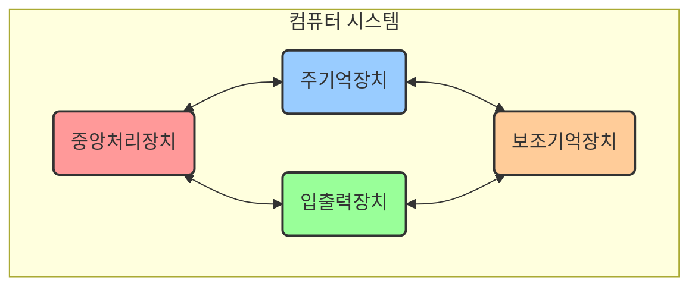
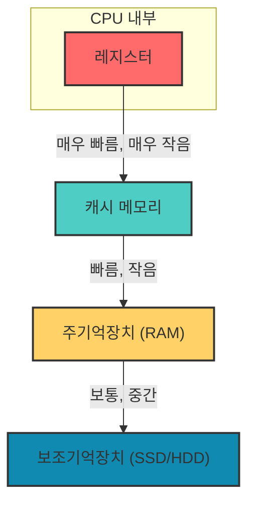

# 1. 컴퓨터 구조 🖥️

## 목차
- [1. 컴퓨터 구조 🖥️](#1-컴퓨터-구조-️)
  - [목차](#목차)
  - [컴퓨터 구조, 왜 알아야 하는가?](#컴퓨터-구조-왜-알아야-하는가)
  - [컴퓨터의 4대 핵심 구성요소](#컴퓨터의-4대-핵심-구성요소)
  - [CPU (중앙처리장치): 컴퓨터의 두뇌 🧠](#cpu-중앙처리장치-컴퓨터의-두뇌-)
    - [CPU의 성능 지표](#cpu의-성능-지표)
    - [CPU의 핵심 구성요소](#cpu의-핵심-구성요소)
  - [메모리 계층 구조: 빠르고 비싼 저장공간 vs. 느리고 값싼 저장공간 💾](#메모리-계층-구조-빠르고-비싼-저장공간-vs-느리고-값싼-저장공간-)
    - [주기억장치 (RAM): 프로그램의 작업대](#주기억장치-ram-프로그램의-작업대)
    - [보조기억장치 (SSD/HDD): 영구적인 데이터 창고](#보조기억장치-ssdhdd-영구적인-데이터-창고)
  - [메인보드와 버스: 데이터가 다니는 고속도로 🚌](#메인보드와-버스-데이터가-다니는-고속도로-)
  - [컴퓨터의 전체 동작 흐름 🔄](#컴퓨터의-전체-동작-흐름-)

---

## 컴퓨터 구조, 왜 알아야 하는가?

우리가 작성하는 코드는 결국 컴퓨터 하드웨어 위에서 실행됩니다. 컴퓨터의 구조를 이해하는 것은, 운동선수가 자신의 신체 능력을 이해하여 기록을 단축하는 것과 같습니다. 어떤 코드가 왜 더 빠르고 효율적인지, 대용량 데이터를 다룰 때 왜 메모리 부족 오류가 발생하는지 이해하려면 컴퓨터의 작동 원리를 알아야 합니다.

> **핵심**: 컴퓨터 구조에 대한 이해는 한정된 자원(CPU, 메모리)을 최대한 효율적으로 사용하는 코드를 작성하는 능력으로 이어집니다.

---

## 컴퓨터의 4대 핵심 구성요소

현대 컴퓨터는 대부분 폰 노이만 구조를 따르며, 크게 4가지 핵심 요소로 구성됩니다.

1.  **중앙처리장치 (CPU)** : 계산과 명령어 실행을 담당하는 '두뇌'.
2.  **주기억장치 (Memory, RAM)** : 실행할 프로그램과 데이터를 올려두는 '작업대'.
3.  **보조기억장치 (Storage)** : 프로그램과 데이터를 영구적으로 저장하는 '창고'.
4.  **입출력장치 (Input/Output)** : 사용자와 컴퓨터가 상호작용하는 '소통 창구'.

---

## CPU (중앙처리장치): 컴퓨터의 두뇌 🧠

CPU는 프로그램의 명령어를 해석하여 실행하고, 모든 계산을 처리하는 핵심 부품입니다.

### CPU의 성능 지표

| 요소 | 설명 | 높을수록 좋은 것 |
|---|---|---|
| **클럭 (Clock Speed)**  | 1초에 CPU가 몇 번의 신호를 처리하는지 나타내는 속도. (단위: GHz) | 단일 작업(Single-thread) 처리 속도 |
| **코어 (Core)**  | 실제로 연산을 수행하는 물리적인 회로의 수. | 여러 작업을 동시에 처리하는 능력 (병렬 처리) |
| **스레드 (Thread)**  | 코어가 동시에 처리할 수 있는 논리적인 작업 단위의 수. | 멀티태스킹 효율 |

> **데이터 사이언티스트와 코어**: 대용량 데이터 분석 시, 데이터를 여러 조각으로 나누어 여러 코어에서 동시에 처리하면 분석 시간을 획기적으로 줄일 수 있습니다.

### CPU의 핵심 구성요소

1.  **산술/논리 연산 장치 (ALU)** : 덧셈, 뺄셈 같은 산술 연산과 AND, OR 같은 논리 연산을 수행합니다.
2.  **제어 장치 (Control Unit)** : 메모리에서 명령어를 가져와 해독하고, CPU의 다른 부분에 적절한 제어 신호를 보내 전체 작업 흐름을 지휘합니다.
3.  **레지스터 (Registers)** : CPU 내부에 있는 **가장 빠른** 소량의 임시 메모리. 현재 처리 중인 명령어, 데이터, 주소 등을 잠시 보관합니다.
    - **프로그램 카운터 (PC)** : 다음에 실행할 명령어의 메모리 주소를 저장.
    - **명령어 레지스터 (IR)** : 현재 실행 중인 명령어를 저장.
    - 이 외에도 다양한 목적의 레지스터들이 존재.

---

## 메모리 계층 구조: 빠르고 비싼 저장공간 vs. 느리고 값싼 저장공간 💾

컴퓨터는 '빠르지만 비싸고 용량이 작은' 저장장치와 '느리지만 싸고 용량이 큰' 저장장치를 함께 사용하여 효율을 높입니다. 이를 **메모리 계층 구조(Memory Hierarchy)**  라고 합니다.

CPU는 가장 먼저 레지스터와 캐시에서 데이터를 찾습니다. 원하는 데이터가 없으면(Cache Miss) RAM으로, RAM에도 없으면 보조기억장치로 이동합니다. 아래 계층으로 갈수록 속도가 기하급수적으로 느려지기 때문에, **효율적인 프로그램은 CPU가 최대한 캐시와 RAM 안에서 작업할 수 있도록 만듭니다.**

### 주기억장치 (RAM): 프로그램의 작업대

**RAM(Random Access Memory)**  은 현재 실행 중인 프로그램과 그 프로그램이 사용하는 데이터를 임시로 저장하는 **휘발성(전원이 꺼지면 내용이 사라짐)**  메모리입니다. CPU는 보조기억장치에 있는 프로그램을 RAM으로 불러와(Loading) 실행합니다. RAM 용량이 클수록 더 많은 프로그램을 동시에 실행하거나 더 큰 데이터를 다룰 수 있습니다.

> **ROM(Read-Only Memory)**  은 주로 컴퓨터의 부팅 정보(BIOS) 등 지워지지 않아야 할 시스템 정보를 저장하는 비휘발성 메모리로, RAM과는 역할이 다릅니다.

### 보조기억장치 (SSD/HDD): 영구적인 데이터 창고

운영체제, 응용 프로그램, 그리고 우리의 소중한 파일들을 영구적으로 저장하는 **비휘발성** 저장장치입니다.
- **HDD (Hard Disk Drive)** : 자기 디스크를 물리적으로 회전시켜 데이터를 읽고 쓰는 방식으로, 속도가 느리지만 저렴하고 용량이 큽니다.
- **SSD (Solid State Drive)** : 반도체 칩에 데이터를 저장하여 물리적 움직임이 없어 매우 빠르지만, 상대적으로 비쌉니다.

---

## 메인보드와 버스: 데이터가 다니는 고속도로 🚌

CPU, RAM, SSD 등 컴퓨터의 모든 부품은 **메인보드(Mainboard)**  라는 커다란 회로 기판에 연결됩니다. 이 부품들은 **시스템 버스(System Bus)**  라는 공용 통신 경로를 통해 데이터를 주고받습니다.

시스템 버스는 역할에 따라 세 가지로 나뉩니다.
- **주소 버스 (Address Bus)** : CPU가 데이터를 읽거나 쓸 메모리 또는 장치의 '주소(위치)' 정보를 전달합니다.
- **데이터 버스 (Data Bus)** : 실제 '데이터'가 오고 가는 통로입니다.
- **제어 버스 (Control Bus)** : 읽기, 쓰기, 인터럽트 등 부품들의 동작을 제어하는 '신호'를 전달합니다.

---

## 컴퓨터의 전체 동작 흐름 🔄

1.  **입력**: 사용자가 키보드로 명령을 입력하면, 이 정보는 입출력장치를 통해 메모리에 전달됩니다.
2.  **가져오기 (Fetch)** : CPU의 제어 장치는 프로그램 카운터(PC)가 가리키는 메모리 주소에서 명령어를 가져옵니다.
3.  **해독 (Decode)** : 가져온 명령어를 해독하여 무엇을 해야 할지 파악합니다.
4.  **실행 (Execute)** : ALU가 실제 연산을 수행하고, 결과는 레지스터나 메모리에 저장됩니다.
5.  **출력**: 처리된 결과가 메모리를 거쳐 모니터나 스피커 같은 출력장치로 전달됩니다.

이 **Fetch-Decode-Execute** 사이클이 1초에 수십억 번씩 반복되면서 컴퓨터가 작동하는 것입니다.