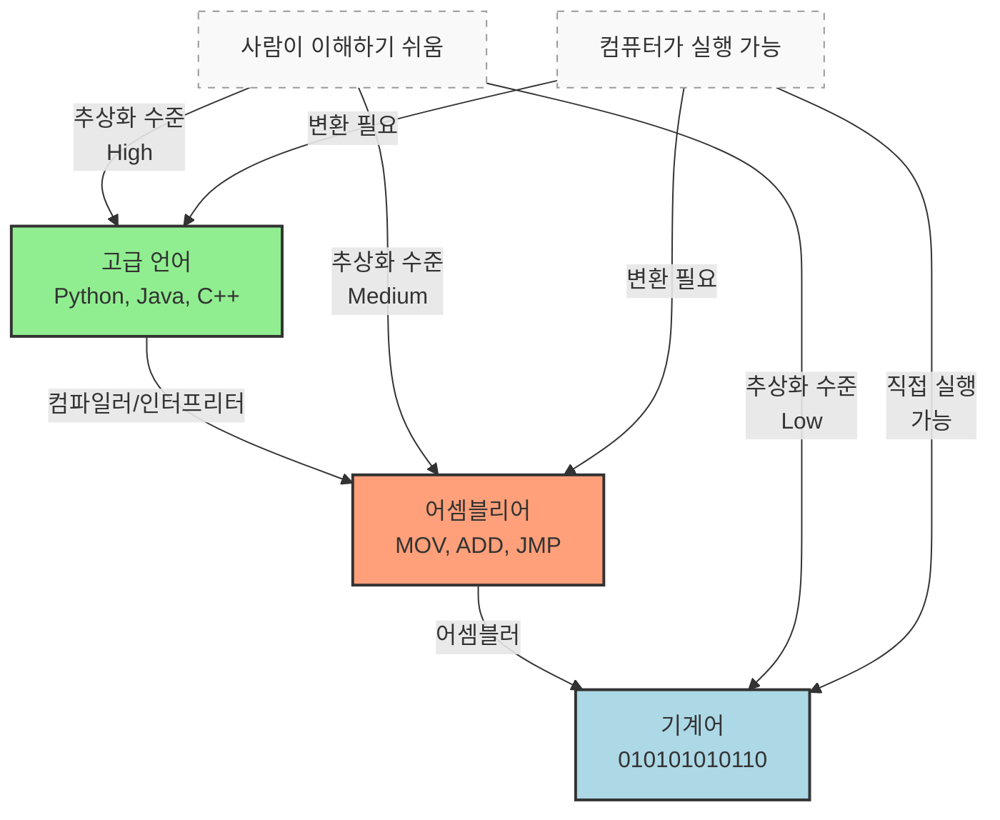
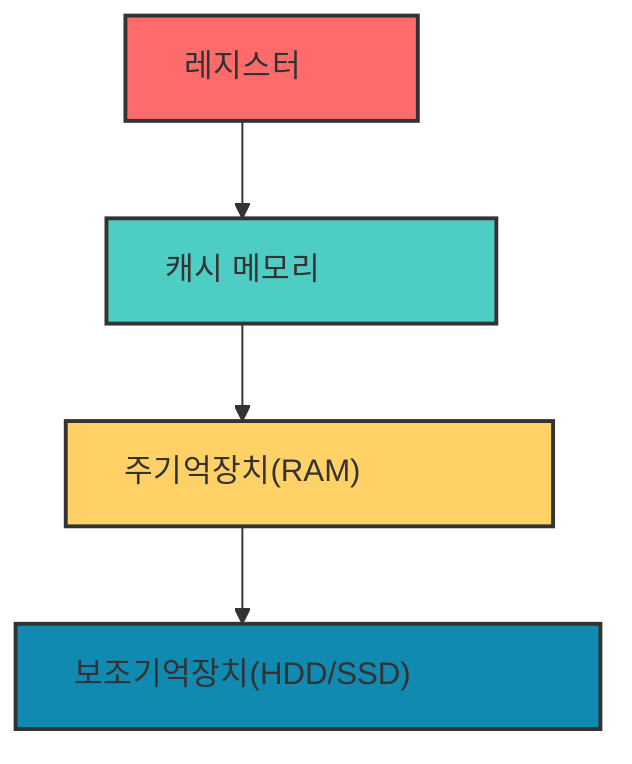
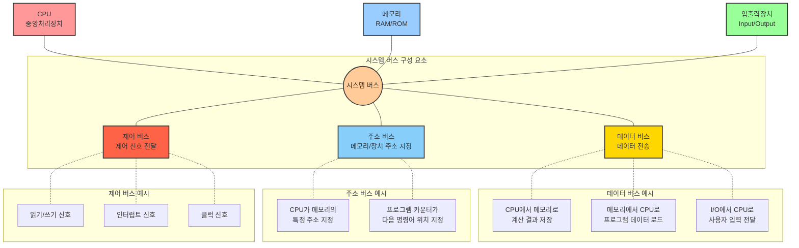
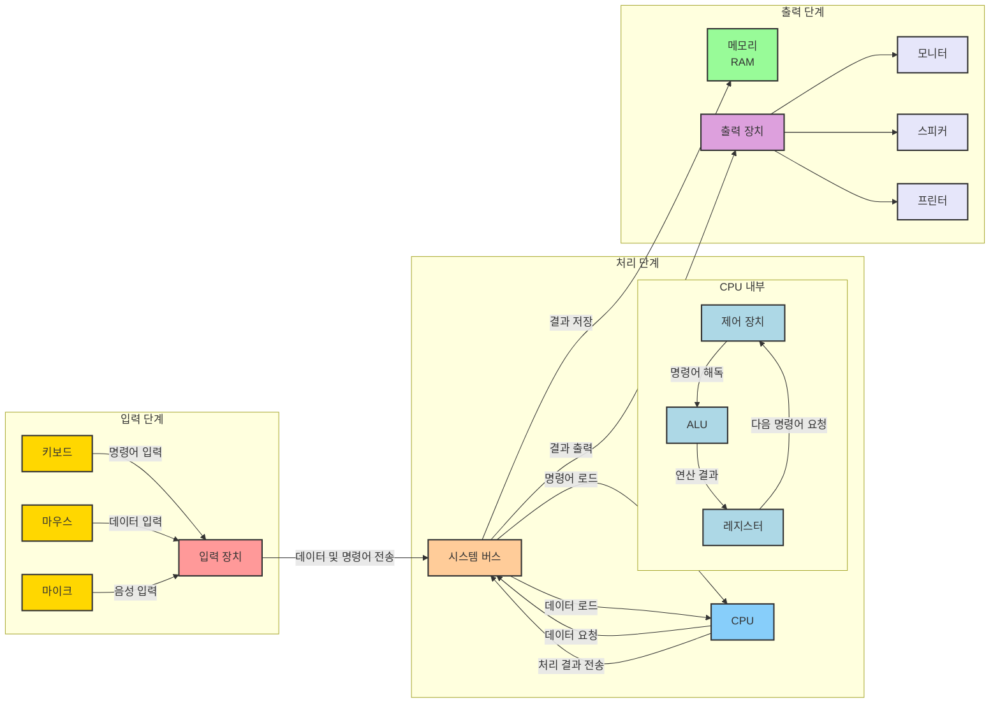

# 1. 컴퓨터 구조 🖥️

## 목차
- [1. 컴퓨터 구조 🖥️](#1-컴퓨터-구조-️)
  - [목차](#목차)
  - [컴퓨터 구조: 왜 알아야 할까? 🤔](#컴퓨터-구조-왜-알아야-할까-)
  - [컴퓨터 동작 방식: 명령어와 처리 구조 ⚙️](#컴퓨터-동작-방식-명령어와-처리-구조-️)
  - [데이터와 명령어: 기계어를 직접 작성하는 것은 어렵다 📝](#데이터와-명령어-기계어를-직접-작성하는-것은-어렵다-)
  - [메모리: 컴퓨터가 작업물을 기록하는 곳 💾](#메모리-컴퓨터가-작업물을-기록하는-곳-)
    - [컴퓨터의 구성 🧩](#컴퓨터의-구성-)
    - [메모리(Memory) 💿](#메모리memory-)
  - [CPU: 컴퓨터의 계산 능력을 담당하는 곳 🧮](#cpu-컴퓨터의-계산-능력을-담당하는-곳-)
    - [ALU (Arithmetic Logic Unit) 🔢](#alu-arithmetic-logic-unit-)
    - [Register 📊](#register-)
    - [Control Unit 🎮](#control-unit-)
  - [기타 장치: 입출력장치와 보조기억장치 🖱️](#기타-장치-입출력장치와-보조기억장치-️)
    - [입출력장치 🖥️](#입출력장치-️)
    - [보조기억장치 💽](#보조기억장치-)
  - [컴퓨터 동작 흐름 🔄](#컴퓨터-동작-흐름-)
    - [1. 시스템 버스 🚌](#1-시스템-버스-)
    - [2. 메인보드 🔌](#2-메인보드-)
    - [3. 동작 흐름 요약 📋](#3-동작-흐름-요약-)
    - [CPU의 동작 흐름 ⏱️](#cpu의-동작-흐름-️)

---

## 컴퓨터 구조: 왜 알아야 할까? 🤔

우리가 컴퓨터에 대해 알아야 하는 근본적인 이유는 우리가 **컴퓨터를 통해 코드를 작성**하기 때문이다. 

예를 들어 운동을 할때 아무것도 모른 채 동작을 따라할 수 있지만 그것이 효율적이지 않으며, 우리의 몸에 대해 이해하고 있어야 운동을 효율적으로 할 수 있는 것과 같다. 마찬가지로 코드를 작성하는 컴퓨터 환경에 대해 이해하고 있어야 효과적인 코드를 작성할 수 있다.

> 💡 **알아두면 좋은 팁**: **데스크탑, 노트북, 스마트폰, 웹, 클라우드 등 다양한 환경**에서 코드가 동작한다. 이러한 환경을 이해하고 있어야 코드를 효율적으로 작성할 수 있다.

---

## 컴퓨터 동작 방식: 명령어와 처리 구조 ⚙️

컴퓨터(Compute + r)는 조어 방식에서도 알 수 있듯이 **계산(Compute)를 해 주는 기계**로 시작했다. 컴퓨터의 종류로 데스크탑 컴퓨터와 같이 우리가 생각하는 전형적인 컴퓨터나, 스마트폰과 같은 핸드헬드 컴퓨터, 아두이노와 같은 임베디드 컴퓨터, 서버 등에서 사용하는 서버 컴퓨터 등이 있다. 

컴퓨터는 근본적으로 **명령어**를 입력하면 데이터가 처리되고, 명령어를 입력하는데에는 마우스, 키보드 등의 고전적인 입력 장치에서부터 음성 인식을 통해 명령어를 입력하는 등 마이크도 입력 장치가 될 수 있다.

---

## 데이터와 명령어: 기계어를 직접 작성하는 것은 어렵다 📝

컴퓨터는 기본적으로 데이터와 명령어로 동작한다. 컴퓨터는 [IT 리터러시](../IT%20리터러시/1.%20컴퓨터의%20이해.md#컴퓨터는-기계어로-소통한다-)에서 다루었듯이 0과 1로 이루어진 이진수로 데이터를 처리할 수 있다.

하지만 이런 **기계어를 직접적으로 작성**하는 것이 어렵기 때문에 기계어와 1:1 대응이 되는 어셈블리어를 사용하는데, 어셈블리어를 기계어로 번역해주는 것을 **어셈블러**라고 한다.

더 나아가 고급 언어의 경우 사람이 이해하기 쉽게 작성된 프로그래밍 언어로, 이를 **컴파일러**나 **인터프리터**를 통해 기계어로 번역해준다.

다음은 기계어, 어셈블리어, 고급 언어의 관계를 나타낸 도표이다:

---

## 메모리: 컴퓨터가 작업물을 기록하는 곳 💾

### 컴퓨터의 구성 🧩

컴퓨터를 구성하는 핵심 부품은 대개 CPU, 주기억장치, 보조기억장치, 입출력장치이다.

### 메모리(Memory) 💿

메모리는 **데이터 저장 및 읽기, 작업 속도 향상, 프로그램 실행** 등의 다양한 역할을 하고 속도와 용량에 따라 다양한 종류가 있다.

*해당 피라미드에서 가장 위일수록 빠르고 용량이 작고 가격이 비싸고, 가장 아래일수록 느리고 용량이 크고 가격이 저렴하다.*

**캐시 메모리**는 CPU 내부에 위치하며, CPU가 빠르게 데이터를 읽고 쓸 수 있도록 도와준다. 주로 자주 읽고 쓰는 데이터를 잠시 보관하는데 사용하는 아주 빠른 임시 메모리이다.(레지스터보다는 느리지만 더 많은 데이터를 사용할 수 있다)

**주기억장치**는 현재 실행되고 있는 데이터와 명령어를 저장하는 역할을 한다. 주기억장치는 **RAM(Random Access Memory)**과 **ROM(Read-Only Memory)**으로 나뉘는데, 주로 RAM이 사용자가 작업 중인 데이터를 저장하는 데 사용된다.

| 특성 | ROM (Read-Only Memory) | RAM (Random Access Memory) |
|------|------------------------|----------------------------|
| **데이터 보존** | 전원이 꺼져도 데이터 유지 (비휘발성) | 전원이 꺼지면 데이터 소실 (휘발성) |
| **읽기/쓰기** | 주로 읽기 전용 (일부 유형은 제한된 쓰기 가능) | 자유로운 읽기/쓰기 가능 |
| **접근 속도** | 상대적으로 느림 | 빠름 |
| **가격/용량** | 용량 대비 비쌈 | ROM보다 저렴함 |
| **사용 예시** | BIOS 설정, 게임 카트리지, 내장 펌웨어 | 작업 중인 문서, 실행 중인 앱, 게임 등 |

흔히 후자의 **RAM**이 컴퓨터가 주로 액세스하는 **메모리**인데, 컴퓨터는 메모리에 저장된 데이터를 주소를 참조해서 데이터를 식별한다.(ex. 0x0000, 0x0001, 0x0002...)

RAM의 성능은 **클럭 속도, 용량, 대역폭**에 의해 결정되는데, 클럭 속도가 높을수록 데이터 전송 속도가 빨라지고, 용량이 클수록 많은 데이터를 저장할 수 있다. 대역폭은 한 번에 전송할 수 있는 데이터의 양을 의미한다.

메모리의 활용 예시로는 데이터 분석이나 AI분야, 게임, 그래픽 작업, 심지어 서버 컴퓨터 등이 있다.

> 📢 **주의**: 메모리는 좁은 의미로는 RAM, 넓은 의미로는 데이터를 저장하는 모든 장치를 의미한다. 맥락에 따라 어떤 의미로 사용했는지 잘 파악하자.

---

## CPU: 컴퓨터의 계산 능력을 담당하는 곳 🧮

CPU는 Central Processing Unit의 약자로, 컴퓨터의 두뇌 중에서도 계산하는 영역을 담당한다. 프로그램의 명령어를 해석 및 실행하고, 덧셈 및 뺄셈이나 논리 연산도 수행하고, 데이터 전송 역할도 한다.

클럭과 코어가, 스레드 수가 성능을 결정하며, CPU는 **산술-논리 연산 장치(ALU), 레지스터(Register), 제어 장치(Control Unit)** 로 구성되어 있다.

| 요소 | 설명 | 영향 | 단위/예시 |
|------|------|------|-----------|
| **클럭 (Clock)** | CPU가 작업을 수행하는 속도의 기본 단위 | 높을수록 단일 스레드 성능 향상 | GHz (2.5GHz, 3.8GHz) |
| **코어 (Core)** | CPU 내 독립적으로 작업을 처리하는 물리적 처리 단위 | 많을수록 병렬 처리 능력 향상 | 싱글, 듀얼, 쿼드, 옥타 코어 등 |
| **스레드 (Thread)** | 코어가 동시에 처리할 수 있는 명령어 흐름 | 많을수록 다중 작업 처리 능력 향상 | 하이퍼스레딩(Intel), SMT(AMD) |

### ALU (Arithmetic Logic Unit) 🔢

ALU는 다양한 산술 연산을 계산하는 디지털 회로이다. 논리 회로로 구성된 다양한 연산 장치가 있는데, 예를 들어:
1. **가산기(Adder)**: 덧셈 연산을 수행함
2. **보수기(Complementer)**: 2의 보수를 계산함

### Register 📊

레지스터는 크게 다음과 같이 구성되어 있다:

1. **상태 레지스터(Status Register)**: 연산 결과 나오는 오버플로우, 부호, 캐리 등의 상태를 저장한다.

2. **인덱스 레지스터(Index Register)**: 메모리 주소를 저장하고, 이를 통해 메모리에 접근한다.

3. **명령어 레지스터(Instruction Register)**: 현재 실행 중인 명령어를 저장한다.

4. **메모리 주소 레지스터(Memory Address Register)**: 기억장치에 저장된 데이터의 주소를 임시로 저장

5. **메모리 버퍼 레지스터(Memory Buffer Register)**: 기억장치에 저장된 데이터 자체를 임시로 저장

6. **프로그램 카운터(Program Counter)**: 다음에 실행할 명령어의 주소를 저장한다.

7. **누산기(Accumulator)**: 연산 결과를 임시로 저장하는 특수 레지스터이다.

> 📚 **읽어보기**: [What are Registers in CPU – Types | Function | Components](https://www.theiotacademy.co/blog/registers-in-cpu/)

### Control Unit 🎮

제어 장치는 처리할 명령어를 해독 및 실행하며 CPU의 전체적인 흐름을 제어한다.
구성 요소로는:

1. **디코더(Decoder)**: 명령어 레지스터로부터 명령어를 받아 해독한다.

2. **제어 신호 생성기(Control Signal Generator)**: 해독된 명령어에 따라 CPU 내 다른 부분에 제어 신호를 전송한다.

---

## 기타 장치: 입출력장치와 보조기억장치 🖱️

### 입출력장치 🖥️

입출력장치는 컴퓨터와 사용자 또는 다른 장치 간의 데이터를 주고받는 장치이다. 데이터를 주고받을수만 있다면 무엇이든 입출력장치가 될 수 있다—**고전적인 키보드랑 마우스부터, 마이크나 터치 스크린 등.** 여기서 사용자의 데이터와 명령어를 컴퓨터에 전달하면 **입력 장치**, 컴퓨터가 사용자에게 결과를 보여주면 **출력 장치**라고 한다.

### 보조기억장치 💽

주기억장치의 경우 전원이 꺼지면 데이터가 소실되거나 한번 작성한 내용을 쉽게 수정할 수 없는 단점이 있다. 이를 보완하기 위해 **보조기억장치**를 사용하는데, 용량이 크고 주기억장치에 비해 상대적으로 저렴하지만 속도가 느리다는 특징이 있다.

보조기억장치의 예시:
| 보조기억장치 유형 | 특징 | 속도 | 일반적 용량 | 주요 용도 |
|----------------|------|------|-----------|----------|
| **HDD (Hard Disk Drive)** | 회전하는 자기 플래터에 데이터 저장 | 느림 (100~150MB/s) | 1TB~18TB | 대용량 데이터 저장, 백업 |
| **SSD (Solid State Drive)** | 반도체 기반 저장 장치, 물리적 움직임 없음 | 빠름 (500MB/s~7GB/s) | 250GB~8TB | 운영체제, 자주 사용하는 프로그램, 게임 |
| **USB 플래시 드라이브** | 휴대 가능한 작은 저장 장치 | 보통 (40MB/s~400MB/s) | 8GB~1TB | 파일 이동, 휴대용 저장 |
| **SD 카드** | 작은 폼팩터의 메모리 카드 | 다양함 (클래스에 따라 10MB/s~300MB/s) | 2GB~1TB | 카메라, 스마트폰, 휴대용 기기 |

---

## 컴퓨터 동작 흐름 🔄

### 1. 시스템 버스 🚌

시스템 버스는 컴퓨터 시스템 내에서 신호를 전송하는 경로로, CPU/메모리/입출력장치 등 모든 장치가 시스템 버스를 통해 데이터를 주고받는다.

그 작동원리를 대략적으로 도표로 나타내면, 다음과 같다:

### 2. 메인보드 🔌

컴퓨터 장치들은 메인보드에 있는 **시스템 버스**를 통해 서로 연결되어있다. 시스템 버스는 **주소 버스, 데이터 버스, 제어 버스**로 구성되어 있으며, 각각 메모리 위치 지정, 실제 데이터 전송, 신호 제어를 담당한다. 메인보드에는 이외에도 PCIe, SATA 등 다양한 버스 구조가 존재하지만, 기본적으로 이 세 가지 버스 구성은 모든 컴퓨터 시스템에 필수적이다.

### 3. 동작 흐름 요약 📋

컴퓨터의 기본적인 동작 흐름은 다음과 같습니다:

1. **입력 단계**: 입력 장치로 데이터와 명령어를 입력받음
2. **처리 단계**: CPU에서 레지스터/ALU가 명령어를 처리
3. **출력 단계**: 처리된 결과를 메모리에 저장하거나 출력 장치를 통해 출력

### CPU의 동작 흐름 ⏱️

CPU는 **Fetch-Decode-Execute** 사이클을 반복하며 동작합니다:

1. **Fetch(가져오기)**: 프로그램 카운터(PC)에 저장된 주소에서 다음 명령어를 메모리로부터 가져와 명령어 레지스터(IR)에 저장
   
2. **Decode(해독)**: 명령어를 해독하고 실행할 동작을 결정, 명령어는 opcode(연산 코드)와 operand(피연산자)로 분리
   
3. **Execute(실행)**: 명령어를 실행하고 실제 작업을 수행(계산 수행, 데이터 저장, 다른 메모리 위치에서 데이터 가져오기 등)

> 📚 **심화 학습**: [The fetch-decode-execute cycle](https://www.bbc.co.uk/bitesize/guides/zbfny4j/revision/5)에서 CPU 동작 사이클에 대해 더 자세히 알아보세요!
