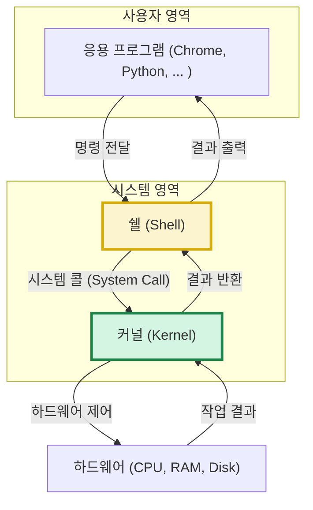

# 2. 운영체제 🖥️

## 목차
- [2. 운영체제 🖥️](#2-운영체제-️)
  - [목차](#목차)
  - [운영체제: 컴퓨터의 총지휘자](#운영체제-컴퓨터의-총지휘자)
  - [프로세스와 스레드: 일과 일꾼의 차이 ⚙️](#프로세스와-스레드-일과-일꾼의-차이-️)
    - [프로세스 (Process): 독립된 작업 공간](#프로세스-process-독립된-작업-공간)
    - [스레드 (Thread): 자원을 공유하는 일꾼](#스레드-thread-자원을-공유하는-일꾼)
  - [운영체제의 핵심 역할](#운영체제의-핵심-역할)
  - [운영체제의 심장과 입: 커널과 쉘](#운영체제의-심장과-입-커널과-쉘)
    - [커널 (Kernel): 모든 것을 통제하는 핵심 🧠](#커널-kernel-모든-것을-통제하는-핵심-)
    - [쉘 (Shell): 사용자와 커널을 잇는 통역가 🐚](#쉘-shell-사용자와-커널을-잇는-통역가-)
  - [왜 리눅스를 배워야 하는가? 🐧](#왜-리눅스를-배워야-하는가-)
  - [리눅스와의 첫 만남: GUI와 CLI](#리눅스와의-첫-만남-gui와-cli)

---

## 운영체제: 컴퓨터의 총지휘자

**운영체제(Operating System, OS)**  는 컴퓨터 하드웨어(CPU, RAM 등)와 사용자 사이에서, 한정된 컴퓨터 자원을 **효율적이고 안전하게 관리**하고, 사용자가 컴퓨터를 편리하게 사용할 수 있도록 돕는 **핵심 시스템 소프트웨어**입니다.

우리가 컴퓨터를 켜면 가장 먼저 만나는 Windows, macOS, Linux, Android, iOS가 모두 운영체제입니다. 운영체제가 없다면 우리는 컴퓨터의 모든 부품을 직접 제어하며 프로그램을 실행해야 할 것입니다.

| 구분 | 응용 소프트웨어 (Application) | 시스템 소프트웨어 (System) |
|---|---|---|
| **역할** | 사용자의 특정 목적 수행 (문서 작성, 웹 서핑) | 하드웨어 제어 및 응용 프로그램 실행 환경 제공 |
| **예시** | MS Word, Chrome, Photoshop | **Windows, Linux (운영체제)** , 디바이스 드라이버 |

> 한정된 컴퓨팅 자원을 효율적으로 사용하는 것은 컴퓨터 과학의 핵심 과제이기도 합니다.

---

## 프로세스와 스레드: 일과 일꾼의 차이 ⚙️

운영체제를 이해하려면 프로그램이 실행되는 기본 단위인 프로세스와 스레드를 알아야 합니다.

### 프로세스 (Process): 독립된 작업 공간

**프로세스**는 **실행 중인 프로그램의 인스턴스(instance)**  입니다. 사용자가 프로그램을 실행하면, 운영체제는 해당 프로그램을 위한 **독립적인 메모리 공간(코드, 데이터, 힙, 스택)**  을 할당해주는데, 이 독립된 실행 단위를 프로세스라고 합니다.

- **비유**: 프로세스는 각자의 주방, 요리사, 재료를 모두 갖춘 **독립된 식당**과 같습니다.
- **특징**: 각 프로세스는 서로의 메모리 공간에 직접 접근할 수 없어 안정적이지만, 그만큼 생성 비용이 비싸고 프로세스 간 데이터 공유가 복잡합니다. (프로세스 간 통신, IPC 필요)

### 스레드 (Thread): 자원을 공유하는 일꾼

**스레드**는 **프로세스 내에서 실행되는 작업의 흐름 단위**입니다. 하나의 프로세스는 여러 개의 스레드를 가질 수 있으며(멀티스레딩), 이 스레드들은 프로세스의 메모리 공간(코드, 데이터, 힙 영역)을 **공유**합니다.

- **비유**: 스레드는 하나의 식당(프로세스)에서 **같은 주방과 재료(메모리)를 공유하며 일하는 여러 명의 요리사**와 같습니다.
- **특징**: 자원을 공유하므로 생성 속도가 빠르고 스레드 간 통신이 용이하지만, 여러 스레드가 동시에 같은 자원에 접근하려 할 때 **동기화 문제**가 발생할 수 있습니다.

> **핵심 차이**: **'독립된 메모리 공간을 갖는가(프로세스)'** vs **'메모리를 공유하는가(스레드)'**

---

## 운영체제의 핵심 역할

1.  **자원 관리**: CPU 시간을 어떤 프로세스에 할당할지(스케줄링), 한정된 메모리를 어떻게 나눌지, 어떤 파일에 누가 접근할 수 있는지 등 모든 컴퓨터 자원을 관리하고 통제합니다.
2.  **프로세스 및 스레드 관리**: 프로세스와 스레드를 생성, 실행, 제어하고 이들 간의 통신과 동기화를 관리합니다.
3.  **추상화**: 복잡한 하드웨어(그래픽카드, 네트워크 카드 등)를 직접 제어하는 방법을 몰라도, 운영체제가 제공하는 간단한 인터페이스(API, 시스템 콜)를 통해 쉽게 사용할 수 있도록 '추상화된' 기능을 제공합니다.

> **동기화 문제란?**: 여러 스레드가 은행 계좌 잔액(공유 자원)에 동시에 접근하여 한쪽은 입금하고 다른 쪽은 출금하려 할 때, 계산이 꼬여 최종 잔액이 틀어지는 것과 같은 문제입니다. 운영체제는 이런 문제를 막기 위해 한 번에 하나의 스레드만 자원에 접근하도록 순서를 정해주는 **상호 배제(Mutex)** , **세마포어(Semaphore)**  등의 동기화 기법을 제공합니다.

---

## 운영체제의 심장과 입: 커널과 쉘

운영체제는 크게 커널과 쉘이라는 두 가지 핵심 요소로 구성됩니다.

### 커널 (Kernel): 모든 것을 통제하는 핵심 🧠

**커널**은 운영체제의 **심장**입니다. 하드웨어를 직접 제어하고 시스템의 모든 자원을 관리하는 핵심 코드의 집합체입니다. 프로세스 관리, 메모리 관리, 동기화 등 운영체제의 모든 핵심 기능은 커널에 의해 수행됩니다. 보안을 위해 사용자는 커널에 직접 접근할 수 없습니다.

### 쉘 (Shell): 사용자와 커널을 잇는 통역가 🐚

**쉘**은 사용자와 커널 사이의 **인터페이스(명령어 해석기)**  입니다. 사용자가 `ls`나 `dir` 같은 명령어를 입력하면, 쉘은 이 명령어를 해석하여 커널이 알아들을 수 있는 형태로 전달하고, 커널로부터 받은 실행 결과를 다시 사용자에게 보여주는 '통역가' 역할을 합니다.

> **시스템 콜 (System Call)** : 쉘이나 응용 프로그램이 파일 생성, 네트워크 통신 등 커널의 기능이 필요할 때, 커널에게 서비스를 요청하는 공식적인 통로입니다.

---

## 왜 리눅스를 배워야 하는가? 🐧

데이터 분석과 머신러닝 모델 개발 및 배포는 대부분 개인 PC가 아닌, 고성능의 원격 **서버**나 **클라우드** 환경에서 이루어집니다. 그리고 이 서버/클라우드 시장의 **절대다수는 리눅스(Linux)**  운영체제를 사용합니다.

- **오픈소스 및 무료**: 라이선스 비용 없이 자유롭게 사용하고 수정할 수 있습니다.
- **안정성과 성능**: 수많은 개발자가 검증하여 매우 안정적이고, 시스템 자원을 효율적으로 사용합니다.
- **강력한 CLI**: 터미널을 통한 강력한 명령어 제어는 원격 작업과 자동화에 필수적입니다.

> **결론**: 데이터 사이언티스트에게 리눅스 명령어는 선택이 아닌 **필수 역량**입니다.

---

## 리눅스와의 첫 만남: GUI와 CLI

- **GUI (Graphical User Interface)** : 우리가 흔히 아는 Windows나 macOS처럼 아이콘과 마우스를 통해 직관적으로 컴퓨터를 조작하는 환경입니다.
- **CLI (Command Line Interface)** : 검은 화면의 터미널에 텍스트 명령어를 직접 입력하여 컴퓨터를 조작하는 환경입니다.

서버 환경에서는 리소스를 아끼기 위해 GUI 없이 CLI만으로 작업하는 경우가 대부분입니다. 따라서 데이터 사이언티스트는 CLI 환경에 익숙해져야 합니다.

> **Windows에서 리눅스 사용하기**: **WSL(Windows Subsystem for Linux)**  을 설치하면 Windows 환경에서도 가상머신 없이 완벽한 리눅스 CLI 환경을 사용할 수 있습니다.
