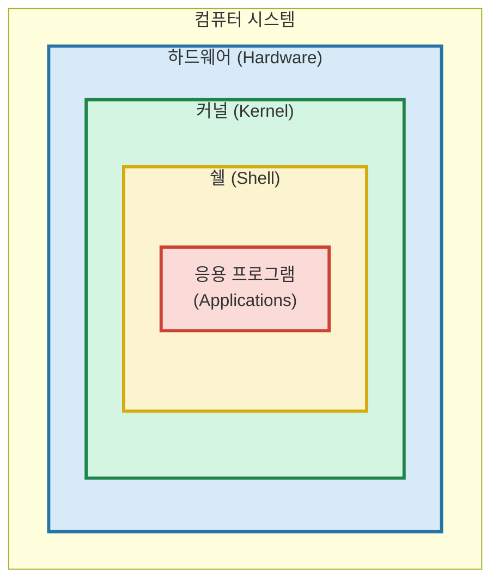
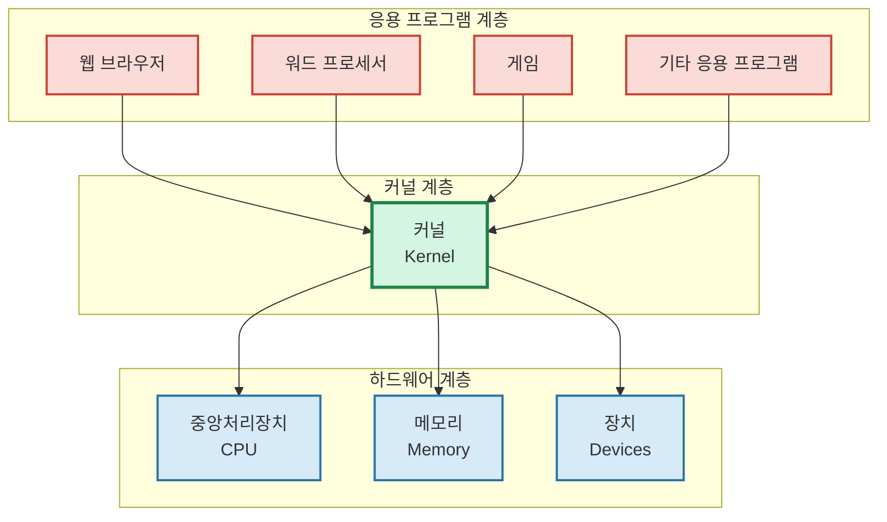
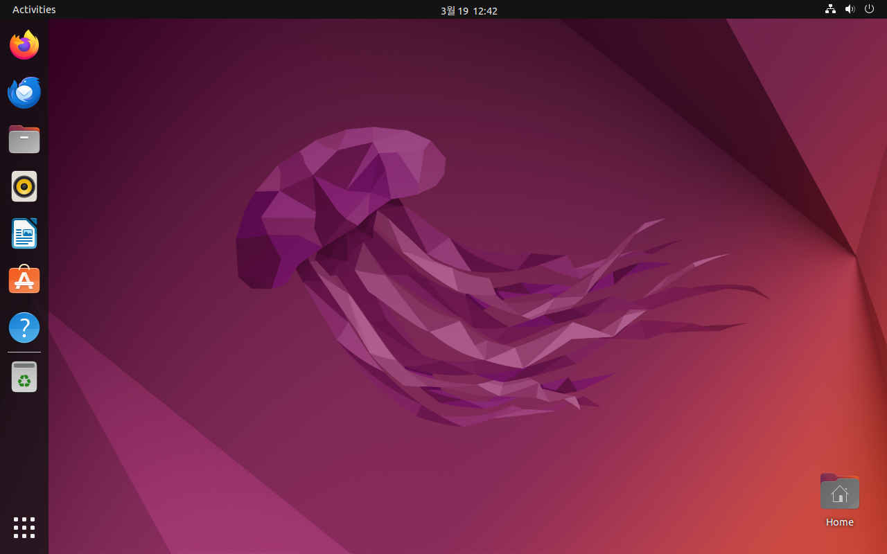
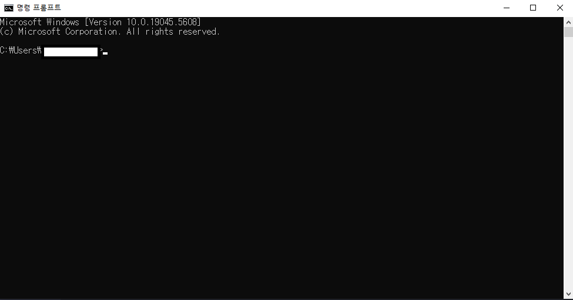
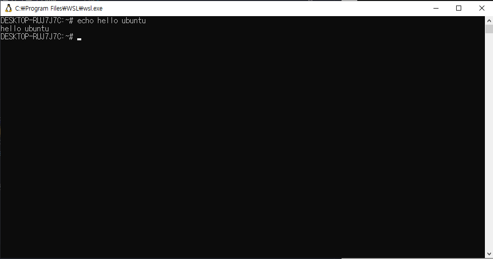

# 2. 운영체제 🖥️

## 목차
- [2. 운영체제 🖥️](#2-운영체제-️)
  - [목차](#목차)
  - [운영체제: 운영체제가 무엇일까? 🔍](#운영체제-운영체제가-무엇일까-)
    - [응용 소프트웨어 vs 시스템 소프트웨어 전격비교 📊](#응용-소프트웨어-vs-시스템-소프트웨어-전격비교-)
  - [프로세스와 스레드: 프로세스와 스레드의 차이점은? ⚙️](#프로세스와-스레드-프로세스와-스레드의-차이점은-️)
  - [운영체제의 역할: 컴퓨터의 규칙을 잡아라 📏](#운영체제의-역할-컴퓨터의-규칙을-잡아라-)
  - [커널과 쉘: 운영체제의 핵심 🧠](#커널과-쉘-운영체제의-핵심-)
    - [커널 (Kernel) 🌰](#커널-kernel-)
    - [쉘 (Shell) 🐚](#쉘-shell-)
    - [동기화 문제 🔄](#동기화-문제-)
    - [권한 레벨(Privilege Level/Protection Ring) 🛡️](#권한-레벨privilege-levelprotection-ring-️)
  - [리눅스: 개발 서버로 가장 많이 사용되는 오픈소스 운영체제 🐧](#리눅스-개발-서버로-가장-많이-사용되는-오픈소스-운영체제-)
    - [운영체제를 왜 배울까? 🤔](#운영체제를-왜-배울까-)
    - [그 중에서도 왜 리눅스? 🔍](#그-중에서도-왜-리눅스-)
  - [리눅스: 직접 사용해보자! 💻](#리눅스-직접-사용해보자-)
    - [리눅스 명령어 실습해보기 📋](#리눅스-명령어-실습해보기-)

---

## 운영체제: 운영체제가 무엇일까? 🔍

컴퓨터는 **하드웨어**와 **소프트웨어**로 이루어져 있다. 하드웨어는 컴퓨터를 구성하는 모든 물리적 부품이고, 소프트웨어는 컴퓨터 시스템에서 작동하는 프로그램 전반을 일컫는다.

**운영체제 또한 소프트웨어이다.** 다만 일반적인 소프트웨어와 성격이 조금 달라 하드웨어와 소프트웨어를 관리하고 제어하는 일종의 메타-소프트웨어라 볼 수 있다. 다른 말로, 컴퓨터의 **자원(Resource)을 효율적으로 관리**해주는 프로그램이다.

> 💡 **참고**: 자원은 컴퓨터가 동작하기 위해 필요한 모든 것으로, CPU나 RAM 등이 포함될 수 있고 대체로 시스템 내에 존재하는 물리적인 부품으로 표현된다. **작업 관리자**를 켜면 주요 컴퓨터 자원의 사용량을 확인할 수 있다.

### 응용 소프트웨어 vs 시스템 소프트웨어 전격비교 📊

| 특성 | 응용 소프트웨어 (Application Software) | 시스템 소프트웨어 (System Software) |
|------|-------------------------------------|----------------------------------|
| **정의** | 특정 작업이나 사용자 목적을 수행하기 위한 소프트웨어 | 하드웨어를 관리하고 응용 프로그램을 지원하는 소프트웨어 |
| **목적** | 사용자의 특정 문제 해결 및 작업 수행 | 컴퓨터 시스템의 기본 기능 제공 및 하드웨어 관리 |
| **하드웨어 의존성** | 낮음 (다양한 플랫폼에서 실행 가능) | 높음 (특정 하드웨어와 밀접하게 연결) |
| **사례** | • 워드 프로세서 (MS Word, 한글)<br>• 웹 브라우저 (Chrome, Firefox) | • 운영체제 (Windows, macOS, Linux)<br>• 디바이스 드라이버 |
| **리소스 접근** | 제한된 시스템 리소스 접근 | 모든 시스템 리소스에 직접 접근 가능 |
| **고장 시 영향** | 해당 프로그램만 영향 받음 | 전체 시스템 작동에 영향 |

---

## 프로세스와 스레드: 프로세스와 스레드의 차이점은? ⚙️

프로세스와 스레드에 대해 말하기 전에, 프로그램이란 명령어가 실행되는 순서의 집합이다. 이 프로그램으로부터 자원을 할당 받아 실행되는 것이 **프로세스**이며, 프로세스 내에서 실행되는 흐름(작업)의 단위가 **스레드**이다. 프로세스와 스레드는 단독 혹은 여러개가 동시에 실행될 수 있으며, **단독/여러개**의 여부에 따라 **싱글/멀티** 프로세스/스레드로 구분된다.

> 📌 **요약**: 프로세스는 컴퓨터에서 실행되고 있는 컴퓨터 프로그램, 스레드는 프로세스 내에서 실행되는 흐름의 단위!


---

## 운영체제의 역할: 컴퓨터의 규칙을 잡아라 📏

운영체제는 컴퓨터의 자원을 효율적으로 관리하고 사용자와 하드웨어 사이의 인터페이스 역할을 한다. 운영체제가 수행하는 역할은 굉장히 많지만, 주된 역할은 다음과 같다:

1. **메모리 관리**: 프로그램이 실행될 때 메모리를 할당하고, 프로그램이 종료되면 메모리를 회수한다.
2. **가상 메모리**: 보조기억장치의 일부를 실제 메모리처럼 활용하거나 프로그램이 실행되는 부분만 메모리에 저장해 물리적 메모리 크기보다 더 큰 프로그램을 실행하게 해준다.
3. **프로세스 관리**: 프로세스가 실행되는 순서를 프로세스 스케줄링으로 관리한다.(멀티태스킹 실현)

이 외에도
**네트워크 자원에 대한 관리**, **파일 시스템 관리**, **입출력 작업 관리**, **보안 및 인증**등의 기능 또한 수행한다.


---

## 커널과 쉘: 운영체제의 핵심 🧠



운영체제는 Application-Shell-Kernel-Hardware 구조를 따른다고 한다. 어플리케이션과 하드웨어는 많이 들어봐서 알고 있겠지만... **커널**과 **쉘**은 무엇일까?

### 커널 (Kernel) 🌰

커널은 하드웨어(CPU, Memory, Devices)와 소프트웨어(Applications) 간의 인터페이스로, 프로세스 스케줄링, 메모리 관리, 입출력 제어 등의 운영체제 핵심 기능을 담당한다.



*커널과 응용 프로그램, 하드웨어간의 관계도*

### 쉘 (Shell) 🐚

쉘은 **커널과 사용자 간의 인터페이스**로, 사용자가 입력한 명령어를 해석해 커널에 전달하고, 커널이 실행한 결과는 사용자에게 출력하는 역할을 한다.


*그림 1: 쉘의 예시인 Microsoft PowerShell*

### 동기화 문제 🔄

두 개의 프로세스가 동시에 자원에 접근하는 경우, **동기화 문제(Synchronization Problem)** 가 발생할 수 있다.(ex. 동일한 자원 X에 대해 A 프로세스는 자원 추가 작업을 하려 하는데 B 프로세스가 자원을 삭제하는 경우) 

- 동기화 문제에서 커널의 역할

  1. **스핀락**: 점유중인 자원에 플래그를 설정, 아닌 자원에 해제하는 방식으로 구현

  2. **배리어**: 병렬 작업을 특정 지점(배리어)에서 대기하도록 구현

  3. **세마포어**: 신호 기반 메카니즘으로, 스레드가 섹션에 접근할 때마다 플래그 값을 감소시키고, 떠날 때 증가시키는 방식으로 구현

- 쉘의 역할

  1. 사용자 프로그램이 시스템 콜을 통해 커널의 동기화 메커니즘에 접근할 수 있는 인터페이스 제공

  2. 쉘 스크립트에서 파일 잠금 등을 통한 간단한 동기화 구현 지원

> 📚 **더 읽어보기**: 해당 내용은 위키피디아 페이지의 implementation 섹션을 참고했습니다. [Synchronization (computer science)](https://en.wikipedia.org/wiki/Synchronization_(computer_science))

### 권한 레벨(Privilege Level/Protection Ring) 🛡️
운영체제는 또한 다양한 계층으로 구성되어 있는데, 흔히 **Privilege Level/Protection Ring**으로 불리는 계층 구조를 사용한다.

이러한 Ring의 구조는 0~3레벨이 기본적으로 존재하는데,
- **Ring 0**: **커널(Kernel)**, 운영체제의 핵심 부분으로 하드웨어를 직접 제어하고 시스템의 모든 자원에 접근할 수 있다.
- **Ring 1**: **디바이스 드라이버** 등의 커널 확장 부분으로 커널의 기능을 확장하는 역할을 한다.
- **Ring 2**: **시스템 서비스**를 제공하는 부분으로 사용자 프로그램이 직접 접근할 수 없는 시스템 서비스를 제공한다.
- **Ring 3**: **사용자 어플리케이션**이 실행되는 부분으로 사용자 프로그램이 직접 접근할 수 있는 영역이다.

Ring 1~2의 경우 현대 OS에서는 잘 채택하지 않으며 Ring 0과 Ring 3만을 사용하는 경우가 많다.

---

## 리눅스: 개발 서버로 가장 많이 사용되는 오픈소스 운영체제 🐧

### 운영체제를 왜 배울까? 🤔

앞서 컴퓨터 구조 시간에 [컴퓨터 구조의 기본](./1.%20컴퓨터%20구조.md#컴퓨터-구조-왜-알아야-할까-)에서, 컴퓨터를 배우는 이유에 대해 간략하게 다뤄봤다.

운영체제를 배워야 하는 이유도 이와 일맥상통한다. **우리는 프로세스와 메모리를 사용하는 프로그램을 만드는 사람**이며, 이러한 프로그램을 만들기 위해서는 운영체제의 동작 방식을 이해해야 한다.

### 그 중에서도 왜 리눅스? 🔍

리눅스는 **오픈소스 운영체제**로 무료로 사용할 수 있으며 **다양한 개발자 도구와 환경**을 제공한다. 또한 **서버 환경, 클라우드 환경**에서 가장 많이 사용되는 운영체제 중 하나이다.

---

## 리눅스: 직접 사용해보자! 💻

리눅스는 기본적으로 GUI(Graphical User Interface) 환경과 CLI(Command Line Interface) 환경을 모두 제공한다. 하지만 실제 명령은 CLI 환경에서 많이 사용된다. 다음 사진들은 GUI와 CLI 화면의 예시이다:



*그림 2: 리눅스의 GUI 환경*

GUI는 아이콘과 같은 **그래픽 요소**를 사용해 사용자가 편리하게 사용 가능한 형태로 상호작용하게 해주고(ex. 게임 아이콘을 클릭하면 게임 프로그램이 실행됨)



*그림 3: 윈도우의 CLI 환경*

CLI는 사용자가 텍스트 명령어를 입력해 터미널 등을 활용해 컴퓨터 시스템과 상호작용하는 방식으로, **텍스트 명령어를 입력하면 컴퓨터가 해당 명령을 실행**한다.

> ⚠️ **주의할 점**: GUI와 CLI는 어느 쪽이 더 좋다/나쁘다라는 것이 아니라, **상황에 따라 적절한 환경을 선택**해야 한다. 예를 들어 스크립트 기반 명령 작업을 할때는 CLI가 더 편리할 수 있고 GUI는 사용자가 직관적으로 이해하기 쉬울 수 있다.

### 리눅스 명령어 실습해보기 📋

윈도우와 같은 대중적으로 많이 사용되는 OS 환경에서 리눅스 실습 환경을 직접 구축하기 위해 VirtualBox와 같은 가상머신 프로그램을 활용하는 방법도 있지만 

명령어만 배워볼 것이라면 **WSL(Windows Subsystem for Linux)**을 활용하는 것도 좋은 방법이다.**(Mac OS의 경우 기본적으로 UNIX 기반 운영체제이기 때문에 약간의 설정으로 Linux 명령어를 사용할 수 있다)**

WSL은 윈도우 설치 시 기본적으로 함께 설치되거나, Microsoft Store에서 다운로드 받을 수 있다.

실습 예시: echo hello ubuntu를 입력하여 hello ubuntu를 출력하는 명령어를 실행해보자.

```bash
echo hello ubuntu
```



*그림 4: WSL 환경에서 echo hello ubuntu 명령어 실행 결과*