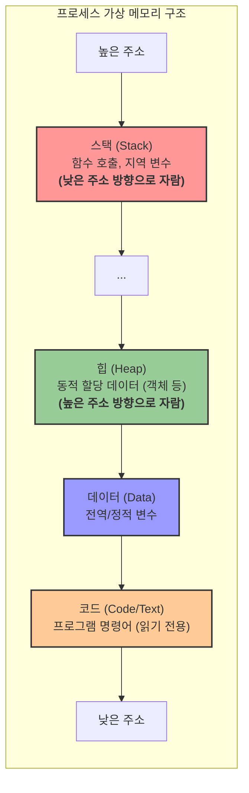
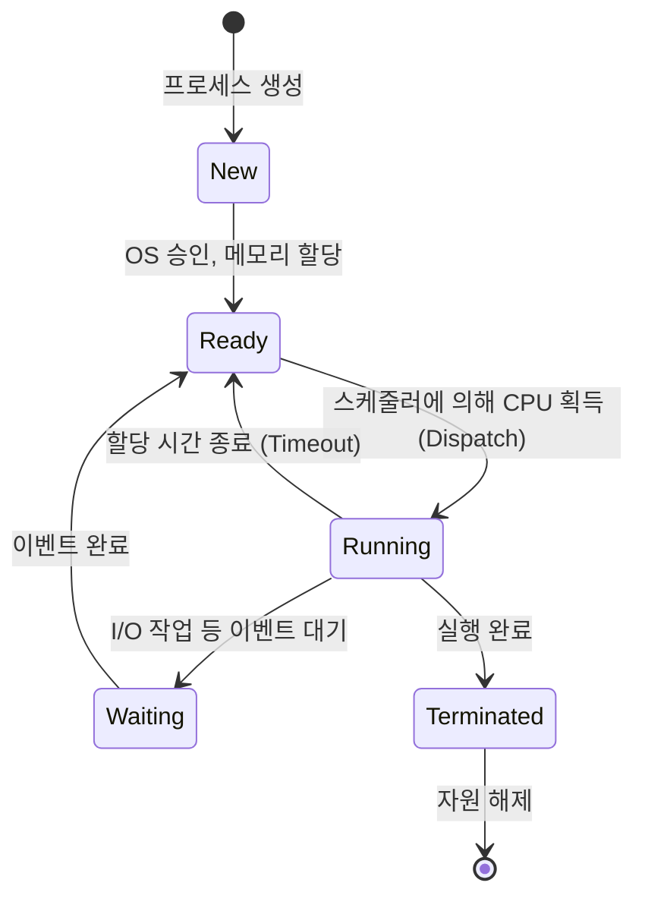

# 1. 프로세스 ⚙️

## 목차
- [1. 프로세스 ⚙️](#1-프로세스-️)
  - [목차](#목차)
  - [프로세스의 메모리 구조: 4개의 방 🧩](#프로세스의-메모리-구조-4개의-방-)
    - [메모리 할당 방식: 정적 할당 vs. 동적 할당](#메모리-할당-방식-정적-할당-vs-동적-할당)
  - [프로세스의 생명 주기 🔄](#프로세스의-생명-주기-)
  - [멀티프로세싱: 여러 일을 동시에 처리하기 🔀](#멀티프로세싱-여러-일을-동시에-처리하기-)
    - [컨텍스트 스위칭: 동시성의 대가](#컨텍스트-스위칭-동시성의-대가)
    - [프로세스 간 통신 (IPC)](#프로세스-간-통신-ipc)
  - [프로세스 스케줄링: 누구에게 CPU를 줄 것인가? ⏱️](#프로세스-스케줄링-누구에게-cpu를-줄-것인가-️)
  - [멀티프로세싱의 함정: 교착상태와 기아상태 ⛔](#멀티프로세싱의-함정-교착상태와-기아상태-)
    - [교착상태 (Deadlock)](#교착상태-deadlock)
    - [기아상태 (Starvation)](#기아상태-starvation)

---

## 프로세스의 메모리 구조: 4개의 방 🧩

프로세스가 운영체제로부터 메모리를 할당받으면, 이 메모리 공간은 크게 4개의 영역으로 나뉘어 사용됩니다.

| 영역 | 설명 | 데이터 저장 예시 |
|---|---|---|
| **코드 (Code)**  | 실행할 프로그램의 코드가 기계어 형태로 저장됩니다. **읽기 전용**입니다. | `if`, `for`, 함수 정의 등 |
| **데이터 (Data)**  | 프로그램이 시작될 때 할당되고 끝날 때 해제되는 변수들이 저장됩니다. | 전역 변수, 정적(static) 변수 |
| **힙 (Heap)**  | 프로그램 실행 중 개발자가 직접 메모리를 할당/해제하는 공간입니다. | 클래스 인스턴스, 대규모 배열 등 |
| **스택 (Stack)**  | 함수가 호출될 때 생성되고, 함수가 끝나면 해제되는 임시 데이터 공간입니다. | 함수 내 지역 변수, 매개변수 |

> **스택 오버플로우 (Stack Overflow)** : 재귀 함수가 무한히 호출되는 등 스택 공간이 가득 차 더 이상 데이터를 저장할 수 없을 때 발생하는 유명한 오류입니다. 스택이 힙 영역을 침범하게 됩니다.

### 메모리 할당 방식: 정적 할당 vs. 동적 할당

- **정적(Static) 할당**: 프로그램 **컴파일 시점**에 메모리 크기가 결정됩니다. 코드, 데이터, 스택 영역에 저장되는 변수들이 해당됩니다. 예측 가능하고 빠르지만, 크기를 바꿀 수 없어 유연성이 떨어집니다.
- **동적(Dynamic) 할당**: 프로그램 **실행 도중**에 필요한 만큼 메모리를 할당받습니다. **힙(Heap) 영역**이 바로 이 동적 할당을 위한 공간입니다. 유연하게 메모리를 관리할 수 있지만, 개발자가 직접 할당(`malloc`, `new`)과 해제(`free`, `delete`)를 관리해야 하는 부담이 있습니다. (Python 같은 언어는 가비지 컬렉터가 이를 자동화해줍니다.)

---

## 프로세스의 생명 주기 🔄

프로세스는 생성부터 소멸까지 여러 상태를 거칩니다. 이를 프로세스의 생명 주기라고 합니다.

| 상태 | 설명 |
|---|---|
| **생성 (New)**  | 프로세스가 막 생성되었고, OS의 승인을 기다리는 상태. |
| **준비 (Ready)**  | CPU를 할당받을 준비가 되어 큐에서 대기 중인 상태. |
| **실행 (Running)**  | CPU를 점유하고 명령어를 실행 중인 상태. |
| **대기 (Waiting)**  | I/O 작업이나 특정 이벤트가 끝나기를 기다리는 상태. CPU를 주어도 소용없음. |
| **종료 (Terminated)**  | 프로세스 실행이 완료되고 자원 해제를 기다리는 상태. |

---

## 멀티프로세싱: 여러 일을 동시에 처리하기 🔀

**멀티프로세싱(Multiprocessing)**  은 하나의 컴퓨터에서 여러 개의 프로세스를 동시에 실행하여 CPU 사용률을 극대화하는 기술입니다. 웹 브라우저에서 여러 탭을 띄우는 것이 대표적인 예입니다.

- **장점**: 하나의 프로세스에 오류가 발생해도 다른 프로세스에 영향을 주지 않아 **안정성**이 높습니다.
- **단점**: 독립된 메모리 공간 때문에 프로세스 생성 및 전환 비용이 크고, 데이터 공유가 복잡합니다.

### 컨텍스트 스위칭: 동시성의 대가

CPU는 실제로 한 순간에 하나의 일만 처리할 수 있습니다. 멀티프로세싱은 CPU가 여러 프로세스를 매우 빠르게 번갈아 가며 실행하여(시분할), 마치 동시에 실행되는 것처럼 보이게 하는 기술입니다.

이때, 하나의 프로세스에서 다른 프로세스로 CPU 제어권이 넘어가는 과정을 **컨텍스트 스위칭(Context Switching)**  이라고 합니다. 이 과정에서 운영체제는 현재 프로세스의 상태(레지스터 값 등)를 저장(PCB에 저장)하고, 새로 실행할 프로세스의 상태를 불러오는 작업을 수행합니다. 이 작업은 상당한 **오버헤드(비용)**  를 유발하며, 너무 잦은 컨텍스트 스위칭은 오히려 시스템 성능을 저하시킬 수 있습니다.

### 프로세스 간 통신 (IPC)

독립된 메모리 공간을 가진 프로세스들은 서로 데이터를 주고받기 위해 운영체제가 제공하는 공식적인 통로, **IPC(Inter-Process Communication)**  를 사용해야 합니다.

| IPC 방식 | 설명 |
|---|---|
| **파이프/소켓** | 두 프로세스 간에 단방향/양방향 통신 채널을 만듭니다. |
| **메시지 큐** | 운영체제가 관리하는 메시지 보관함을 통해 비동기적으로 메시지를 주고받습니다. |
| **공유 메모리** | 두 프로세스가 특정 메모리 영역을 공유하여 매우 빠르게 데이터를 교환합니다. (동기화 문제 발생 가능) |

---

## 프로세스 스케줄링: 누구에게 CPU를 줄 것인가? ⏱️

**프로세스 스케줄러**는 '준비(Ready)' 상태에 있는 여러 프로세스 중, 어떤 프로세스에게 다음 CPU를 할당할지 결정하는 운영체제의 핵심 기능입니다.

- **목표**: 시스템 처리량 극대화, 응답 시간 최소화, 모든 프로세스에 대한 공정성 유지.
- **주요 알고리즘**:
    - **FCFS (First-Come, First-Served)** : 먼저 온 순서대로 처리. (단순하지만 비효율적)
    - **SJF (Shortest Job First)** : 실행 시간이 가장 짧은 작업을 먼저 처리. (평균 대기 시간 최소화)
    - **라운드 로빈 (Round Robin)** : 모든 프로세스에 동일한 시간(Time Slice)을 할당하고, 시간이 다 되면 다음 프로세스로 전환. (시분할 시스템의 근간)

---

## 멀티프로세싱의 함정: 교착상태와 기아상태 ⛔

### 교착상태 (Deadlock)

**교착상태**는 두 개 이상의 프로세스가 서로 상대방이 가진 자원을 기다리며, 영원히 다음 단계로 진행하지 못하는 상황을 말합니다. (예: 프로세스 A는 자원 1을 가진 채 자원 2를 기다리고, 프로세스 B는 자원 2를 가진 채 자원 1을 기다리는 상황)

- **발생 조건 (4가지 모두 충족 시)** :
    1.  **상호 배제**: 한 번에 하나의 프로세스만 자원을 사용할 수 있음.
    2.  **점유와 대기**: 자원을 하나 가진 상태에서 다른 자원을 추가로 기다림.
    3.  **비선점**: 다른 프로세스의 자원을 강제로 빼앗을 수 없음.
    4.  **순환 대기**: 자원을 기다리는 관계가 원형을 이룸.

### 기아상태 (Starvation)

**기아상태**는 특정 프로세스가 계속해서 CPU나 자원을 할당받지 못하고 무기한 대기하는 상태입니다. 우선순위 기반 스케줄링에서 우선순위가 낮은 프로세스가 계속해서 새로운 높은 우선순위 프로세스에 밀리는 경우가 대표적입니다.

- **해결책**: 오래 기다린 프로세스의 우선순위를 점차 높여주는 **에이징(Aging)**  기법 등이 사용됩니다.
