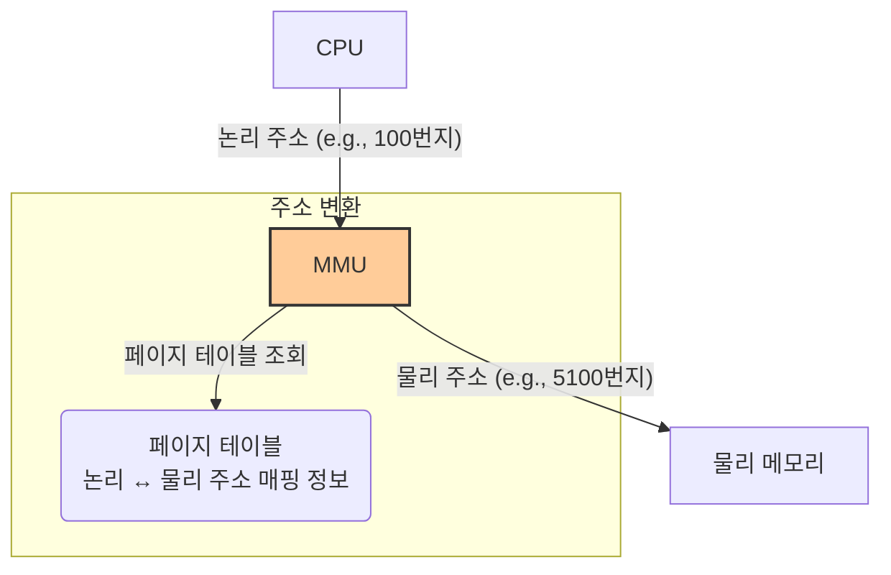

# 2. 메모리 관리 💾

## 목차
- [2. 메모리 관리 💾](#2-메모리-관리-)
  - [목차](#목차)
  - [메모리 관리란 무엇인가?](#메모리-관리란-무엇인가)
  - [메모리 할당 기법과 단편화 문제](#메모리-할당-기법과-단편화-문제)
    - [연속 할당: 간단하지만 비효율적인](#연속-할당-간단하지만-비효율적인)
    - [불연속 할당: 현대 OS의 선택](#불연속-할당-현대-os의-선택)
  - [가상 메모리: 물리적 한계를 넘어서 🚀](#가상-메모리-물리적-한계를-넘어서-)
    - [핵심 원리: 주소 변환 (feat. MMU)](#핵심-원리-주소-변환-feat-mmu)
    - [페이지 부재와 페이지 교체](#페이지-부재와-페이지-교체)

---

## 메모리 관리란 무엇인가?

**메모리 관리(Memory Management)**  란, 한정된 물리 메모리(RAM) 자원을 여러 프로세스에게 효율적으로 할당하고, 사용이 끝나면 회수하며, 프로세스들이 서로의 메모리 영역을 침범하지 않도록 보호하는 운영체제의 핵심 기능입니다.

운영체제는 메모리 관리를 통해 다음 목표를 달성합니다.
- **효율성**: 메모리 공간의 낭비를 최소화하고 최대한 많은 프로세스를 동시에 실행시킵니다.
- **안정성**: 각 프로세스가 자신에게 할당된 영역만 접근하도록 하여 시스템 전체를 보호합니다.

---

## 메모리 할당 기법과 단편화 문제

### 연속 할당: 간단하지만 비효율적인

초기 운영체제에서 사용하던 방식으로, 프로세스를 메모리의 연속된 공간에 통째로 할당합니다.

- **고정 분할 방식**: 메모리를 미리 여러 개의 고정된 크기로 나누고 각 파티션에 프로세스를 할당합니다.
    - **문제점**: 프로세스가 파티션보다 작으면 남는 공간이 그대로 낭비됩니다. (예: 10MB 파티션에 3MB 프로세스 할당 시 7MB 낭비) -> **내부 단편화**
- **가변 분할 방식**: 프로세스가 요청하는 크기만큼 정확히 메모리를 할당합니다.
    - **문제점**: 할당과 해제가 반복되면서 중간중간 작은 빈 공간들이 생겨납니다. 이 공간들이 너무 작아 새로운 프로세스를 할당하지 못하게 됩니다. -> **외부 단편화**

> **단편화(Fragmentation)** : 메모리 공간이 조각나서, 총량은 충분하지만 실제로 할당할 수 없는 상태.

### 불연속 할당: 현대 OS의 선택

단편화 문제를 해결하기 위해, 현대 운영체제는 프로세스를 여러 조각으로 나누어 메모리 곳곳의 비어있는 공간에 분산하여 할당합니다.

1.  **페이징 (Paging)** 
    - **개념**: 프로세스를 **'페이지(Page)'** 라는 동일한 크기(예: 4KB)의 블록으로 나누고, 물리 메모리도 **'프레임(Frame)'** 이라는 페이지와 동일한 크기의 블록으로 나누어, 비어있는 프레임에 페이지를 할당합니다.
    - **장점**: 외부 단편화 문제를 해결합니다.
    - **단점**: 페이지의 마지막 부분에서 여전히 공간 낭비(내부 단편화)가 발생할 수 있습니다.

2.  **세그멘테이션 (Segmentation)** 
    - **개념**: 프로세스를 '코드, 데이터, 스택'과 같이 **논리적 의미가 같은 단위인 '세그먼트(Segment)'** 로 나누어 메모리에 할당합니다.
    - **장점**: 논리 단위로 관리하므로 메모리 보호와 공유가 용이합니다.
    - **단점**: 크기가 다른 세그먼트들이 할당/해제되면서 외부 단편화 문제가 발생할 수 있습니다.

> **결론**: 많은 현대 운영체제는 세그멘테이션과 페이징을 결합한 방식(세그먼트를 페이지 단위로 나누어 관리)을 사용하여 각 기법의 장점을 모두 취합니다.

---

## 가상 메모리: 물리적 한계를 넘어서 🚀

**가상 메모리(Virtual Memory)**  는 실제 물리 메모리 크기보다 더 큰 프로그램을 실행할 수 있도록 하고, 각 프로세스에 독립적인 메모리 공간을 제공하는 현대 운영체제의 핵심 기술입니다. 이를 위해 보조기억장치(SSD/HDD)의 일부를 RAM의 확장 공간처럼 사용합니다.

- **장점**:
    - **메모리 확장**: 실제 RAM보다 큰 프로그램을 실행할 수 있습니다.
    - **메모리 보호**: 각 프로세스는 자신만의 가상 주소 공간을 가지므로, 다른 프로세스의 메모리를 침범할 수 없습니다.
    - **효율적인 메모리 사용**: 프로그램의 당장 필요한 부분만 RAM에 올리고, 나머지는 디스크에 두어 RAM을 효율적으로 사용합니다.

### 핵심 원리: 주소 변환 (feat. MMU)

가상 메모리의 핵심은 **주소 변환(Address Translation)**  입니다.

1.  **논리 주소 (Logical Address)** : CPU와 프로세스가 사용하는 주소. 각 프로세스는 0번지부터 시작하는 자신만의 독립적인 주소 공간을 가집니다.
2.  **물리 주소 (Physical Address)** : 실제 RAM 상의 주소.
3.  **MMU (Memory Management Unit)** : CPU가 논리 주소로 메모리 접근을 요청하면 이 논리 주소를 실제 물리 주소로 변환해주는 **하드웨어 장치**입니다. MMU는 **페이지 테이블**이라는 이정표를 참조하여 이 변환을 수행합니다.

### 페이지 부재와 페이지 교체

- **페이지 부재 (Page Fault)** : CPU가 요청한 페이지가 현재 RAM에 없고 디스크에 있는 경우 발생하는 인터럽트입니다.
- **페이지 교체 (Page Replacement)** : 페이지 부재가 발생했는데 RAM에 빈 공간이 없다면, 운영체제는 RAM에 있는 페이지 중 하나를 디스크로 내보내고(Swap-out), 필요한 페이지를 디스크에서 가져와야(Swap-in) 합니다.

이때 어떤 페이지를 내보낼지 결정하는 정책을 **페이지 교체 알고리즘**이라고 합니다.

| 알고리즘 | 설명 |
|---|---|
| **FIFO (First-In, First-Out)**  | 가장 먼저 들어온 페이지를 가장 먼저 내보냅니다. |
| **LRU (Least Recently Used)**  | **가장 오랫동안 사용되지 않은** 페이지를 내보냅니다. (성능이 좋고 가장 널리 쓰임) |
| **LFU (Least Frequently Used)**  | 참조 횟수가 가장 적은 페이지를 내보냅니다. |

> **스래싱 (Thrashing)** : 페이지 부재가 너무 빈번하게 발생하여, CPU가 실제 작업보다 페이지 교체에 대부분의 시간을 소모하여 시스템 성능이 급격히 저하되는 현상입니다. 메모리가 부족하다는 명백한 신호입니다.
