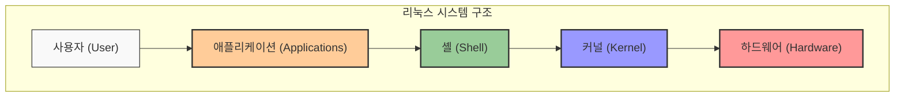

# 1. 리눅스 처음 배우기 🐧

## 목차
- [1. 리눅스 처음 배우기 🐧](#1-리눅스-처음-배우기-)
  - [목차](#목차)
  - [리눅스란 무엇인가? 🤔](#리눅스란-무엇인가-)
    - [GNU 프로젝트](#gnu-프로젝트)
    - [리눅스의 구조](#리눅스의-구조)
    - [활용 분야](#활용-분야)
  - [리눅스의 특징과 배포판 종류 📚](#리눅스의-특징과-배포판-종류-)
  - [가장 많이 쓰는 리눅스, 우분투 🧡](#가장-많이-쓰는-리눅스-우분투-)
    - [우분투를 사용하는 이유?](#우분투를-사용하는-이유)
    - [우분투 버전](#우분투-버전)
  - [리눅스 기초 명령어 알아보기 💻](#리눅스-기초-명령어-알아보기-)
    - [리눅스 셸(Shell)](#리눅스-셸shell)
    - [가장 많이 사용하는 셸, bash](#가장-많이-사용하는-셸-bash)
    - [리눅스 기초 명령어](#리눅스-기초-명령어)
  - [리눅스의 패키지 관리자, apt 📦](#리눅스의-패키지-관리자-apt-)

---

## 리눅스란 무엇인가? 🤔

UNIX라는 운영체제가 있었다. 이 운영체제는 1960년대부터 사용되어 왔으며, 현재까지도 많은 서버에서 사용되고 있다. UNIX는 무료로 사용할 수 없었기 때문에, 리누스 토르발스라는 프로그래머가 UNIX를 기반으로 만든 운영체제가 바로 리눅스다. 

### GNU 프로젝트

GNU는 역두문자어로, "GNU's Not Unix"의 약자다. 유닉스 운영체제를 여러 회사에서 각자 개발하지만 소스 코드를 공유하지 않는 문화에 대한 반발로 생겼다.

### 리눅스의 구조

리눅스 또한 Hardware-Kernel-Shell-Application의 계층 구조를 따른다.



### 활용 분야

| 분야 | 설명 | 예시 |
|------|------|------|
| **서버** | 웹서버, 데이터베이스 서버 등 다양한 서버 환경 | Apache, MySQL, AWS |
| **임베디드** | 작은 기기에 내장된 리눅스 시스템 | 라우터, 스마트TV |
| **슈퍼컴퓨터** | 고성능 컴퓨팅을 위한 시스템 | TOP500의 대부분 |
| **모바일** | 모바일 기기의 운영체제 | 안드로이드(리눅스 커널 기반) |
| **데스크톱** | 개인용 컴퓨터 운영체제 | Ubuntu, Fedora |

---

## 리눅스의 특징과 배포판 종류 📚

리눅스는 유닉스 기반이며 멀티 유저와 멀티 태스킹을 지원하고 CLI 환경과 GUI를 모두 지원하며 다양하고 강력한 네트워킹이 가능하다.

| 특징 | 설명 |
|------|------|
| **오픈소스** | 소스 코드가 공개되어 있어 누구나 수정 가능 |
| **멀티 유저** | 여러 사용자가 동시에 사용 가능 |
| **멀티 태스킹** | 여러 작업을 동시에 수행 가능 |
| **보안성** | 사용자 권한 관리와 보안 기능이 강력함 |
| **안정성** | 오랜 시간 실행해도 안정적으로 동작 |

리눅스에는 '배포판'이라는 개념이 존재하는데 리눅스 커널을 중심으로 여러 프로그램을 묶어서 배포하는 것을 말한다.

| 배포판 계열 | 주요 배포판 | 특징 |
|------------|------------|------|
| **데비안 계열** | Ubuntu, Debian | apt 패키지 관리자, .deb 패키지 |
| **레드햇 계열** | CentOS, Fedora, RHEL | yum/dnf 패키지 관리자, .rpm 패키지 |
| **아치 계열** | Arch Linux, Manjaro | pacman 패키지 관리자, 최신 패키지 |
| **슬랙웨어 계열** | Slackware | 가장 오래된 배포판 중 하나 |

---

## 가장 많이 쓰는 리눅스, 우분투 🧡

우분투는 데비안 계열의 리눅스 배포판으로, 데스크탑과 서버 모두에서 사용되고 있다. 우분투는 무료로 사용할 수 있으며, 데스크탑 환경을 위한 우분투와 서버 환경을 위한 우분투 서버가 있다.

### 우분투를 사용하는 이유?

- 개인용 PC 환경에 최적화 되어 있음
- 간결하고 쉬운 사용법, 사용자가 많아 커뮤니티가 활성화 되어 있음
- 6개월 단위로 업데이트됨

### 우분투 버전

우분투는 6개월마다 새로운 버전이 나오며, 2년마다 LTS(Long Term Support) 버전이 나온다. LTS 버전은 5년간 지원되며, 일반 버전은 9개월간 지원된다. 나온 연도와 달로 번호를 지정한다.

| 버전 타입 | 출시 주기 | 지원 기간 | 주요 사용처 |
|----------|----------|-----------|-----------|
| **LTS 버전** | 2년마다 | 5년 | 서버, 기업 환경 |
| **일반 버전** | 6개월마다 | 9개월 | 개인 사용자, 테스트 환경 |

---

## 리눅스 기초 명령어 알아보기 💻

### 리눅스 셸(Shell)

리눅스 셸은 사용자와 리눅스 커널 사이에서 사용자의 명령을 해석하고 실행하는 프로그램이다. 리눅스 셸은 크게 bash(bourne-again shell), sh(bourne shell), csh(C shell), ksh(korn shell) 등이 있다.

### 가장 많이 사용하는 셸, bash

bash는 GNU 프로젝트의 일환으로 개발된 셸로, 리눅스와 유닉스 계열의 운영체제에서 가장 많이 사용되는 셸이다.(리눅스의 기본 Shell이다.)

### 리눅스 기초 명령어

| 명령어 | 설명 | 예시 |
|--------|------|------|
| **whoami** | 현재 사용자 이름 출력 | `whoami` |
| **passwd** | 사용자 비밀번호 변경 | `passwd` |
| **pwd** | 현재 디렉토리 출력 | `pwd` |
| **ls** | 디렉토리 목록 출력 | `ls`, `ls -l`, `ls -a`, `ls -al` |
| **cd** | 디렉토리 이동 | `cd Desktop` |
| **--help** | 명령어 도움말 출력 | `ls --help` |

```bash
# 기본 명령어 사용 예시
exampleuser@ubuntu:~$ whoami
exampleuser

exampleuser@ubuntu:~$ pwd
/home/exampleuser

exampleuser@ubuntu:~$ ls
Desktop  Documents  Downloads  Music  Pictures  Videos

# ls 명령어 옵션 사용
exampleuser@ubuntu:~$ ls -l
total 24
drwxr-xr-x 2 exampleuser exampleuser 4096 Apr  1 12:00 Desktop
drwxr-xr-x 2 exampleuser exampleuser 4096 Apr  1 12:00 Documents
drwxr-xr-x 2 exampleuser exampleuser 4096 Apr  1 12:00 Downloads
drwxr-xr-x 2 exampleuser exampleuser 4096 Apr  1 12:00 Music
drwxr-xr-x 2 exampleuser exampleuser 4096 Apr  1 12:00 Pictures
drwxr-xr-x 2 exampleuser exampleuser 4096 Apr  1 12:00 Videos

# 숨김 파일 출력
exampleuser@ubuntu:~$ ls -a
.  ..  .bashrc  .profile  .bash_history

# 디렉토리 이동
exampleuser@ubuntu:~$ cd Desktop
exampleuser@ubuntu:~/Desktop$
```

---

## 리눅스의 패키지 관리자, apt 📦

리눅스는 패키지 관리자를 통해 소프트웨어를 설치, 제거, 업데이트한다. 우분투에서는 apt(Advanced Packaging Tool)를 사용한다.

apt 명령어는 기존에는 apt-get과 apt-cache로 나뉘어 있었으나, 16.04 버전부터 apt로 통합되었다.

| 기능 | 현재 apt 명령어 | 이전 명령어 | 설명 |
|------|----------------|------------|------|
| **패키지 설치** | `apt install` | `apt-get install` | 패키지와 필요한 모든 의존성을 설치합니다 |
| **패키지 제거** | `apt remove` | `apt-get remove` | 패키지를 제거하지만 설정 파일은 유지합니다 |
| **패키지 목록 업데이트** | `apt update` | `apt-get update` | 사용 가능한 패키지 목록을 업데이트합니다 |
| **패키지 검색** | `apt search` | `apt-cache search` | 패키지 저장소에서 패키지를 검색합니다 |
| **패키지 정보 표시** | `apt show` | `apt-cache show` | 패키지의 세부 정보를 표시합니다 |

apt 명령어는 **반드시 root 권한이 필요**하고, 따라서 sudo 명령어를 사용해 실행해야 한다.

```bash
exampleuser@ubuntu:~$ apt install nano
E: Unable to acquire the dpkg frontend lock (/var/lib/dpkg/lock-frontend), are you root?
exampleuser@ubuntu:~$ sudo apt install nano
[sudo] password for exampleuser:
패키지 목록을 읽는 중입니다... 완료
의존성 트리를 만드는 중입니다
상태 정보를 읽는 중입니다... 완료
패키지 nano는 이미 최신 버전입니다. (2.9.3-2)
```

> root 권한이란?: 리눅스에서는 **root**라는 슈퍼 유저가 존재하며, 시스템 전체를 관리할 수 있는 권한을 가지고 있다. 일반 사용자는 root 권한을 가지지 않으며, root 권한이 필요한 작업을 할 때는 **sudo 명령어**를 사용해야 한다.
