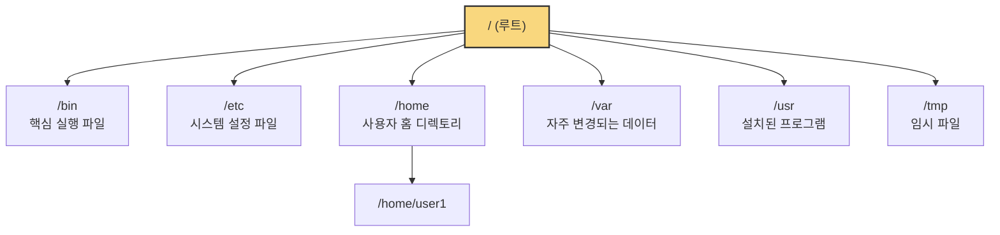

# 2. 리눅스의 파일 시스템 📁

## 목차
- [2. 리눅스의 파일 시스템 📁](#2-리눅스의-파일-시스템-)
  - [목차](#목차)
  - [리눅스 파일 시스템의 계층 구조 (FHS)](#리눅스-파일-시스템의-계층-구조-fhs)
  - [소유권과 권한: 내 파일은 누가 만질 수 있을까?](#소유권과-권한-내-파일은-누가-만질-수-있을까)
    - [권한 읽는 법](#권한-읽는-법)
    - [권한 변경하기: `chmod`](#권한-변경하기-chmod)
  - [파일/디렉토리 조작 핵심 명령어](#파일디렉토리-조작-핵심-명령어)
    - [생성: `mkdir`, `touch`](#생성-mkdir-touch)
    - [복사/이동: `cp`, `mv`](#복사이동-cp-mv)
    - [삭제: `rm`, `rmdir`](#삭제-rm-rmdir)
    - [내용 확인: `cat`, `less`](#내용-확인-cat-less)
  - [간단한 텍스트 편집: `nano`](#간단한-텍스트-편집-nano)

---

## 리눅스 파일 시스템의 계층 구조 (FHS)

리눅스의 파일 시스템은 모든 파일과 디렉토리가 최상위 지점인 **루트 디렉토리 (`/`)**  에서 시작하는 하나의 거대한 **트리 구조**를 이룹니다. 각 디렉토리는 저마다 정해진 목적이 있으며, 이 표준 구조를 **FHS(Filesystem Hierarchy Standard)**  라고 합니다.



| 디렉토리 | 역할 |
|---|---|
| `/` | 모든 디렉토리의 시작점, 최상위 루트 디렉토리. |
| `/bin` | `ls`, `cp` 등 가장 기본적인 명령어(실행 파일)들이 위치. |
| `/etc` | 시스템 전체의 설정 파일들이 위치. |
| `/home` | 각 사용자들의 개인적인 파일이 저장되는 공간. (예: `/home/alice`, `/home/bob`) |
| `/usr` | 사용자가 설치한 응용 프로그램과 관련 파일들이 저장됨. |
| `/var` | 로그, 메일 등 시스템 운영 중에 크기가 계속 변하는 파일들이 저장됨. |
| `/tmp` | 임시 파일을 저장하는 공간. 시스템 재부팅 시 내용이 삭제될 수 있음. |

---

## 소유권과 권한: 내 파일은 누가 만질 수 있을까?

리눅스는 멀티유저 시스템이므로, 파일과 디렉토리마다 **누가 소유하고, 누가 무엇을 할 수 있는지**를 엄격하게 통제합니다. `ls -l` 명령어로 이를 확인할 수 있습니다.

`$ ls -l`
`drwxr-xr-x 2 alice alice 4096 Jul 11 10:30 Documents`

### 권한 읽는 법

`d rwx r-x r-x` 이 10자리 문자열을 자세히 봅시다.

1.  **첫 글자: 파일 종류**
    - `d`: 디렉토리 (Directory)
    - `-`: 일반 파일 (File)
    - `l`: 심볼릭 링크 (Symbolic Link)

2.  **2~10번째 글자: 권한** (3자리씩 끊어서 읽음)
    - **1~3번째 (rwx)** : **소유자(User)** 의 권한
    - **4~6번째 (r-x)** : **그룹(Group)** 의 권한
    - **7~9번째 (r-x)** : **그 외 사용자(Others)** 의 권한

| 권한 문자 | 의미 | 8진수 숫자 |
|---|---|---|
| `r` | **R**ead (읽기) | 4 |
| `w` | **W**rite (쓰기/수정) | 2 |
| `x` | **E**xecute (실행) | 1 |

> 위 예시 `rwxr-xr-x`는 소유자는 읽기/쓰기/실행(4+2+1=7), 그룹과 그 외 사용자는 읽기/실행(4+0+1=5) 권한을 가짐을 의미합니다. 즉, `chmod 755` 와 같습니다.

### 권한 변경하기: `chmod`

`chmod` (Change Mode) 명령어로 파일/디렉토리의 권한을 변경합니다.

```bash
# example.sh 파일에 소유자는 모든 권한(7), 그룹과 다른 사용자는 읽고 실행할 권한(5)을 부여
chmod 755 example.sh

# script.py 파일에 실행(x) 권한을 추가
chmod +x script.py
```

---

## 파일/디렉토리 조작 핵심 명령어

### 생성: `mkdir`, `touch`
- `mkdir [디렉토리명]`: **M**a**k**e **Dir**ectory. 새 디렉토리를 만듭니다.
- `touch [파일명]`: 내용이 없는 빈 파일을 만들거나, 기존 파일의 최종 수정 시간을 현재로 갱신합니다.

### 복사/이동: `cp`, `mv`
- `cp [원본] [대상]`: **C**o**p**y. 파일이나 디렉토리를 복사합니다. 디렉토리 복사 시에는 `-r` (recursive) 옵션을 사용합니다.
- `mv [원본] [대상]`: **M**o**v**e. 파일이나 디렉토리를 이동시키거나, 이름을 변경합니다.

### 삭제: `rm`, `rmdir`
- `rmdir [디렉토리명]`: **R**e**m**ove **Dir**ectory. **비어있는** 디렉토리만 삭제합니다.
- `rm [파일명]`: **R**e**m**ove. 파일을 삭제합니다. 내용이 있는 디렉토리를 삭제하려면 `-r` 옵션을 사용합니다.

> ⚠️ **경고: `rm` 명령어는 매우 위험합니다!**
> `rm`으로 삭제된 파일은 휴지통이 없으며 복구가 거의 불가능합니다. 특히 `rm -rf [경로]` 명령어는 **경고 메시지 없이(`-f`)**  해당 경로의 모든 하위 파일과 디렉토리를 **재귀적으로(`-r`)**  삭제하므로, 실행 전 경로를 반드시 두세 번 확인하는 습관을 들여야 합니다. 오죽하면 rm 명령어를 이용한 러시안 룰렛 밈이 있을까요?

### 내용 확인: `cat`, `less`
- `cat [파일명]`: 파일 내용을 터미널에 전부 출력합니다. 짧은 파일 확인에 유용하지만, 긴 파일을 열면 화면이 모두 덮여버립니다.
- `less [파일명]`: 긴 파일 내용을 페이지 단위로 나눠서 보여주는 뷰어입니다. (이동: 방향키, 종료: `q`) 긴 로그 파일이나 소스 코드를 확인할 때 필수적입니다.

---

## 간단한 텍스트 편집: `nano`

`nano`는 리눅스 터미널에서 사용할 수 있는 가장 배우기 쉬운 텍스트 편집기입니다. vi/vim의 경우 처음 사용 시 사용법을 직관적으로 알기가 쉽지 않은데 nano의 경우 터미널 창 하단에 항상 단축키가 표시되어 있어 사용하기 편리합니다. 간단한 텍스트/설정 파일 편집에 적합합니다.

- **실행**: `nano [편집할 파일명]`
- **주요 단축키** (화면 하단에 항상 표시됨):
    - `Ctrl + O`: **O**utput. 저장하기.
    - `Ctrl + X`: E**x**it. 종료하기.
    - `Ctrl + W`: **W**here is. 검색하기.

> `nano`는 입문용으로 훌륭하지만, 더 전문적인 작업을 위해서는 `Vim`이나 `Emacs` 같은 강력한 터미널 편집기, 또는 `VSCode`의 원격 접속 기능을 사용하는 것을 목표로 하는 것이 좋습니다.