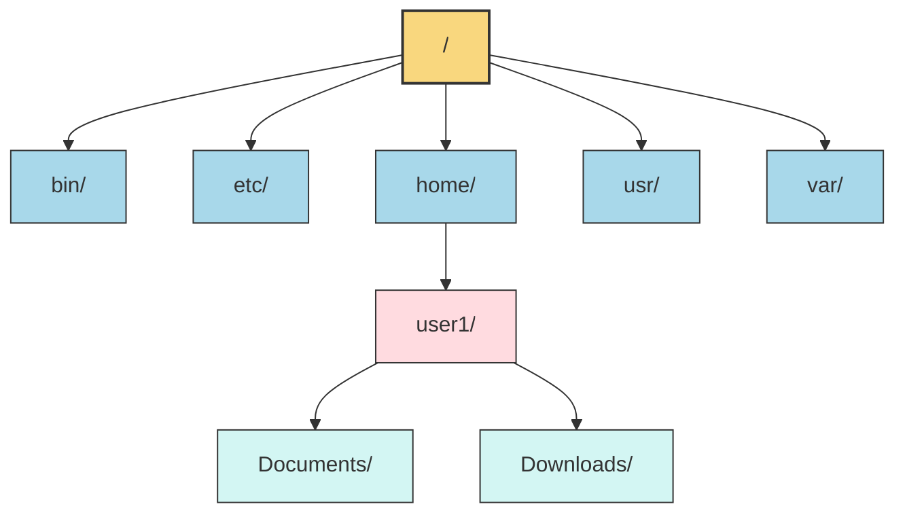

# 2. 리눅스의 파일 시스템 📁

## 목차
- [2. 리눅스의 파일 시스템 📁](#2-리눅스의-파일-시스템-)
  - [목차](#목차)
  - [리눅스의 파일 시스템: 계층적! 🌲](#리눅스의-파일-시스템-계층적-)
    - [파일 vs 디렉토리](#파일-vs-디렉토리)
  - [리눅스 디렉토리의 구조: 트리 구조 🌳](#리눅스-디렉토리의-구조-트리-구조-)
  - [소유권과 권한 🔐](#소유권과-권한-)
    - [권한 변경 명령어: chmod](#권한-변경-명령어-chmod)
    - [소유권 변경 명령어: chown](#소유권-변경-명령어-chown)
  - [파일과 관련된 명령어들 💻](#파일과-관련된-명령어들-)
    - [디렉토리 생성: mkdir](#디렉토리-생성-mkdir)
    - [빈 파일 생성: touch](#빈-파일-생성-touch)
    - [디렉토리 삭제: rmdir](#디렉토리-삭제-rmdir)
    - [파일 및 디렉토리 삭제: rm](#파일-및-디렉토리-삭제-rm)
    - [파일 및 디렉토리 복사: cp](#파일-및-디렉토리-복사-cp)
    - [파일 및 디렉토리 이동: mv](#파일-및-디렉토리-이동-mv)
    - [파일 내용 확인: cat](#파일-내용-확인-cat)
    - [파일 검색: find](#파일-검색-find)
  - [nano editor 사용해보기 ✏️](#nano-editor-사용해보기-️)

---

## 리눅스의 파일 시스템: 계층적! 🌲

리눅스의 파일 시스템은 디렉토리와 파일의 형태로 구성되어 있다.(다만, 윈도우와 다르게 디렉토리 또한 파일로 취급한다.) 루트 파일 아래에 **계층적**인 디렉토리 구조로 파일들이 저장되어 있는것이 특징이다. 

### 파일 vs 디렉토리

파일은 저장 공간에 저장되는 **데이터의 집합**이고, 디렉토리는 파일과 하위 디렉토리를 그룹으로 묶은 **이름 공간**이다.

---

## 리눅스 디렉토리의 구조: 트리 구조 🌳

리눅스의 디렉토리 구조는 **트리 구조**로 이루어져 있다. 루트 디렉토리(/)를 시작으로 하위 디렉토리가 계속 연결되어 있는 구조이다. 심지어 이 트리를 확인해 보는 방법도 있다!



> **트리 구조**란 이름 그대로 **나무**의 형태를 띄는 구조로, 루트 노드를 시작으로 여러 개의 하위 노드가 연결되어 있는 자료구조를 말한다.


```bash
exampleuser@ubuntu:~$ tree
.
├── bin
├── etc
├── home
│   └── user1
│       ├── Documents
│       └── Downloads
├── usr
└── var
```

*우분투에서 트리 명령어를 사용한 예시*

---

## 소유권과 권한 🔐

ls -l 명령어를 사용했을때 drwxr-xr-x 같은 문자열이 나오는데, 이는 **파일의 소유권과 권한**을 나타낸다.

```
drwxr-xr-x 2 exampleuser exampleuser 4096 Apr  1 12:00 Desktop
```

*ls -l 명령어로 확인한 소유권과 권한의 예시*
- drwxr-xr-x: 파일 유형과 권한을 나타내는 10자리 문자열
- 2: 하위 디렉토리와 링크 수
- exampleuser: 소유자 이름
- exampleuser: 소유 그룹 이름
- 4096: 파일 크기
- Apr 1 12:00: 파일 마지막 수정 시간
- Desktop: 파일 이름

권한에서 맨 앞 한글자를 제외한 나머지 9문자는 **3개씩** 끊어서 소유자, 그룹, 기타 사용자의 권한을 나타낸다. (ex. rwxr-xr-x: 소유자는 읽기(r), 쓰기(w), 실행 권한(x)이 있고, 그룹과 기타 사용자는 읽기, 실행 권한만 있다.) 한편 이 표기는 이진수 표기이므로(문자가 있으면 1, 없으면 0) 10진수로 변환하여 표기하기도 한다.

### 권한 변경 명령어: chmod

chmod 741이라고 하면 소유자는 7(4(r)+2(w)+1(x)), 그룹은 4(4(r)+0+0), 기타 사용자는 1(0+0+1(x))로 권한을 설정하겠다는 뜻이다.

```bash
exampleuser@ubuntu:~$ chmod 741 example.txt
```

### 소유권 변경 명령어: chown

chown exampleuser:examplegroup example.txt 명령어로 example.txt 파일의 소유자와 그룹을 변경할 수 있다.

```bash
exampleuser@ubuntu:~$ chown exampleuser:examplegroup example.txt
```

---

## 파일과 관련된 명령어들 💻

파일과 관련된 여러가지 명령어를 알아보자.

### 디렉토리 생성: mkdir

mkdir [생성 디렉토리명] 형식으로 사용한다. **현재 디렉토리 위치에 새로운 하위 디렉토리를 생성**한다.
mkdir[디렉토리 경로/디렉토리명] 형식으로도 사용 가능하다.

```bash
exampleuser@ubuntu:~$ mkdir newdir
exampleuser@ubuntu:~$ ls
Desktop  Documents  Downloads  Music  Pictures  Videos  newdir
```

### 빈 파일 생성: touch

touch [파일명] 형식으로 사용한다. **빈 파일을 생성**한다.

```bash
exampleuser@ubuntu:~$ touch newfile.txt
exampleuser@ubuntu:~$ ls
Desktop  Documents  Downloads  Music  Pictures  Videos  newdir  newfile.txt
```

### 디렉토리 삭제: rmdir

rmdir [디렉토리명] 형식으로 사용한다. **빈 디렉토리를 삭제**한다.

```bash
exampleuser@ubuntu:~$ rmdir newdir
exampleuser@ubuntu:~$ ls
Desktop  Documents  Downloads  Music  Pictures  Videos  newfile.txt
```

### 파일 및 디렉토리 삭제: rm

rm [옵션][파일명] 형식으로 사용한다. **파일을 삭제**한다. -r 옵션을 사용하면 **디렉토리를 삭제**할 수 있다.

```bash
exampleuser@ubuntu:~$ rm newfile.txt
exampleuser@ubuntu:~$ ls
Desktop  Documents  Downloads  Music  Pictures  Videos
```

### 파일 및 디렉토리 복사: cp

cp [옵션][원본 파일명][복사 위치] 형식으로 사용한다. **파일을 복사**한다. -r 옵션을 사용하면 **디렉토리를 복사**할 수 있고, -p 옵션을 사용하면 **원본 파일의 속성을 그대로 복사**할 수 있다.

```bash
exampleuser@ubuntu:~$ cp example.txt example2.txt
exampleuser@ubuntu:~$ ls
Desktop  Documents  Downloads  Music  Pictures  Videos  example.txt  example2.txt
```

### 파일 및 디렉토리 이동: mv

mv [옵션][원본 파일명][대상 파일명] 형식으로 사용한다. **파일을 이동**한다. -r 옵션을 사용하면 **디렉토리를 이동**할 수 있다.

```bash
exampleuser@ubuntu:~$ mv example.txt Documents/
exampleuser@ubuntu:~$ ls
Desktop  Documents  Downloads  Music  Pictures  Videos  example2.txt
```

### 파일 내용 확인: cat

cat [파일명] 형식으로 사용한다. **파일의 내용을 확인**한다. 옵션으로 -n을 사용하면 **행 번호를 붙여서 출력**하고, >를 사용하면 파일의 내용을 덮어쓸 수 있고, >>를 사용하면 **파일의 끝에 내용을 추가**할 수 있다.

```bash
exampleuser@ubuntu:~$ cat example2.txt
hello exampleuser!
exampleuser@ubuntu:~$ cat >> example2.txt
nice to meet you!
exampleuser@ubuntu:~$ cat example2.txt
hello exampleuser!
nice to meet you!
```

### 파일 검색: find

find [경로][옵션][파일명] 형식으로 사용한다. **파일을 검색**한다. -name 옵션을 사용하면 **파일명으로 검색**할 수 있고, -type 옵션(d/f)을 사용하면 **파일 타입으로 검색**할 수 있다.

```bash
exampleuser@ubuntu:~$ find /home/exampleuser -name example.txt
/home/exampleuser/example.txt
```

---

## nano editor 사용해보기 ✏️

nano는 리눅스에서 사용하는 가볍고 간단한 **텍스트 편집기**이다. nano [파일명] 형식으로 사용한다.

대표적인 단축키로는:
| 단축키 | 기능 |
|--------|------|
| Ctrl + O | 저장 |
| Ctrl + X | 종료 |
| Ctrl + W | 검색 |
| Alt + 6 | 복사 |
| Ctrl + U | 붙여넣기 |
| Ctrl + ^ | 여러 줄 선택 |

이 있다.
