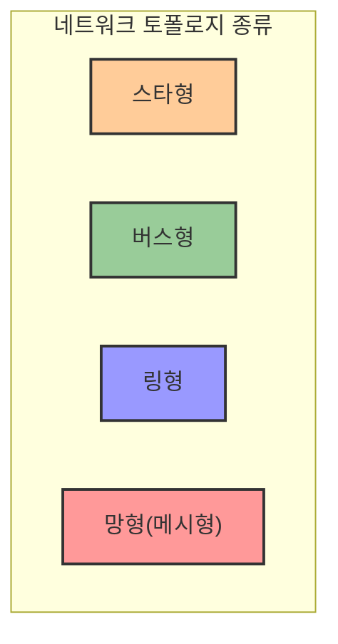
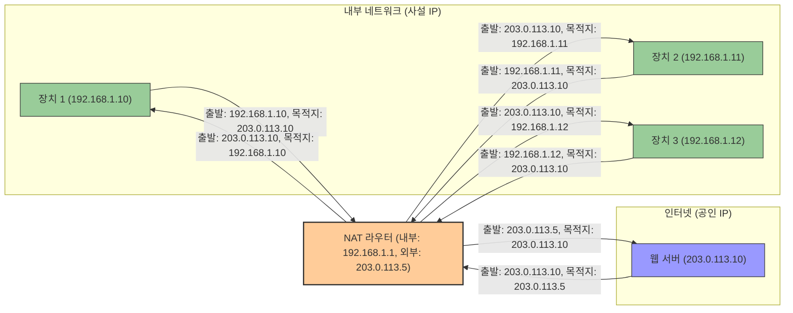
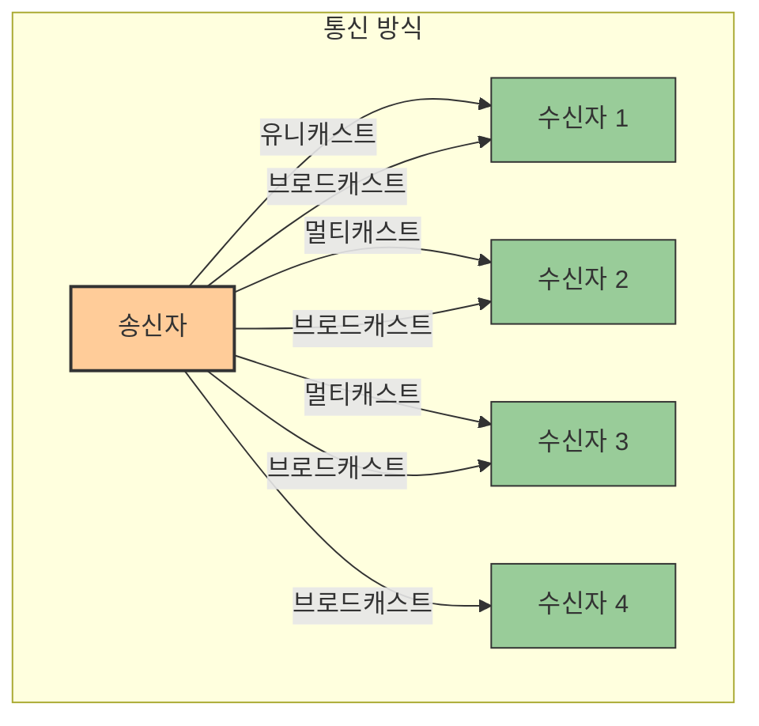

# 1. 네트워크 개요 🌐

## 목차
- [1. 네트워크 개요 🌐](#1-네트워크-개요-)
  - [목차](#목차)
  - [네트워크의 정의 📝](#네트워크의-정의-)
    - [네트워크의 장단점?](#네트워크의-장단점)
      - [장점](#장점)
      - [단점](#단점)
    - [네트워크, 어떻게 작동할까?](#네트워크-어떻게-작동할까)
    - [다양한 유선 케이블들](#다양한-유선-케이블들)
    - [무선 네트워크의 예시는?](#무선-네트워크의-예시는)
  - [네트워크 토폴로지 🔄](#네트워크-토폴로지-)
  - [네트워크 유형 (PAN, LAN, WAN, MAN) 🔍](#네트워크-유형-pan-lan-wan-man-)
  - [IP 주소: IPv4, IPv6 방식으로 구분되다 🔢](#ip-주소-ipv4-ipv6-방식으로-구분되다-)
    - [vs MAC Address?](#vs-mac-address)
    - [IP 주소의 구성요소](#ip-주소의-구성요소)
    - [IP 서브넷 마스크](#ip-서브넷-마스크)
    - [IP 클래스](#ip-클래스)
    - [IPv4](#ipv4)
    - [IPv6](#ipv6)
    - [사설 네트워크 vs 공용 네트워크](#사설-네트워크-vs-공용-네트워크)
    - [NAT: IPv4 주소는 부족하다](#nat-ipv4-주소는-부족하다)
  - [네트워크의 통신 방식: 유니캐스트, 멀티캐스트, 브로드캐스트 📡](#네트워크의-통신-방식-유니캐스트-멀티캐스트-브로드캐스트-)
    - [유니캐스트(Unicast)](#유니캐스트unicast)
    - [멀티캐스트(Multicast)](#멀티캐스트multicast)
    - [브로드캐스트(Broadcast)](#브로드캐스트broadcast)
  - [네트워크의 구성요소들 🏗️](#네트워크의-구성요소들-️)
    - [네트워크 엣지](#네트워크-엣지)
    - [접속 네트워크](#접속-네트워크)
    - [네트워크 코어](#네트워크-코어)
    - [네트워크 코어의 기능](#네트워크-코어의-기능)
  - [OSI 7계층 🧩](#osi-7계층-)

---
## 네트워크의 정의 📝

네트워크란 **두 대 이상의 컴퓨터가 데이터를 주고받을 수 있도록 연결된 구조**를 말한다. 네트워크에 연결된 구성요소들은 **노드**라고 부르며, 노드들 간의 연결은 **링크**로 표현한다.

### 네트워크의 장단점?

#### 장점
1. 방대한 자원 공유가 가능하다.
2. 프로세스 분배가 가능하다.
3. 다양한 미디어 시청이 가능하다.

#### 단점
1. 바이러스나 악성코드와 같은 보안 문제가 발생할 수 있다.
2. 데이터 손실 혹은 변조 가능성이 있다.

### 네트워크, 어떻게 작동할까?

네트워크의 연결 방식은 크게 **유선**과 **무선**으로 나뉜다. 어느 쪽이든 데이터가 원하는 방향으로 전달도록 하며, 데이터 신호의 왜곡을 방지해 데이터를 보호한다.

### 다양한 유선 케이블들

1. 동축 케이블

TV, 무전기 등 안테나 연결 용도로도 사용되어 안테나선이라고도 부르는 **동축 케이블**은 외부 쉴드가 중심 도체를 둘러쌓은 구조로 전자기장 차폐 효과를 누리고, 매우 적은 손실로 장거리 전송이 가능하다.

2. 이더넷 케이블

근거리 통신망을 구축하기 위해 사용하는 케이블로, **랜선**이라고도 부른다.

3. 광섬유 케이블

빛을 이용해 데이터를 전송하는 광섬유 케이블은 전기적 노이즈에 강하고, 전송 속도가 빠르다. **국가간 연결**을 위한 해저 케이블에 많이 사용한다.

### 무선 네트워크의 예시는?

1. 라디오파

벽 통과가 가능한 라디오파는 사용자 밀집도가 높은 곳에서 주로 사용하며, 별도의 송신 장치가 필요 없다는 장점이 있다. 같은 주파수 내 방해 여지가 있다.

2. 마이크로파

유선 전송 매체를 사용하기 힘든 사막, 강, 도로 등의 경우 적합한 방식이다. 설치가 쉽고 비용이 적게 들고 장애물의 제약을 덜 받는다. 하지만 직진하는 성질이 있어 감쇠 현상과 혼선의 영향을 받을 수 있다.

## 네트워크 토폴로지 🔄

네트워크 토폴로지란 **네트워크의 물리적인 연결 구조 및 연결 방식**을 말한다. 네트워크 토폴로지에는 **버스형, 링형, 스타형, 망형, 트리형, 메시형** 등이 있다.



1. 스타(Star)형

   중앙에 집중형 허브가 있고, 모든 노드가 허브에 직접 연결되어 있는 구조이다. 허브가 고장나면 네트워크 전체가 마비될 수 있다.    

2. 버스(Bus)형

   중앙에 케이블이 있고, 모든 노드가 이 케이블에 연결되어 있는 구조이다. 구조가 간단하며 설치가 쉽지만 노드가 많아질수록 전송 속도가 느려진다.

3. 링(Ring)형

    하나의 연속된 경로를 통해 통신을 하는 망 구성 형태이다. 제어가 간단하지만, 노드의 추가나 제거에 민감한 구조이다.

4. 망(Mesh, Fully Connected)형

    모든 노드가 다른 모든 노드와 직접 연결된 구조이다. 높은 신뢰성을 가지지만 설치 비용이 높다.

## 네트워크 유형 (PAN, LAN, WAN, MAN) 🔍

네트워크는 규모에 따라 **개인 네트워크(PAN), 근거리 네트워크(LAN), 광대한 범위 네트워크(WAN), 도시 네트워크(MAN)**로 나뉜다.

| 유형 | 범위 | 특징 | 예시 |
|------|------|------|------|
| **PAN** | 개인 공간 | 개인 기기 연결 | 블루투스, 스마트홈 |
| **LAN** | 건물 내부, 캠퍼스 | 빠른 속도, 제한된 영역 | 사무실 네트워크, 학교 네트워크 |
| **MAN** | 도시 규모 | 여러 LAN 연결 | 도시 CCTV, 교통체계 |
| **WAN** | 국가, 전 세계 | 다양한 통신 기술 사용 | 인터넷, 기업 네트워크 |

1. PAN(Personal Area Network)

    개인 네트워크는 **개인이 사용하는 기기들을 연결**하는 네트워크로, **블루투스**가 대표적이다.
    PC에 스피커, 스마트폰, 키보드 등을 연결하는 것이 PAN의 예시이다.

2. LAN(Local Area Network)

    근거리 네트워크는 **한정된 지역**에 있는 컴퓨터들을 연결하는 네트워크로, **이더넷**이 대표적이다.
    가정, 학교, 회사 등의 소규모 네트워크가 LAN의 예시이다.

3. WAN(Wide Area Network)
   
    광대한 범위 네트워크는 **지리적으로 넓은 지역**에 있는 컴퓨터들을 연결하는 네트워크로, **인터넷**이 대표적이다.
    인터넷 서비스 제공자(ISP)가 제공하는 서비스가 WAN의 예시이다.

4. MAN(Metropolitan Area Network)

    도시 네트워크는 **도시 전체**에 있는 컴퓨터들을 연결하는 네트워크로, **광섬유**가 대표적이다.
    도시 전체의 CCTV, 교통체계, 전화가 MAN의 예시이다.

## IP 주소: IPv4, IPv6 방식으로 구분되다 🔢

흔히 인터넷을 사용하다 보면 192.108.10.2와 같은 숫자들을 볼 수 있는데, 이를 **IP 주소**라고 한다. IP 주소는 **네트워크 상에서 컴퓨터를 식별하는 주소**이다.

### vs MAC Address?

MAC 주소는 **네트워크 카드**에 할당된 고유한 주소로, IP 주소와 달리 **네트워크 내에서 사용하는 하드웨어 주소**이다.

### IP 주소의 구성요소

IP 주소는 **네트워크 ID**와 **호스트 ID**로 구성된다. 네트워크 ID는 **네트워크를 식별**하고, 호스트 ID는 **네트워크 내에서 호스트를 식별**한다.

### IP 서브넷 마스크

IP 서브넷 마스크는 로컬 네트워크 **내부에서 접속한 호스트의 IP 대역을 외부 네트워크와 명확하게 구분할 수 있는 수단**이다. 예를 들어 192.168.123.132라는 주소가 있다면 처음 세 자리(192.168.123.x)는 네트워크 ID, 마지막 한 자리는 호스트 ID로 구분된다. 유지관리가 쉽고 보안성이 높다는 장점이 있다.

### IP 클래스

IP 주소는 **A, B, C, D, E** 클래스로 나뉜다. 각 클래스는 **네트워크 ID와 호스트 ID의 비트 수**로 구분된다.

| 클래스 | 첫 비트 | 네트워크 ID 비트 | 호스트 ID 비트 | IP 주소 범위 | 네트워크 수 | 호스트 수/네트워크 | 주요 용도 |
|-------|---------|----------------|--------------|------------|------------|------------------|----------|
| A 클래스 | 0 | 8 | 24 | 1.0.0.0 ~ 127.255.255.255 | 126개 | 약 1,677만개 | 대규모 네트워크 |
| B 클래스 | 10 | 16 | 16 | 128.0.0.0 ~ 191.255.255.255 | 약 1만 6천개 | 약 6만 5천개 | 중규모 네트워크 |
| C 클래스 | 110 | 24 | 8 | 192.0.0.0 ~ 223.255.255.255 | 약 209만개 | 254개 | 소규모 네트워크 |
| D 클래스 | 1110 | 해당 없음 | 해당 없음 | 224.0.0.0 ~ 239.255.255.255 | 해당 없음 | 해당 없음 | 멀티캐스트 |
| E 클래스 | 1111 | 해당 없음 | 해당 없음 | 240.0.0.0 ~ 255.255.255.255 | 해당 없음 | 해당 없음 | 연구용/예약 |

### IPv4

```
192.168.123.12
```
IPv4 주소 체계는 총 32비트의 정보를 가지고, 8비트씩 4개의 옥텟으로 나뉜다. 예를 들어 192.168.123.12와 같은 형태로 표현된다. 2^32개의 주소를 가지고 있으며, 이는 약 43억개의 주소를 가지고 있다.

### IPv6

```
2001:0db8:85a3:0000:0000:8a2e:0370:7334
```
IPv6 주소 체계는 총 128비트의 정보를 가지고, 16비트씩 8개의 옥텟으로 나뉜다. 예를 들어 2001:0db8:85a3:0000:0000:8a2e:0370:7334와 같은 형태로 표현된다. 2^128개의 주소를 가지고 있으며, 각각이 쌍점으로 구분된다.

| 특성 | IPv4 | IPv6 |
|------|------|------|
| **비트 수** | 32비트 | 128비트 |
| **주소 표기법** | 점(.)으로 구분된 10진수<br>예: 192.168.123.12 | 콜론(:)으로 구분된 16진수<br>예: 2001:0db8:85a3:0000:0000:8a2e:0370:7334 |
| **세그먼트** | 8비트씩 4개 옥텟 | 16비트씩 8개 옥텟 |
| **주소 개수** | 2^32개 (약 43억개) | 2^128개 (약 3.4x10^38개) |
| **주소 형식** | 0-255 사이의 숫자 4개 | 0-FFFF 사이의 16진수 8개 |
| **서브넷 마스크** | CIDR 표기법 사용<br>예: 192.168.1.0/24 | 접두사 길이로 표시<br>예: 2001:db8::/32 |
| **주소 할당** | 클래스(A, B, C, D, E)로 구분 | 계층적 주소 할당 모델 |

### 사설 네트워크 vs 공용 네트워크

**사설 네트워크**는 접속할 수 있는 사용자를 제한, 주로 회사나 집에서 사용하는 네트워크를 말하고 **공용 네트워크**는 인터넷과 같이 누구나 접속할 수 있는, 주로 ISP(인터넷 서비스 제공자)에서 사용하는 네트워크를 말한다.

| 특성 | 사설 IP (Private IP) | 공인 IP (Public IP) |
|------|---------------------|-------------------|
| **정의** | 내부 네트워크에서만 사용되는 IP 주소 | 인터넷에서 사용되는 전 세계적으로 유일한 IP 주소 |
| **할당 주체** | 네트워크 관리자 또는 라우터에 의해 자동 할당 | ISP(인터넷 서비스 제공자)에 의해 할당 |
| **접근성** | 내부 네트워크에서만 접근 가능 | 인터넷을 통해 전 세계에서 접근 가능 |
| **비용** | 무료 | 일반적으로 ISP 서비스 요금에 포함 또는 별도 비용 발생 |
| **주소 범위** | • 10.0.0.0 - 10.255.255.255 (10/8 접두사)<br>• 172.16.0.0 - 172.31.255.255 (172.16/12 접두사)<br>• 192.168.0.0 - 192.168.255.255 (192.168/16 접두사) | 사설 IP 범위를 제외한 모든 IP 주소 |
| **고유성** | 다른 네트워크와 중복 가능 | 인터넷상에서 중복 불가, 전 세계적으로 유일 |
| **보안** | 외부에서 직접 접근 불가능하여 상대적으로 안전 | 외부 공격에 직접 노출될 수 있음 |
| **용도** | • 가정이나 회사 내부 네트워크<br>• 로컬 장치 간 통신<br>• 인트라넷 서비스 | • 웹 서버 호스팅<br>• 이메일 서버<br>• 모든 인터넷 서비스 |

### NAT: IPv4 주소는 부족하다

현재 인터넷에 접속되어 있는 기기만 해도 2025년 기준 수십억 대에 달한다. 이런 기기 하나하나에 주소를 물려주기에 IPv4 주소는 부족하다. 이를 해결하기 위해 **NAT(Network Address Translation)**이 등장했다.

NAT은 IP 주소를 재기록하여 네트워크 트래픽을 주고 받는 기술로, 사설망에 할당된 사설 IP 주소를 공인 IP 주소로 변환하여 인터넷에 접속할 수 있게 한다.



## 네트워크의 통신 방식: 유니캐스트, 멀티캐스트, 브로드캐스트 📡

통신 방식에서 제시된 이름의 어근으로부터 추측할 수 있는 것처럼, **유니캐스트, 멀티캐스트, 브로드캐스트**는 각각 **1:1 통신, 1:n 통신, 모든 단말기와의 통신**을 의미한다.

> Uni-는 단일한, Multi-는 다중의, Broad-는 넓은을 의미한다.

### 유니캐스트(Unicast)

특정 대상과 1:1로 통신하는 방법이다. 정보 전송을 위한 프레임에 자신의 MAC 주소와 목적지의 MAC 주소를 첨부하여 전송한다. 대부분의 통신이 유니캐스트 방식으로 이루어진다.

### 멀티캐스트(Multicast)

네트워크 내 특정 다수 대상들과 통신하는 방법이다. 특정 그룹에 속해있는 시스템에게만 정보를 전달할 수 있으며, 다중 수신자들에게 동일한 데이터를 전송하고자 할 경우 사용할 수 있다.

### 브로드캐스트(Broadcast)

네트워크 상의 모든 시스템에게 정보를 전달하는 방법이다. 네트워크에 연결된 모든 시스템에게 데이터를 전송하므로, 네트워크 트래픽이 급증할 수 있다. 모든 시스템에 알림이 필요하거나 라우터끼리 정보 교환, 새 라우터를 찾는 경우 등에 쓸 수 있다.

> 라우터는 네트워크 간 최적 경로로 데이터를 전송할 수 있도록 도와주는 인터넷 접속 장비이다.



## 네트워크의 구성요소들 🏗️

### 네트워크 엣지

네트워크 엣지는 **사용자가 네트워크에 접속하는 종단, 말단 지점에서 실행되는 시스템들**을 말한다. 우리가 사용하는 PC, 스마트폰, IoT 기기 등이 속할 수 있다.

### 접속 네트워크

접속 네트워크는 **엣지와 코어 네트워크를 연결하는 네트워크**로, LAN, WAN, 무선 네트워크 등이 속한다. 통신 경로를 제공하고, 네트워크 속도와 품질을 결정하는 핵심 요소이다.

### 네트워크 코어

네트워크 코어는 **다양한 네트워크를 연결하는 핵심 네트워크**로, ISP나 대규모 데이터 센터에서 운영한다. 코어 네트워크는 고속 데이터를 전송하고, 대용량 처리하고, 안정적이어야 한다.

### 네트워크 코어의 기능

데이터를 가장 빠르게 효율적으로 목적지까지 전달하는 역할을 하는데, 주요 기능으로 포워딩(Forwarding), 라우팅(Routing)이 있다.

1. 포워딩(Forwarding)

    포워딩은 **목적지까지 데이터를 전달하는 과정**을 말한다. 라우터는 목적지 IP 주소를 확인하고, 해당 목적지로 데이터를 전송한다.

2. 라우팅(Routing)

    라우팅은 **데이터가 목적지까지 가는 최적의 경로를 설정**하는 과정을 말한다. 라우터는 라우팅 테이블을 참고하여 데이터를 전송한다.

## OSI 7계층 🧩

OSI(Open Systems Interconnection) 7계층은 **네트워크 프로토콜이 데이터를 전송하는 과정을 7단계로 나눈 것**이다. 각 계층은 **상위 계층과 하위 계층 간의 통신을 위한 규칙과 역할**을 가지고 있다. 이런 식으로 통신 계층을 표준화해두면 서로 다른 시스템간에도 통신 가능하다.

| 계층 | 이름 | 주요 기능 | 대표 프로토콜/장비 | 데이터 단위 |
|-----|------|----------|------------------|------------|
| 7 | **응용 계층**<br>(Application Layer) | • 응용 프로세스 간의 정보 교환을 담당<br>• 응용 프로그램 서비스 제공<br>• 파일 전송, 이메일, 웹 브라우징 등 | HTTP, SMTP, SSH | 데이터(Data) |
| 6 | **표현 계층**<br>(Presentation Layer) | • 데이터를 어떻게 표현할지 정함 <br>• 문자 인코딩, 압축, 암호화<br>• 데이터 표현 방식 조정 | JPEG, MPEG | 데이터(Data) |
| 5 | **세션 계층**<br>(Session Layer) | • 세션 간 상호작용 및 동기화를 제공 <br>• 동기화, 대화 제어<br>• 연결 복구 지원 | SSH | 데이터(Data) |
| 4 | **전송 계층**<br>(Transport Layer) | • 종단 간 데이터 전송 관리<br>• 신뢰성 있는 데이터 전송<br>• 오류 검출 및 흐름 제어 | TCP, UDP, SCTP | 세그먼트(Segment) |
| 3 | **네트워크 계층**<br>(Network Layer) | • 패킷 라우팅 및 전달<br>• 논리 주소 지정(IP 주소)<br>• 경로 선택 및 트래픽 제어 | 라우터 | 패킷(Packet) |
| 2 | **데이터 링크 계층**<br>(Data Link Layer) | • 물리적 주소 지정(MAC 주소)<br>• 프레임화 및 오류 제어<br>• 매체 접근 제어 | 스위치, 브리지 | 프레임(Frame) |
| 1 | **물리 계층**<br>(Physical Layer) | • 비트 전송 및 물리적 연결<br>• 전기적, 기계적, 기능적 규격<br>• 신호 변환 및 인코딩 | 전압, 허브 | 비트(Bit) |