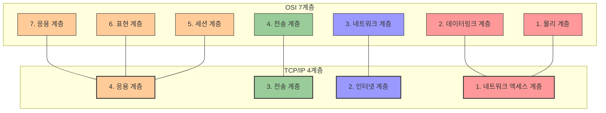
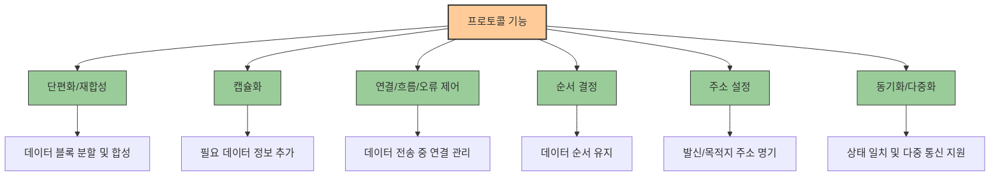
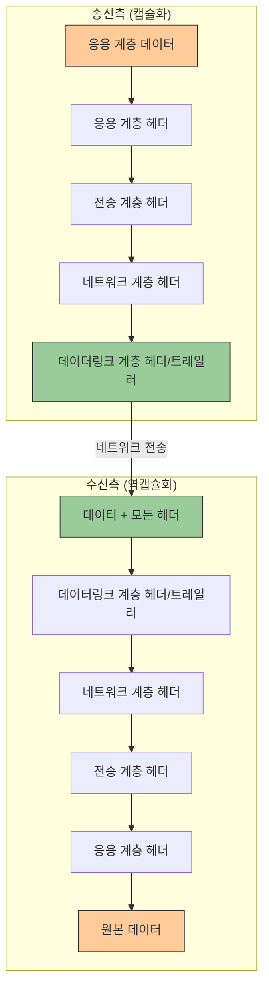
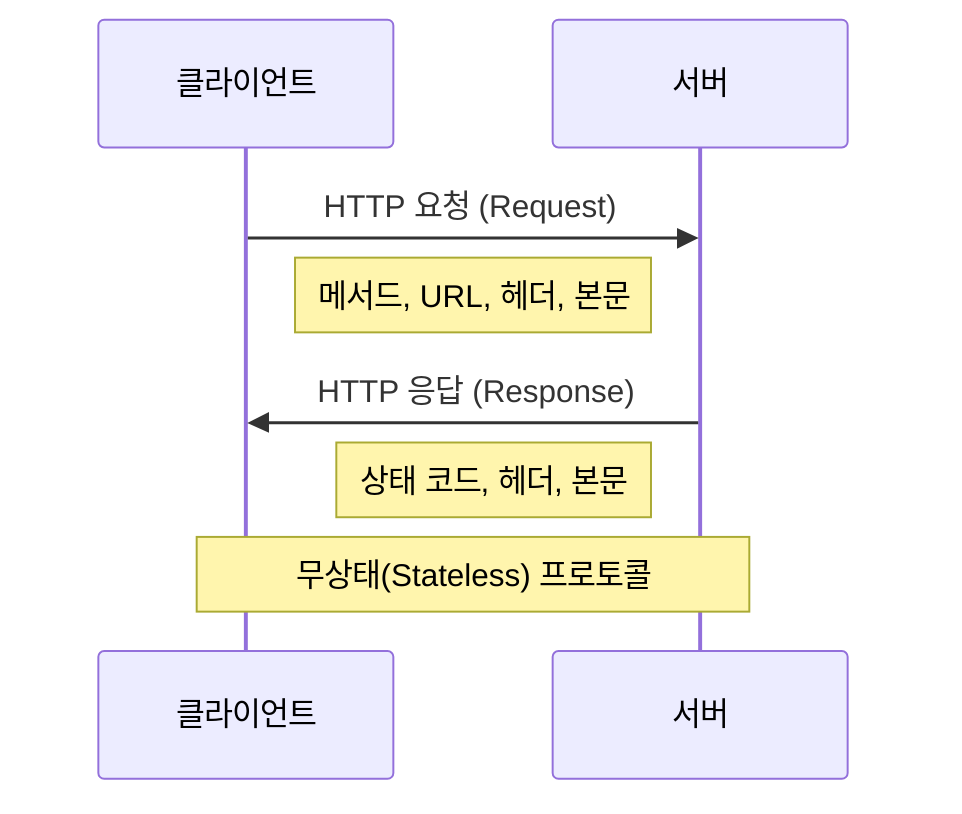
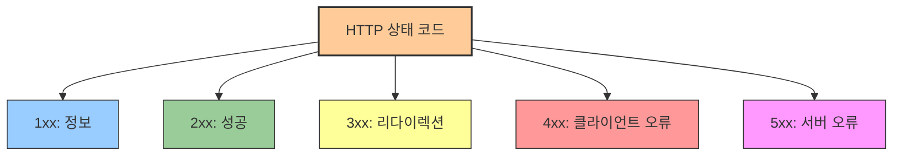
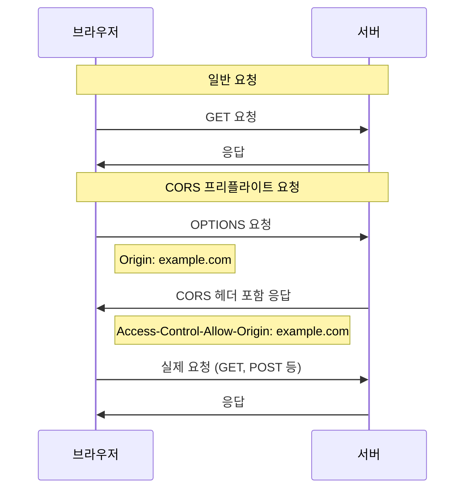

# 2. 인터넷과 HTTP 🌐

## 목차
- [2. 인터넷과 HTTP 🌐](#2-인터넷과-http-)
  - [목차](#목차)
  - [TCP/IP란? 📡](#tcpip란-)
    - [OSI 7계층 vs TCP/IP 모델](#osi-7계층-vs-tcpip-모델)
    - [인터넷, 인트라넷, 엑스트라넷](#인터넷-인트라넷-엑스트라넷)
  - [프로토콜이란? 📋](#프로토콜이란-)
    - [네트워크 아키텍처](#네트워크-아키텍처)
    - [프로토콜 기능](#프로토콜-기능)
    - [캡슐화와 역캡슐화](#캡슐화와-역캡슐화)
    - [OSI 7계층과 프로토콜 예시](#osi-7계층과-프로토콜-예시)
  - [HTTP란? 🔄](#http란-)
    - [HTTP 구조](#http-구조)
    - [HTTP 메서드와 CRUD](#http-메서드와-crud)
  - [HTML Status Code 🔢](#html-status-code-)
    - [1xx (정보)](#1xx-정보)
    - [2xx (성공)](#2xx-성공)
    - [3xx (리다이렉션)](#3xx-리다이렉션)
    - [4xx (클라이언트 오류)](#4xx-클라이언트-오류)
    - [5xx (서버 오류)](#5xx-서버-오류)
  - [CORS란? 🛡️](#cors란-️)
    - [CORS 요청 종류](#cors-요청-종류)
    - [Same-Origin vs Same-Site](#same-origin-vs-same-site)

---

## TCP/IP란? 📡

**TCP/IP**는 데이터가 정확한 목적지에 도달할 수 있도록 해주는 **통신 규약**이다. 디바이스를 연결하는 여러 **프로토콜의 집합**으로, 개별적으로도 사용 가능하다. 

**TCP**는 연결 지향형 프로토콜로, 다음과 같은 규칙을 따른다:

- **신뢰성**: 데이터 손실을 최소화하고, 순서를 보장한다.
- **흐름 제어**: 수신자의 처리 속도에 맞춰 데이터 전송 속도를 조절한다.
- **다중화**: 여러 개의 연결을 동시에 처리한다.  

### OSI 7계층 vs TCP/IP 모델

네트워크 통신 과정을 구분할 때, **OSI 7계층 모델**과 **TCP/IP 4계층 모델**이 사용된다. OSI 7계층은 응용, 표현, 세션, 전송, 네트워크, 데이터링크, 물리 계층으로 구성되며, TCP/IP 모델은 이를 간소화해 **응용, 전송, 인터넷, 네트워크 엑세스 계층**으로 나눈다.



| 계층 | TCP/IP 모델 | 데이터 단위 | 주요 기능 | 대표 프로토콜 |
|-----|------------|------------|----------|-------------|
| 4 | **응용 계층**<br>(Application) | DATA/Message | 응용프로그램 간 데이터 송수신 담당 | HTTP, SMTP, FTP |
| 3 | **전송 계층**<br>(Transport) | Segment | 포트 번호로 송수신 연결, 자료 송수신 제어 | TCP, UDP |
| 2 | **인터넷 계층**<br>(Internet) | Packet | IP 주소로 목적지까지 정확한 연결 | IP, ICMP, ARP |
| 1 | **네트워크 엑세스 계층**<br>(Network Access) | Frame | 물리적 데이터 전송 방식 정의, MAC 주소 사용 | Ethernet, Wi-Fi |

### 인터넷, 인트라넷, 엑스트라넷

**인터넷**은 전 세계 컴퓨터들을 하나로 연결하는 **거대한 통신망**이다. 사용자들은 시간과 장소에 구애받지 않고 쌍방향 통신이 가능하다. 초기에는 텍스트 기반이었으나, 현재는 이미지, 음성, 동영상 등 다양한 포맷의 통신을 지원한다.

| 구분 | 인터넷 | 인트라넷 | 엑스트라넷 |
|------|-------|---------|----------|
| **정의** | 전 세계적으로 연결된 컴퓨터 네트워크 | 기업 내부용 네트워크 | 기업과 외부 파트너 간 네트워크 |
| **접근 범위** | 모든 사람 | 조직 내부 사용자만 | 조직 내부 + 승인된 외부 파트너 |
| **주요 목적** | 정보 공유, 소통, 서비스 이용 | 내부 정보 공유, 업무 효율화 | 협력사와 정보 공유, 업무 협력 |
| **보안 수준** | 낮음 (공개됨) | 높음 (폐쇄적) | 중간 (제한적 공개) |
| **접속 예시** | google.com, naver.com | 회사 내부 포털, 그룹웨어 | 공급망 관리 시스템, B2B 플랫폼 |

---

## 프로토콜이란? 📋

**프로토콜**은 통신에 필요한 **형식, 약속, 규칙**을 정의한다. 데이터의 형식(**구문**), 제어 정보의 의미(**의미**), 통신 속도와 순서(**시간**) 등을 규정한다.

### 네트워크 아키텍처

복잡한 네트워크 시스템을 **프로토콜의 조합**으로 단순화한 것이 **네트워크 아키텍처**이다. 건축물의 뼈대처럼, 네트워크 아키텍처는 전체 시스템의 구조를 정의한다.

### 프로토콜 기능

프로토콜은 다양한 기능을 수행한다.



### 캡슐화와 역캡슐화

상위 계층에서 데이터에 프로토콜 정보를 추가하는 과정을 **캡슐화**, 수신 측에서 이를 제거하는 과정을 **역캡슐화**라 한다.



### OSI 7계층과 프로토콜 예시

| 계층 | 주요 프로토콜 예시 |
|------|-----------------|
| **응용 계층** | HTTP, SMTP, FTP, Telnet, DNS |
| **표현 계층** | ASCII, MPEG, JPEG, MIDI, SSL/TLS |
| **세션 계층** | NetBIOS, SAP, SDP, NWLink |
| **전송 계층** | TCP, UDP, SCTP |
| **네트워크 계층** | IP, ICMP, ARP, RARP |
| **데이터 링크 계층** | Ethernet, Token Ring, PPP, HDLC |
| **물리 계층** | RS-232, RS-449, X.21, SONET |

---

## HTTP란? 🔄

**HTTP (HyperText Transfer Protocol)**는 인터넷에서 데이터를 주고받기 위한 프로토콜이다. **클라이언트-서버 모델**을 따르며, **무상태(stateless)** 프로토콜로 서버가 상태 정보를 유지하지 않는다.



### HTTP 구조

HTTP 메시지는 다음 네 가지 구성으로 이루어진다.

```
GET /index.html HTTP/1.1       ← Start Line
Host: www.example.com          ↑
User-Agent: Mozilla/5.0        | Header
Accept: text/html              ↓
                               ← Empty Line
(요청 본문이 있다면 여기에)      ← Message Body
```

| 구성 요소 | 설명 | 예시 |
|---------|------|------|
| **Start Line** | 요청 라인(클라이언트) 또는<br>상태 라인(서버) | `GET /index.html HTTP/1.1`<br>`HTTP/1.1 200 OK` |
| **Header** | 요청/응답에 대한 부가 정보<br>(이름-값 쌍) | `Host: www.example.com`<br>`Content-Type: text/html` |
| **Empty Line** | 헤더와 본문을 구분하는 빈 줄 | (공백 라인) |
| **Message Body** | 실제 데이터 내용 | HTML 문서, 이미지 데이터 등 |

### HTTP 메서드와 CRUD

주요 HTTP 메서드는 다음과 같다.

| HTTP 메서드 | CRUD 작업 | 설명 | 특징 |
|-----------|----------|------|------|
| **GET** | Read | 자원 조회 | • 서버에서 데이터를 가져옴<br>• URL에 데이터가 노출됨<br>• 캐싱 가능 |
| **POST** | Create | 자원 생성 | • 새로운 리소스 생성<br>• 요청 본문에 데이터 포함<br>• 멱등성 없음 |
| **PUT** | Update | 자원 수정<br>(전체 교체) | • 리소스를 완전히 대체<br>• 멱등성 있음 |
| **PATCH** | Update | 자원 수정<br>(부분 변경) | • 리소스 일부만 수정<br>• 멱등성은 구현에 따라 다름 |
| **DELETE** | Delete | 자원 삭제 | • 지정된 리소스 삭제<br>• 멱등성 있음 |
| **HEAD** | - | 헤더 정보 조회 | • GET과 동일하나 본문 없이 헤더만 반환 |
| **OPTIONS** | - | 통신 옵션 확인 | • 서버 지원 메서드 확인<br>• CORS에서 사용 |

> **멱등성(Idempotency)**: 동일한 요청을 여러 번 보내도 결과가 같은 성질

---

## HTML Status Code 🔢

**상태코드(Status Code)**는 클라이언트 요청에 대한 서버의 응답 상태를 나타낸다.



### 1xx (정보)

| 코드 | 설명 | 의미 |
|-----|------|------|
| **100** | Continue | 요청 헤더는 수신, 본문 전송 가능 |
| **101** | Switching Protocols | 프로토콜 변경 요청 수락 |
| **102** | Processing | 요청 수신 후 처리 중 |
| **103** | Checkpoint | 중단된 요청 재개 가능 |

### 2xx (성공)

| 코드 | 설명 | 의미 |
|-----|------|------|
| **200** | OK | 요청 성공 |
| **201** | Created | 새 자원 생성 |
| **202** | Accepted | 요청 수락, 처리 미완료 |
| **204** | No Content | 성공했지만 전송할 데이터 없음 |
| **206** | Partial Content | 일부 데이터만 전송됨 |

### 3xx (리다이렉션)

| 코드 | 설명 | 의미 |
|-----|------|------|
| **301** | Moved Permanently | 영구적 이동 |
| **302** | Found | 임시적 이동 |
| **304** | Not Modified | 변경 없음 |
| **307** | Temporary Redirect | 요청 메서드 유지하며 임시 이동 |
| **308** | Permanent Redirect | 요청 메서드 유지하며 영구 이동 |

### 4xx (클라이언트 오류)

| 코드 | 설명 | 의미 |
|-----|------|------|
| **400** | Bad Request | 문법 오류 |
| **401** | Unauthorized | 인증 필요 |
| **403** | Forbidden | 접근 금지 |
| **404** | Not Found | 요청 자원 없음 |
| **405** | Method Not Allowed | 지원하지 않는 메서드 |
| **429** | Too Many Requests | 요청 과다 |

### 5xx (서버 오류)

| 코드 | 설명 | 의미 |
|-----|------|------|
| **500** | Internal Server Error | 서버 내부 오류 |
| **502** | Bad Gateway | 게이트웨이 문제 |
| **503** | Service Unavailable | 과부하, 서비스 불가 |
| **504** | Gateway Timeout | 게이트웨이 시간 초과 |

---

## CORS란? 🛡️

웹 보안을 위해 **SOP (Same-Origin Policy)**가 적용된다. 이는 동일 출처에서만 데이터 요청을 허용하는 정책이다. 출처는 **프로토콜, 호스트, 포트 번호** 조합으로 정의된다.

서로 다른 출처 간 요청을 허용하려면 **CORS (Cross-Origin Resource Sharing)** 정책을 사용한다.



### CORS 요청 종류

| 요청 유형 | 특징 | 사용되는 경우 |
|----------|------|-------------|
| **Simple Request** | • GET, POST, HEAD 메서드 사용<br>• Content-Type 제한<br>• 사용자 정의 헤더 없음 | 간단한 요청<br>(기본 폼 제출 등) |
| **Preflighted Request** | • OPTIONS 메서드로 사전 확인<br>• 본 요청 전 서버가 허용하는지 확인<br>• 다양한 CORS 헤더 사용 | 복잡한 요청<br>(PUT, JSON 데이터 등) |

### Same-Origin vs Same-Site

**Same-Origin**은 프로토콜, 호스트, 포트 번호가 모두 동일해야 하며, **Same-Site**는 도메인만 동일하면 된다.

| URL | `https://www.example.com`에 대해 |
|-----|--------------------------------|
| `https://www.example.com/page2` | Same-Origin, Same-Site |
| `https://login.example.com` | Different-Origin, Same-Site |
| `http://www.example.com` | Different-Origin, Same-Site |
| `https://www.example.com:8080` | Different-Origin, Same-Site |
| `https://www.other.com` | Different-Origin, Different-Site |
