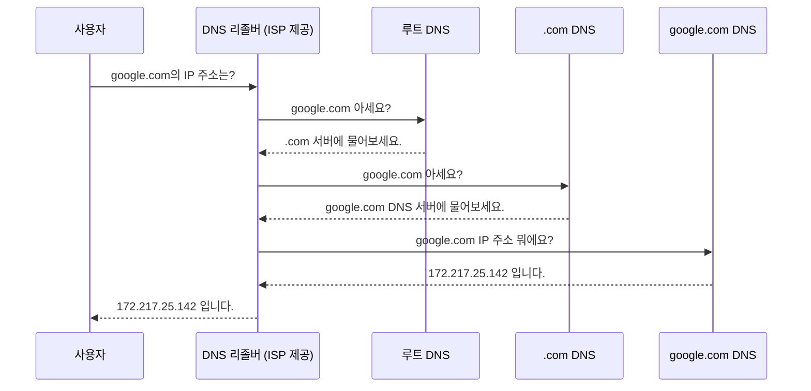

# 3. 인터넷의 주요 프로토콜들 🌐

## 목차
- [3. 인터넷의 주요 프로토콜들 🌐](#3-인터넷의-주요-프로토콜들-)
  - [목차](#목차)
  - [주소 지정을 위한 프로토콜: IP, DNS, DHCP](#주소-지정을-위한-프로토콜-ip-dns-dhcp)
    - [IP (Internet Protocol): 인터넷의 주소 체계](#ip-internet-protocol-인터넷의-주소-체계)
    - [DNS (Domain Name System): IP 주소의 전화번호부](#dns-domain-name-system-ip-주소의-전화번호부)
    - [DHCP (Dynamic Host Configuration Protocol): 자동 IP 할당](#dhcp-dynamic-host-configuration-protocol-자동-ip-할당)
  - [데이터 전송을 위한 프로토콜: TCP vs. UDP](#데이터-전송을-위한-프로토콜-tcp-vs-udp)
    - [TCP (Transmission Control Protocol): 신뢰의 핸드셰이크](#tcp-transmission-control-protocol-신뢰의-핸드셰이크)
    - [UDP (User Datagram Protocol): 빠르고 간편한 전송](#udp-user-datagram-protocol-빠르고-간편한-전송)
  - [응용 계층의 프로토콜들](#응용-계층의-프로토콜들)
    - [FTP (File Transfer Protocol): 파일 전송](#ftp-file-transfer-protocol-파일-전송)
    - [SMTP, POP3, IMAP: 이메일 전송 및 수신](#smtp-pop3-imap-이메일-전송-및-수신)
  - [보안을 위한 프로토콜: SSH, SSL/TLS](#보안을-위한-프로토콜-ssh-ssltls)
    - [SSH (Secure Shell): 안전한 원격 제어](#ssh-secure-shell-안전한-원격-제어)
    - [SSL/TLS 와 HTTPS: 안전한 웹 통신](#ssltls-와-https-안전한-웹-통신)

---

## 주소 지정을 위한 프로토콜: IP, DNS, DHCP

### IP (Internet Protocol): 인터넷의 주소 체계
**IP**는 인터넷에 연결된 모든 장치를 식별하는 주소 체계이자, 데이터 조각(패킷)을 목적지까지 전달하는 기본적인 규칙입니다. 하지만 IP 자체는 데이터가 제대로 도착했는지 보장하지 않는 **비신뢰성, 비연결형** 프로토콜입니다. (이후 설명할 TCP가 신뢰성을 보장합니다.)

### DNS (Domain Name System): IP 주소의 전화번호부
사람은 `google.com`과 같은 도메인 이름을 기억하기 쉽지만, 컴퓨터는 `172.217.25.142`와 같은 IP 주소로 통신합니다. **DNS**는 이 **도메인 이름을 IP 주소로 변환**해주는, 인터넷의 거대한 분산 전화번호부 시스템입니다.

> 실제로는 효율성을 위해 각 단계의 응답이 캐시(Cache)에 저장되어, 반복적인 요청은 더 빠르게 처리됩니다.

### DHCP (Dynamic Host Configuration Protocol): 자동 IP 할당
네트워크에 새로운 장치가 연결될 때마다 수동으로 IP 주소를 설정하는 것은 매우 번거롭습니다. **DHCP**는 네트워크에 참여하는 장치에게 **IP 주소, 서브넷 마스크, 기본 게이트웨이, DNS 서버 주소** 등의 정보를 **자동으로 할당**해주는 프로토콜입니다. 우리가 카페 와이파이에 접속하면 별도 설정 없이 바로 인터넷을 사용할 수 있는 것이 DHCP 덕분입니다.

---

## 데이터 전송을 위한 프로토콜: TCP vs. UDP

IP가 데이터 패킷을 목적지 컴퓨터까지 '배달'해주면, 그 컴퓨터 안의 수많은 프로그램 중 어떤 프로그램에게 전달할지 결정하고, 데이터가 올바르게 전달되었는지 확인하는 역할은 전송 계층의 TCP와 UDP가 담당합니다. 이 둘은 **포트(Port) 번호**를 사용하여 프로그램을 구분합니다.

### TCP (Transmission Control Protocol): 신뢰의 핸드셰이크
**TCP**는 **신뢰성**이 가장 중요한 통신에 사용되는 **연결 지향형** 프로토콜입니다.

- **3-Way Handshake**: 데이터를 보내기 전, "연결할까요?(SYN) -> 네, 좋아요!(SYN+ACK) -> 알겠습니다!(ACK)" 과정을 통해 상대방과 연결을 설정합니다.
- **데이터 확인**: 데이터를 보낸 후, 잘 받았는지 응답(ACK)을 확인하고, 데이터가 순서대로 도착했는지 검사하며, 손실된 경우 재전송을 요청합니다.
- **사용 사례**: 웹 브라우징(HTTP), 파일 전송(FTP), 이메일(SMTP) 등 데이터의 정확성이 100% 보장되어야 하는 경우.

### UDP (User Datagram Protocol): 빠르고 간편한 전송
**UDP**는 신뢰성보다 **속도와 실시간성**이 중요한 통신에 사용되는 **비연결형** 프로토콜입니다.

- **특징**: 연결 설정 과정이 없고, 데이터를 그냥 '보내기만' 합니다. 중간에 데이터가 일부 유실되거나 순서가 뒤바뀌어도 신경 쓰지 않습니다.
- **사용 사례**: 온라인 게임, 영상 스트리밍, 인터넷 전화(VoIP) 등 약간의 데이터 손실이 있더라도 끊김 없이 빠르게 전송하는 것이 더 중요한 경우.

| 구분 | TCP (신뢰성) | UDP (속도) |
|---|---|---|
| **연결 설정** | 필요 (3-way handshake) | 불필요 |
| **신뢰성 보장** | O (데이터 순서, 손실 확인) | X |
| **속도** | 상대적으로 느림 | 빠름 |
| **주요 사용처** | 웹, 이메일, 파일 전송 | 스트리밍, 온라인 게임, DNS |

---

## 응용 계층의 프로토콜들

### FTP (File Transfer Protocol): 파일 전송
네트워크를 통해 컴퓨터 간에 파일을 전송하기 위한 표준 프로토콜입니다. (포트: 20, 21)
- **SFTP (Secure FTP)** : SSH 위에서 동작하여 파일 전송 구간을 암호화한, 훨씬 안전한 버전의 FTP입니다.

### SMTP, POP3, IMAP: 이메일 전송 및 수신
- **SMTP (Simple Mail Transfer Protocol)** : 사용자가 작성한 이메일을 메일 서버로, 그리고 서버 간에 이메일을 **전송(Push)** 할 때 사용하는 프로토콜입니다. (포트: 25)
- **POP3 / IMAP**: 메일 서버에 도착한 이메일을 사용자의 클라이언트(아웃룩, 스마트폰 등)로 **가져올(Pull)**  때 사용하는 프로토콜입니다.
    - **POP3**: 메일을 클라이언트로 다운로드하고 서버에서는 삭제하는 방식. (단일 기기 사용에 적합)
    - **IMAP**: 서버에서 메일을 직접 관리하는 방식. 여러 기기에서 메일 상태가 동기화됨. (현대적 방식)

---

## 보안을 위한 프로토콜: SSH, SSL/TLS

### SSH (Secure Shell): 안전한 원격 제어
**SSH**는 다른 컴퓨터에 원격으로 접속하여 명령을 실행하고 시스템을 제어할 때, 모든 통신 내용을 암호화하여 안전하게 연결을 유지하는 프로토콜입니다. (포트: 22) 데이터 사이언티스트가 원격 서버에 접속할 때 필수적으로 사용합니다.

### SSL/TLS 와 HTTPS: 안전한 웹 통신
- **SSL/TLS**: 웹 브라우저와 서버 간의 통신을 암호화하여, 중간에서 데이터를 훔쳐보거나 위변조하는 것을 방지하는 보안 프로토콜입니다. (TLS가 SSL의 후속 버전으로, 현재는 TLS가 표준입니다.)
- **HTTPS (HTTP Secure)** : HTTP 통신 전체를 SSL/TLS로 암호화하는 방식입니다. 주소창에 자물쇠 아이콘이 표시되며, 로그인, 결제 등 민감한 정보를 다루는 모든 웹사이트의 표준입니다. (포트: 443)