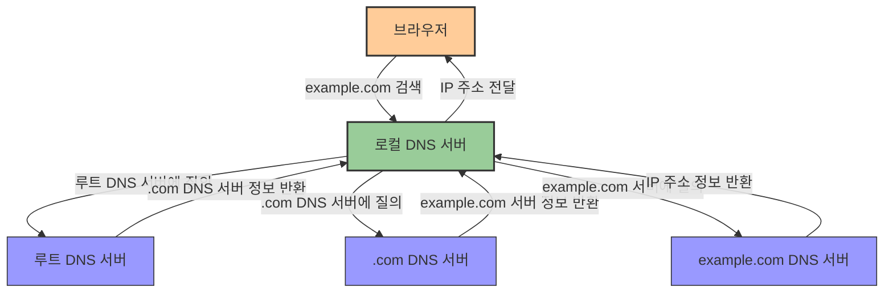
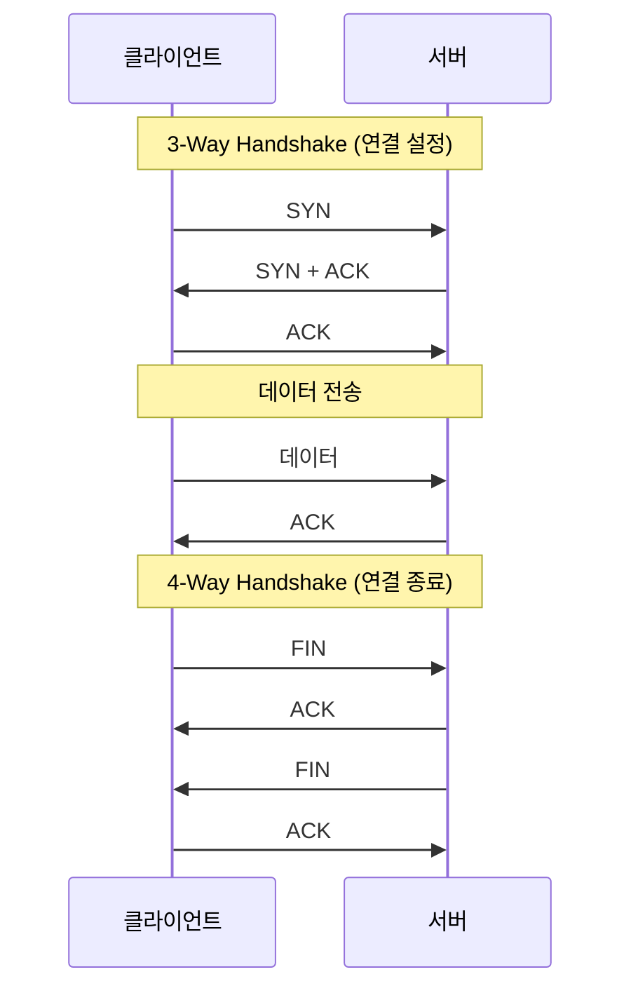
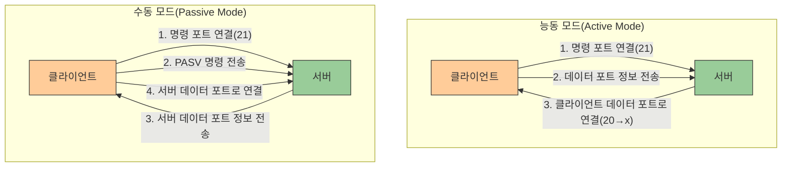
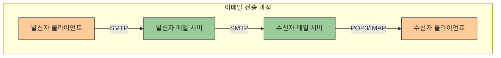
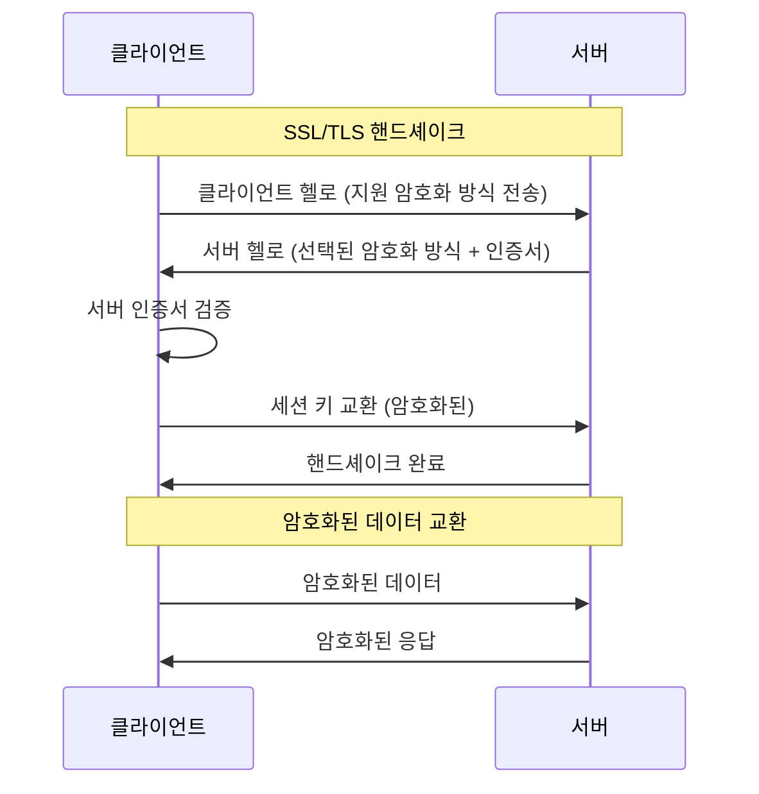

# 3. 주요 프로토콜들 🌐

## 목차
- [3. 주요 프로토콜들 🌐](#3-주요-프로토콜들-)
  - [목차](#목차)
  - [IP, DNS, DHCP 📡](#ip-dns-dhcp-)
    - [IP(Internet Protocol)](#ipinternet-protocol)
    - [DNS(Domain Name System)](#dnsdomain-name-system)
    - [DHCP(Dynamic Host Configuration Protocol)](#dhcpdynamic-host-configuration-protocol)
  - [TCP/UDP 🔄](#tcpudp-)
    - [TCP(Transmission Control Protocol)](#tcptransmission-control-protocol)
    - [UDP(User Datagram Protocol)](#udpuser-datagram-protocol)
    - [TCP vs UDP 비교](#tcp-vs-udp-비교)
  - [FTP 📂](#ftp-)
    - [FTP 종류](#ftp-종류)
    - [FTP 모드](#ftp-모드)
    - [SFTP vs FTP](#sftp-vs-ftp)
  - [SMTP 📧](#smtp-)
    - [이메일 프로토콜 비교](#이메일-프로토콜-비교)
  - [SSH 🔐](#ssh-)
    - [SSH 동작 원리](#ssh-동작-원리)
  - [SSL/TLS 🔒](#ssltls-)
    - [HTTPS](#https)

---

## IP, DNS, DHCP 📡

### IP(Internet Protocol)

**IP(Internet Protocol)**은 네트워크에서 정보를 송수신하는 규약이다. IP는 **비신뢰성**과 **비연결형** 특성을 가진다. 즉, 데이터가 정확히 도착함을 보장하지 않으며, 별도의 연결 설정 없이 데이터를 전송한다. 또한, **IP 주소**를 통해 각 장치를 식별하고 **라우팅 경로 설정**이 가능하다.

### DNS(Domain Name System)

**DNS(Domain Name System)**는 인터넷 전화번호부 역할을 한다. 사용자는 도메인 이름을 입력해 정보를 요청하면, DNS가 이를 IP 주소로 변환한다. 

- **DNS 조회 단계**: 
  1. 웹 브라우저가 도메인으로 요청
  2. DNS 서버가 TLD 서버에 IP 요청
  3. TLD 서버 응답
  4. DNS 서버가 IP 응답

- **DNS 질의 방식**: 
  - **재귀적 질의**: Root DNS 서버로부터 하향식으로 IP 주소를 재귀적으로 반환.
  - **반복적 질의**: Local DNS 서버가 각각의 서버에 직접 요청.

### DHCP(Dynamic Host Configuration Protocol)

**DHCP(Dynamic Host Configuration Protocol)**는 네트워크 장치에 IP 주소와 기타 정보를 자동 할당한다.

- **할당 종류**:
  - **수동 할당**: 관리자가 개별 장비에 고정 설정.
  - **자동 할당**: IP 주소 영구 할당.
  - **동적 할당**: 제한된 IP를 임시로 할당 후 재활용.

- **DHCP 동작 원리**: 
  1. **DHCP Discover**: 클라이언트가 브로드캐스트로 DHCP 서버 탐색
  2. **DHCP Offer**: 서버가 사용 가능한 IP 주소 제안
  3. **DHCP Request**: 클라이언트가 제안된 IP 주소 요청
  4. **DHCP Acknowledge**: 서버가 IP 주소 사용 허가

| 용도 | 설명 |
|------|------|
| IP 주소 할당 | 클라이언트에 고유 IP 주소 제공 |
| 네트워크 설정 정보 | 서브넷 마스크, 기본 게이트웨이, DNS 서버 주소 등 제공 |
| IP 주소 관리 | 주소 충돌 방지 및 효율적인 IP 주소 사용 |

---

## TCP/UDP 🔄

### TCP(Transmission Control Protocol)

**TCP(Transmission Control Protocol)**는 신뢰성 있는 데이터 전송을 위한 연결형 프로토콜이다.

- **특징**: 
  - 연결형 프로토콜
  - 흐름/혼잡 제어 기능
  - 높은 신뢰성 보장
  - 전이중(Full-Duplex) 방식 통신

- **연결 관리**:
  - **3-Way Handshake**: 연결 설정 (SYN → SYN+ACK → ACK)
  - **4-Way Handshake**: 연결 해제 (FIN → ACK → FIN → ACK)

### UDP(User Datagram Protocol)

**UDP(User Datagram Protocol)** 는 빠른 전송을 위한 비연결형 프로토콜이다.

- **특징**: 
  - 비연결형 프로토콜
  - 신뢰성 낮음 (패킷 손실 가능)
  - 속도 빠름
  - 순서 보장 없음

### TCP vs UDP 비교

| 항목 | TCP | UDP |
|------|-----|-----|
| **연결 방식** | 연결형 | 비연결형 |
| **전송 순서** | 보장 | 보장 X |
| **수신 여부 확인** | O | X |
| **통신 방식** | 1:1 | 1:1, 1:N, N:N |
| **신뢰성** | 높음 | 낮음 |
| **속도** | 느림 | 빠름 |
| **오류 제어** | 있음 | 최소한 또는 없음 |
| **혼잡 제어** | 있음 | 없음 |
| **헤더 크기** | 20-60 바이트 | 8 바이트 |
| **사용 예시** | 웹 브라우징, 이메일, 파일 전송 | 스트리밍, 게임, DNS 조회 |

---

## FTP 📂

**FTP(File Transfer Protocol)**는 한 컴퓨터에서 다른 컴퓨터로 파일을 전송하는 프로토콜이다. 

- **21번 포트**로 명령 제어, **20번 포트**로 데이터 전송.
- **3-Way Handshake**로 연결 후 데이터 송수신.

### FTP 종류

| 종류 | 설명 | 특징 |
|------|------|------|
| **FTP** | 표준 파일 전송 프로토콜 | ID, 비밀번호 인증 후 TCP 사용 |
| **TFTP** | 간소화된 FTP | 인증 없이 UDP 기반, 69번 포트 사용 |
| **SFTP** | 보안 강화 FTP | SSH를 이용해 전송 구간 암호화 |

### FTP 모드

- **능동 모드(Active Mode)**: 
  - 서버가 데이터 연결 주도
  - 클라이언트가 포트 지정하고 서버가 연결 시도
  - 방화벽 환경에서 문제 발생 가능

- **수동 모드(Passive Mode)**: 
  - 서버는 대기 상태 유지
  - 클라이언트가 데이터 채널 설정
  - 방화벽 환경에서 더 안정적

### SFTP vs FTP

| 항목 | SFTP | FTP |
|------|-----|-----|
| **보안성** | 높음 (암호화 통신) | 낮음 (평문 통신) |
| **방화벽 안정성** | 안정적 | 취약 |
| **포트** | 단일 포트 (22) | 여러 포트 (20, 21) |
| **인증** | SSH 키 또는 비밀번호 | 주로 비밀번호 |
| **암호화** | 데이터와 명령 모두 암호화 | 암호화 없음 |
| **효율성** | 단일 연결로 다양한 파일 작업 | 각 작업마다 새 연결 필요 |

---

## SMTP 📧

**SMTP(Simple Mail Transfer Protocol)**는 네트워크에서 전자우편을 전송하는 프로토콜이다.

- **POP3(Post Office Protocol version 3)**: 
  - 메일 서버에서 이메일을 클라이언트로 전송해 로컬에 저장
  - 기본적으로 다운로드 후 서버에서 삭제
  - 단일 기기에서 이메일 관리에 적합

- **IMAP(Internet Message Access Protocol)**: 
  - 원격 서버에서 메일을 관리
  - 다양한 기기에서 동기화 가능
  - 서버에 이메일 보관, 필요시 접근

### 이메일 프로토콜 비교

| 특성 | SMTP | IMAP | POP3 |
|------|------|------|------|
| **주요 기능** | 이메일 발송 | 서버에서 메일 관리 | 서버에서 메일 다운로드 |
| **방향성** | 발신 | 양방향 | 수신 |
| **포트** | 25, 587 | 143, 993(SSL) | 110, 995(SSL) |
| **이메일 저장** | 전송만 담당 | 서버에 보관 | 로컬에 다운로드 |
| **다중 기기** | 해당 없음 | 지원 (동기화) | 제한적 |
| **네트워크 사용** | 발송 시 | 지속적 연결 필요 | 다운로드 시에만 |
| **서버 공간** | 해당 없음 | 많이 사용 | 최소한 사용 |

---

## SSH 🔐

**TELNET**은 원격 접속 서비스로, 사용자가 네트워크를 통해 다른 컴퓨터에 접속할 수 있게 한다. 다만 보안성이 낮다.

**SSH(Secure Shell)** 는 **원격 접속**을 위한 보안 프로토콜이다.

- **특징**: 
  - 데이터 전송 및 원격 제어
  - 모든 데이터 암호화
  - 트래픽 압축 기능
  - 22번 포트 사용
  - Public/Private Key 기반 인증

### SSH 동작 원리

SSH는 다음과 같은 단계로 동작한다:

1. **연결 설정**: 클라이언트가 서버에 연결 시도
2. **서버 인증**: 서버의 공개 키를 확인해 서버 신원 확인
3. **키 교환**: 안전한 세션 키 생성을 위한 키 교환
4. **암호화 통신**: 생성된 세션 키로 통신 암호화
5. **사용자 인증**: 비밀번호 또는 키 기반 인증

| SSH 특징 | 설명 |
|---------|------|
| **보안성** | 모든 통신 암호화로 도청 방지 |
| **인증 방식** | 비밀번호, 공개키, 키보드-인터랙티브 등 다양한 방식 |
| **포트 포워딩** | 로컬, 원격, 동적 포트 포워딩 지원 |
| **X11 포워딩** | 그래픽 애플리케이션 원격 실행 가능 |
| **SCP/SFTP** | 안전한 파일 전송 기능 내장 |

---

## SSL/TLS 🔒

**SSL(Secure Sockets Layer)** 와 **TLS(Transport Layer Security)** 는 인터넷에서 데이터를 암호화해 보안을 강화하는 프로토콜이다.

- **주요 기능**:
  - 클라이언트와 서버 간 상호 인증
  - 핸드셰이크를 통한 안전한 연결 설정
  - 통신 내용 암호화로 도청 방지
  - 데이터 **무결성** 보장을 위한 디지털 서명

- **발전 과정**:
  - **SSL 2.0/3.0**: 초기 버전, 보안 취약점 발견으로 사용 중단
  - **TLS 1.0/1.1**: SSL에서 개선된 버전, 현재는 지원 중단
  - **TLS 1.2**: 높은 보안성, 현재 널리 사용
  - **TLS 1.3**: 최신 버전, 개선된 성능과 보안

### HTTPS

**HTTPS(Hyper Text Transfer Protocol Secure)**는 SSL/TLS를 적용한 HTTP 프로토콜로, 웹 데이터 전송 시 보안을 강화한다.

| 특성 | HTTP | HTTPS |
|------|------|-------|
| **보안** | 암호화 없음 | SSL/TLS로 암호화 |
| **포트** | 80 | 443 |
| **URL 시작** | http:// | https:// |
| **인증서** | 필요 없음 | SSL/TLS 인증서 필요 |
| **속도** | 상대적으로 빠름 | 약간의 오버헤드 발생 |
| **검색 엔진 순위** | 낮음 | 높음 (SEO 이점) |
| **사용 사례** | 비중요 정보 | 로그인, 결제, 개인정보 처리 |
