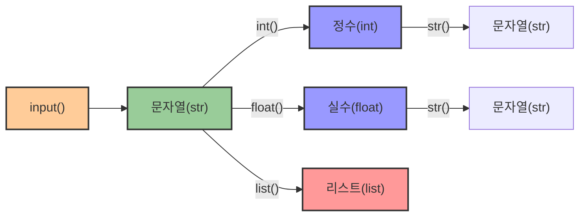
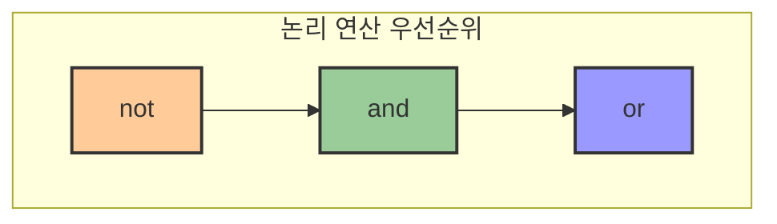
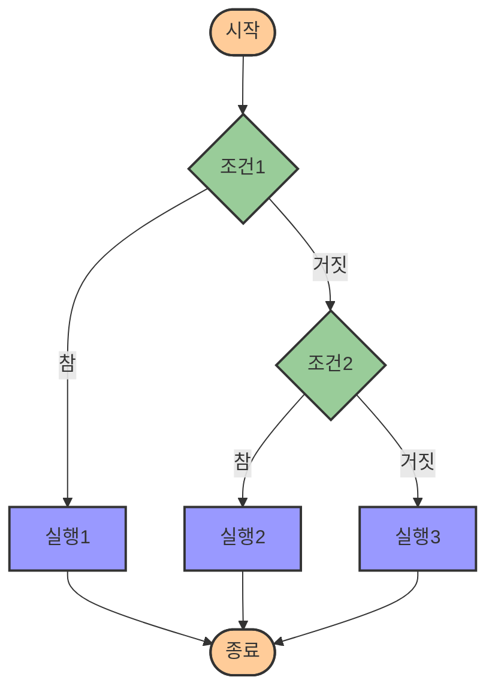

# 2. 분기의 기초가 되는 조건문 🔀

## 목차
- [2. 분기의 기초가 되는 조건문 🔀](#2-분기의-기초가-되는-조건문-)
  - [목차](#목차)
  - [값을 입력받는 함수, input 📥](#값을-입력받는-함수-input-)
    - [형변환 예시](#형변환-예시)
  - [논리 자료형과 비교연산 ⚖️](#논리-자료형과-비교연산-️)
    - [비교 연산자](#비교-연산자)
    - [논리 연산자](#논리-연산자)
  - [조건에 따라 코드를 실행하고 싶을 때: if 🚦](#조건에-따라-코드를-실행하고-싶을-때-if-)
  - [조건이 맞지 않는 경우의 분기점: if-else, if-elif 🔄](#조건이-맞지-않는-경우의-분기점-if-else-if-elif-)
    - [if-else 문](#if-else-문)
    - [if-elif-else 문](#if-elif-else-문)

---

## 값을 입력받는 함수, input 📥

`input()` 함수는 사용자로부터 값을 입력받을 수 있게 한다. 입력된 값은 항상 **문자열(str)** 형태로 저장된다. 따라서 다른 형태의 자료로 활용하려면 **형변환**이 필요하다.

| 함수 | 설명 | 예시 |
|------|------|------|
| **input()** | 사용자로부터 입력 받기 | `input("값을 입력하세요: ")` |
| **input("메시지")** | 안내 메시지와 함께 입력 받기 | `input("이름을 입력하세요: ")` |

```python
var = input("값을 입력하세요: ")
print(var)         # 입력값 출력
print(type(var))   # <class 'str'>
```

### 형변환 예시

| 함수 | 변환 | 예시 | 결과 |
|------|------|------|------|
| **int()** | 문자열 → 정수 | `int("123")` | `123` |
| **float()** | 문자열 → 실수 | `float("3.14")` | `3.14` |
| **str()** | 숫자 → 문자열 | `str(123)` | `"123"` |
| **list()** | 문자열 → 리스트 | `list("abc")` | `['a', 'b', 'c']` |

```python
num_str = "123"
num_int = int(num_str)
print(num_int + 5)  # 128
```



---

## 논리 자료형과 비교연산 ⚖️

**논리 자료형(Boolean)**은 참(`True`)과 거짓(`False`) 두 가지 값만 가진다.

### 비교 연산자
| 연산자 | 의미          | 예시          | 결과  |
|-------|--------------|--------------|------|
| `==`  | 같다         | `3 == 3`     | True |
| `!=`  | 다르다       | `3 != 4`     | True |
| `<`   | 작다         | `3 < 5`      | True |
| `>`   | 크다         | `7 > 2`      | True |
| `<=`  | 작거나 같다 | `3 <= 3`     | True |
| `>=`  | 크거나 같다 | `5 >= 6`     | False |

### 논리 연산자

| 연산자 | 의미 | 예시 | 결과 |
|--------|------|------|------|
| **and** | 모두 True여야 True | `True and True` | `True` |
| **or** | 하나라도 True면 True | `True or False` | `True` |
| **not** | 논리값 반전 | `not True` | `False` |

```python
print(4 > 2 and 3 < 5)  # True
print(4 > 2 or 3 > 10)  # True
print(not 4 == 2)       # True
```



---

## 조건에 따라 코드를 실행하고 싶을 때: if 🚦

조건에 따라 실행할 코드를 달리할 때 **if 문**을 사용한다. 파이썬에서는 **들여쓰기**로 코드 블록을 구분하는 것이 필수적이다.

| 구조 | 설명 | 예시 |
|------|------|------|
| **if 조건:** | 조건이 참일 때 실행할 코드 | `if x > 5:` |
|              |                         | `    print("5보다 크다")` |

```python
x = 10
if x > 5:
    print("5보다 큽니다")
```

> ⚠️ 파이썬에서는 들여쓰기가 코드 블록을 구분하는 문법적 요소이므로, 정확한 들여쓰기가 매우 중요하다!

---

## 조건이 맞지 않는 경우의 분기점: if-else, if-elif 🔄

### if-else 문
조건이 참이면 if 블록, 거짓이면 else 블록을 실행한다.

| 구조 | 설명 |
|------|------|
| **if 조건:** | 조건이 참일 때 실행 |
| **else:** | 조건이 거짓일 때 실행 |

```python
x = 3
if x > 5:
    print("5보다 큽니다")
else:
    print("5보다 작거나 같습니다")
```

### if-elif-else 문
다수 조건을 검사할 때 사용한다.

| 구조 | 설명 |
|------|------|
| **if 조건1:** | 첫 번째 조건이 참일 때 실행 |
| **elif 조건2:** | 첫 번째 조건이 거짓이고, 두 번째 조건이 참일 때 실행 |
| **else:** | 모든 조건이 거짓일 때 실행 |

```python
score = 82

if score >= 90:
    print("A")
elif score >= 75:
    print("B")
else:
    print("C")
```

여러 조건 중 처음으로 참인 조건의 명령어가 실행되고, 이후 조건은 검사하지 않는다.



