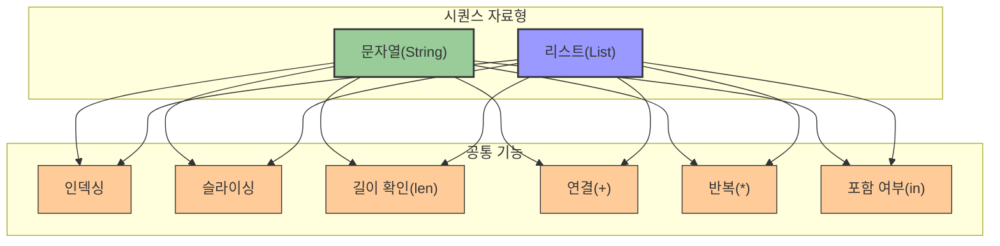

# 3. 자료의 나열, 리스트 📋

## 목차
- [3. 자료의 나열, 리스트 📋](#3-자료의-나열-리스트-)
  - [목차](#목차)
  - [리스트: 자료의 나열 📝](#리스트-자료의-나열-)
    - [요소 추가](#요소-추가)
    - [요소 제거](#요소-제거)
    - [정렬](#정렬)
  - [시퀀스 자료형: 순서를 따라 🔢](#시퀀스-자료형-순서를-따라-)
    - [예시](#예시)
    - [인덱싱 \& 슬라이싱](#인덱싱--슬라이싱)
    - [포함 여부 확인](#포함-여부-확인)
    - [길이 확인](#길이-확인)
    - [연산](#연산)
    - [활용 팁](#활용-팁)

---

## 리스트: 자료의 나열 📝

리스트는 여러 데이터를 순서대로 저장하는 자료형이다. Python에서는 다양한 메서드로 리스트를 다룰 수 있다. 주로 사용하는 네개의 메서드는 다음과 같다.

### 요소 추가
- `append(d)`: 리스트 마지막에 요소 하나 추가.
```python
numbers = []
numbers.append(42) # 결과: [42]
```

- `insert(i, d)`: i번째 위치에 요소 d를 삽입.
```python
items = ["x", "y", "z"]
items.insert(1, "new")  # 결과: ['x', 'new', 'y', 'z']
```

### 요소 제거
- `remove(d)`: 리스트에서 첫 번째로 나오는 d를 제거.
```python
colors = ["red", "green", "blue", "red"]
colors.remove("red")  # 결과: ['green', 'blue', 'red']
```

### 정렬
- `sort()`: 숫자는 오름차순, 문자열은 사전순으로 정렬.
```python
scores = [88, 55, 72, 91]
scores.sort()  # 결과: [55, 72, 88, 91]
```

---

## 시퀀스 자료형: 순서를 따라 🔢

시퀀스 자료형은 **순서가 있는 자료형**으로, 문자열(str), 리스트(list) 등이 해당한다. 순서를 가지므로 인덱싱, 슬라이싱 등의 기능이 가능하다.



### 예시
| 시퀀스 종류 | 예시 | 설명 |
|------------|------|------|
| **빈 리스트** | `[]` | 아무 요소도 포함하지 않은 리스트 |
| **문자열 리스트** | `['apple', 'banana']` | 문자열만 포함한 리스트 |
| **혼합 리스트** | `[3.14, True]` | 다양한 타입이 혼합된 리스트 |
| **문자열** | `"Data"` | 문자로 구성된 시퀀스 |

### 인덱싱 & 슬라이싱

| 기능 | 문법 | 예시 | 결과 |
|------|------|------|------|
| **인덱싱** | `시퀀스[위치]` | `word[2]` | `'t'` |
| **음수 인덱스** | `시퀀스[-위치]` | `word[-1]` | `'n'` |
| **슬라이싱** | `시퀀스[시작:끝]` | `letters[1:4]` | `['y', 't', 'h']` |
| **시작 생략** | `시퀀스[:끝]` | `letters[:3]` | `['p', 'y', 't']` |
| **끝 생략** | `시퀀스[시작:]` | `letters[3:]` | `['h', 'o', 'n']` |

```python
word = "Python"
letters = ["p", "y", "t", "h", "o", "n"]

print(word[2])       # 't'
print(letters[1:4])  # ['y', 't', 'h']
print(word[-1])      # 'n'
print(letters[:3])   # ['p', 'y', 't']
print(letters[3:])   # ['h', 'o', 'n']
```

### 포함 여부 확인
- `in` 연산자: 원소가 있는지 확인
```python
"a" in "Data"            # True
"X" in ["x", "y", "z"]     # False
```

### 길이 확인
- `len()`: 시퀀스 길이 반환
```python
len("OpenAI")            # 6
len([10, 20, 30, 40])     # 4
```

### 연산
| 연산자 | 기능 | 문자열 예시 | 결과 | 리스트 예시 | 결과 |
|-------|------|------------|------|------------|------|
| `+` | 연결 | `"Hello" + "World"` | `'HelloWorld'` | `[1, 2] + [3, 4]` | `[1, 2, 3, 4]` |
| `*` | 반복 | `"Hi!" * 3` | `'Hi!Hi!Hi!'` | `[True, False] * 2` | `[True, False, True, False]` |

### 활용 팁
- 시퀀스는 **공통된 특징**이 존재하며, 이를 이용해 다양한 연산 가능
- 예: 인덱싱, 슬라이싱, 특정 원소 개수 구하기 등
- 시퀀스 종류마다 활용법이 다름
  - list는 `append()`로 요소 추가 가능하지만, str은 불가능
  - str은 `split()`으로 분할 가능하지만, list는 해당 없음
