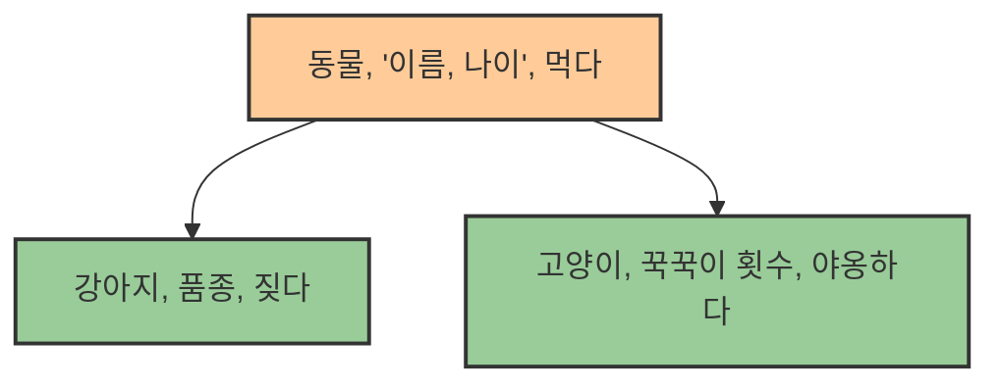

# 3. 상속과 다형성: 코드의 재사용과 확장 🧬

## 목차
- [3. 상속과 다형성: 코드의 재사용과 확장 🧬](#3-상속과-다형성-코드의-재사용과-확장-)
  - [목차](#목차)
  - [상속 (Inheritance): 물려받고 확장하기](#상속-inheritance-물려받고-확장하기)
    - [상속의 구현: `class 자식(부모)`와 `super()`](#상속의-구현-class-자식부모와-super)
  - [메서드 오버라이딩 (Method Overriding): 기능 재정의하기](#메서드-오버라이딩-method-overriding-기능-재정의하기)
  - [다형성 (Polymorphism): 같은 이름, 다른 행동](#다형성-polymorphism-같은-이름-다른-행동)
  - [추상 클래스 (Abstract Class): 미완성 설계도](#추상-클래스-abstract-class-미완성-설계도)

---

## 상속 (Inheritance): 물려받고 확장하기

**상속**은 한 클래스(자식 클래스)가 다른 클래스(부모 클래스)의 속성과 메서드를 그대로 물려받아 사용하는 객체 지향 프로그래밍의 핵심 기능입니다. 상속을 통해 코드의 중복을 피하고, 클래스 간의 계층적 관계를 만들어 프로그램을 더 체계적으로 구조화할 수 있습니다.

> **언제 사용할까?**: "A는 B의 한 종류이다 (A is a B)" 관계가 성립할 때 사용합니다.
> (예: "강아지(자식)는 동물(부모)이다", "이미지 게시글(자식)은 게시글(부모)이다")


> `강아지`와 `고양이` 클래스는 `동물` 클래스로부터 `이름`, `나이` 속성과 `먹다()` 메서드를 물려받으므로, 중복해서 코드를 작성할 필요가 없습니다.

### 상속의 구현: `class 자식(부모)`와 `super()`

- **상속 선언**: 클래스를 정의할 때, `class 자식클래스(부모클래스):` 형태로 괄호 안에 부모 클래스를 명시합니다.
- **`super()`**: 자식 클래스에서 부모 클래스의 메서드를 호출할 때 사용하는 특별한 함수입니다. 주로 자식 클래스의 생성자(`__init__`)에서 부모 클래스의 생성자를 호출하여, 부모의 속성을 초기화하는 데 사용됩니다.

```python
# 부모 클래스
class Post:
    def __init__(self, author, content):
        self.author = author
        self.content = content
        self.likes = 0

    def like(self):
        self.likes += 1
        print("좋아요!")

# 자식 클래스
class ImagePost(Post):
    def __init__(self, author, content, image_url):
        # super()를 통해 부모 클래스의 __init__을 호출하여 author, content 속성을 초기화
        super().__init__(author, content)
        self.image_url = image_url # 자식 클래스만의 속성 추가

# ImagePost는 Post의 모든 것을 물려받음
my_image_post = ImagePost("Alice", "아름다운 풍경", "http://example.com/img.png")
my_image_post.like() # 부모의 like() 메서드 사용 가능
print(my_image_post.likes) # 1
print(my_image_post.image_url) # http://example.com/img.png
```

---

## 메서드 오버라이딩 (Method Overriding): 기능 재정의하기

**메서드 오버라이딩**은 부모로부터 물려받은 메서드를 자식 클래스에서 **동일한 이름으로 다시 정의**하여, 자신만의 기능으로 덮어쓰는 것을 의미합니다.

```python
class Post:
    def display(self):
        print("일반 게시글입니다.")

class VideoPost(Post):
    # 부모의 display() 메서드를 오버라이딩
    def display(self):
        print("✨✨ 영상 게시글입니다! ✨✨")

normal_post = Post()
video_post = VideoPost()

normal_post.display() # "일반 게시글입니다." 출력
video_post.display()  # "✨✨ 영상 게시글입니다! ✨✨" 출력
```
> **오버로딩(Overloading)과의 차이**: C++/Java 등에서 사용되는 오버로딩은 매개변수의 종류나 개수가 다른, 동일한 이름의 함수를 여러 개 정의하는 것입니다. **파이썬은 오버로딩을 공식적으로 지원하지 않습니다.** 대신 가변인자나 기본값을 사용해 유사한 구현이 가능합니다.

---

## 다형성 (Polymorphism): 같은 이름, 다른 행동

**다형성**은 '여러(Poly) 가지 형태(Morph)'라는 뜻으로, **서로 다른 클래스의 객체가 동일한 이름의 메서드 호출에 대해 각자의 방식대로 다르게 반응**하는 것을 의미합니다. 메서드 오버라이딩은 다형성을 구현하는 핵심적인 방법입니다.

다형성의 진정한 힘은, 코드가 객체의 구체적인 자식 타입(`VideoPost`, `ImagePost` 등)에 의존하지 않고, **추상적인 부모 타입(`Post`)에만 의존**하게 만든다는 점입니다.

```python
# 다양한 종류의 게시글 객체들을 하나의 리스트에 담음
posts = [Post(), ImagePost("Bob", "노을", "..."), VideoPost()]

# for 루프는 각 객체가 어떤 자식 클래스인지 신경쓰지 않고,
# 단지 'Post'로서 display() 메서드를 가지고 있다는 사실에만 의존합니다.
for post in posts:
    # 같은 post.display() 호출이지만, 객체의 실제 타입에 따라 다른 결과가 나옴
    post.display() 
```
> 이처럼 다형성을 활용하면, 나중에 `LinkPost`라는 새로운 자식 클래스가 추가되더라도 위 `for` 루프 코드는 전혀 수정할 필요가 없습니다. 이것이 바로 다형성이 코드의 **유연성과 확장성**을 높여주는 이유입니다.

---

## 추상 클래스 (Abstract Class): 미완성 설계도

때로는 부모 클래스가 공통된 기능과 구조를 제공하기는 하지만, 그 자체로 인스턴스를 만드는 것이 의미가 없을 때가 있습니다. 예를 들어, '동물'이라는 클래스는 직접 만들기보다, '강아지'나 '고양이' 클래스를 만들기 위한 '틀'로만 사용하고 싶을 수 있습니다.

이처럼, 자식 클래스가 **반드시 구현해야 할 메서드(인터페이스)를 명시**하고, 스스로는 인스턴스화될 수 없는 클래스를 **추상 클래스**라고 합니다. 파이썬에서는 `abc` 모듈을 사용하여 만듭니다.

```python
from abc import ABC, abstractmethod

# ABC를 상속받아 추상 클래스로 지정
class Shape(ABC):
    @abstractmethod  # 이 메서드는 자식 클래스에서 반드시 오버라이딩해야 함을 명시
    def area(self):
        pass

class Square(Shape):
    def __init__(self, side):
        self.side = side
    
    # 추상 메서드인 area()를 구현하지 않으면 에러 발생
    def area(self):
        return self.side * self.side

# 추상 클래스는 직접 인스턴스를 만들 수 없습니다.
# shape = Shape() # TypeError 발생!

square = Square(5)
print(square.area()) # 25
```