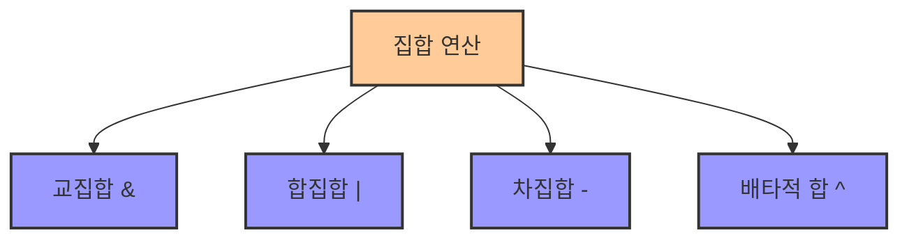

# 5. 집합 연산과 그래프 설정 📊

## 목차
- [5. 집합 연산과 그래프 설정 📊](#5-집합-연산과-그래프-설정-)
  - [목차](#목차)
  - [집합 연산 🔢](#집합-연산-)
    - [교집합 ∩](#교집합-)
    - [합집합 ∪](#합집합-)
    - [차집합 −](#차집합-)
    - [배타적 합(XOR) ⊕](#배타적-합xor-)
    - [파이썬 예제 💻](#파이썬-예제-)
  - [그래프 설정 📈](#그래프-설정-)
    - [matplotlib으로 그래프 다루기 🎨](#matplotlib으로-그래프-다루기-)
    - [실습 예시 🔍](#실습-예시-)

---

## 집합 연산 🔢

파이썬에서는 `set` 자료형을 이용하여 간단하게 집합 연산을 수행할 수 있다. 주요 연산으로는 **교집합**, **합집합**, **차집합**, **배타적 합(XOR)** 이 있으며, 각각 다른 연산자 혹은 메서드를 통해 구현할 수 있다.

### 교집합 ∩

두 집합에서 **공통된 원소**만을 추출한다. 파이썬에서는 `&` 연산자를 사용한다.

```python
set_a = {2, 4, 6}
set_b = {4, 6, 8}
intersection = set_a & set_b
# 결과: {4, 6}
```

### 합집합 ∪

두 집합의 원소를 **모두 포함**하며, 중복은 제거된다. `|` 연산자를 사용한다.

```python
union = set_a | set_b
# 결과: {2, 4, 6, 8}
```

### 차집합 −

한 집합에만 존재하는 원소를 추출한다. `-` 연산자를 사용한다.

```python
difference = set_a - set_b
# 결과: {2}
```

### 배타적 합(XOR) ⊕

두 집합 중 **한쪽에만 포함된 원소들**을 구한다. `^` 연산자를 사용한다.

```python
xor_result = set_a ^ set_b
# 결과: {2, 8}
```



### 파이썬 예제 💻

아래는 다양한 집합 연산을 한 번에 실행하는 코드 예시이다.

```python
group1 = {10, 20, 30}
group2 = {20, 40, 50}

print("합집합:", group1 | group2)       # {10, 20, 30, 40, 50}
print("교집합:", group1 & group2)       # {20}
print("차집합:", group1 - group2)       # {10, 30}
print("XOR:", group1 ^ group2)          # {10, 30, 40, 50}
```

| 연산 | 연산자 | 예시 | 결과 |
|------|--------|------|------|
| **교집합** | & | group1 & group2 | {20} |
| **합집합** | \| | group1 \| group2 | {10, 20, 30, 40, 50} |
| **차집합** | - | group1 - group2 | {10, 30} |
| **배타적 합** | ^ | group1 ^ group2 | {10, 30, 40, 50} |

---

## 그래프 설정 📈

### matplotlib으로 그래프 다루기 🎨

Python의 시각화 라이브러리인 `matplotlib`를 사용하여 **데이터를 시각적으로 표현**할 수 있다. 기본적인 그래프 구성 요소는 다음과 같다.

- **제목 추가**: `plt.title()`
- **축 이름 설정**: `plt.xlabel()`, `plt.ylabel()`
- **눈금 조정(ticks)**: `plt.xticks()`, `plt.yticks()`
- **여백 조정**: `plt.tight_layout()`

```python
import matplotlib.pyplot as plt

labels = ['A', 'B', 'C']
values = [15, 30, 45]

plt.bar(labels, values)
plt.title("카테고리별 수치")
plt.xlabel("항목")
plt.ylabel("값")
plt.tight_layout()
plt.show()
```


### 실습 예시 🔍

- 막대그래프를 그릴 때 **눈금이 겹치지 않도록** 조정하거나, 
- 그래프 외곽의 **여백을 최소화**하여 가독성을 높이는 등의 조정이 필요하다.

| 그래프 설정 | 메서드 | 목적 |
|------------|--------|------|
| **제목 추가** | plt.title() | 그래프의 주제 표시 |
| **x축 레이블** | plt.xlabel() | x축에 대한 설명 추가 |
| **y축 레이블** | plt.ylabel() | y축에 대한 설명 추가 |
| **눈금 조정** | plt.xticks(), plt.yticks() | 축의 눈금 위치와 레이블 조정 |
| **여백 조정** | plt.tight_layout() | 그래프 요소들이 잘리지 않도록 여백 최적화 |

> 이러한 세부 설정은 실제 데이터 시각화에서 매우 중요한 부분이며, 보기 좋은 그래프는 데이터를 효과적으로 전달하는 데 핵심적인 역할을 한다.

---
