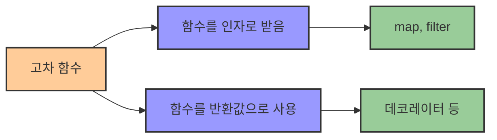
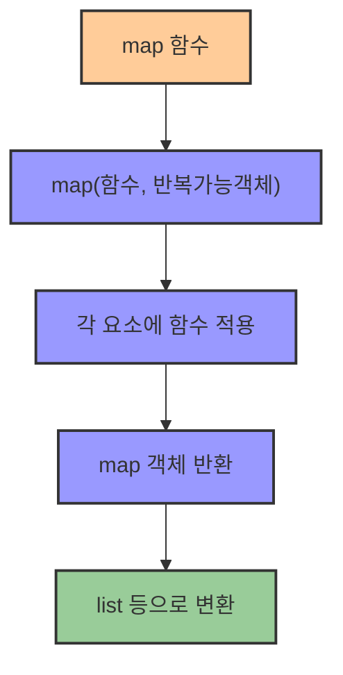
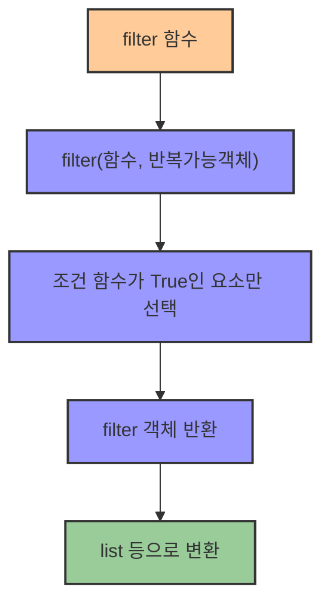

# 2. 고차 함수 map과 filter 🧮

## 목차
- [2. 고차 함수 map과 filter 🧮](#2-고차-함수-map과-filter-)
  - [목차](#목차)
  - [고차 함수란? 🧠](#고차-함수란-)
  - [고차 함수 `map()` 🗺️](#고차-함수-map-️)
  - [고차 함수 `filter()` 🧹](#고차-함수-filter-)

---

## 고차 함수란? 🧠

**고차 함수(Higher-Order Function)** 란, **함수를 인자로 받거나 함수를 반환하는 함수**를 말한다. 즉, **함수를 다루는 함수**라고 볼 수 있다. **함수형 프로그래밍**에서 사용되는 개념이다.

파이썬의 `map()`과 `filter()`는 모두 **다른 함수를 인자로 받아**, 해당 함수를 컬렉션의 각 요소에 적용하거나 필터링하기 때문에 고차 함수로 분류된다.



| 고차 함수 특징 | 설명 | 예시 |
|--------------|------|------|
| **함수를 인자로** | 다른 함수를 파라미터로 받음 | `map(function, iterable)` |
| **함수를 반환** | 함수를 결과값으로 반환 | 데코레이터, 클로저 등 |
| **목적** | 추상화 수준을 높이고 코드 재사용성 증가 | 반복 작업 최소화 |

---

## 고차 함수 `map()` 🗺️

`map()` 함수는 리스트 등의 반복 가능한 객체에 대해 **함수를 적용하여 결과를 반환**하는 파이썬의 내장 함수이다. 반환되는 값은 `map` 객체로, 필요시 리스트로 형 변환해줘야 한다.

```python
# 문자열에서 영어 제목만 추출
movies = [
    "배트맨,The Dark Knight,2008",
    "겨울왕국,Frozen,2013",
    "초록괴물,Shrek,2001",
    "하늘을 날아,Superman,1978"
]

# 함수 정의 방식
def extract_title(row):
    return row.split(',')[1]

eng_titles = map(extract_title, movies)

# 혹은 람다식으로 축약
eng_titles = map(lambda row: row.split(',')[1], movies)

# 출력시 list로 변환 필요
print(list(eng_titles))  # ['The Dark Knight', 'Frozen', 'Shrek', 'Superman']
```



**주의할 점**: `map()`은 곧바로 리스트가 아닌 `map` 객체를 반환하므로, 순회하거나 리스트로 변환해야 내용을 확인할 수 있다.

```python
print(eng_titles)
# <map object at 0x...> 와 같이 출력됨
```

| map 특징 | 설명 | 예시 |
|---------|------|------|
| **구문** | `map(function, iterable)` | `map(int, ['1', '2', '3'])` |
| **반환값** | map 객체 (이터레이터) | 리스트로 변환 필요 |
| **활용법** | 모든 요소에 동일 함수 적용 | 형변환, 데이터 가공 등 |
| **장점** | 간결한 코드, 함수형 스타일 | for 반복문 대체 가능 |

---

## 고차 함수 `filter()` 🧹

`filter()` 함수는 반복 가능한 객체에 대해 **조건을 만족하는 요소만 걸러냄**. `True`를 반환하는 값들만 남기며, 마찬가지로 반환값은 `filter` 객체이다.

```python
words = ['real', 'man', 'rhythm', 'sky', 'right']

# 함수 정의 방식
def starts_with_r(word):
    return word.startswith('r')

r_words = filter(starts_with_r, words)

# 람다로 축약 가능
r_words = filter(lambda w: w.startswith('r'), words)

# 리스트로 변환
print(list(r_words))  # ['real', 'rhythm', 'right']
```



**주의할 점**: `map()`과 마찬가지로 `filter()`도 `filter` 객체를 반환하므로 리스트 변환을 통해 결과를 확인해야 한다.

```python
print(r_words)
# <filter object at 0x...>
```

| filter 특징 | 설명 | 예시 |
|------------|------|------|
| **구문** | `filter(function, iterable)` | `filter(lambda x: x>0, [-1,0,1,2])` |
| **반환값** | filter 객체 (이터레이터) | 리스트로 변환 필요 |
| **활용법** | 조건에 맞는 요소만 추출 | 데이터 필터링, 조건 검색 |
| **장점** | 간결한 코드, 가독성 향상 | if 조건문 줄일 수 있음 |

---
