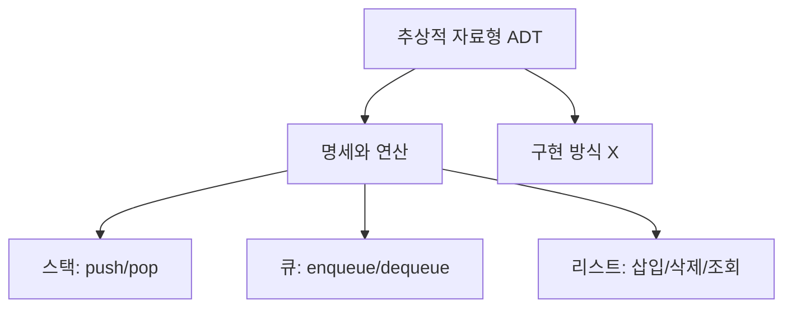
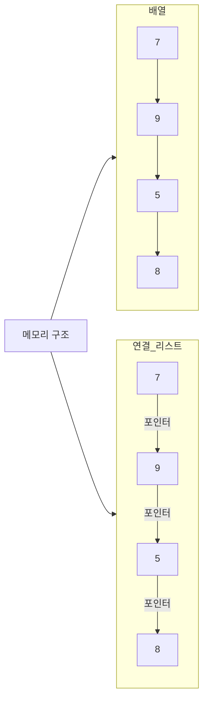
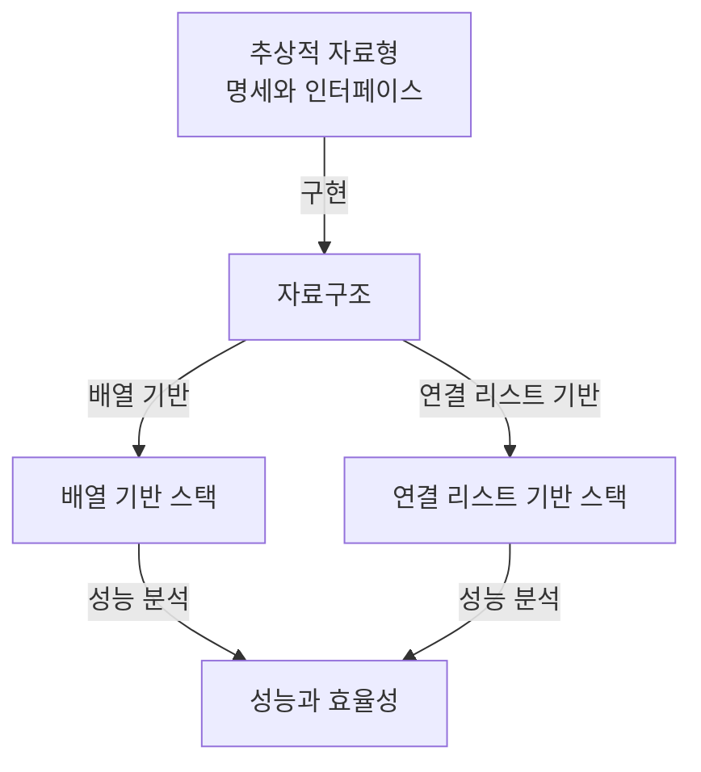
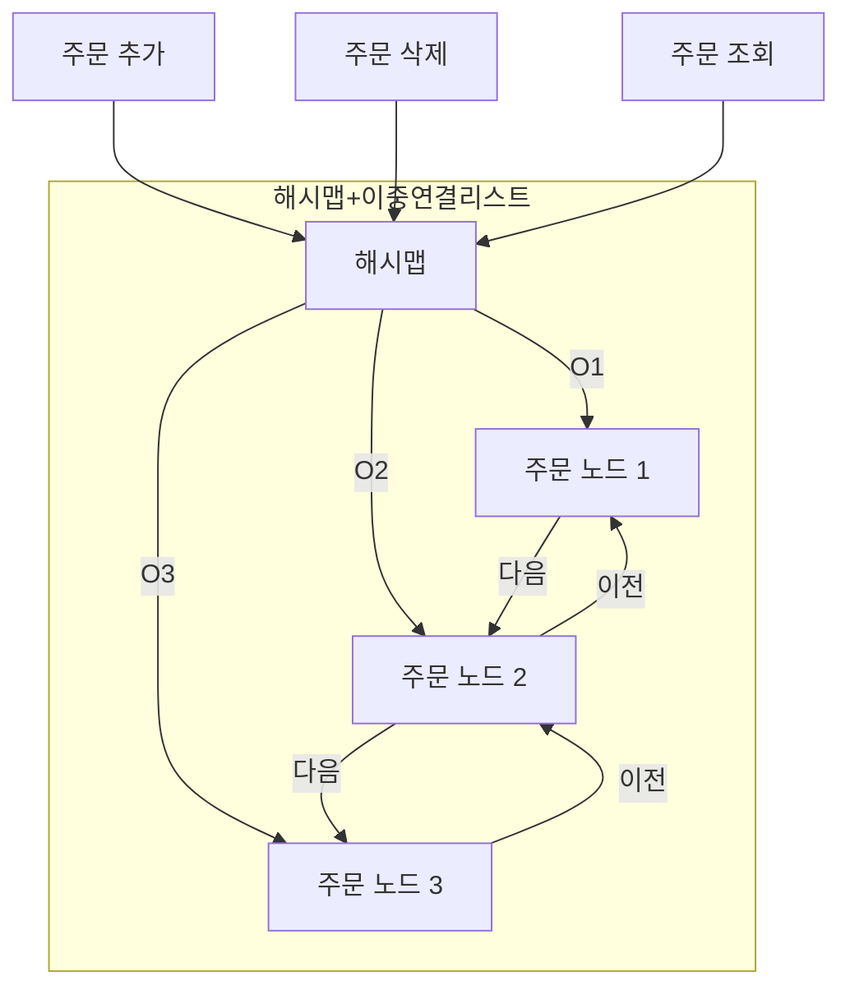
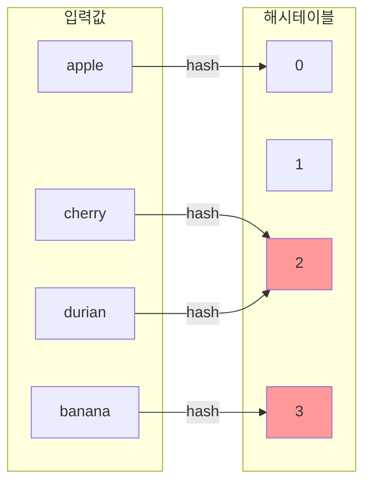
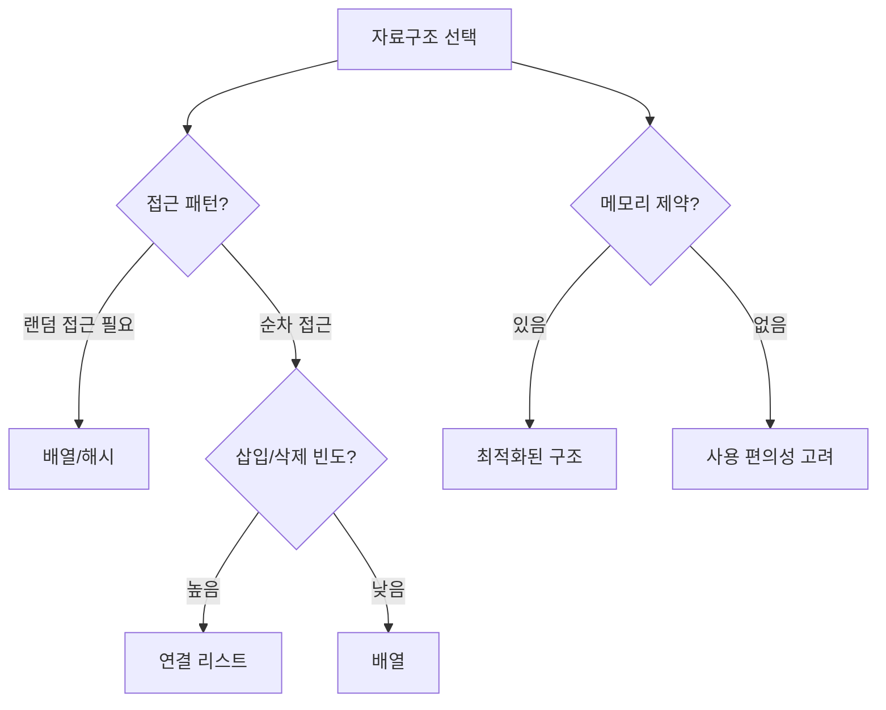

# 1. 자료구조 소개 💾

## 목차
- [1. 자료구조 소개 💾](#1-자료구조-소개-)
  - [목차](#목차)
  - [자료구조의 의미 📌](#자료구조의-의미-)
  - [추상적 자료형 🧩](#추상적-자료형-)
    - [예: 숫자 99는 정수일 수도 있고 문자 'c'일 수도 있다](#예-숫자-99는-정수일-수도-있고-문자-c일-수도-있다)
  - [배열과 연결 리스트 📊](#배열과-연결-리스트-)
    - [리스트 ADT의 연산](#리스트-adt의-연산)
    - [배열(Array)](#배열array)
    - [연결 리스트(Linked List)](#연결-리스트linked-list)
    - [비교](#비교)
  - [자료구조의 구현 방법 🛠️](#자료구조의-구현-방법-️)
    - [예시: 최대값 추적 클래스](#예시-최대값-추적-클래스)
  - [공 양쪽 삽입 문제 해결하기 🔄](#공-양쪽-삽입-문제-해결하기-)
    - [배열 기반 구현](#배열-기반-구현)
    - [연결 리스트 기반 구현](#연결-리스트-기반-구현)
  - [주문 처리 시스템 구현하기 🛒](#주문-처리-시스템-구현하기-)
    - [배열 기반 접근](#배열-기반-접근)
    - [연결 리스트 + 해시맵 개선](#연결-리스트--해시맵-개선)
  - [요약 📚](#요약-)
  - [더 알아보기: 해시와 해시 테이블 🔑](#더-알아보기-해시와-해시-테이블-)
    - [해시(Hash)](#해시hash)
    - [해시 테이블 (Key-Value 저장소)](#해시-테이블-key-value-저장소)
    - [충돌 해결 방식](#충돌-해결-방식)
  - [자료구조의 구현 실습: 공 삽입 문제 정리 🧪](#자료구조의-구현-실습-공-삽입-문제-정리-)
    - [문제 요약](#문제-요약)
    - [구현 방법 비교](#구현-방법-비교)
      - [1. 배열 기반](#1-배열-기반)
      - [2. 연결 리스트 기반 (Deque 활용)](#2-연결-리스트-기반-deque-활용)
    - [결론](#결론)
  - [주문 처리 시스템 문제 심화 🔍](#주문-처리-시스템-문제-심화-)
    - [시스템 요구사항](#시스템-요구사항)
    - [기본 구조](#기본-구조)
    - [문제점](#문제점)
    - [해결법: 해시 테이블 + 이중 연결 리스트](#해결법-해시-테이블--이중-연결-리스트)
  - [메모리 구조와 성능의 관계 💻](#메모리-구조와-성능의-관계-)
    - [배열이 빠른 이유](#배열이-빠른-이유)
    - [연결 리스트의 한계](#연결-리스트의-한계)
  - [마무리: 자료구조 선택 기준 🎯](#마무리-자료구조-선택-기준-)
    - [자료구조를 고를 때 고려할 것](#자료구조를-고를-때-고려할-것)
    - [사례 요약](#사례-요약)
  - [부록: 해시와 해시 테이블 심화 📚](#부록-해시와-해시-테이블-심화-)
    - [해시의 개념](#해시의-개념)
    - [충돌(Collision) 해결법](#충돌collision-해결법)
      - [1. 체이닝 (Chaining)](#1-체이닝-chaining)
      - [2. 오픈 어드레싱 (Open Addressing)](#2-오픈-어드레싱-open-addressing)
    - [충돌의 불가피성: **비둘기집 원리** 🕊️](#충돌의-불가피성-비둘기집-원리-️)
  - [🔚 끝맺음](#-끝맺음)

---

## 자료구조의 의미 📌

**자료구조**란 데이터를 담는 형식이자, 그 데이터에 접근하고 조작하는 방식을 의미한다.  
데이터를 어떻게 구성하느냐에 따라 프로그램의 성능이 결정된다.

프로그램에서 음식이 담긴 접시처럼, 데이터도 알맞은 형태의 그릇에 담겨야 제대로 활용될 수 있다.  
어떤 문제를 다룰지에 따라 적절한 자료구조를 고르는 것은 매우 중요하다.

---

## 추상적 자료형 🧩

**추상적 자료형(Abstract Data Type)** 은 데이터를 어떻게 해석하고 어떤 연산이 가능한지를 정의하는 개념적 틀이다.  
하지만 구체적인 구현 방식은 정의하지 않는다.



### 예: 숫자 99는 정수일 수도 있고 문자 'c'일 수도 있다

```python
# 내부적으로 문자 'c'의 아스키 값은 99
ord('c') == 99
```

자료형은 어떤 연산이 가능한지를 함께 정의하며,  
**ADT는 "데이터와 연산의 계약서"** 처럼 동작한다.

---

## 배열과 연결 리스트 📊

### 리스트 ADT의 연산
- `조회`: 특정 위치의 항목을 확인
- `삽입`: 특정 위치에 새 항목 추가
- `삭제`: 특정 위치의 항목 제거

### 배열(Array)
- **고정된 인덱스 기반** 구조
- 빠른 조회 성능 (O(1))  
- 삽입/삭제는 비효율적 (O(n))

```python
numbers = [7, 9, 5, 8]
numbers.insert(2, 42)  # 중간 삽입 시 뒤 항목 밀어내야 함
```

### 연결 리스트(Linked List)
- 각 항목이 **노드**로 구성되고, 다음 노드를 가리키는 포인터를 가진다
- 조회는 느리지만 삽입/삭제는 효율적이다

```python
class Cell:
    def __init__(self, data):
        self.data = data
        self.link = None
```

### 비교

| 구조 | 장점 | 단점 |
|------|------|------|
| 배열 | 빠른 조회 | 느린 삽입/삭제 |
| 연결 리스트 | 빠른 삽입/삭제 | 느린 조회 |



---

## 자료구조의 구현 방법 🛠️

ADT는 명세만 제공하고, 자료구조는 그것을 실제 코드로 구현한 것이다.  
클래스를 이용하면 구조화된 방식으로 구현 가능하다.



```python
from abc import ABC, abstractmethod

class AbstractStack(ABC):
    @abstractmethod
    def push(self, value): pass
```

### 예시: 최대값 추적 클래스

```python
class MaxTracker:
    def __init__(self):
        self.data = []
    def insert(self, n):
        self.data.append(n)
    def remove(self, n):
        if n in self.data:
            self.data.remove(n)
    def max(self):
        return max(self.data) if self.data else None
```

---

## 공 양쪽 삽입 문제 해결하기 🔄

양쪽 끝이 열린 통로에 공을 넣는 문제를 구현한다고 하자.  
왼쪽이나 오른쪽으로 공을 추가할 수 있다.

### 배열 기반 구현

```python
tube = []
tube.insert(0, 1)
tube.append(2)
tube.insert(0, 3)
```

- 왼쪽 삽입 시 요소들을 모두 밀어야 한다 → 비효율적
- 시간복잡도: `O(n^2)` (누적 이동 발생)

### 연결 리스트 기반 구현

```python
from collections import deque
pipe = deque()
pipe.appendleft(1)
pipe.append(2)
pipe.appendleft(3)
```

- 삽입은 `O(1)`에 가능
- 누적 비용: `O(n)`

---

## 주문 처리 시스템 구현하기 🛒

**기능**: 주문 추가, 삭제, 조회  
각 주문은 고유한 ID를 가진다고 가정한다.



### 배열 기반 접근

```python
orders = []
orders.append(101)           # 추가
orders.remove(101)           # 삭제
orders.index(102)            # 위치 조회
```

- `append`: O(1)
- `remove`, `index`: O(n)

### 연결 리스트 + 해시맵 개선

```python
order_map = {}  # ID → 노드
```

- 해시맵을 이용해 특정 주문을 즉시 찾는다 → `O(1)`
- 삭제 시 이중 연결 리스트로 이전/다음 포인터도 유지

```python
class OrderNode:
    def __init__(self, id):
        self.id = id
        self.prev = None
        self.next = None
```

---

## 요약 📚

- **자료구조**: 데이터를 구조적으로 저장하고, 효율적으로 처리하기 위한 도구
- **ADT**는 설계, **자료구조**는 구현
- 성능, 공간 효율, 목적에 따라 자료구조 선택이 달라져야 한다

---

## 더 알아보기: 해시와 해시 테이블 🔑

### 해시(Hash)
- 데이터를 고정된 길이의 값으로 변환하는 함수

```python
hash("zebra")
```

### 해시 테이블 (Key-Value 저장소)

```python
info = {}
info["Lina"] = 88
```

### 충돌 해결 방식

- **체이닝 방식**: 같은 인덱스에 리스트를 연결

```python
hash_table = [[], [], [], []]
hash_table[1].append(("Lina", 88))
```

- **오픈 어드레싱**: 빈 공간을 찾아 저장 (선형 탐사)

> 파이썬 딕셔너리는 내부적으로 오픈 어드레싱 방식 사용

---

**비둘기집 원리**에 의해 충돌은 불가피하다.  
해시값 공간은 유한하지만, 입력값은 무한하기 때문이다.



## 자료구조의 구현 실습: 공 삽입 문제 정리 🧪

### 문제 요약
- 양쪽 끝이 열린 통로에 공을 넣는 문제
- 왼쪽 또는 오른쪽 삽입이 가능
- 삽입 순서대로 파이프 상태를 출력

### 구현 방법 비교

#### 1. 배열 기반

```python
pipe = []
pipe.insert(0, 11)  # 왼쪽 삽입
pipe.append(22)     # 오른쪽 삽입
pipe.insert(0, 33)  # 다시 왼쪽
print(pipe)  # 출력: [33, 11, 22]
```

- 왼쪽에 삽입할수록 뒤의 모든 요소를 이동시켜야 하므로 시간 소요 증가
- 최악의 경우 시간 복잡도: **O(n²)**

#### 2. 연결 리스트 기반 (Deque 활용)

```python
from collections import deque
pipe = deque()
pipe.appendleft(11)
pipe.append(22)
pipe.appendleft(33)
print(list(pipe))  # 출력: [33, 11, 22]
```

- 삽입 시 요소 이동 없음 → **O(1)** 연산
- 전체 시간 복잡도: **O(n)**

### 결론
- 삽입 위치가 다양하다면 연결 리스트 혹은 `deque`가 성능상 우수
- 배열은 한쪽 끝에만 삽입할 경우 간단하고 빠름

---

## 주문 처리 시스템 문제 심화 🔍

### 시스템 요구사항
- 주문 추가: 고유 번호로 삽입
- 주문 취소: 특정 번호 제거
- 주문 조회: 몇 번째 주문인지 반환

### 기본 구조
- `addOrder(order_id)`: 주문 생성
- `removeOrder(order_id)`: 주문 삭제
- `getOrder(order_id)`: 순서 조회

### 문제점
- 연결 리스트는 특정 노드 삭제 시 **이전 노드 정보가 필요**
- 순차 탐색은 비효율적 → 시간 복잡도 **O(n)**

### 해결법: 해시 테이블 + 이중 연결 리스트

```python
class OrderNode:
    def __init__(self, order_id):
        self.id = order_id
        self.prev = None
        self.next = None
```

- 각 주문 노드를 딕셔너리에 저장해 `O(1)`로 접근
- 이중 연결 리스트는 양방향 포인터로 이전 노드 추적 가능

```python
order_map = {1001: node1, 1002: node2}
```

---

## 메모리 구조와 성능의 관계 💻

### 배열이 빠른 이유
- 배열은 **물리적으로 연속된 메모리 공간**에 저장됨
- CPU 캐시 접근에 유리 → 전체 순회 시 성능 우수

### 연결 리스트의 한계
- 각 노드는 메모리 내 **임의의 위치**에 존재
- 순차 접근 시 포인터 추적 필요 → CPU 입장에서 느림

---

## 마무리: 자료구조 선택 기준 🎯

### 자료구조를 고를 때 고려할 것
1. 데이터의 추가/삭제가 잦은가?
2. 특정 인덱스 접근이 중요한가?
3. 메모리 효율성과 코드 복잡도는?



### 사례 요약

| 문제 유형             | 적합한 자료구조         | 이유                  |
|----------------------|------------------------|----------------------|
| 양쪽 삽입이 필요한 파이프 | `deque`, 연결 리스트     | O(1) 삽입 가능        |
| 빠른 조회가 필요한 상황  | 배열 (`list`)           | 인덱스 접근이 O(1)    |
| 특정 ID 기반 삭제 필요 | 해시 + 이중 연결 리스트 | 빠른 접근 + 포인터 관리 |

---

## 부록: 해시와 해시 테이블 심화 📚

### 해시의 개념
- 데이터를 일정한 길이로 변환
- 예시: 이름을 숫자로 매핑하여 저장

```python
hash("koala")  # => 정수값 출력
```

### 충돌(Collision) 해결법

#### 1. 체이닝 (Chaining)

- 같은 해시값에 여러 데이터를 리스트로 저장

```python
hash_table = [[] for _ in range(10)]
hash_table[3].append(("lemon", 50))
```

#### 2. 오픈 어드레싱 (Open Addressing)

- 충돌 시 다음 빈 공간으로 이동

```python
# 파이썬 딕셔너리 내부 구현 원리
fruit_price = {}
fruit_price["melon"] = 80  # 충돌 시 선형 탐사
```

### 충돌의 불가피성: **비둘기집 원리** 🕊️

- 저장 공간(해시값)이 유한하고, 입력값은 무한
- 충돌은 원천적으로 피할 수 없음 → **좋은 해시 함수 + 충돌 처리 전략** 필요

---

## 🔚 끝맺음

- 자료구조는 단순한 저장이 아닌 **문제 해결 전략**
- 알고리즘과 함께 문제에 맞는 구조를 선택해야 최적의 결과를 얻을 수 있다
- ADT → 설계 → 자료구조 → 구현 → 최적화의 흐름을 기억하자
